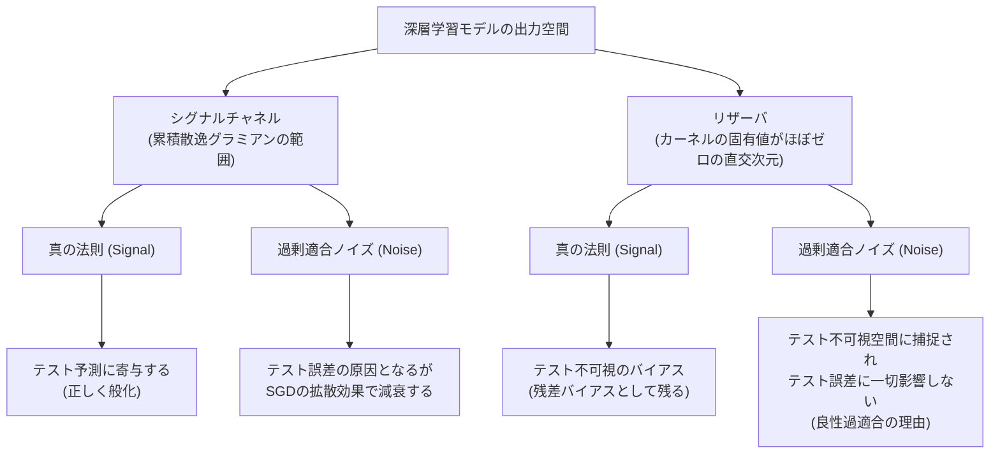
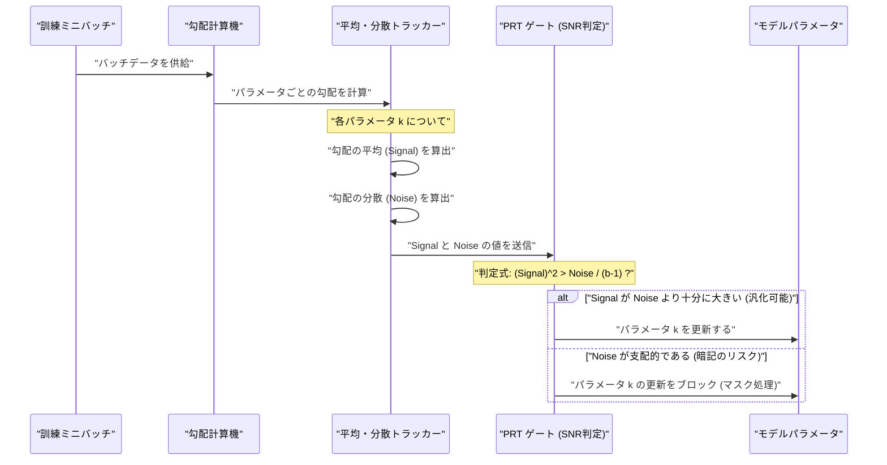
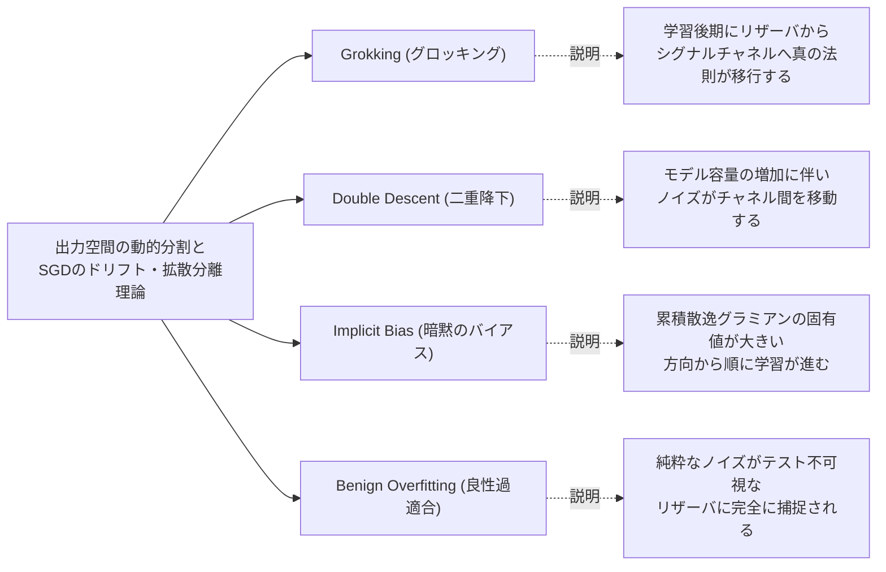

###### Created: 
2026-05-15 14:33 
###### Tag: 
#paper
###### url_01:
https://arxiv.org/abs/2605.01172 
###### url_02: 

###### memo: 

---
本日は、深層学習の長年の謎である「なぜパラメータがデータ数より圧倒的に多い過パラメータ化されたモデルが、未知のデータに対して汎化するのか」という問いに対し、極めて革新的かつ包括的な理論的枠組みと、それを基盤とした実践的な最適化アルゴリズムを提示したプレプリント論文をご紹介します。本論文は現在arXivにて公開されている査読前プレプリント（2024年5月公開）である点に留意しつつ、その主張の新規性と実用性を深く読み解いていきましょう。

---

# One line and three points

**深層学習の汎化メカニズムを「出力空間におけるシグナルとノイズの分離」として理論化し、検証データに依存せずに真の母集団リスクを最適化する実践的なアルゴリズムを導出した画期的な研究です。**

1. **出力空間の二分割とテスト不可視性：** 訓練中に進化するニューラルタンジェントカーネル（NTK）が、出力空間を「シグナルチャネル（誤差が急速に減少する領域）」と「リザーバ（ノイズが蓄積するが、テストデータからは構造的に不可視となる領域）」に自然に分割することを証明しました。
2. **古典的現象の統一的理解：** 二重降下現象（Double Descent）、グロッキング（Grokking）、暗黙のバイアス（Implicit Bias）、良性過適合（Benign Overfitting）といった、これまで個別に議論されてきた深層学習の不思議な現象を、単一の理論的枠組みの中で網羅的に説明することに成功しています。
3. **革新的な最適化アルゴリズム（PRT）の提案：** 理論的洞察から、Adamオプティマイザに1つの状態変数と数式の1行を追加するだけで、ミニバッチ内の勾配の「信号対雑音比（SNR）」を計算し、真の汎化性能を低下させる無駄なノイズの暗記を遮断する「Population Risk Training (PRT)」を開発しました。

# Pre-knowledge

本論文を深く理解するためには、以下の概念についての基礎的な背景知識が助けになります。
深層学習の理論解析において、モデルの重み変化をカーネル関数の進化として捉える「ニューラルタンジェントカーネル（NTK）」という強力な数学的道具があります。従来のNTK理論は、重みが初期値からほとんど動かない「Lazy regime（怠惰な領域）」を前提として汎化を証明していましたが、実際の最先端の深層学習は重みが大きく動いて特徴そのものを学習する「Feature-learning regime（特徴学習領域）」にあります。また、深層学習では、データに完全に適合して訓練誤差がゼロになった後も、さらにモデルのパラメータを増やす、あるいは訓練を長く続けることで、突如として未知のデータへの予測精度が向上する「二重降下現象」や「グロッキング」といった直感に反する現象が知られており、これらをいかにして統一的に説明するかが理論的課題となっていました。

# Summary

本論文は、実際の深層学習モデルが機能する「特徴学習領域（訓練中にカーネルが大きく変動する状態）」における非漸近的な汎化理論を提示した野心的なプレプリントです。著者らは、モデルの出力空間が、有意義なパターンを学習する「シグナルチャネル」と、ランダムなラベルノイズを閉じ込める「リザーバ」に分割されることを数学的に証明しました。重要な発見は、オプティマイザがリザーバに押し込んだノイズは、未知のテストデータに対する予測において完全に「不可視」になるという構造的性質です。さらに、シグナルチャネル内部においても、ミニバッチ確率的勾配降下法（SGD）の持つ特性により、真の信号は線形に蓄積（ドリフト）する一方で、個別データの暗記（ノイズ）はゆっくりとした拡散に留まることを示しました。特筆すべきは、著者らがこの壮大な理論にとどまらず、訓練ミニバッチ内の各データの勾配分散を用いて「未知のデータに対する真の損失（母集団リスク）」を推定し、ノイズ暗記に繋がるパラメータ更新を動的にマスクする「Population Risk Training (PRT)」という極めて実装が容易かつ強力なアルゴリズムを導出した点です。この手法は検証データを一切必要とせず、物理知識深層学習（PINN）や大規模言語モデルの選好アライメント（DPO）など、様々なタスクで過学習を劇的に抑制し、汎化を加速させることを実証しています。

# Briefing

この論文が提示する理論と応用の全体像を、論理的なステップに分けて詳細に解説します。

**1. 出力空間の動的分割：シグナルチャネルとリザーバ**
深層ニューラルネットワークは、訓練データ数よりもはるかに多いパラメータを持つため、純粋なノイズであっても完全に暗記（適合）できてしまいます。では、なぜ実際のデータではうまく般化するのでしょうか。著者らは、出力空間において、訓練中のカーネルの進化を積分した「累積散逸グラミアン（Cumulative Dissipation Gramian）」という演算子を導入しました。この演算子は空間を二つに切り分けます。一つは、損失が急速に減少する「シグナルチャネル」です。もう一つは、カーネルの固有値がほぼゼロに近い広大な直交次元である「リザーバ（貯水池）」です。数学的な驚きは、訓練とテストのカーネルが特定の因子を共有しているため、この「リザーバ」に蓄積されたいかなるノイズや暗記情報も、未知のテストデータに対する予測計算時には完全にキャンセルされ「不可視（test-invisible）」になるという点です。

**2. ミニバッチSGDの物理学：ドリフトと拡散**
リザーバに落ちたノイズは無害化されるとして、では「シグナルチャネル」内に残ったノイズはどうなるのでしょうか。ここで確率的勾配降下法（SGD）のミニバッチ処理が決定的な役割を果たします。勾配を「真の母集団に対する期待値（シグナル）」と「ミニバッチ抽出によるゼロ平均の揺らぎ（ノイズ）」に分解すると、シグナル方向の更新はステップごとに着実に蓄積（線形ドリフト）していきます。一方で、個別データに特有のノイズ方向の更新は、ランダムウォークのように振る舞うため、蓄積速度が極めて遅くなります（拡散）。結果として、SGD自体が持つこの「ドリフトと拡散の分離」効果により、シグナルチャネル内のノイズは時間とともに自然に減衰していくことが証明されました。

**3. フル特徴学習領域における理論の統合**
既存のカーネル理論の多くは、学習中にカーネルが変化しないという強い仮定（Lazy regime）を置いていました。しかし本論文は、カーネルが学習中に劇的に変動する「フル特徴学習領域」においても、上記の法則が成立することを示しました。これにより、初期にノイズを記憶した後に遅れて真の法則を学習する「グロッキング」、モデル容量や学習時間を増やすことでテスト誤差が再び下降する「二重降下現象」、過学習しているにも関わらず汎化する「良性過適合」といった現象が、すべてこの「リザーバへのノイズ退避」と「シグナルチャネルでのドリフト蓄積」という単一のレンズを通して説明可能であることを示しました。

**4. 理論から実践へ：Population Risk Training (PRT)**
本論文の最も実用的な貢献は、上記の複雑な理論を、検証データ（Validation set）を用いずに訓練データのみから「真の母集団リスク」を直接最適化するアルゴリズムへと昇華させたことです。交差検証の「Leave-one-out（1個抜き出し）」の概念を勾配の自己影響（Self-influence）として定式化することで、Adamオプティマイザの更新ルールにシンプルな変更を加えました。具体的には、パラメータごとにミニバッチ内の勾配の平均（シグナル）と分散（ノイズ）を監視し、「シグナルの2乗がノイズを上回っている（真の法則を学習している）パラメータのみを更新し、ノイズが勝っている（暗記しようとしている）パラメータの更新をブロックする」というゲート処理を導入しました。

**5. 圧倒的な経験的成果**
このたった1つの状態変数を追加するだけの軽量なアルゴリズム変更が、極めて強力な結果をもたらしています。ノイズを含む初期条件から物理法則を学習するPINNにおいては、通常のAdamWに比べて2.4倍の速度で目標精度に到達し、過学習を完全に抑え込みました。また、言語モデルQwen2.5のDPO（直接選好最適化）によるアライメントにおいては、ノイズの多い選好データセットを用いても、元のポリシーからの過度な逸脱（報酬ハッキングに類する挙動）を3倍抑えつつ、最終的な報酬精度を大幅に向上させることに成功しています。

# FAQ

**Q: 従来のNTK（ニューラルタンジェントカーネル）理論とは何が決定的に違うのですか？**
A: 従来のNTK理論は、ネットワークの幅が無限大に広く、パラメータが初期値からほとんど動かない「Lazy regime（凍結されたカーネル）」でのみ厳密に成立するものでした。本論文の画期的な点は、訓練の進行に伴ってカーネル自体が劇的に変化（O(1)のオーダーで変動）する、より現実の深層学習に近い「フル特徴学習領域（Full feature-learning regime）」において、正確にテスト誤差の振る舞いを予測・分解する理論を構築したことです。

**Q: 新しく提案された「PRT」アルゴリズムは、計算コストが高く実装が難しいのではないでしょうか？**
A: いいえ、驚くほど低コストで実装が容易です。PRTは既存のAdamWなどのオプティマイザの上に実装されます。各パラメータの勾配の分散を追跡するための状態変数を1つ追加し、勾配の「平均の2乗」と「分散」を比較する1行のif文（またはソフトなゲート関数）を追加するだけです。バックプロパゲーションの回数が増えるわけでもなく、計算オーバーヘッドは実質的にゼロに近いです。

**Q: 検証データ（Validation set）なしで過学習を防げるというのは、直感に反します。どのような仕組みですか？**
A: PRTは、訓練で使用している現在のミニバッチそのものを利用して「未知のデータに対するリスク」を疑似的に推定します。ミニバッチ内の1つのデータを「テストデータ」、残りを「訓練データ」と見なす「Leave-one-out（1個抜き出し）」の数学的展開を勾配レベルで計算します。これにより、あるパラメータの更新が「バッチ全体に共通する一般的な法則」に基づいているのか、それとも「特定のデータポイントの特異なノイズ」に引っ張られているのかを判別し、後者の場合は更新を止めることで過学習を未然に防ぎます。

# Critical Assessment（批判的評価）

本研究を以下の観点から専門的かつ批判的に評価します：

**方法論の妥当性：**
複雑な出力空間のダイナミクスを、累積散逸グラミアンという経路依存の演算子を用いて見事に解析しています。SGDのドリフトと拡散を分離する論証も統計的学習理論として非常に説得力があります。ただし、厳密なテスト予測可能性の証明の一部において、データ多様体上の滑らかさ（Sobolev空間における制約）などの数学的仮定が置かれており、これが自然言語や高次元の不連続なモダリティにおいて完全に成立するかについては、理論と現実の間に若干のギャップが残る可能性があります。

**エビデンスの強度：**
本論文は現在プレプリント（査読前）の段階であり、数学的証明の完全なピアレビューは今後の課題です。しかしながら、主張を裏付ける経験的証拠は非常に強固です。トイモデルでの検証にとどまらず、PINN（偏微分方程式の解法）やLLM（Qwen2.5）のDPOファインチューニングといった、全く性質の異なる複雑なドメインにおいて、提案アルゴリズム（PRT）が一貫してベースラインを凌駕している点は、理論の普遍性を強く支持する証拠となっています。

**実用化への考慮：**
PRTの実用性は極めて高く、既存の学習パイプラインにおけるオプティマイザを差し替えるだけで直ちに恩恵を受けられる設計は秀逸です。一方で、実環境での適用における制限事項として、極端にバッチサイズが小さい場合や、データストリームが非定常でバッチ間の分散推定が不安定になる環境下では、SNRの推定が不正確になり、学習が過度に停止してしまう（あるいはノイズを通してしてしまう）リスクが存在します。ハイパーパラメータ（$\lambda_{pop}$など）の調整が特定のタスクでどの程度クリティカルになるかは、より広範な実環境テストが必要です。

# For easy understanding

深層学習のAIモデルは、なぜ「教科書の丸暗記」にならずに、見たことのない「応用問題」を解けるようになるのでしょうか？

本論文の理論を、**「試験勉強をする学生（AIモデル）」**に例えて解説しましょう。

学生が過去問（訓練データ）を解き続けると、本質的な「解き方のルール」を学ぶと同時に、「この年度の第3問は答えがウになる」といった、無意味な「問題のクセ（ノイズ）」まで覚えてしまいます。
本論文が数学的に証明した驚くべき事実は、AIの脳内が自然に**「シグナルチャネル（ルールを覚える引き出し）」**と**「リザーバ（無意味なクセを放り込むゴミ箱）」**に分かれるということです。そして、本番の試験（テストデータ）では、この「ゴミ箱」に入った知識は一切使われない（テストからは見えない）構造になっていることが分かりました。

さらに、学習法（SGDというアルゴリズム）の性質上、普遍的なルールは毎回繰り返し登場するため学習が一直線に進みます（ドリフト）が、特定のノイズはたまにしか登場しないため学習がフラフラと定まりません（拡散）。結果として、有意義な知識だけが強く残るのです。

この理論を応用して、著者らは**「PRT」という新しい学習ブースター（オプティマイザ）**を発明しました。
これは、学生の脳に「今覚えようとしていることは、いろんな問題に共通する一般的な法則か？ それともこの1問にしか通用しない丸暗記か？」を自動で判定するセンサーを取り付けるようなものです。もし「これは丸暗記だ（ノイズが大きい）」と判定されたら、その部分の脳細胞の更新をストップさせます。
つまり、**「テスト用の確認問題（検証データ）」をわざわざ用意しなくても、勉強している最中にリアルタイムで丸暗記を防ぎ、真の実力だけを効率よく伸ばすことができる**ようになった画期的な発明なのです。

# Mermaid Diagrams

論文の核心的な概念とアルゴリズムのプロセスを視覚化します。

## 概念図・構造図
深層学習の出力空間における「シグナル」と「ノイズ」の動的な分離（テスト誤差の分解）を図示します。

## タイムライン・シーケンス図
**Important** 提案手法であるPRT（Population Risk Training）アルゴリズムが、Adamオプティマイザの更新ステップにおいてどのように介入し、ノイズの暗記を防ぐかを示すシーケンス図です。

## 関係図・相関図
本論文が、これまで個別の現象として扱われてきた深層学習の謎を、どのように単一のフレームワークで統一的に説明しているかの相関関係を図示します。

