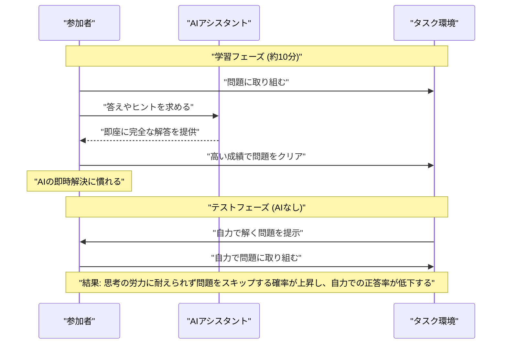
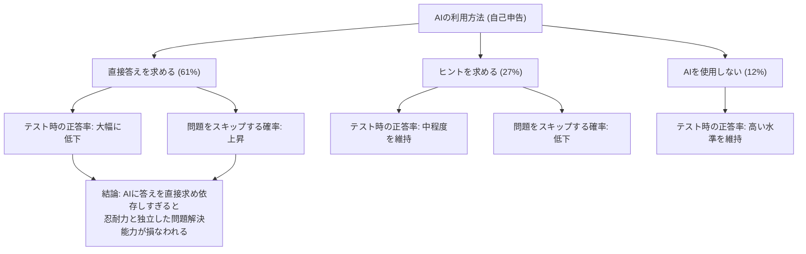

###### Created: 
2026-04-16 15:16 
###### Tag: 
#paper
###### url_01:
https://arxiv.org/abs/2604.04721 
###### url_02: 

###### memo: 

---

<!-- paper_extractor:summary:start -->

# One line and three points
AIによる即座の解答支援は、短期的な成績を向上させる一方で、人間の自力で問題を解く能力と最後までやり抜く忍耐力を低下させる。

- 大規模なランダム化比較試験（参加者1,222名）により、AIへの依存が独立したパフォーマンスと忍耐力を低下させる因果関係を初めて実証しました。
- 分数計算（数学的推論）と読解問題という全く異なる認知領域の両方において、わずか10分から15分程度のAI利用後にこの悪影響が確認されました。
- 特にAIから「直接答え」を得ていたユーザーにおいて能力低下と諦め（スキップ率）の増加が顕著であり、即時解決のみを目的としない、長期的な学習を支援するAI設計の必要性が示唆されています。

# Summary
本論文は、現代のAIシステムが提供する「即時かつ完全な支援」が、人間の自立的な問題解決能力と忍耐力に与える影響を検証した研究です。合計1,222名を対象とした3つのランダム化比較試験（分数計算および読解問題）を通じて、AIの支援が短期的なタスクの成績を向上させる一方で、AIの支援が取り上げられた後の独立したパフォーマンスを著しく低下させ、さらに問題に取り組むことを諦める割合（スキップ率）を有意に増加させるという因果関係を明らかにしました。特に、AIに直接的な答えを求めた参加者においてその傾向が強く見られました。この結果は、AIによる認知的な作業の外部化（オフローディング）が長期的な学習やスキルの獲得を妨げるリスクがあることを示しており、人間の成長を促すためのより良いAI協働設計（例えば、あえて適切なタイミングで支援を控える機能など）の必要性を強く提起しています。

# Briefing
優れたメンターや教育者は、学習者を指導する際、ただ答えを教えるだけではありません。長期的な学習目標を見据え、時にはヒントを与えるに留めたり、あえて手助けをせずに試行錯誤させたりすることで、学習者自身の成長と自律性を促します。しかし、現在のChatGPTに代表されるAIシステムは、安全性の理由を除いてはユーザーの要求を拒否することはなく、即座に完全な解答を提供する設計になっています。つまり、AIは非常に有能な「短期的協力者」ではありますが、人間の長期的な能力構築には無関心であると言えます。本研究は、こうしたAIの短期的な最適化が、人間の認知能力やモチベーションに長期的な悪影響を及ぼすのではないかという懸念を、大規模なランダム化比較試験（RCT）によって因果関係として証明しようと試みた画期的なものです。

研究チームは、数学的推論能力を測定する分数の計算問題（実験1および実験2）を用いてAIの影響を評価しました。分数の計算は数学の基礎であり、実践的な練習によって能力が向上しやすいという特徴があります。実験では参加者を、AIを自由に利用できるグループと、一切利用できずに自力で解くグループに分けました。AIを利用できるグループは、学習フェーズにおいて高い正答率と低いスキップ率（諦めずに解答する姿勢）を示し、一見すると非常に優秀な成績を収めました。しかし、その後のテストフェーズにおいて警告なしに突然AIの利用を禁止されると、状況は一変しました。AIに頼っていた参加者は、最初から自力で解いていたグループよりも正答率が急激に低下したのです。さらに重大な発見として、AIを利用していた参加者は問題にじっくり取り組むことなく、自発的に「スキップ（解答を放棄）」してしまう割合が有意に増加しました。

この結果をさらに深く掘り下げるため、実験2では参加者のAIの利用方法を自己申告によって分析しました。その結果、AIから「ヒント」を得るために使っていた参加者に比べ、「直接的な答え」を求めるためにAIを使っていた参加者において、テスト時のパフォーマンス低下と忍耐力の喪失が最も顕著に現れました。答えを瞬時に得てしまうことは、思考のプロセスをバイパスしてしまうため、自身の能力を損なうだけでなく、問題に立ち向かう気力をも奪ってしまうことが浮き彫りになりました。

さらに、実験3では、数学とは全く異なる認知的スキル（文章の文脈理解、意味の構築、メンタルモデルの形成など）を必要とする読解問題を用いて、同様の試験を実施しました。結果として、分数計算のときと全く同じパターンが確認されました。AIの支援を受けたグループは、支援がなくなった途端に自力での正答率が低下し、問題文をしっかり読むことを諦めてすぐにスキップしてしまう傾向が強まりました。これにより、AIによる忍耐力の低下や能力の減退という現象が、特定のタスク（計算など）に限定されるものではなく、認知作業全般に広く当てはまる普遍的なリスクであることが示唆されました。

結論として、わずか10分から15分程度の短いAI利用でさえ、人間の独立したパフォーマンスと忍耐力に明確な悪影響を与えることが判明しました。これは、AIが瞬時にタスクを完了させることで「タスクはすぐに終わるべきものだ」という誤った主観的な基準を作り出し、自力で思考する際の本来の労力が、極端に面倒で苦痛なものに感じられてしまうためと考えられます。また、試行錯誤という「生産的な苦労」を経験しないことで、自分自身の能力の限界や可能性を正確に把握するメタ認知能力も損なわれてしまいます。長期間にわたるAIの日常的な利用は、この「茹でガエル」のような漸進的な能力低下を引き起こす危険性があります。将来のAI開発においては、即時的なタスク完了によるユーザー満足度だけでなく、人間の長期的な能力維持や自律性を支援する設計へとパラダイムシフトすることが急務であると本論文は訴えています。

# FAQ
**Q: AIを使うと人間の能力が下がるというのは本当ですか？**
A: はい。本研究の実験では、AIを使って問題を解いていた人は、AIが使えなくなった途端に自力で問題を解く正答率が下がり、さらに問題を解くこと自体を諦めてしまう（スキップする）傾向が強くなることが確認されました。

**Q: AIをどのように使えばこの悪影響を防げますか？**
A: 直接的な答えをAIに出させるのではなく、「ヒント」や「解説」を求めるようにすることが重要です。実験データの分析によれば、直接答えを得ていた参加者において能力と忍耐力の低下が最も顕著でしたが、ヒントを得るために利用していた参加者は比較的その悪影響を免れていました。

**Q: この結果は算数や数学の計算にしか当てはまらないのですか？**
A: いいえ、数学的推論（分数の計算）だけでなく、読解問題を用いた実験でも全く同様の結果が得られました。したがって、この現象はタスクの種類に関わらず、人間の認知プロセス全般に影響を及ぼす可能性が高いと考えられます。

**Q: どのくらいの期間AIを使うと影響が出るのですか？**
A: 驚くべきことに、わずか10分から15分程度の短い実験時間内でのAI利用でも、その後の自力でのタスク遂行能力や忍耐力に対する悪影響が明確に観察されました。これが日常的に何ヶ月、何年も続いた場合の影響は計り知れません。

# Critical Assessment（批判的評価）

**方法論の妥当性：**
合計1,222名という大規模なサンプルサイズを用いたランダム化比較試験（RCT）により、介入と結果の因果関係を強力に示している点が最大の強みです。また、プレテストを用いて事前の基礎スキルレベルを測定し交絡因子を排除する工夫や、数学と読解という複数の異なるドメインで現象の再現性を確認している点において、実験設計は非常に堅牢です。一方で、オンラインプラットフォーム上での短時間の実験であるため、現実の大規模で長期的な学習環境を完全に模倣できているわけではないという制約は存在します。

**エビデンスの強度：**
RCTにより高い統計的検定力をもって仮説が支持されており、因果関係を実証するエビデンスとしては極めて強力です。なお、本論文はarXivに公開されたプレプリント（査読前論文）であり、今後の査読プロセスによる精査を待つ必要はありますが、データと分析手法の透明性は高いと評価できます。ただし、AIの使用方法（直接の答えかヒントか）による影響の違いについての分析は、自己申告に基づく相関関係の観察に留まっており、厳密な因果関係を断定するものではないと著者ら自身も適切に限界を明記しています。

**実用化への考慮：**
実際の教育現場や職場でのAI導入において、短期的な生産性向上やユーザー満足度だけを追求することの危険性に明確な警鐘を鳴らしており、実務への示唆に富んでいます。しかし、AI側が「ユーザーの長期的な成長」をどのように定量化し、どのタイミングで支援を打ち切るべきか（教育的な足場掛けをどう実装するか）を動的に判断するシステムの構築は技術的・社会的に大きな課題であり、現状のAIプロダクトに即座に解決策を実装するには多くの制限事項があります。

# For easy understanding
想像してみてください。あなたが自転車に乗る練習をしているとき、常に親が後ろからサドルを支え続けてくれたとします。その間は絶対に転ばず、スイスイ進めるので「自分はすっかり自転車に乗れるようになった」という気分になります。しかし、親が突然手を離した途端、バランスの取り方が分からずに転んでしまい、最終的には「こんなに難しいならもう乗りたくない」と練習を諦めてしまうでしょう。

この論文が明らかにしているのは、まさにこれと同じことが「AIと人間の脳」の間で起きているということです。

研究チームが1,200人以上を集めて行った実験では、参加者に計算問題や文章の読解問題を解かせました。一部の人にはChatGPTを使って何でも聞ける状態にしました。すると、ChatGPTを使える間はスイスイと問題が解けて成績が良かったのですが、いざ「ここからは自力で解いてください」とAIを取り上げると、彼らの成績は最初からAIを使わずに自力で頑張っていた人たちよりも大幅に悪くなってしまいました。

さらに深刻だったのは、成績が落ちただけでなく、「分からないからもういいや」と問題をスキップして諦めてしまう人が増えたことです。AIがほんの数秒で完璧な答えを出してくれることに慣れてしまうと、自分の頭でウンウンと悩む「時間」や「苦労」がとても馬鹿らしく、つらいものに感じられてしまうのです。

つまりこういうことです。AIは、今すぐ目の前の仕事を片付けるのには最高のツールですが、私たちの「考える力」や「粘り強さ」といった長期的な成長の機会を奪ってしまう副作用を持っています。論文は、私たちが今後AIを作ったり使ったりする際、AIを「何でも代わりにやってくれる便利な魔法の杖」としてではなく、あえて答えを教えずに考えるヒントだけをくれる「良い先生」のように設計し直す必要があると教えてくれています。

# Mermaid Diagrams

## タイムライン・シーケンス図
論文内で実施されたランダム化比較試験の実験手順と、参加者の心理的・認知的変化のプロセスを図示します。

## 関係図・相関図
実験2で明らかになった、参加者の「AIの利用方法」の違いが、最終的なテスト時のパフォーマンスと忍耐力にどのような影響を与えたかを図示します。

<!-- paper_extractor:summary:end -->

