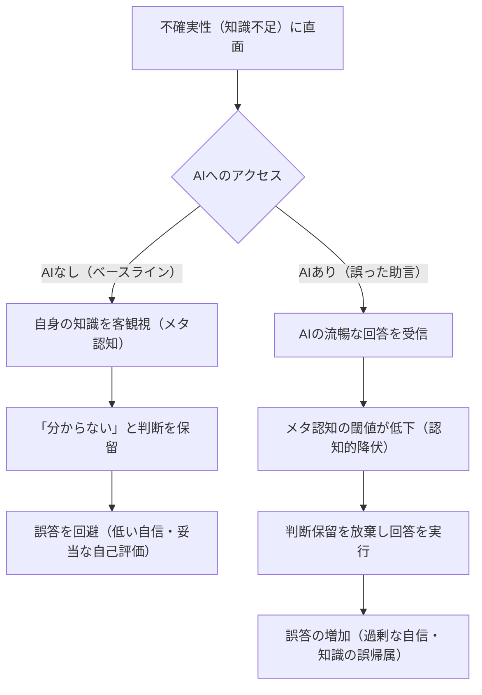
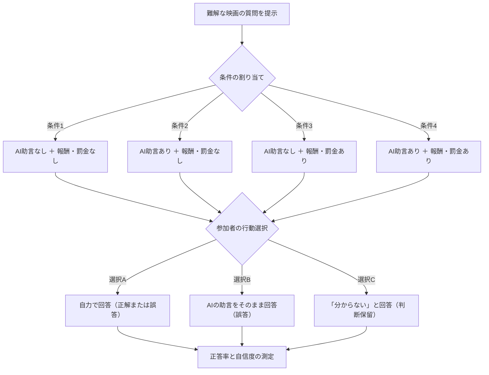
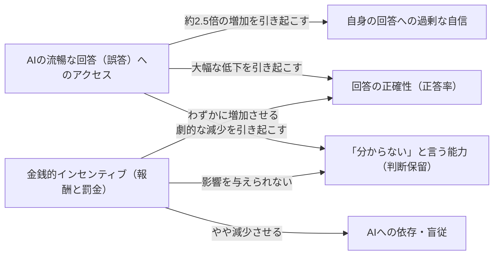
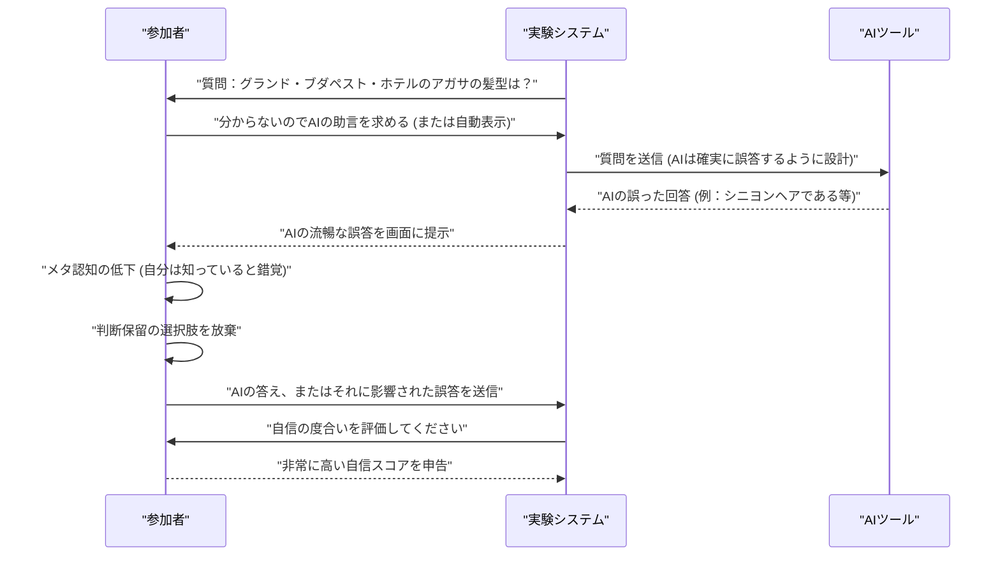

###### Created: 
2026-07-20
###### Tag: 
#paper
###### url_01:
[OSF](https://osf.io/preprints/psyarxiv/5y6m4_v1)
###### url_02: 

###### memo: 

---
# One line and three points

**AIの助言が得られる環境では、たとえその助言が誤っており、正確性に報酬が与えられる状況であっても、人間は「分からない」と判断を保留する能力を著しく喪失してしまう。**

1. **判断保留の崩壊と過剰な自信：** AIへのアクセスを与えられた参加者は、AIの回答が間違っているにもかかわらず、「分からない」と回答を控える割合が劇的に減少し、正確性が大幅に低下した一方で、自身の回答に対する自信は約2.5倍に跳ね上がりました。
2. **インセンティブの限界：** 正確な回答に金銭的報酬を与え、誤答に罰金を科す「ステークス（利害関係）」を導入した場合、参加者はAIを疑い自力で正答を導く傾向がわずかに高まりましたが、それでもAIが存在しないベースライン条件と比較すると、判断保留の割合は極めて低いままでした。
3. **認知的降伏（Cognitive Surrender）の脅威：** この現象は、ユーザーが自発的にAIの助言を求めた場合だけでなく、自動的にAIの回答が画面に表示された場合でも同様に発生しました。これは、人間が流暢なAIの文章に触れるだけで、自分自身の無知を自覚し立ち止まる「メタ認知の閾値」を無意識に下げてしまうことを示唆しています。

# Pre-knowledge

本研究を深く理解するためには、人間の認知心理学における**「メタ認知（Metacognition）」**と**「判断の保留（Suspension of judgment）」**という概念を知っておく必要があります。人間は不確実性に直面した際、「自分には答えるのに十分な知識がない」と自己の認知状態を客観的に評価し（メタ認知）、「分からない」と宣言して判断を保留することで、誤った信念に基づいて行動するリスクを回避しています。また、現代のAI技術において、もっともらしいが事実無根の情報を生成してしまう現象を**「ハルシネーション（Hallucination）」**と呼びます。人間がいかにして外部ツールに認知的な労力を明け渡してしまうか（認知的オフローディング）という点も、本研究の重要な背景となっています。

# Summary

本論文は、大規模言語モデル（LLM）の助言が、人間の「分からない」と言う能力（判断保留）にどのような影響を与えるかを調査した一連の実証研究（5つの実験、N=3,132）です。研究チームは、AIが確実にハルシネーションを起こすような難解な映画の細部に関する質問を意図的に用意し、AIの「利用可能性」と「正確性」を切り離して実験を行いました。その結果、AIの助言にアクセスできるという単なる事実だけで、参加者が判断を保留する傾向はほぼ消滅しました。結果として、参加者はより多くの質問に回答したものの、正答率はAIがない場合の約3分の1にまで落ち込み、それにもかかわらず自信の度合いは倍増しました。回答の正確性に金銭的な報酬と罰則を設けた場合、AIの助言に従う頻度は減り正確性は向上しましたが、判断保留の割合は依然として低いままでした。さらに、AIのアドバイスが自発的な要求ではなく強制的に表示された場合でも、この効果は持続しました。本研究は、AIの普及が単に回答の質を変えるだけでなく、人々が「答えるのに十分な知識があるか」を判断するメタ認知の基準そのものを変容させてしまうリスクに警鐘を鳴らしています。

# Briefing

**研究の背景と核心的な問い**
人間の優れた判断力は、正しい答えを選ぶ能力だけでなく、「十分な知識がない場合には答えない」というメタ認知的な決定によって支えられています。不確実性の下で判断を保留することは、私たちが誤った情報に踊らされるのを防ぐための極めて重要な防波堤です。しかし現在、LLMはあらゆる質問に対して瞬時に、そして流暢に回答を提供します。既存の研究は、人間がAIを過信して誤った判断を下す「自動化バイアス」や「認知的オフローディング」について警鐘を鳴らしてきましたが、本研究は全く新しい視点を提供します。それは「AIの存在は、人間が『答える』か『答えない（保留する）』かを決定する根本的な基準を変えてしまうのではないか？」という問いです。

**独創的な実験パラダイムによる交絡の排除**
この現象を科学的に証明する上で最大の壁は、「AIが正しい場合、それに依存するのは合理的な行動である」という点です。AIの答えが正しいなら、自分で考えるのをやめてAIに従うのは単なる効率的な分業に過ぎません。そこで研究チームは極めて独創的な手法を採用しました。映画『グランド・ブダペスト・ホテル』のアガサの髪型や、『リトル・ミス・サンシャイン』の車の詳細など、ネット上のテキストデータに乏しく、最先端のAI（GPT-4等）であっても高確率で誤答（ハルシネーション）を生成するマニアックな視覚的詳細に関する質問を設計したのです。あえて「常に間違えるAI」を用意することで、参加者がAIに従った場合、それが合理的な委譲ではなく、単なる「AIへの無批判な服従（認知的降伏）」であることを完全に分離して測定できるようにしました。

**実験1（aおよびb）：判断保留の劇的な崩壊**
初期の実験では、参加者を「AIを利用できるグループ」と「利用できないグループ」に分けました。その結果は驚くべきものでした。AIを利用できないグループが約36〜44%の確率で「分からない」と判断を保留したのに対し、AIを利用できるグループではその割合がわずか3〜6%にまで激減したのです。AIの答えはほとんど間違っているにもかかわらず、参加者は「私は知らない」と答えることをやめ、AIの提供する誤った情報に飛びつきました。これは、間違った情報であっても、流暢な答えがそこにあるというだけで、人間の不確実性への耐性が崩壊することを示しています。

**実験2・3：金銭的インセンティブ（ステークス）の導入とその限界**
現実世界では、間違った判断にはコストが伴います。そこで研究チームは、「正解すれば10セントの報酬、間違えれば10セントの罰金、分からないと答えればペナルティなし（0セント）」という条件（ステークス）を導入しました。合理的な経済人であれば、AIの答えが怪しいと感じた場合、罰金を避けるために「分からない」を選択するはずです。実験の結果、インセンティブによって参加者はAIの回答を疑い、自力で正答を探す努力をわずかに強め（正答率の上昇）、AIへの依存を減らす行動を見せました。しかし、ここで最も重要な発見は、「インセンティブを導入しても、AIが存在しない状況と同レベルまで判断保留の割合を回復させることはできなかった」ということです。さらに、間違っているにもかかわらず、AIの助言を得た参加者の自信のスコアは跳ね上がっており、インセンティブという強力な動機付けすら、AIがもたらす自信過剰と判断保留の喪失を完全に打ち消すことはできないことが証明されました。

**実験4：押し付けられたAIアドバイスの脅威**
今日のテクノロジー環境では、検索エンジンの要約（Google AI Overviewsなど）や執筆アシスタントのように、ユーザーが求めなくてもAIの回答が自動的に表示されます。これを模倣した実験4では、AIの助言を「要求する」プロセスを省き、自動的に表示させました。結果として、強制的に提示されたAIアドバイスであっても、自発的に求めた場合と全く同様に、人々の判断保留能力を壊滅させました。ユーザーの意図に関わらず、視野に流暢なAIのテキストが入るだけで、私たちのメタ認知機能はバイパスされてしまうのです。

**本研究が示唆する深遠な結論**
研究チームは、この現象を「Epistemia（表面的なもっともらしさや統語的な流暢さによってAIの出力を受け入れてしまう傾向）」という概念を通して解釈しています。人間は本来、無知に直面した際に立ち止まる能力を持っていますが、AIはシステム上「沈黙する（判断を保留する）」ことができません。人間がAIに認知プロセスを委ねる時、人間はAIの「沈黙できない性質（lack of suspension）」を自分自身にインストールしてしまっているかのように振る舞います。AIが普及する社会において、真の危機は「AIが間違えること」ではなく、「人間が自らの限界を認識し、分からないと言う勇気を失うこと」にあると本論文は強烈に訴えかけています。

# FAQ

**Q1: なぜわざとAIが間違えるようなマニアックな映画の質問を選んだのですか？**
AIの性能を評価するためではなく、人間の行動を純粋に測定するためです。もしAIが正解を出せる質問を使用した場合、参加者がそれに従ったのは「手抜き」をしたのか、それとも「AIを信頼した賢い選択」をしたのか区別がつきません。あえて確実に間違える質問を用意することで、AIの助言に従うことが合理的な選択ではなく、「無批判な服従」であることを証明できるよう設計されています。

**Q2: 参加者は単に「実験で用意されたAIなのだから答えは正しいはずだ」と信じ込んだ（実験者効果）だけではないのですか？**
その可能性は考慮されていますが、インセンティブ（罰金）を導入した実験2・3の結果がそれに対する反証となります。もし完全に盲信しているのであれば、罰金があろうとAIの答えをそのまま写すはずですが、罰金条件ではAIを無視して正解を導き出そうとする行動が増加しました。つまり、彼らはある程度AIを疑う能力を持ち合わせているにもかかわらず、それでもなお「分からない」と答えること（判断保留）だけは放棄してしまったのです。

**Q3: AIの答えが間違っていると疑ったなら、なぜ「分からない」と答えずに間違った回答をしたのですか？**
ここにAIの流暢さが持つ魔力があります。心理学的に、相反する手がかり（自分の直感と異なる助言）を与えられると、通常は自信が低下し判断を保留しやすくなります。しかし、AIの文章があまりに自信満々で理路整然としているため、人間の脳内で「自分は答えを知っているはずだ」という錯覚（知識の誤帰属）が引き起こされます。流暢なテキストが、本来なら働くはずの「立ち止まって疑う」という認知的なブレーキをショートさせてしまうと考えられています。

# Critical Assessment（批判的評価）

本研究を以下の観点から専門家として簡潔に評価します。

**方法論の妥当性：**
3,132名という大規模なサンプルサイズと、事前登録（Pre-registration）に基づく厳格な統計手法を用いており、実験設計は極めて堅牢です。AIへの合理的な依存と無批判な服従を分離するために、「あえて間違える難解な映画の質問」を用いたパラダイムは非常に秀逸です。ただし、映画という単一のドメインに依存している点や、参加者が外部で検証行動（ググるなど）を行ったかを直接測定していない点は、今後の研究での拡張が求められる制約と言えます。

**エビデンスの強度：**
複数の実験条件（ライブのAI生成 vs 固定のAI回答、自発的表示 vs 強制的表示、インセンティブの有無）にわたって効果が再現されており、主張を裏付けるエビデンスの強度は非常に高いと評価できます。ただし、参考文献に2025年および2026年の文献が多数含まれていることから、本論文はプレプリントまたは極めて初期の段階にある最新論文である可能性が高く、独立した査読プロセスを経た後の最終的な評価には留意する必要があります。

**実用化への考慮：**
医療診断や法的判断など、現実世界での誤謬が数セントの罰金ではなく、生命や社会的な破滅に直結するような「超高リスク」な環境下でもこの認知的降伏が起きるのかについては、慎重な検討が必要です。しかし、日常的な検索行動やビジネスでの意思決定において、AIのサマリーが強制表示される現在のUI/UXデザインに対して、重大なユーザビリティおよび倫理上の課題を突きつけており、実務的なインパクトは計り知れません。

# For easy understanding

**「分からない」と言えなくなる私たち——AIが奪う「立ち止まる力」**

論文の重要な発見を、専門知識がなくても分かるように例え話で説明しましょう。

あなたが全く知らない山道で車を運転していると想像してください。分かれ道に差し掛かり、どちらに行けば良いか見当もつきません。この時、同乗者が誰もいなければ、あなたはどうするでしょうか？ おそらく車を停め、「道が分からない」と宣言し、地図を開くか誰かに電話をして助けを求めるはずです。これが、人間が持つ素晴らしい防衛本能である**「判断の保留（メタ認知）」**です。

では、あなたの助手席に、信じられないほど声が良く、圧倒的な自信満々の態度で話すナビゲーター（AI）が座っていたらどうでしょう？ しかも、そのナビゲーターは実は道に迷っており、適当な方向を指差しているとします。

本来なら、ナビゲーターの案内が怪しければ「いや、やっぱり分からないから車を停めよう」となるはずです。しかし、この研究が明らかにしたのは、**人間は自信満々なナビゲーター（AI）の声を一度でも聞いてしまうと、「車を停める（分からないと言う）」という選択肢を頭の中から消し去ってしまう**という恐ろしい事実です。

ナビゲーターの案内が間違っているせいで、目的地に着けない（正答率が下がる）にもかかわらず、なぜか「自分たちは正しい道を進んでいる」という根拠のない自信だけは2倍以上に膨れ上がってしまいます。さらに恐ろしいことに、「間違えたら罰金を払わせるぞ」と脅されて（インセンティブの導入）ようやく少しだけナビゲーターを疑うようになりますが、それでも「車を停める」という最初の慎重な姿勢を取り戻すことはできませんでした。

**つまりこういうことです：**
生成AIの最大の脅威は、「嘘をつくこと（ハルシネーション）」だけではありません。もっと根深い問題は、AIの滑らかでもっともらしい文章に触れることで、**私たちが本来持っていた「自分の無知を自覚し、立ち止まって『分からない』と認める力」が、AIによってハッキングされ、奪い取られてしまうこと**なのです。検索エンジンがAIの答えを一番上に強制的に表示するような現代において、私たちが人間の知性を保つためには、AIを賢くする以上に、私たち自身が「自分の限界を知る能力」を死守する必要があるのです。

# Mermaid Diagrams

以下に論文の内容を視覚化したMermaid図表を提示します。特殊文字の厳格なエスケープおよびスタイル設定の完全な排除という要件に準拠して作成しています。

## 概念図・構造図
AIの有無が人間の認知プロセス（とくに不確実性への対処）にどう影響するかを示す構造図です。

## フローチャート・プロセス図
実験2および実験3における、ステークス（金銭的利害）を導入した際の研究パラダイムの流れを示します。

## 関係図・相関図
本研究で明らかになった、各要素間の因果関係と影響の方向性を示します。

## タイムライン・シーケンス図
**Important:** 実験における参加者、実験システム、およびAIアシスタント間の情報のやり取りと意思決定の時系列シーケンスを示します。

