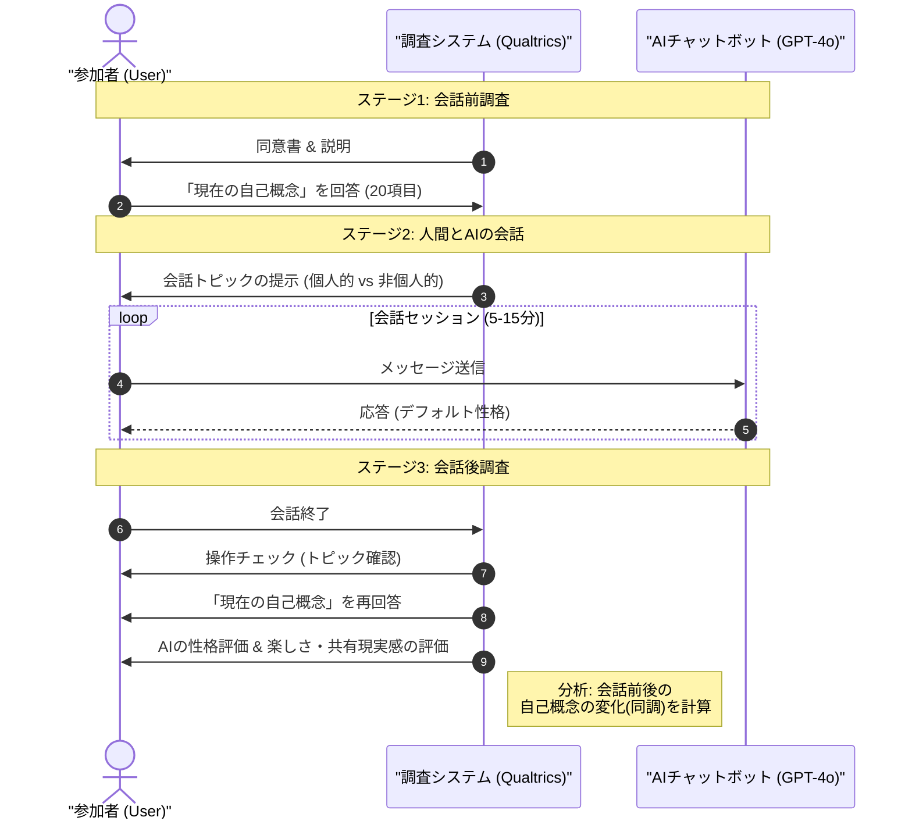
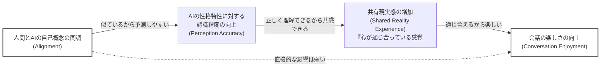
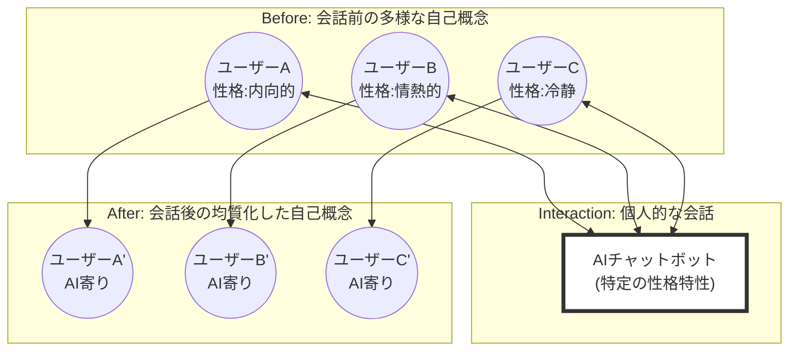

###### Created: 
2026-02-02 17:54 
###### Tag: 
#paper
###### url_01:
https://www.arxiv.org/abs/2601.12727 
###### url_02: 

###### memo: 

---

<!-- paper_extractor:summary:start -->

本論文のSummary、Briefing、FAQ、平易な理解のための解説、およびMermaid図表を出力します。

# One line and three points
GPT-4o等のLLMベースのAIと個人的なトピックについて会話することで、人間の「自己概念（自分が自分の性格をどう捉えているか）」がAIの性格特性へと無意識に同調し、ユーザー集団全体の性格的な均質化を招く可能性があることを実証した研究。

1.  **自己概念の同調（Alignment）：** 個人的な話題（人生、感情、価値観など）について会話すると、ユーザーの自己概念はAIが示す性格特性（GPT-4oのデフォルト設定）に近づくことが確認されました。
2.  **集団の均質化（Homogenization）：** 多数のユーザーが同一のAIモデルと対話することで、個々人の自己概念がAIの特性に収束し、結果として人間側の多様性が減少するリスクが示されました。
3.  **エンゲージメントへの影響：** AIとの同調度が高いほど会話の楽しさが増すことが判明し、その背景には「AIの性格を正確に認識できること」と「共有現実感（感覚の共有）」が介在していることが明らかになりました。

# Summary
本研究は、国立シンガポール大学の研究チームにより、人間とAI（LLMベースのチャットボット）の相互作用において、AIが示す性格特性が人間の「自己概念（Self-concept）」にどのような影響を与えるかを調査したものです。人間同士の会話において、相手の性格特性が自分の自己認識に影響を与える「対人自己同調」という現象が知られていますが、本研究はこれがAI相手でも発生することを実証しました。

実験では92名の参加者を対象に、GPT-4o（デフォルト設定）と会話を行わせ、会話前後の自己概念の変化を測定しました。その結果、個人的なトピック（自己開示や内省を伴う話題）について会話した場合、ユーザーの自己概念はAIの測定された性格特性へと有意に同調（シフト）することが確認されました。会話が長くなるほどこの同調は強まりました。

重要な発見として、この同調現象は、個々のユーザーが「AIの性格」に近づくことを意味するため、結果として異なるユーザー間での自己概念の差異が縮小し、集団としての均質化（ホモジェナイゼーション）を引き起こすことが示されました。一方で、自己概念の同調は、会話の「楽しさ」と正の相関がありました。これは、同調によってAIの性格を予測しやすくなり、AIとの間に「共有現実感（Shared Reality）」を感じやすくなるためであると説明されています。

本論文は、AIが人間の心理に与える影響の深さを示し、AI設計における倫理的リスク（多様性の喪失、操作の可能性）と機会（ウェルビーイングの向上、エンゲージメント改善）の両面について重要な示唆を与えています。

# Briefing
本研究の背景、実験手法、および主要な発見について、包括的に解説します。

### 1. 研究の背景と動機
*   **AIの社会的影響力の増大:** 人々は日常的にLLMベースのAI（ChatGPT等）と対話し、個人的な経験や感情を共有するようになっています。これまでの研究で、AIはユーザーの行動や認知を同調させる力を持つことが示唆されてきました。
*   **自己概念の可変性:** 心理学において「自己概念」は固定的なものではなく、他者との相互作用によって変化しうることが知られています（例：外向的な人と話すと、自分も一時的に外向的だと感じやすくなる）。
*   **リサーチクエスチョン:** 人間のような性格特性を示すAIとの会話において、人間の自己概念はAIの特性に同調するのか？また、それはどのような条件下で発生し、どのような結果をもたらすのか？

### 2. 実験デザイン（方法論）
研究チームは、以下の混合要因デザインを用いたランダム化比較実験を行いました。
*   **参加者:** 米国在住の成人92名。
*   **AIモデル:** GPT-4o（システムプロンプトによる性格付与は行わず、APIのデフォルト設定を使用）。事前にAI自身に性格検査を行わせ、その特性を基準値としました。
*   **条件（被験者間要因）:**
    *   **個人的トピック条件:** 人生、感情、アイデンティティに関連する話題（例：「時間と金銭の制約がなければ何をしたいか？」）。
    *   **非個人的トピック条件:** 客観的・一般的な話題（例：「なぜインターネットで猫が人気なのか？」）。
*   **測定（被験者内要因）:** 会話前（ベースライン）と会話後の自己概念を、20項目の性格特性尺度を用いて測定し、AIの特性との距離（マンハッタン距離）の変化を分析しました。

### 3. 主要な発見
*   **H1（同調の確認）:** 会話後、参加者の自己概念はAIの性格特性に有意に近づきました。
*   **H2（トピックの影響）:** この同調現象は、「個人的トピック」について話したグループでのみ有意に観察され、非個人的な話題では確認されませんでした。これは、自己開示や内省を伴う会話において、AIの言語パターンから性格特性がより強く伝達・受容されるためと考えられます。
*   **H3（均質化）:** 同調の結果、参加者同士の自己概念の距離（ばらつき）が会話後に有意に減少しました。これは、多様な個人が単一のAIモデル（画一的な性格）に影響を受けることで、人間側の多様性が失われるリスクを示唆しています。
*   **H4 & H5（楽しさのメカニズム）:** AIへの同調度が高いほど、会話の「楽しさ」が高く評価されました。構造方程式モデリング（SEM）により、以下のプロセスが明らかになりました：
    `同調度の上昇` → `AIの性格予測精度の向上` → `共有現実感（心が通じ合っている感覚）の増加` → `会話の楽しさ向上`

### 4. 議論とインプリケーション
*   **二面性のある影響:** 自己概念の同調は「諸刃の剣」です。
    *   **リスク:** 大規模なユーザー集団が少数のAIモデルと対話することで、文化的・社会的な多様性が損なわれる「均質化」の恐れがあります。また、意図的に特定の性格（例：従順さ）を人間に植え付けるような悪用のリスクもあります。
    *   **機会:** ユーザーとの親和性を高め、ユーザー体験を向上させる設計に応用可能です。また、肯定的な性格特性を持つAIとの対話を通じて、ユーザーの自尊心を高める等のセラピューティックな応用の可能性も示唆されました。
*   **AI設計への提言:** AIの性格特性を透明化すること（「私はこういう性格設定です」と明示する）、多様な性格オプションを提供すること、特に脆弱なユーザー（子供や精神的に不安定な人）に対する保護メカニズムの必要性が提言されています。

# FAQ

**Q1: AIは特定の性格を演じるように設定されていたのですか？**
A1: いいえ、特定のペルソナ（例：「外向的な性格で振る舞え」など）は設定されていません。GPT-4oのAPIデフォルト設定が使用されました。これは、一般ユーザーが最も頻繁に接する「素のAI」の状態での影響を測定するためです。研究チームは、このデフォルト状態のAIに性格検査を行わせ、そのスコアを基準としました。

**Q2: どのような話題でも、AIと話せば性格が変わってしまうのですか？**
A2: いいえ、本研究では「個人的なトピック（Personal Topics）」について会話した場合にのみ、有意な同調効果が確認されました。一般的な雑談や客観的な情報交換（非個人的トピック）では、自己概念の変化は確認されませんでした。自己開示や内省を伴う深い会話が鍵となるようです。

**Q3: この変化は永続的なものですか？**
A3: 本研究は1回の短い会話（平均9分程度）直後の変化を測定したものであり、効果がどれくらい持続するかは検証されていません。しかし、人間関係の研究や行動変容の理論からは、こうした相互作用が繰り返されることで、一時的な変化が長期的な変化として定着する可能性が指摘されています。

**Q4: なぜ自己概念がAIに近づくと「会話が楽しく」なるのですか？**
A4: 自分と相手（AI）が似ていると感じることで、相手の反応を予測しやすくなり、「私たちは世界を同じように見ている」「心が通じている」という感覚（共有現実感）が生まれるためです。この感覚がポジティブな感情や満足感につながると分析されています。

# Critical Assessment（批判的評価）

**方法論の妥当性：**
実験は無作為化比較試験（RCT）として適切に設計されており、被験者内要因（事前・事後）と被験者間要因（トピックの違い）を組み合わせた混合デザインは強力です。また、会話ターン数を共変量として制御するなど、統計的な検定力も十分に考慮されています。ただし、自己概念の測定が自己申告（アンケート）に依存している点や、実験参加者が米国在住者に限定されている点は、文化的な一般化における制約となります。

**エビデンスの強度：**
個人的トピック条件における同調効果（H1, H2）や均質化（H3）に関する統計的有意差は明確であり、仮説を強く支持しています。また、SEMを用いた媒介分析（H5）も適合度が高く、メカニズムの説明に説得力があります。本論文はarXiv上のプレプリントであり、現時点では査読プロセスを経ていない可能性がある点に留意が必要ですが、提示されたデータは堅牢です。

**実用化への考慮：**
GPT-4oのデフォルト設定を用いた点は、実環境（Ecological Validity）を反映しており評価できます。一方で、実際にこの知見を応用（またはリスク回避）する際、AIの性格特性をどのように制御・提示するか、またユーザーの精神状態をどう保護するかという倫理的・技術的課題は依然として大きく、具体的な実装ガイドラインの策定にはさらなる長期的な研究が必要です。

# For easy understanding
この論文は、**「AIとおしゃべりをしていると、知らず知らずのうちに自分の性格だと思っているものが、AIの性格に似てきてしまう」**という驚くべき現象を発見しました。

分かりやすく例えると、**「仲の良い友達と話していると、口癖や考え方が似てくる（うつる）」**という現象が、相手が人間でなくAIであっても起こるということです。

具体的には以下のことが分かりました：
1.  **深い話をすると「うつる」：** 天気の話や一般論ではなく、自分の人生や価値観についてAIと話すと、AIの性格（GPT-4oが元々持っている傾向）が自分に「うつり」ます。
2.  **みんなが「平均化」されるリスク：** もし世界中の何億人もの人が、同じ性格のAI（例えばChatGPT）とばかり話していると、みんなの自己認識がそのAIに近づいてしまい、**人間一人ひとりの個性が薄れて、みんな似通った性格になってしまう（均質化する）**恐れがあります。
3.  **似てくると「楽しい」：** AIに性格が似てくると、「このAIは私のことを分かっている」「気が合う」と感じやすくなり、会話が楽しくなります。

つまり、AIは単なる道具ではなく、**私たちの「自分らしさ」を書き換えてしまう影響力を持っている**可能性があるということです。これは、AIをメンタルケアなどに使うチャンスでもありますが、同時に私たちの個性を消してしまうリスクも孕んでいるのです。

# Mermaid Diagrams

## タイムライン・シーケンス図：実験の手順

## フローチャート・プロセス図：同調が楽しさを生むメカニズム (H5)

## 概念図・構造図：集団レベルでの均質化 (H3)

<!-- paper_extractor:summary:end -->