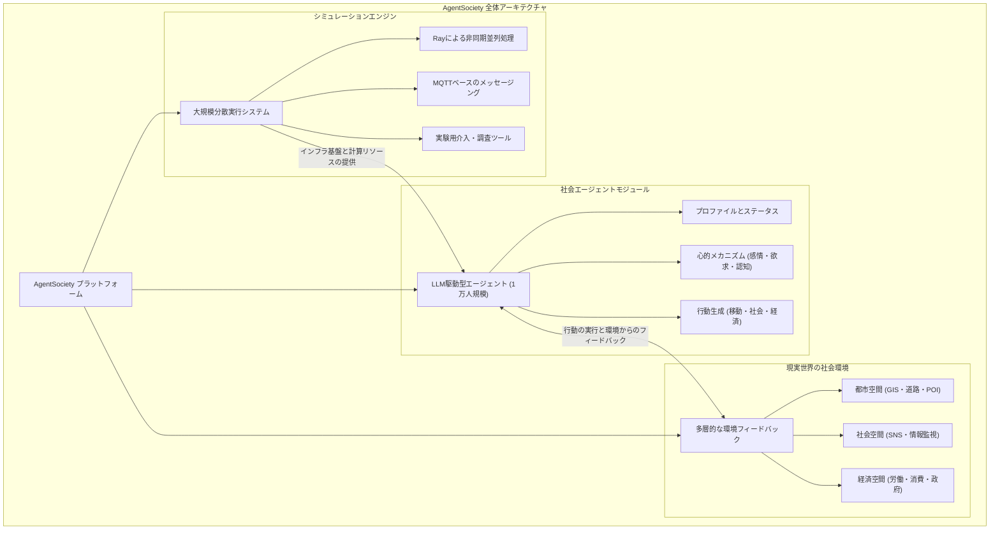
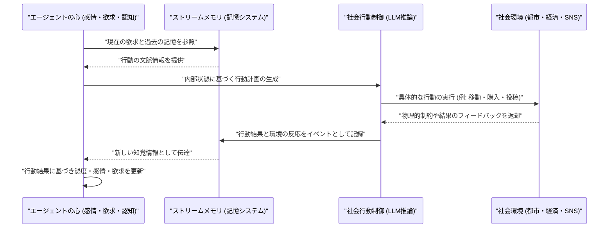
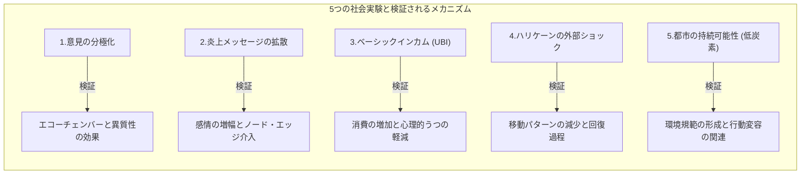

###### Created: 
2026-04-17 14:09 
###### Tag: 
#paper
###### url_01:
https://arxiv.org/abs/2502.08691 
###### url_02: 

###### memo: 

---

<!-- paper_extractor:summary:start -->

**One line and three points**

1万人規模のLLM駆動型自律エージェントを用いて、都市の物理空間、社会ネットワーク、マクロ経済を現実に即して再現し、様々な社会実験を可能にする大規模社会シミュレータ「AgentSociety」を提案・実証した研究です。

*   **心理学や経済学の理論に裏打ちされたエージェント設計：** 単なる役割演技（ロールプレイ）を超え、エージェントの内部に「感情・欲求・認知」といった心のメカニズムを持たせ、それらが物理的な移動、SNSでの交流、労働や消費といった「複雑な社会行動」を明示的に駆動するアーキテクチャを構築しています。
*   **多様な相互作用を支える現実的な社会環境の構築：** 道路網や施設データ（POI）に基づく「都市空間」、情報伝播と介入をシミュレートする「社会空間」、企業・政府・銀行・個人が関わる「経済空間」を統合的にモデリングし、LLMの幻覚（ハルシネーション）を防ぐための客観的な制約とフィードバックを提供しています。
*   **分散コンピューティングとIoT通信技術による大規模化の実現：** Rayフレームワークによる非同期分散処理と、IoT分野で実績のある高効率なMQTTメッセージングプロトコルを採用することで、通信ポートの枯渇問題を解決し、1万エージェントを超える大規模かつ高速なシミュレーションと政策介入テストを可能にしました。

---

**Summary**

本論文は、人工知能（AI）を用いた計算社会科学の新たなパラダイムとして、大規模言語モデル（LLM）によって駆動される自律型エージェントと、現実世界の複雑な構造を反映した環境とを統合した大規模社会シミュレータ「AgentSociety」を提案しています。これまでのエージェントベースモデル（ABM）は、少数の単純なルールに依存しているか、あるいはLLMを用いていても小規模なテキストベースの環境にとどまっており、現実の人間社会に見られる動的で多面的な相互作用を正確に再現するには至っていませんでした。この課題を克服するため、著者らはマズローの欲求階層説や計画的行動理論などの心理学・経済学の知見を組み込み、感情や認知といった内部状態が、都市空間での移動、オンラインSNSでの情報共有、そして労働や消費といった経済活動を自律的に引き起こす高度なエージェントモデルを開発しました。さらに、これらのエージェントが活動する舞台として、地理情報に基づく都市空間、メッセージフィルタリングが可能な社会空間、そしてミクロな個人の行動がマクロなGDPなどの指標を形成する経済空間という3つの基盤環境を構築しています。計算資源の制約を打破するために導入された分散処理技術とMQTTベースのメッセージングシステムにより、1万体規模のエージェントが互いに通信しながら生活する様子を高速にシミュレートすることに成功しています。論文の後半では、このプラットフォームを活用して「意見の分極化メカニズム」「炎上メッセージの拡散と介入効果」「ユニバーサル・ベーシックインカム（UBI）の導入による経済・心理的変化」「ハリケーンなどの外部ショックに対する避難行動」「低炭素な都市の持続可能性に向けた規範形成」という5つの具体的な社会実験を実施し、AgentSocietyが実際の社会政策の評価や危機管理のテストベッドとして極めて有用であることを実証しています。

---

**Briefing**

**計算社会科学における新たなパラダイムの必要性**
人間の行動や社会の複雑なダイナミクスを理解することは、社会科学における長年の目標であり、近年では膨大なデータと計算機を活用する計算社会科学がその中心的な役割を担うようになっています。従来の計算社会科学は、過去のデータを分析して法則を見つけ出す「説明」や、将来のトレンドを予測する「予測」に主眼を置いてきました。しかし、真の理解を得るためには、個々の構成要素である人間をモデル化し、それらの相互作用から社会現象がボトムアップに創発される過程をシミュレーションする「生成的な社会科学」のアプローチが不可欠です。近年、大規模言語モデル（LLM）の飛躍的な進歩により、人間に近い推論能力や会話能力を持つエージェントを作成することが可能になりましたが、既存の研究の多くは、小規模な空間での限定的な役割演技（ロールプレイ）や、特定のタスク解決にとどまっており、現実の人間社会に見られる複雑な心理的要因や多層的な社会環境、そして数万人規模の相互作用を総合的にシミュレートするには大きな技術的限界がありました。本研究で提案される「AgentSociety」は、これらの限界を打ち破り、ミクロな個人の心理からマクロな社会現象までをシームレスに繋ぐプラットフォームを提供することを目的としています。

**心理的メカニズムと社会行動を統合したエージェント設計**
AgentSocietyにおける最大の革新の一つは、単にLLMにプロンプトを与えて行動させるのではなく、社会科学的な理論体系に深く根ざした内部アーキテクチャをエージェントに実装している点です。エージェントは、年齢や性別、性格といった固定的な「プロファイル」と、経済状況や人間関係といった動的な「ステータス」を保持しています。その上で、マズローの欲求階層説や認知評価理論などの心理学理論に基づき、「感情（即次的な反応）」「欲求（行動を駆り立てる根本的な動機）」「認知（他者の意図の理解や態度）」という3つの階層からなる心のモデリングが行われています。これらの内部状態は、都市空間における物理的な「移動」、オンラインネットワークを通じた「社会的交流」、そして日々の労働や買い物といった「経済的行動」という具体的な外部行動へと翻訳されます。例えば、空腹という生存欲求が生じれば、エージェントは重力モデル（距離と魅力度のトレードオフ）を用いて最適な飲食店を選択して移動し、同時にそこで友人との社会的なつながりを深めるといった、相互に関連し合う一連の行動計画を自律的に立案し実行します。そして、行動の結果や環境からのフィードバックは「ストリームメモリ（Stream Memory）」という時系列の記憶システムに記録され、それが再びエージェントの感情や態度を更新するという、現実の人間に極めて近い動的なフィードバックループが形成されています。

**現実世界の複雑さを反映した多層的な社会環境の構築**
高度なエージェントがその能力を十分に発揮するためには、LLMの純粋な想像（ハルシネーション）に頼るのではなく、現実世界の物理的・社会的制約を正確にシミュレートする環境が不可欠です。AgentSocietyは、エージェントの外部環境を3つの空間に分けて構築しています。第一の「都市空間」は、OpenStreetMapなどの現実の地理情報システム（GIS）データを基にしており、道路網や様々な施設（POI）を含んでいます。ここでは、歩行、自転車、公共交通機関、自動車といった移動手段が物理法則と交通ルールに従って計算され、エージェントに対して正確な時間コストと空間的フィードバックを提供します。第二の「社会空間」は、エージェント間の社会的ネットワークを管理し、現実のソーシャルメディアプラットフォームのように機能します。ここでは、オンラインでのメッセージのやり取りだけでなく、特定のアルゴリズムを用いたコンテンツのフィルタリングや、特定のアカウントの凍結といった、プラットフォーム管理者側の「監視・介入」のメカニズムも実装されており、情報伝播の研究に不可欠な基盤を提供しています。第三の「経済空間」は、エージェントが労働力を提供して賃金を得る「企業」、徴税を行う「政府」、貯蓄に対して金利を付与する「銀行」、そして消費活動を行う市場から構成されるマクロ経済のフレームワークです。これらの機関は、消費者の需要に応じて価格を調整したり、テイラー・ルールに基づいて金利を変動させたりすることで、エージェントのミクロな意思決定がGDPなどのマクロな経済指標にどのように結びつくかを計算する役割を担っています。

**数万規模の相互作用を可能にするシミュレーションエンジン**
このような精緻なエージェントと環境を大規模に動作させるにあたり、従来のシステムでは膨大なTCPポートの枯渇やプロセス間通信のオーバーヘッドが致命的なボトルネックとなっていました。AgentSocietyのシミュレーションエンジンは、Rayフレームワークを活用した「グループベースの分散コンピューティングアーキテクチャ」を採用することでこの問題を根本から解決しています。数万体におよぶエージェントを複数のグループにまとめ、各グループ内でPythonの非同期処理（asyncio）を用いてLLM API呼び出しや環境とのI/O処理を並列化することで、効率的なコネクションプーリングを実現しています。さらに、エージェント間の絶え間ないコミュニケーションを支えるために、インターネット・オブ・シングス（IoT）分野で数百万台のデバイス通信を支えている軽量かつ高信頼なメッセージングプロトコル「MQTT」を導入しました。これにより、1万エージェントを超える規模であっても、システム全体が遅延なく安定してメッセージをルーティングし続けることが可能となり、同時に研究者がGUIツールを通じて個々のエージェントに直接インタビューやアンケート調査を行うためのバックエンドとしても機能するよう設計されています。

**社会課題の解決に向けたテストベッドとしての実証**
論文の最後では、構築されたAgentSocietyがいかにして実際の政策評価や社会メカニズムの解明に貢献できるかを示すため、5つの具体的な実験事例が提示されています。例えば「分極化」の実験では、銃規制という政治的テーマについて、エージェント同士が自分と似た意見を持つ者（エコーチェンバー）とだけ交流する場合、対立が極端に深まるプロセスが定量的に観察されました。また、「炎上メッセージの拡散」に関する実験では、有害な情報が通常の情報よりも速く伝播する特性が再現され、ネットワークの繋がりを断つよりも、発信源となるノード（アカウント）を凍結する介入がより効果的に集団の怒りの感情を鎮静化できることが示されました。「ユニバーサル・ベーシックインカム（UBI）」の実験では、毎月一定額をエージェントに給付することで、実際にテキサス州で行われた実験と同様に、マクロな消費水準が向上し、心理的なうつ病レベルが低下するという経済的・社会的影響の双方が確認されています。「ハリケーンの外部ショック」に関するシミュレーションでは、災害発生時に人々の外出（モビリティ）が急減し、事後に回復するという現実のGPSデータと一致する避難行動が自然に創発されました。「都市の持続可能性」の実験では、環境保護に関する規範的な介入メッセージをエージェントに与えることで、彼らの内面的な価値観が変化し、それが実際に自動車利用を控えて公共交通機関を選択するという行動変容、ひいては都市全体のCO2排出量の削減に直結するプロセスが明らかにされています。これらの結果は、AgentSocietyが単なる仮想空間の箱庭ではなく、政策立案者がリスクを伴う意思決定を事前に行うための、極めて強力な「社会のデジタルツイン」として機能することを示しています。

---

**FAQ**

**Q: 従来の「Generative Agents（生成エージェント）」の研究とは何が異なるのですか？**
A: 従来の生成エージェントの研究は、小さな村やテキストベースのゲーム環境といった限定的な空間で数十体程度のエージェントを動作させる概念実証にとどまっていました。本研究のAgentSocietyは、現実のGISデータに基づいた都市空間や、マクロ経済モデルに基づく経済空間といった「客観的な物理・社会法則」をシミュレータに組み込んでいる点が大きく異なります。また、IoT通信技術（MQTT）やグループベースの分散処理を活用することで、従来の通信ボトルネックを解消し、1万体以上のエージェントによる大規模な相互作用を同時に計算できるようにアーキテクチャが根本的に改善されています。

**Q: エージェントの行動は、毎回どのように決定されているのですか？あらかじめ決められたルールに従っているだけですか？**
A: いいえ、固定化されたルールに従っているわけではありません。エージェントは、マズローの欲求階層説などに基づく「心理モデル」を内包しており、現在の「欲求（例えば空腹、あるいは社会的交流を求める気持ち）」や「感情」を起点に、LLM（大規模言語モデル）の推論能力を用いて自律的に行動計画を立案します。その際、過去の記憶（ストリームメモリ）や現在の所持金、物理的な距離などの環境的な制約がフィードバックとしてLLMに与えられるため、状況に応じて極めて人間らしく適応的で柔軟な意思決定が行われます。

**Q: このシミュレータを実際の政策決定に使うことはできるのでしょうか？**
A: 本プラットフォームは、実際の政策決定のための「安全なテストベッド（実験場）」として設計されています。例えば、新しい税制や補助金制度（ベーシックインカムなど）を導入した際、それが人々の労働意欲や消費行動にどのような影響を与え、最終的にマクロ経済のGDPがどう変化するかを、実際に社会に適用する前に仮想空間で試算することができます。また、研究者は稼働中のエージェントに対して「アンケート」や「インタビュー」を行うツールを備えているため、単なる数値の変化だけでなく、政策に対する「仮想住民の心理的な受容度」までも定性的に分析することが可能です。

---

**Critical Assessment（批判的評価）**

※本評価は、本論文が現在arXiv等で公開されている**プレプリント（未査読論文）**であることを前提としています。今後の査読プロセスにより、内容の修正や評価が変更される可能性がある点に留意する必要があります。

**方法論の妥当性：**
本研究の最大の強みは、心理学（計画的行動理論など）や経済学（マクロ経済モデル）の既存理論をLLMのプロンプト構造とシステムアーキテクチャに明示的に翻訳し、個人のミクロな動機付けとマクロな環境フィードバックとを接続する壮大な枠組みを構築した点にあります。一方で制約として、LLMの推論には確率的な要素が含まれており、いわゆる「幻覚（ハルシネーション）」を完全に排除することが難しいため、実験の決定論的な再現性を担保する上での課題が残ります。また、経済空間における労働市場（失業や賃金交渉）や財市場（複数企業間の競争）のモデリングは依然として抽象度が高く、これらの簡略化がマクロ指標に与えるバイアスについてはさらなる検証が必要です。

**エビデンスの強度：**
プレプリント段階である本研究の主張は、概念実証（Proof of Concept）としては非常に強力ですが、厳密な実証的証拠としてはまだ初期段階にあると評価すべきです。UBIやハリケーン避難といった5つの事例実験では、シミュレーション結果が現実の現象と巨視的な傾向レベル（マクロなトレンド）で一致していることは示されていますが、実際の統計データとのミクロレベルでの精緻な定量的比較や、統計的な適合度検定は十分に行われていません。したがって、このシステムが現実の複雑な社会動態を「どこまで正確に予測できるか」という点については、今後の追加的な検証実験と、第三者による査読を通じた客観的な評価が待たれます。

**実用化への考慮：**
AgentSocietyを現実の都市計画や政策立案の現場で実用化するには、いくつかの重大な障壁を乗り越える必要があります。第一に、LLMに対する膨大なAPI呼び出し回数は、莫大な計算コストと金銭的費用を伴うため、恒常的な運用には小規模かつ特化型のオープンソースモデルを用いたローカル推論環境の最適化が必須となります。第二に、特定の都市や地域社会に適用する場合、その地域特有の人口動態や文化、経済的背景に合わせてエージェントのプロファイルを精密にキャリブレーション（調整）する作業が非常に困難です。第三に、AIが生成した「尤もらしいシミュレーション結果」を根拠に実際の政治決定を行うことには、アルゴリズムの透明性やバイアスに関する倫理的リスクが伴うため、出力結果を無批判に受け入れないためのガードレール作りが実社会での適用には不可欠です。

---

**For easy understanding**

私たちの住む現実社会は、何万人、何百万人という人々が、それぞれの感情や事情を抱えて移動し、働き、SNSで繋がり合うことで成り立っています。もし、「国民全員に毎月10万円を配ったらどうなるだろう？」「フェイクニュースが蔓延したとき、どうすれば一番早く鎮められるだろう？」といった疑問を持っても、現実世界でいきなり国全体を使って実験することは、お金もかかりますし、失敗した時のリスクが大きすぎて不可能です。

この論文が作った「AgentSociety（エージェント・ソサエティ）」は、いわば**「超リアルな社会のシミュレーションゲーム（例えばシムシティのようなもの）」の中に、それぞれ独自の『心』を持ったAIの住人を1万人以上住まわせる**という、画期的なシステムです。

これまでのAIは、こちらから質問したことに答えるだけの受動的な存在でした。しかし、このシミュレータの中のAI住人たちは、自分自身の年齢や性格を持っており、「お腹が空いたから、地図を見て近くのレストランに行こう」「給料が入ったから買い物をしよう」「SNSで友達が怒っているのを見て、自分も不安になった」というように、**自分自身の欲求や感情にしたがって自律的に生活**します。さらに、AI住人たちが生活する環境も非常にリアルに作られており、道路の渋滞、お店の値段、銀行の金利、SNSのタイムラインなどが、彼らの行動に合わせてリアルタイムに変化していきます。

つまりこういうことです。このAgentSocietyを使えば、コンピュータの中に作り上げた「もう一つの社会」に対して、政策立案者や研究者が安全に介入テストを行うことができます。「この街に新しいルールを導入したら、住人たちはどう反応するか？」を、AI住人たちの行動の変化だけでなく、彼らに直接「アンケート」や「インタビュー」を行うことで、心理的な変化まで含めて事前に予測できるようになるのです。これは、社会の仕組みを理解し、より良い未来のルールを設計するための、全く新しい強力な道具（タイムマシンのようなもの）が誕生したことを意味しています。

---

**Mermaid Diagrams**

### 概念図・構造図

### タイムライン・シーケンス図
**Important** エージェントの内部的な認知・行動プロセスと環境との相互作用を示すシーケンス図です。

### 関係図・相関図

<!-- paper_extractor:summary:end -->

