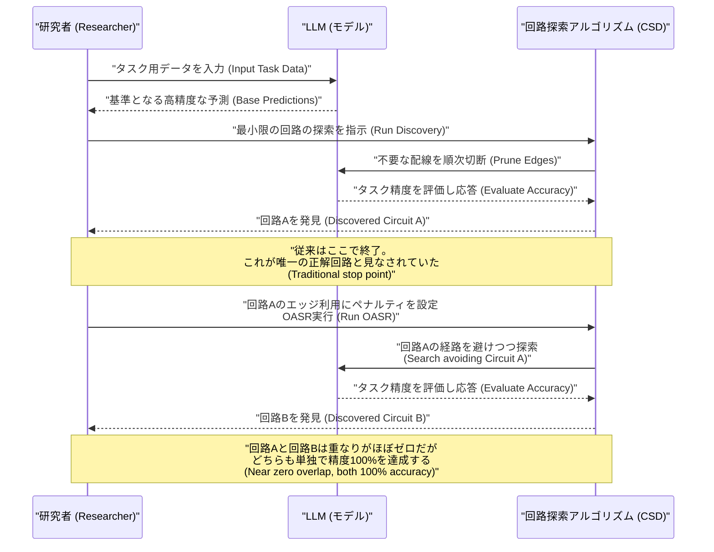
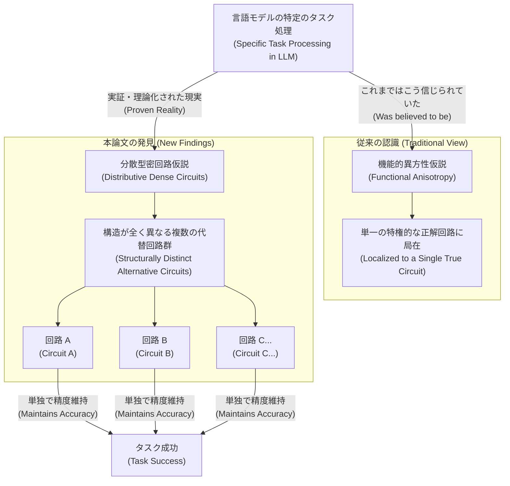
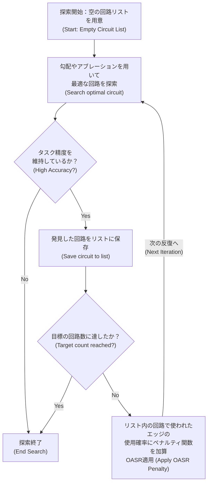

###### Created: 
2026-06-03 12:51 
###### Tag: 
#paper
###### url_01:
https://arxiv.org/abs/2605.12671 
###### url_02: 
[GitHub - TonyXiChen/OASR · GitHub](https://github.com/TonyXiChen/OASR)
###### memo: 

---

<!-- paper_extractor:summary:start -->

# One line and three points

大規模言語モデル（LLM）において、特定のタスクを処理する内部メカニズム（回路）は単一の「正解」が存在するわけではなく、全く構造の異なる複数の回路が同じ機能・精度を独立して発揮できることを実証・理論化した研究。

*   **機能的異方性仮説の反証：** 従来の解釈可能性研究で暗黙の前提とされていた「特定のタスクを担う特権的で唯一の回路が存在する」という見方を、実験的および理論的に覆しました。
*   **OASR手法の導入：** 探索アルゴリズムが同じ回路に収束するのを防ぐため、既に発見された回路の構成要素（エッジ）にペナルティを与える「Overlap-Aware Sheaf Repulsion (OASR)」を開発し、重なりがほぼゼロの代替回路群を抽出することに成功しました。
*   **分散型密回路仮説の提唱と証明：** 高次元空間におけるモデルの表現（重ね合わせ：Superposition）と鳩の巣原理により、LLM内には同一の出力結果を導く多様で重なりのない回路の組み合わせが数学的・必然的に存在することを証明しました。

# Pre-knowledge

本論文を深く理解するためには、「メカニスティック解釈可能性（Mechanistic Interpretability）」と呼ばれる分野の背景を知る必要があります。この分野は、巨大なブラックボックスである大規模言語モデル（LLM）の内部で、どの構成要素（アテンションヘッドやMLP層など）がどのように接続され、情報がどう流れて特定のタスク（例：主語と目的語を区別するなど）を処理しているかをリバースエンジニアリングで解明しようとするものです。

これまで研究者たちは、不要な経路を削ぎ落としてタスク遂行に必要な最小限のネットワーク部分グラフを抽出する「回路探索（Circuit Discovery）」や、他の要素を無効化しても単独でタスクを完遂できる「層（Sheaf）」の探索を行ってきました。そして、これらの探索を通じて「ある能力を司る唯一無二のコア回路がモデル内に一つだけ存在するはずだ」という強い期待を持っていました。本論文は、この根本的な前提自体に疑問を投げかける内容となっています。

# Summary

本論文は、大規模言語モデル（LLM）の解釈可能性研究の基盤となっている暗黙の前提「機能的異方性仮説（Functional Anisotropy Hypothesis）」、すなわち「特定の機能やタスクはモデル内のユニークな（あるいはほぼユニークな）単一のメカニズムに局在している」という考え方に対して、強力な反証を提示しています。著者らは、LLM内の一つのタスクが、単一の回路ではなく、構造的に全く異なりながらも同等の精度を誇る「複数の回路（またはSheaf）」によって並行してサポートされ得ることを発見しました。

この隠された複数のメカニズムを体系的に発掘するため、論文では「Overlap-Aware Sheaf Repulsion (OASR)」という新たな回路探索手法を導入しています。これは、回路探索の目的関数に対し、過去の探索で選ばれたエッジ（経路）の再利用を意図的に罰するペナルティ項を加えるものです。間接目的語の識別（IOI）や文法タスク（BLiMP）などの標準的なベンチマークでこの手法を適用した結果、構成要素の重複（IoU：Intersection over Union）が偶然レベルに近いほど少ないにもかかわらず、どれも単独で完璧に近いタスク精度を達成する複数の回路が抽出されました。さらに、この非一意性は探索回数を増やすほど顕著になり、20個の回路を発見した際には、すべてに共通する必須コンポーネント（積集合）は実質的に消失することが確認されました。

極端な例として、IOIタスクにおいてたった3つのエッジからなる超スパースな回路が見つかりましたが、この3つのエッジのどれ一つとして「全体として不可欠」なものは存在せず、代替可能な別の経路が容易に見つかることが示されました。さらに、この現象は特定のアルゴリズム（DiscoGP）のアーティファクトではなく、ACDCやEAP、Edge Pruningといった主要な回路探索手法のすべてにおいて普遍的に観察されることが実証されています。

これらの実証的証拠を説明するため、著者らは「分散型密回路仮説（Distributive Dense Circuit Hypothesis）」を提唱し、数学的な証明を与えています。この証明は、高次元の重ね合わせ（Superposition）と部分和の問題を応用したもので、ニューラルネットワークの深さと幅がもたらす天文学的な組み合わせの数（鳩の巣）に対して、量子化された出力結果（鳩）の数が限られているため、異なる回路構造が同一の予測ロジットを生成する（衝突する）ことが必然的に生じることを示しています。これにより、回路探索の結果は「唯一の真のメカニズム」を発見したと解釈するべきではなく、「無数にある有効な計算経路の一つ」を提示しているに過ぎないという、LLMの解釈可能性に対する根本的なパラダイムシフトを迫っています。

# Briefing

**機能的異方性仮説への挑戦という問題提起**
現代の大規模言語モデル（LLM）がなぜこれほど賢いのかを理解するために、研究者たちはモデルの内部配線を解き明かす「回路探索」に注力してきました。これまでの研究の多くは、「モデルがある特定の能力（例：文法の理解）を発揮するとき、それを担当している特定の『正解回路』がモデルのどこかに存在する」という前提に立っていました。本論文では、この暗黙の了解を「機能的異方性仮説」と定義し、これが本当に正しいのかという根源的な問いを立てています。もしこの仮説が正しいのであれば、どのような探索手法を用いたとしても、最終的には同じ「コアとなる構成要素」に収束するはずです。

**革新的な探索手法「OASR」の開発とその驚くべき結果**
著者らは、モデル内に隠された「別の正解」を探し出すために、Overlap-Aware Sheaf Repulsion（OASR：重複を避けるSheafの反発機構）という巧妙な手法を開発しました。これは、一度優れた回路を見つけたら、次回の探索時にはその回路で使用された配線（エッジ）を使うことにペナルティを与え、アルゴリズムに「今まで使ったことのない別の道を使って同じ問題を解け」と強制するものです。
この手法を標準的な言語タスクに適用した結果、極めて衝撃的な事実が判明しました。精度が100%に達する完璧な回路が2つ見つかったにもかかわらず、その2つの回路が共有している配線の割合（IoU）はわずか4.1%に過ぎなかったのです。つまり、モデルは完全に別々の脳の部位を使って、全く同じ完璧な推論を独立して行うことが可能であることが実証されました。

**「不可欠な要素」の不在と消えゆく共通項**
さらに探索を20回繰り返したところ、抽出された20個の回路の「合体（和集合）」はどんどん巨大化していく一方で、「すべてに共通する部分（積集合）」は極限まで縮小していくことが分かりました。特定のタスク（IOI）においては、たった3つの経路からなる極限までスリム化された回路が発見されました。一見するとこの3つの経路が「絶対に不可欠なコア」であるかのように思えますが、タスクの条件を少し変えたり、そのエッジを意図的に禁止したりしても、モデルは難なく別の代替経路を見つけ出し、高精度を維持しました。これは、「バックアップ機能が働く」といった一時的なものではなく、平時からモデル内に複数の代替機能が密に分散して存在していることを意味しています。

**数学的必然としての「分散型密回路仮説」**
なぜこのようなことが起こるのでしょうか。著者らはこれを「分散型密回路仮説」として理論化しました。LLMの内部は極めて高次元であり、膨大な数の構成要素が重なり合って計算を行っています。数学的に見れば、ネットワークの層とヘッドが構成する「配線の組み合わせ（部分和）」の数は天文学的であるのに対し、最終的な出力（例えば「Aという単語を選ぶ」という決定）の許容幅はある程度広くなっています。鳩の巣原理（Pigeonhole Principle）を適用した数学的証明により、「全く異なる経路の足し合わせが、偶然にも全く同じ出力結果にピタリと一致する」という衝突が、この巨大な空間では必然的に、しかも無数に発生することが示されました。

**解釈可能性研究に対するパラダイムシフト**
この研究がもたらす最大のメッセージは、「これまでの回路探索が無意味だった」ということではありません。見つかった回路は確かにタスクを実行する因果関係を持っています。しかし、「それこそがモデルの思考回路そのものである」と還元主義的に解釈することはもはや不可能です。私たちは今後、LLMの推論を一本の線ではなく、冗長で部分的に重複しながら並行して走る「多重の経路のネットワーク」として捉え直す必要があります。

# FAQ

**Q: これまでの回路発見の手法（ACDCやEAPなど）で見つかった回路は間違っていたということですか？**
A: いいえ、間違っていたわけではありません。それらの手法で見つかった回路は、実際にそのタスクを実行する能力を持つ「有効で因果関係のある」メカニズムです。本論文が指摘しているのは、見つかった回路が「唯一の正解」ではないということです。それらは、広大な可能性の海の中からアルゴリズムが偶然見つけ出した「無数にある有効な経路の一つ」に過ぎません。

**Q: 過去の研究で報告されている「バックアップ・ヘッド」や「ハイドラ効果」とは何が違うのですか？**
A: 非常に重要な違いがあります。過去の研究におけるバックアップ機構（ハイドラ効果）は、主要な回路を「破壊（アブレーション）」した際に、通常は眠っている別のコンポーネントが目を覚まして代わりを務めるという「異常時の自己修復」の文脈で語られていました。一方、本論文で示されたのは、モデルを一切破壊しなくても、通常の動作状態のままで「並行して独立に機能する複数の完璧な回路」がすでに共存しているという事実です。

**Q: なぜモデルは構造が全く違うのに同じタスクが実行できるのですか？**
A: 理論的には「高次元空間における重ね合わせ（Superposition）」と「部分和の衝突」によって説明されます。モデルの内部には膨大な数のパラメータと経路があり、それぞれの経路が微小な信号を出力に足し合わせています。選び得る経路の組み合わせが天文学的であるため、全く異なる要素の組み合わせを選んで足し合わせても、最終的な出力結果（ロジット）が同じ値になる組み合わせが必然的に無数に存在してしまうのです。 
# Critical Assessment（批判的評価）

**方法論の妥当性：**
本研究は、DiscoGP、ACDC、EAP、Edge Pruningという原理の異なる複数の最先端の回路探索アルゴリズムを横断的に検証しており、実験設計として非常に堅牢です。また、独自に導入した「Overlap-Aware Sheaf Repulsion (OASR)」も、ペナルティ関数として目的関数に自然に組み込まれており、代替回路を探索する手法として極めて合理的です。ただし、使用されたモデルがGPT-2 SmallやPythia-160Mといった比較的小規模なものに限られている点は制約と言えます。最新の数百億パラメータ規模のLLMで同様の完全な非一意性がどれほど顕著に現れるかは、計算コストの壁もあり今後の検証が待たれるところです。

**エビデンスの強度：**
実験的な結果（IoUが偶然レベルまで低下する現象の観察）と、鳩の巣原理を用いた数学的・理論的な証明（存在定理）が見事に合致しており、主張を支持する証拠の強度は非常に高いと評価できます。複数のタスクや手法で再現性が確認されている点も強力です。ただし、本論文はプレプリント（arXiv:2605.12671v1）であり、学会等での厳密な査読プロセスを完全に通過した状態ではない点には留意が必要です。とはいえ、理論的アプローチに飛躍はなく、現象の記述としては極めて説得力があります。

**実用化への考慮：**
この発見は、AIの安全性（アライメント）やモデル編集技術を実用化する上で、非常に深刻な課題を突きつけています。もし「悪意ある出力を生む回路」を特定して修正・削除したとしても、本研究の「分散型密回路仮説」によれば、モデルは全く別の代替回路を使って容易に同じ悪意ある出力を再構築できる可能性が高いからです。メカニズムが単一でない以上、特定の部分グラフの制御だけではモデルの挙動を完全に制御することは困難であり、より全体的・分散的な介入手法の開発が必要となるでしょう。

# For easy understanding

私たちが大規模言語モデル（LLM）の仕組みを理解しようとするとき、これまでは「ある能力には、それ専用の部署や直通ルートがあるはずだ」と考えていました。例えば、「東京から大阪へ行くためのルートを探して」とコンピュータに頼んだとします。これまでの分析手法は「東海道新幹線」という太くてわかりやすいルートを一つだけ発見し、「なるほど、LLMはこの新幹線ルートを使って東京から大阪へ移動しているんだな」と結論づけて満足していました。

しかし、この論文の著者らが「新幹線を使うのを禁止したらどうなるか？」というペナルティ（OASR手法）を与えて探索をやり直したところ、驚くべきことが起きました。LLMは飛行機を使って羽田から伊丹へ飛び、あるいは高速バスを乗り継いで、新幹線と全く同じ正確さで大阪にたどり着いたのです。さらに探索を繰り返すと、フェリーや在来線の乗り継ぎなど、**「全く違う駅や道路（要素）を使っているのに、最終的な目的地（タスクの正解）には完璧に到達できるルート」**が20個も30個も見つかりました。

つまりこういうことです。LLMの頭の中は、一つの正解ルートしかない単純な迷路ではなく、無数の道が複雑に絡み合った超巨大な交通ネットワークになっています。そのため、「東京から大阪へ行く」という同じ結果を出すための組み合わせが無限に存在しているのです。

この発見は、「AIの思考回路をたった一つの図面に書き起こして完全に理解した」と宣言することが不可能であることを意味します。なぜなら、私たちが見つけたと思ったその回路は、「無数にある正解ルートのうち、たまたま一番最初に見つかったもの」に過ぎないからです。AIの思考は私たちが想像していたよりもはるかに冗長で、分散して存在していることが、数学的にも証明された画期的な研究です。

# Mermaid Diagrams

論文における回路探索プロセスの違いや、機能的異方性仮説からのパラダイムシフトを視覚化します。

## タイムライン・シーケンス図
従来の回路探索（CSD）と、本論文で導入されたOASR（Overlap-Aware Sheaf Repulsion）による複数回路の探索のプロセスの違いを示すシーケンス図です。

## 概念図・構造図
本論文の中心的なテーマである「機能的異方性仮説（従来の見方）」と「分散型密回路仮説（新たな発見）」の対比を示すフローチャートです。

## フローチャート・プロセス図
OASR（Overlap-Aware Sheaf Repulsion）を組み込んだ回路探索のアルゴリズムループを示します。

<!-- paper_extractor:summary:end -->

