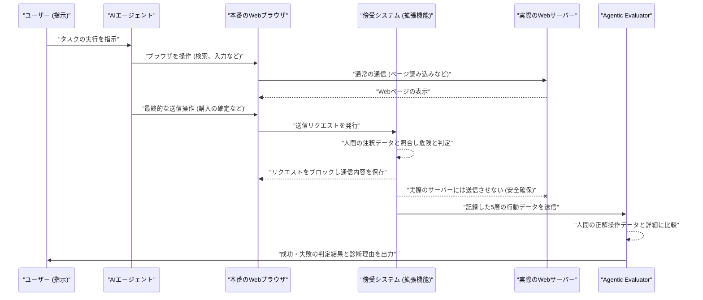
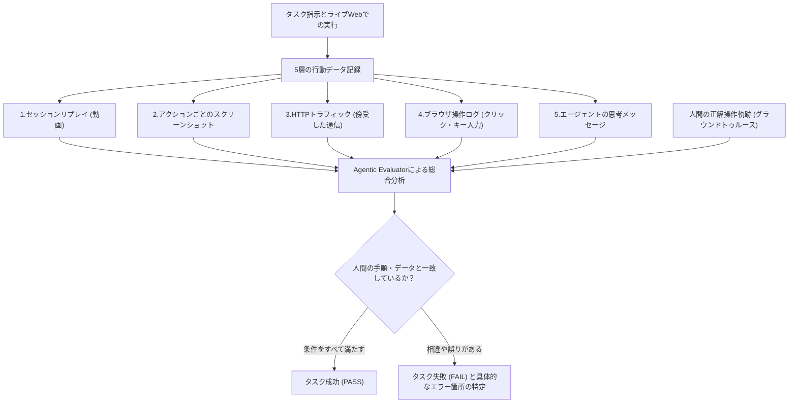

###### Created: 
2026-04-14 14:44 
###### Tag: 
#paper
###### url_01:
https://arxiv.org/abs/2604.08523v1 
###### url_02: 
[ClawBench — Real-World Browser Agent Benchmark](https://claw-bench.com/)
[GitHub - reacher-z/ClawBench: Can AI Agents Complete Everyday Online Tasks? 153 tasks, 144 live websites, 15 categories. · GitHub](https://github.com/reacher-z/ClawBench)
###### memo: 

---
# One line and three points
実際のWebサイト上でAIエージェントが日常タスク（予約や購入など）を遂行できるかを、安全な通信傍受システムと詳細な行動ログを用いて評価する実践的ベンチマーク「ClawBench」の提案。

1. **実環境での評価**：隔離された静的なテスト環境ではなく、144の実在するライブWebサイト上で、状態変更を伴う複雑な153のタスク（航空券の予約やフォームの送信など）を用いてAIエージェントの能力を測定します。
2. **安全な通信傍受と5層のデータ記録**：最終的な購入や送信といった不可逆的な操作のみを直前でブロックする仕組みを導入し、実社会への影響を防ぎつつ、動画からHTTP通信まで5つの異なる階層でエージェントの全行動を緻密に記録します。
3. **性能ギャップの発見**：最先端のAIモデル7種を検証した結果、既存の簡略化されたベンチマークでは高得点を出すモデル（Claude Sonnet 4.6など）でも、本ベンチマークでは成功率が33.3%に留まり、実世界での実用化にはまだ大きな課題があることが判明しました。

# Summary
本論文は、大規模言語モデル（LLM）を搭載したAIエージェントが、私たちの日常生活で不可欠なオンラインタスクをどの程度自律的に実行できるかを評価するための新しいベンチマーク「ClawBench」を提案しています。これまで多くのエージェント評価は、安全性や再現性の観点から、静的でコントロールされたサンドボックス環境や、情報検索のみを行う読み取り専用のタスクに依存してきました。しかし、現実のWebサイトには、動的に変化するJavaScriptのレンダリング、予期せぬポップアップ、複雑な多段階の認証プロセスなど、サンドボックスでは再現できないノイズや困難が無数に存在しています。

ClawBenchは、15カテゴリ・144の実際のライブWebサイトを舞台に、153の「書き込み重視（状態変更を伴う）」のタスクをエージェントに実行させます。実環境でのテストに伴う安全性のリスク（誤って高額な商品を購入してしまうなど）を回避するため、本研究はChrome拡張機能とCDP（Chrome DevTools Protocol）を活用した独自の傍受メカニズムを開発しました。このシステムは、エージェントがサイト内を自由にナビゲートすることを許可しつつ、事前の人間による注釈に基づき、最終的な確定リクエストの通信のみをピンポイントでブロックして内容を記録します。

評価システムにおいても、ClawBenchは革新的です。エージェントの実行中に、画面録画、スクリーンショット、HTTPトラフィック、ブラウザの低レベル操作、エージェントの内部メッセージという5層の行動ログを収集します。そして「Agentic Evaluator（Claude Codeのサブエージェント）」が、これらの膨大なマルチモーダルデータを人間の正解ログと詳細に比較し、タスクの成否とその具体的な理由を診断します。実験の結果、最先端のClaude Sonnet 4.6であっても成功率は33.3%にとどまることが示され、現在のAIエージェントが実世界の複雑なWebタスクに対処する能力には依然として大きな限界があることを明らかにしました。

# Briefing
近年の大規模言語モデルの飛躍的な進化により、AIエージェントはブラウザを操作し、高度な自律的作業を行えるようになってきました。しかし、これまでのAIエージェントの能力評価は、実世界から切り離された静的なサンドボックス環境や、既存のウェブサイトの単純なコピー上で行われることがほとんどでした。このような隔離された環境は、評価結果を安全かつ安定的に再現できるという利点がある一方で、私たちが日常生活で直面する「本物のウェブサイトが持つ複雑さ」を評価から完全に排除してしまいます。例えば、突然現れるクッキーの同意ポップアップや、リアルタイムでレイアウトが変わる動的なコンテンツ、巧妙なボット対策や複雑な多段階の入力フォームなどは、実環境においてエージェントが乗り越えなければならない最大の障壁ですが、これまでのベンチマークではそれらの真の対応力をテストすることができませんでした。

この根深いジレンマを解決するために、本研究の著者らは「ClawBench」と呼ばれる画期的な評価フレームワークを開発しました。ClawBenchの最も優れた設計思想は、評価の安全性を犠牲にすることなく、現在稼働している本物のライブウェブサイト上でAIエージェントを直接テストできる点にあります。このベンチマークは、航空券の予約やオンラインショッピングでの決済、求人への応募といった、実行結果が取り消し不可能で影響の大きいタスクをあえて対象としています。エージェントがこれらのタスクを実行する際、システムに組み込まれた軽量な拡張機能が背後で稼働し続けます。そして、エージェントが「購入を確定する」ボタンを押すなど、サーバーのデータベースを実際に変更してしまう瞬間をピンポイントで検知し、その最終的な通信のみを直前で傍受してブロックします。これにより、実社会に一切の迷惑や予期せぬ金銭的被害を与えずに、エージェントが本番環境の予測不可能な事象にどれだけ適応できるかを極めてリアルに測定することが可能となりました。

さらに、エージェントがタスクを達成できたかどうかを判定する評価プロセスにおいても、ClawBenchは従来のシステムとは一線を画す緻密なアプローチを採用しています。評価の根拠として、単に最終的な画面の見た目を確認するだけではありません。画面全体の動画録画、ステップごとの静止画スクリーンショット、水面下でやり取りされる通信ペイロードの詳細、マウスクリックやキーボード入力といった微細なブラウザ操作の履歴、そしてエージェント自身がその瞬間にどう推論したかを示す内部メッセージという、5つの異なる次元の行動データをすべて同期して記録します。これらの豊富な記録データは、あらかじめ人間の専門家が同じタスクを完璧に遂行した際の「正解データ」と照らし合わされます。ここで「Agentic Evaluator」と呼ばれるAIベースの評価者が登場し、両者の膨大な記録をステップごとにクロスチェックします。これにより、単なる成功や失敗の二値判定にとどまらず、「どの手順で、どの入力フィールドの値を間違えたのか」といった非常に詳細な失敗要因までを明らかにすることができ、エージェント開発者にとって極めて有用な改善のヒントを提供します。

実際にこのClawBenchを用いて、現在世界をリードする7つの最先端AIモデルをテストした結果は、AI研究コミュニティに強い警鐘を鳴らすものでした。OSWorldなどの従来の統制されたベンチマークでは70%近い高い成功率を誇っていた最高峰のモデル「Claude Sonnet 4.6」でさえ、この実環境テストではわずか33.3%のタスクしか完了できませんでした。また、他の多くのモデルに至っては成功率が10%を下回るなど、実世界のノイズや予測不可能性に対処する能力がいかに不足しているかが浮き彫りになりました。この検証結果は、AIエージェントが私たちの日常的な作業を完全に代行してくれる「信頼できる汎用アシスタント」になるためには、まだ越えなければならない大きな壁が存在していることを明確に示しており、今後のAIエージェント開発が向かうべき新たな、そして最も現実的な指標を提示しています。

# FAQ
**Q1: なぜ隔離されたテスト環境（サンドボックス）ではなく、実際のWebサイト上でテストする必要があるのですか？**
A1: サンドボックス環境では、予期せぬポップアップ広告、頻繁に変わる画面レイアウト、ボット対策の認証など、現実のWebサイト特有の複雑な要素が排除されてしまうからです。AIエージェントが日常のタスクをこなす汎用アシスタントとして役立つためには、こうした「実世界のノイズ」に対応する能力を測ることが不可欠です。

**Q2: 実際のWebサイトでAIが勝手に商品を注文してしまったりする危険はないのですか？**
A2: その危険を防ぐために、ClawBenchは特別な通信傍受システムを組み込んでいます。AIエージェントは実際のサイトを自由に操作できますが、「購入の確定」や「応募の送信」といった後戻りできない操作を実行した瞬間、その通信がサーバーに届く直前でシステムがブロックし、送信しようとした内容だけを記録します。これにより安全に実力を評価できます。

**Q3: AIエージェントがタスクを成功したかどうかは、どのように判定されるのですか？**
A3: 人間が実際にそのタスクを正しく完了した際の「お手本の操作記録」と、AIエージェントの操作記録を比較することで判定します。画面の録画だけでなく、裏側の通信データやクリックの履歴など5つの異なるデータをAI評価者（Claude Code）が総合的に分析し、正しく手順を踏んで正しい情報を送信しようとしたかを厳密にチェックします。

# Critical Assessment（批判的評価）

**方法論の妥当性：**
本番環境のウェブサイトを使用し、最終的なリクエストのみを傍受するという評価手法は、極めて高い生態学的妥当性（現実に即していること）を持ち、画期的です。一方で、ライブサイトを利用する性質上、ウェブサイト側のUI変更やA/Bテストなどに影響を受けやすく、ベンチマークとしての再現性や長期的な維持管理コストに大きな課題が残ります。

**エビデンスの強度：**
本論文はプレプリント（未査読）の段階であり、今後の査読プロセスでの精査を待つ必要があります。しかし、153の多様なタスクセットにおいて、5層のマルチモーダルな行動ログを用いて7つの主要モデルを比較評価している点は、現在のAIエージェントが実世界で直面する限界を示す強力な証拠となっています。

**実用化への考慮：**
実用化の壁を可視化したという点で極めて有用な研究ですが、現実社会へのAIエージェント導入にあたっては、本研究で用いたような「事前の人間による注釈に基づくブロック」を未知のタスクに対して自動化・汎用化する必要があります。未知の環境下で、意図しない破壊的アクションをいかに確実に防ぐかというゼロトラスト的な安全性の担保が、今後の最大のハードルとなるでしょう。

# For easy understanding
AI（人工知能）がパソコンの画面を見て、人間の代わりに色々な作業をやってくれる「AIエージェント」の開発が進んでいます。これまでのAIのテストは、言ってみれば「おままごとのスーパーマーケット」で行われていました。誰にも邪魔されず、商品もいつも同じ場所にある安全な環境です。このテストでは、最新のAIはとても優秀な成績（70点くらい）を収めていました。

しかし、本論文の著者は「それじゃあ本当に役に立つかは分からない」と考え、実際の「街のスーパー」や「本物の飛行機の予約サイト」にお使いに行かせるという、非常に厳しいテスト「ClawBench」を作りました。ただ、本当に買い物をされてお金が引き落とされては困るので、AIがレジでお金を払う直前に親（監視システム）が「ストップ！」と止めて、カゴの中身（送信しようとしたデータ）が正しいかを確認する仕組みを発明しました。

その結果どうなったかというと、おままごとでは優秀だった最新の最高峰AIでさえ、本物のお店に行くと「ポイントカードはお持ちですか？」という予期せぬポップアップに戸惑ったり、画面のレイアウトが変わっていて目的のボタンが見つけられなかったりして、わずか33%（10回のうち3回）しかお使いを成功させることができませんでした。他のAIに至ってはほとんどが失敗してしまいました。

つまりこういうことです。「テスト用の簡単な環境」でAIが賢く見えても、私たちが日々使っている「本物のインターネットの世界」はAIにとってまだまだ複雑すぎるということです。私たちが安心して「明日からの旅行の手配、全部任せたよ」とAIにお願いできる未来が来るまでには、もう一段階大きな技術の飛躍が必要であることを、この論文は見事に証明して見せました。

# Mermaid Diagrams

## エージェント評価プロセスのシーケンス図

## 5層データ記録と評価判定のフローチャート

