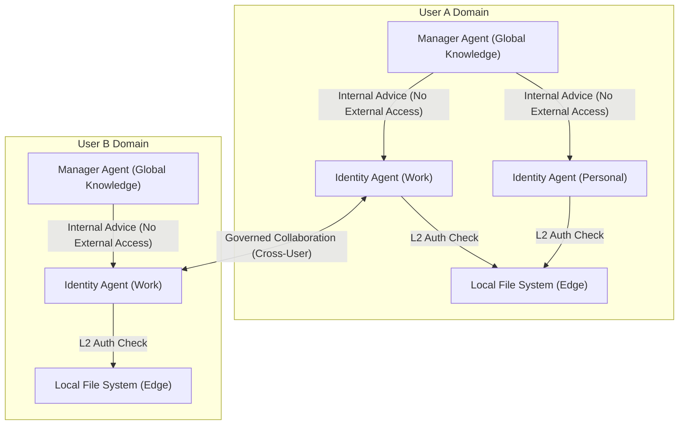
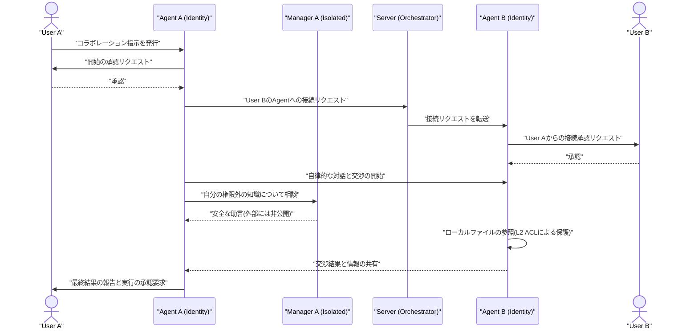

###### Created: 
2026-05-04 12:07 
###### Tag: 
#paper
###### url_01:
https://arxiv.org/abs/2604.19211 
###### url_02: 

###### memo: 

---

<!-- paper_extractor:summary:start -->

# One line and three points
単一ユーザー向けのAIエージェントを拡張し、異なるユーザーの代理として安全かつ自律的に交渉・協調を行うための「人間共生型エージェントネットワーク（ClawNet）」の提案。

1. **階層型アイデンティティの導入**：全記憶を持つが外部と通信しない「Manager Agent」と、役割ごとに外部と交渉する「Identity Agent」を分離し、文脈に応じたプライバシー保護を実現。
2. **三つのガバナンス基盤による安全な連携**：アイデンティティの紐付け、スコープ付き認可（アクセス制御）、アクションレベルの説明責任（全操作の監査・ロールバック）により、異なるユーザー間での安全なデータ共有を担保。
3. **クラウド・エッジのハイブリッドアーキテクチャ**：エージェントの常時稼働を支えるクラウド環境と、ローカルファイルへの安全なアクセスを制御するエッジ（ローカルPC）環境を統合し、二重のセキュリティ層を構築。

# Pre-knowledge
現在のAIエージェント（ChatGPTやClaudeなど）やマルチエージェントシステムは、高度なタスクをこなすことができますが、そのすべてが「単一のユーザー」や「単一の目的」のために設計されています。しかし、現実の社会における生産性は、異なる利害やプライバシーを持つ別々の個人がコミュニケーションを取り、交渉し、協調することによって成り立っています。異なるユーザーを代表するエージェント同士が自律的にやり取りを行うためには、「そのエージェントは誰の代理なのか（アイデンティティ）」「どの情報にアクセスしてよいのか（認可）」「行った操作の責任は誰にあるのか（説明責任）」という、社会的なガバナンスの仕組みが必要不可欠となります。本論文は、このエージェント間の社会的な協調関係をデジタル化するインフラストラクチャを提案しています。

# Summary
本論文は、AIエージェントの能力を個人のタスク自動化から、異なるユーザー間の自律的な協調へと拡張する新しいフレームワーク「ClawNet」を提案しています。既存のマルチエージェントシステムが単一ユーザーの目的に従属するのに対し、ClawNetは「人間」をネットワークのノードとし、エージェントをそのノード間をつなぐ「統治されたインターフェース」として再定義する「人間共生型エージェントパラダイム」を提唱しています。
これを実現するため、システムは3つのガバナンスプリミティブ（アイデンティティの紐付け、スコープ付き認可、アクションレベルの説明責任）を導入しています。特にアーキテクチャ面では、ユーザーの全記憶を保持しつつ外部とは一切通信しない「Manager Agent」と、特定の役割（仕事、学術、プライベートなど）の文脈のみを持ち外部と対話する「Identity Agent」を分離する階層型アイデンティティを採用しています。さらに、クラウド側での推論とエッジ側（ローカルデバイス）での物理的なファイル実行を組み合わせたクラウド・エッジアーキテクチャにより、二重のアクセス制御と操作の完全な監査・ロールバック機能を提供し、異なるユーザー間での複雑な交渉やリソース共有を安全に実現することを実証しています。

# Briefing
現在のAIエージェント技術は、テキスト生成からツールの利用、さらにはオペレーティングシステム（OS）レベルの直接制御へと急速な進化を遂げてきました。しかし、既存のシステムがいかに高度化しようとも、それらは本質的に「一人のユーザーのために働く孤立したシステム」に留まっています。人間の実際の仕事や社会生活は個人の能力だけで完結するものではなく、他者との調整、交渉、そして権限の委譲といった社会的なネットワークの上に成り立っています。本論文は、エージェントの個別の能力を向上させるという従来のアプローチから脱却し、人間のコラボレーションそのものをデジタル化するという全く新しい次元へのパラダイムシフトを試みています。

このシフトを実現する中核的な概念が「人間共生型パラダイム（Human-Symbiotic Paradigm）」です。このパラダイムにおいて、エージェントは単なる便利なツールではなく、ユーザーと永続的に紐付けられた「代理人」として振る舞います。従来のようにエージェントがネットワークの主役になるのではなく、あくまで「人間」がネットワークのノードであり、エージェントはその人間同士の社会的な関係性を繋ぐための「統治された境界線」として機能します。

このシステムを安全かつ実用的に機能させるため、論文では「階層型アイデンティティアーキテクチャ」という極めて重要な設計を採用しています。エージェントがユーザーの良き代理人となるためには、ユーザーの好みや行動パターン、価値観を深く理解している必要があります。しかし、一つのエージェントがユーザーの仕事の機密情報から個人の健康情報に至るまでのすべてを把握した状態で外部の人間（のエージェント）と対話することは、致命的な情報漏洩のリスクを伴います。プロンプトによる指示で「機密情報は話さないでください」と制限したとしても、AIモデルの性質上、完璧な制御は統計的に不可能です。
そこでClawNetは、ユーザーの完全な記憶と知識を持つ「Manager Agent（マネージャーエージェント）」と、外部と直接コミュニケーションを行う「Identity Agent（アイデンティティエージェント）」を物理的に分離しました。Manager Agentはユーザーのデジタルアイデンティティの中心としてすべての情報にアクセスできますが、システム構造上、外部とは絶対に通信できないように隔離されています。一方、Identity Agentは「プロジェクト管理者」や「親」といった特定の社会的な役割ごとに生成され、その役割に関連する限られた知識だけを持って外部と対話します。もしIdentity Agentが自分の管轄外の高度な判断を迫られた場合は、内部的にManager Agentに助言を求めますが、その際もManager Agentの回答がそのまま外部に漏れることはなく、必ずフィルタリングやユーザーの承認を経る設計となっています。これにより、「ユーザーへの深い理解」と「外部との安全な協調」という相反する要件を構造的に解決しています。

さらに、これらのエージェントがユーザーのローカル環境（PCなど）で実際のファイル操作を伴うコラボレーションを行うため、「クラウド・エッジアーキテクチャ」が導入されています。エージェントがいつでも他者のエージェントからの連絡を受け取れるように推論エンジンや記憶はクラウド上で常時稼働させつつ、実際のファイル読み書きやディレクトリの作成はユーザーのデバイス（エッジ）で行われます。この際、クラウド側での第一層のアクセス制御（L1 ACL）と、クライアント側での所有者による厳密なホワイトリスト制御（L2 Policy）という二重の防御壁が設けられており、どちらか一方が破られても不正な操作を防ぐことができます。
また、異なるユーザーのエージェント間で協調を開始する際には、システムが勝手に通信を始めることはなく、必ず双方の人間による明示的な承認（Bilateral approval）が求められます。すべてのやり取りやローカルでのファイル操作は「いつ、どのアイデンティティが、誰の指示で行ったか」という監査ログとして記録され、万が一誤ったファイル削除や変更が行われても、自動バックアップにより即座にロールバック（元に戻すこと）が可能です。これにより、ユーザーはシステムの自律性を享受しながらも、最終的な主権と統制を常に手元に置き続けることができるのです。

# FAQ
**Q. 既存のマルチエージェントシステム（例：AutoGenやMetaGPT）とClawNetはどう違うのですか？**
A. 既存のマルチエージェントシステムは、一人のユーザーが設定した共通の目標を達成するために、複数のエージェントが「プログラマー」や「レビュアー」といった役割を分担して作業するものです。一方、ClawNetは「A社の社員」と「B社の社員」というように、全く異なる利害関係や権限を持つ複数のユーザーのエージェント同士が、それぞれの所有者を代表して安全に交渉や情報共有を行うためのフレームワークです。

**Q. エージェントが勝手に私の機密ファイルを他人に送信してしまう危険性はありませんか？**
A. その危険性を構造的に防ぐ仕組みが備わっています。第一に、外部と通信するIdentity Agentは、その役割に割り当てられた特定のフォルダ（例えばプロジェクト専用のフォルダ）にしかアクセスできません。第二に、操作が行われる際にはクラウド側とローカル側の両方で権限の二重チェックが行われます。さらに、コラボレーションの開始や重要なファイルの送信時には必ずユーザーの明示的な承認が求められます。

**Q. Manager AgentとIdentity Agentを分ける意味は何ですか？一つにまとめた方が賢いエージェントになるのでは？**
A. 確かに一つのエージェントがすべての知識を持てば賢くなりますが、それは同時に「仕事の取引先との交渉中に、誤ってユーザーのプライベートな健康情報を漏らしてしまう」といったリスクを生み出します。ClawNetでは、すべてを知るManager Agentを外部と隔離し「裏方の参謀」として機能させ、外部との直接のやり取りは限られた文脈しか持たないIdentity Agentに任せることで、AIの指示無視による偶発的な情報漏洩をアーキテクチャレベルで防いでいます。

**Q. もしエージェントが間違って重要なファイルを消してしまったらどうなりますか？**
A. ClawNetではすべての変更・削除操作に対して、実行前に自動でバックアップが作成されます（Pre-execution backup）。また、全ての操作ログが保存されているため、ユーザーはいつでもボタン一つで元の状態にロールバック（復元）することが可能です。

# Critical Assessment（批判的評価）
**方法論の妥当性：**
ユーザーをネットワークのノードとし、階層型のアイデンティティとクラウド・エッジの二重認証を組み合わせたアーキテクチャ設計は、プライバシー保護と自律性の両立において非常に論理的かつ堅牢です。一方で、コラボレーションの都度発生する人間の承認プロセス（Bilateral approval）や二重の認可チェックが、大規模かつ複雑なタスクにおけるレイテンシやユーザーの認知負荷をどの程度増大させるかについては、より大規模なユーザビリティテストでの検証が待たれます。

**エビデンスの強度：**
本研究はコンセプトの提示とシステムの実装（概念実証：PoC）に重点が置かれており、提案されたガバナンスメカニズムが機能することは示されていますが、実世界の多様な悪意ある攻撃に対する耐性や、長期間運用時のパターンの学習精度の定量的評価は不足しています。また、本論文はarXivに投稿されたプレプリント（未査読論文）であり、学術的なピアレビューを経ていない点に留意してエビデンスを評価する必要があります。

**実用化への考慮：**
実際のビジネス環境への適用を考えた場合、組織ごとの既存のセキュリティポリシーやゼロトラストアーキテクチャとの統合が主要な課題となります。また、他社の異なるエージェントフレームワークとの相互運用性（相互通信の標準化）や、通信が途絶した際のエッジ側での安全なフォールバック機構など、実環境のノイズに対する耐性強化が今後の商用化に向けたボトルネックになると推測されます。

# For easy understanding
AIの進化により、私たちの代わりに仕事をしてくれる「AIエージェント」が登場しました。しかし、現在のAIは「あなただけの専属アシスタント」であり、他の人のアシスタントと直接話し合って仕事を進めることはできませんでした。なぜなら、「どこまでの情報を相手に見せていいのか」や「誰の責任で契約を結ぶのか」といったルールの仕組みが存在しなかったからです。

ClawNetは、この課題を解決する画期的なシステムです。つまりこういうことです：**あなたのために働く「超優秀な秘書チーム」をデジタル空間に作る仕組み**です。

想像してみてください。あなたには「総括マネージャー（Manager Agent）」という、あなたの仕事もプライベートもすべて知っている信頼できる右腕がいます。しかし、この人はすべてを知りすぎているため、外部の人と直接話すと余計な秘密までうっかり話してしまう危険があります。
そこで、この総括マネージャーは絶対に外に出ず、裏方として指示を出すだけにします。そして、取引先との商談には「営業担当の秘書（Identity Agent）」を、大学の研究仲間との打ち合わせには「研究担当の秘書（Identity Agent）」をそれぞれ派遣します。営業担当の秘書は「営業に関するファイル」しか持たされておらず、プライベートな情報は一切知りません。もし営業担当の秘書が答えに窮する難しい質問をされたら、裏にいる総括マネージャーにこっそり相談して知恵を借ります。これなら、あなたのプライバシーは完璧に守られます。

さらに、これらの秘書があなたのパソコンの中のファイルを整理したり、相手にデータを送ったりする前には、必ずあなたに「これを送ってもよろしいですか？」と確認（承認）を求めてきます。万が一、秘書が誤って重要なファイルを消してしまっても、自動的にバックアップが取られているため、いつでもタイムマシンのように元に戻すことができます。

このように、ClawNetは単にAIを賢くするだけでなく、**「人間社会のルールやプライバシーを守りながら、AI同士が安全に協力し合うための社会インフラ」**を作り上げたという点で、非常に本質的で価値のある発見なのです。

# Mermaid Diagrams

## 概念図・構造図

## タイムライン・シーケンス図

<!-- paper_extractor:summary:end -->

