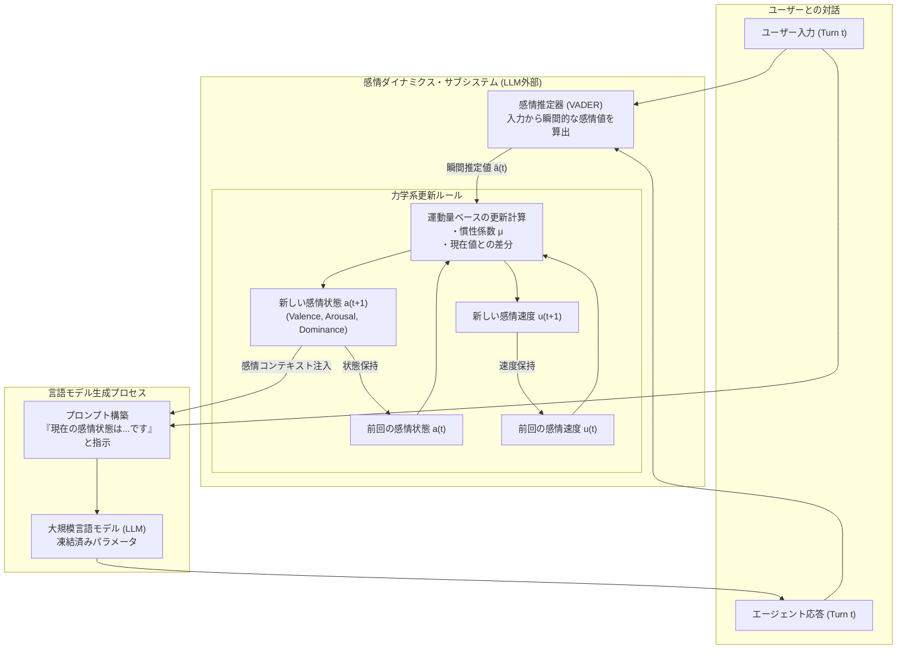
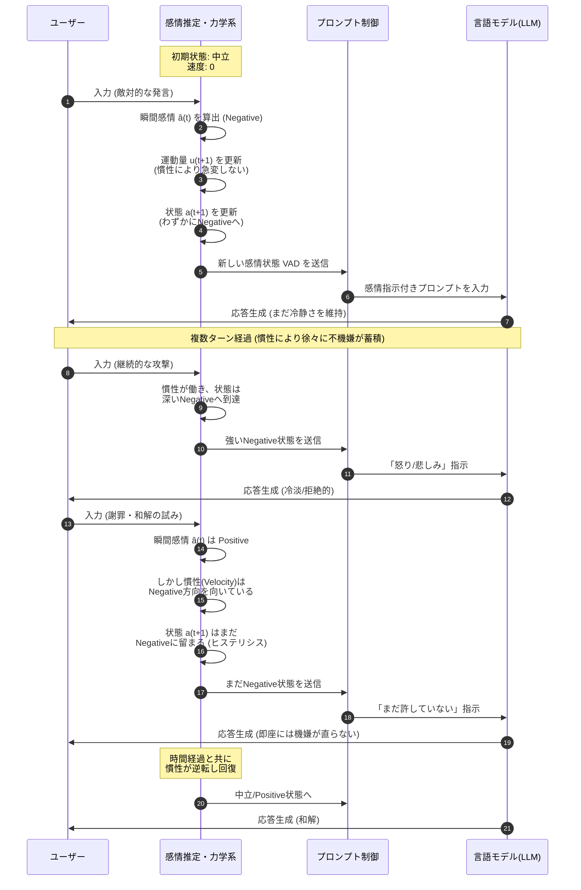
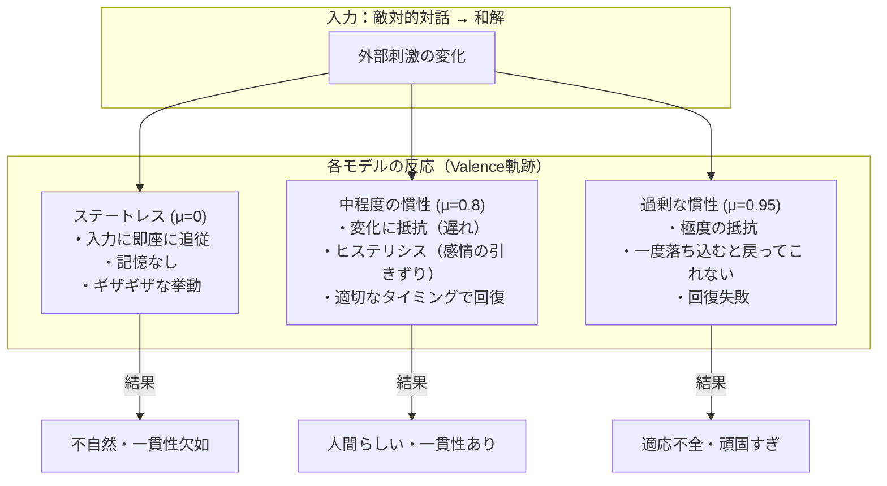

###### Created: 
2026-01-31 18:05 
###### Tag: 
#paper
###### url_01:
https://arxiv.org/abs/2601.16087 
###### url_02: 

###### memo: 

---
本論文のSummary、Briefing、FAQ、平易な理解のための解説、およびMermaid図表をMarkdown形式で出力します。

# One line and three points
大規模言語モデル（LLM）のエージェントに対し、物理学的な「慣性」と「運動量」を持つ外部感情状態（VAD）を導入することで、対話における突発的な人格のブレを防ぎ、人間らしい一貫した感情の推移と回復を実現する手法の提案。

1.  **問題意識：** 従来のLLMエージェントは、記憶（Memory）はあっても感情的な「慣性（Inertia）」がないため、入力に対して即座に反応しすぎてしまい、長期的な対話において人格やトーンが不自然に激変する「感情的逆転」の問題を抱えている。
2.  **手法：** エージェントの内部状態としてValence-Arousal-Dominance（VAD）ベクトルを定義し、それをバネ・ダンパ系のような2次の力学系（運動量を持つ更新ルール）で制御することで、過去の感情状態を引きずる「ヒステリシス」効果を意図的に作り出した。
3.  **発見：** 慣性項（モーメンタム）を適切に設定することで、敵対的な対話の後でも人間のように徐々に機嫌を直す「回復」挙動が再現されたが、慣性が強すぎると逆に新しい状況に適応できなくなるという、安定性と応答性のトレードオフ関係が明らかになった。

# Summary
本研究は、大規模言語モデル（LLM）を用いた対話エージェントが、長期的な相互作用において一貫した人格や感情トーンを維持できないという課題に取り組んでいます。著者は、既存のアプローチが「情報の記憶（Memory）」に焦点を当てており、感情が時間とともにどのように変化するかという「ダイナミクス（Dynamics）」を軽視している点を指摘します。この欠如により、エージェントは直前の入力に対して過敏に反応し、冷淡な態度から突然親密になるような不自然な振る舞い（即時の感情的逆転）を見せることがあります。

この問題を解決するために、本研究ではLLMの外部に独立した「感情状態サブシステム」を導入しました。具体的には、Valence（快・不快）、Arousal（覚醒度）、Dominance（支配性）からなる3次元のVADベクトルを定義し、これを物理学における減衰振動系や最適化手法（モーメンタム法）に着想を得た1次および2次の更新ルールに従って時間発展させます。対話の各ターンにおいて、入力テキストから簡易的な感情推定（VADER）を行い、それを現在の「慣性」を持つ感情状態と統合し、その結果をプロンプトとしてLLMにフィードバックすることで応答のトーンを制御します。

25ターンの固定された対話シナリオ（敵対的なフェーズから和解フェーズへ移行する哲学的な対話）を用いた実験の結果、状態を持たない（ステートレスな）エージェントは入力に対して不安定に変動しましたが、2次の力学系を導入したエージェントは、感情の変化に遅延と抵抗（ヒステリシス）を示しました。特に、適度な慣性係数（$\mu=0.8$）を設定したモデルは、敵対的な対話によって「気分を害した」後、和解フェーズに入っても即座には戻らず、人間らしく徐々に回復する挙動を示しました。一方で、過剰な慣性（$\mu=0.95$）を与えると、感情が固定化され、対話が終わるまで機嫌が直らないという現象も確認されました。これらは、モデルの再学習なしに、明示的な数式による外部制御だけで、エージェントに「感情的な重み」と「一貫性」を付与できることを実証しています。

# Briefing
**文脈と背景：LLMにおける「時間的構造」の欠如**
現在、LLMはチャットボットやソーシャルロボットとして広く利用されていますが、それらは本質的に「ステートレス（状態を持たない）」な関数に近い挙動を示します。文脈ウィンドウやRAG（検索拡張生成）によって過去の「情報」を参照することはできても、エージェント自身の「機嫌」や「態度」が時間的にどう推移すべきかという物理的な制約が存在しません。その結果、ユーザーの一言で極端に態度を変えるような、人間としては不自然な（サイコパス的とも言える）挙動が生じ、ユーザーの信頼を損なう原因となっていました。本研究は、この問題の核心を「記憶不足」ではなく「慣性（Inertia）の欠如」であると再定義し、心理学的な「感情的慣性」を工学的に実装することを試みています。

**技術的アプローチ：2次の力学系による感情制御**
本提案の核心は、エージェントの感情状態 $\mathbf{a}_t$ を、以下の2次の更新式（モーメンタム法に類似）で制御する点にあります。
$$ \mathbf{u}_{t+1} = \mu \mathbf{u}_t + (1-\mu)(\hat{\mathbf{a}}_t - \mathbf{a}_t) $$
$$ \mathbf{a}_{t+1} = \mathbf{a}_t + \mathbf{u}_{t+1} $$
ここで、$\mathbf{u}$ は「感情の速度」、$\hat{\mathbf{a}}_t$ は現在の入力から推定された瞬間的な感情値、$\mu$ は慣性係数です。
この数式により、エージェントの感情は「現在の入力」だけでなく「過去の勢い（速度）」の影響を受けます。これは、物理的な物体が急には止まれないのと同様に、エージェントの感情も急には変わらないことを保証します。この計算はLLMの外部で行われ、計算されたVAD値は自然言語の指示（例：「あなたは現在、非常に不快で、興奮しており、支配的な状態です」）に変換され、システムプロンプトとして次の生成時に注入されます。

**主要な発見と意義：ヒステリシスとトレードオフ**
実験により、慣性を導入することで「ヒステリシスループ（履歴現象）」が確認されました。これは、同じ入力状況であっても、そこに至るまでの経緯（過去の状態）によってエージェントの反応が異なることを意味し、より人間らしい複雑な挙動を生み出します。
しかし、重要な発見として「安定性と応答性のトレードオフ」が示されました。
*   **ステートレス/低慣性：** 外部環境に即応するが、一貫性がない。
*   **適度な慣性（$\mu=0.8$）：** 外部の変化に抵抗しつつも、時間をかけて適応・回復する（理想的な挙動）。
*   **過剰な慣性（$\mu=0.95$）：** 一度ネガティブな状態に陥ると、外部環境が好転しても回復できない（頑固すぎる状態）。

この知見は、メンタルヘルスケア用の対話AIや、長期的な関係構築が必要なNPC（ノンプレイヤーキャラクター）の設計において、エージェントの「性格」や「粘り強さ」を調整するための重要なパラメータを提供します。モデル自体の再学習を必要とせず、推論時の制御だけで実現できるため、既存のあらゆるLLMに適用可能な汎用性の高い手法と言えます。

# FAQ
**Q1: コンテキストウィンドウ（記憶）を長くするだけでは、感情の一貫性は保てないのですか？**
A1: 保てない場合が多いです。コンテキストウィンドウは「過去に何が起きたか」という情報を提供しますが、その情報に対して「どう反応すべきか」という内部状態の推移ルールを強制するものではありません。従来のLLMは、直近のユーザー入力に強く影響される傾向（Recency Bias）があり、過去の文脈を無視して即座にトーンを変えてしまうことがよくあります。本研究の手法は、情報の記憶とは別に、感情の「物理法則」を強制することでこれを防ぎます。

**Q2: この手法を使うには、モデルをファインチューニング（再学習）する必要がありますか？**
A2: いいえ、必要ありません。この手法は「インファレンス・タイム（推論時）」の制御メカニズムです。感情状態の計算はLLMの外部にある軽量なプログラムで行われ、その結果をプロンプトの一部としてLLMに入力するだけです。したがって、GPT-4やLlama 3など、あらゆる事前学習済みモデルにアドオンとして適用可能です。

**Q3: 「ヒステリシス（Hysteresis）」とは、この文脈でどういう意味ですか？**
A3: 「履歴効果」や「経路依存性」を指します。例えば、人間がひどく怒った後、相手が謝ってもすぐにはニコニコできないように、入力がポジティブに戻っても、内部のネガティブな状態がしばらく残る現象のことです。本研究では、感情の下降時と回復時で、同じ外部状況でも異なる感情値を示すことを「感情的ヒステリシス」と呼び、これを人間らしさの指標としています。

**Q4: 感情の推定にVADERという古い手法を使っていますが、精度に問題はないのですか？**
A4: 著者は、VADERが簡易的でノイズの多い推定器であることを認めています。しかし、本研究の主眼は「高精度な感情認識」ではなく、「ノイズの多い入力があっても、力学系（慣性）を通すことで、いかに安定した一貫性のある振る舞いを生成できるか」を実証することにあります。むしろ、単純な推定器を使っても滑らかで一貫した挙動が得られたことは、提案手法（ダイナミクス制御）のロバスト性（堅牢さ）を示唆しています。

# Critical Assessment（批判的評価）

**方法論の妥当性：**
実験設計は堅実です。固定された対話プロトコルを使用し、複数の乱数シード（N=5）で試行を行うことで、LLMの確率的な揺らぎと、力学系による決定論的な効果を明確に分離しています。ステートレス、1次系、2次系（中慣性、高慣性）という比較対象の設定も論理的です。ただし、感情推定に辞書ベースのVADERのみを使用している点は、現代の文脈理解能力を持つLLMベースの感情推定と比較すると、入力信号の精度という面で制限があります。

**エビデンスの強度：**
主張は定量的（Valenceの軌跡、ヒステリシスの面積、回復までのターン数）および定性的な結果によって十分に支持されています。特に、慣性係数 $\mu$ とヒステリシスの大きさの単調増加関係を示した点は説得力があります。なお、本稿は著者の所属が「Independent Researcher」となっており、現時点ではプレプリント（未査読または投稿中）の状態であると推測されます。その点を考慮し、第三者による再現検証が待たれますが、理論的な基盤は物理学と制御工学に基づいており堅牢です。

**実用化への考慮：**
この手法は計算コストが極めて低く、既存のLLMパイプラインに容易に組み込めるため、実用性は非常に高いです。しかし、適切な慣性係数（$\mu$）の調整はアプリケーションに依存し、調整を誤るとエージェントが「頑固」になりすぎてユーザーの意図に反応しなくなるリスク（過剰な慣性による回復失敗）があることが本研究でも示されています。実環境では、状況に応じて慣性を動的に変化させるなどの工夫が必要になるでしょう。

# For easy understanding
この論文のポイントを、専門知識のない方にもわかるように例え話で説明しましょう。

**「AIに『感情の重み』を持たせる話」**

想像してみてください。あなたは今、とても機嫌が悪いです。誰かに嫌なことを言われたからです。その直後、別の人から「こんにちは」と挨拶されたとします。
普通の人間なら、まだイライラを引きずっていて、少し素っ気ない返事をしてしまうでしょう。急にはニコニコできませんよね。これが「感情の慣性（重み）」です。

しかし、現在のAI（チャットボット）は違います。嫌なことを言われて怒ったフリをしていても、次の瞬間に「こんにちは」と言われると、前のことを忘れたかのように即座に「こんにちは！何かお手伝いしましょうか！」と満面の笑み（のようなテキスト）で返してきます。これはAIに「感情の重み」がなく、羽毛のように風（ユーザーの言葉）に吹かれて飛んでいってしまうからです。これでは、人間味を感じられず、時には不気味にさえ思えます。

この論文の著者は、AIに**「重たいフライホイール（弾み車）」**を取り付けるアイデアを提案しました。
*   **これまで：** AIの感情 ＝ その場の風向き（ユーザーの言葉）だけで決まる。
*   **この研究：** AIの感情 ＝ 重たい車輪が回っている状態。
    *   ユーザーが文句を言うと、車輪がゆっくりと「不機嫌」な方向に回り始めます。重いので、回り始めるのに少し時間がかかります。
    *   その後、ユーザーが謝っても、重い車輪は急には止まれません。「不機嫌」な方向に回り続けようとする勢い（慣性）があるからです。
    *   しばらくしてようやく車輪が減速し、逆回転（機嫌が直る）し始めます。

この研究では、この「心の重さ」を数式で表現し、AIに組み込みました。その結果、AIは嫌な対話の後にすぐには機嫌を直さず、人間のように「根に持つ」挙動を見せ、その後ゆっくりと関係を修復していく様子が確認されました。
「面倒くさいAIになった」と思うかもしれませんが、これこそが「人間らしい一貫性」を生み出し、カウンセリングや長期的なパートナーとしてのAIには不可欠な要素なのです。つまり、**「信頼できるパートナーであるためには、ある程度『気分屋』ではなく『頑固』である必要がある」**ということを数学的に示した研究と言えます。

# Mermaid Diagrams

## 概念図・システムアーキテクチャ

## シーケンス図：対話と感情状態の時間発展
**Important:** 論文の要件に従い、sequenceDiagramを含めます。ここでは対話ターンごとの処理の流れを示します。

## 比較概念図：慣性（イナーシャ）の違いによる挙動
