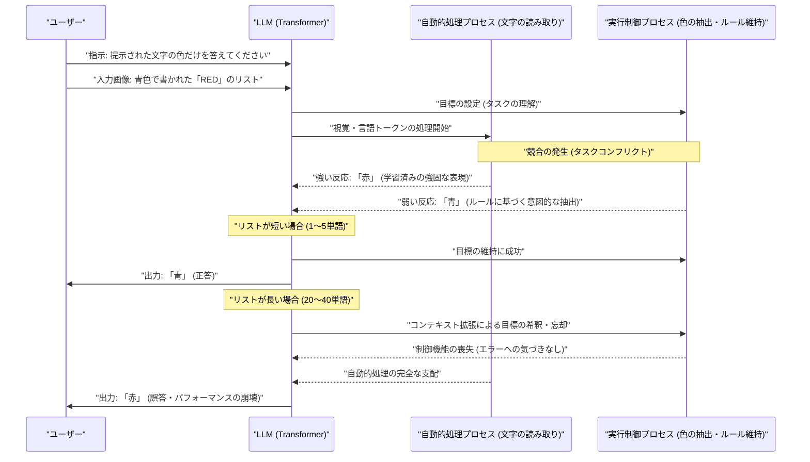
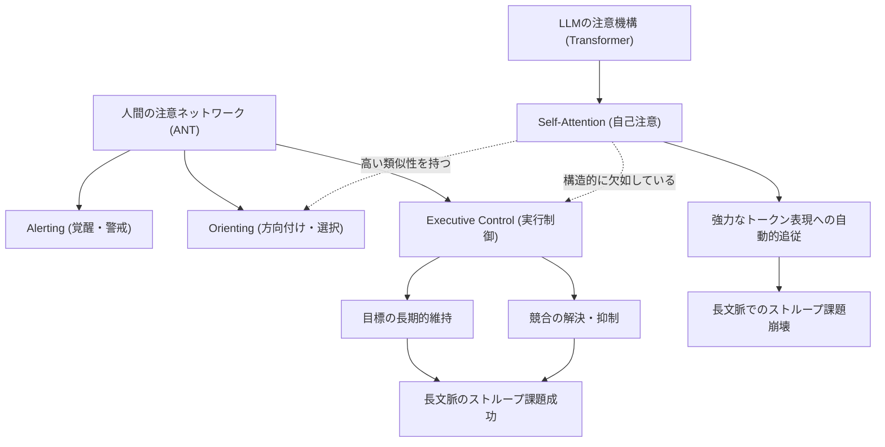
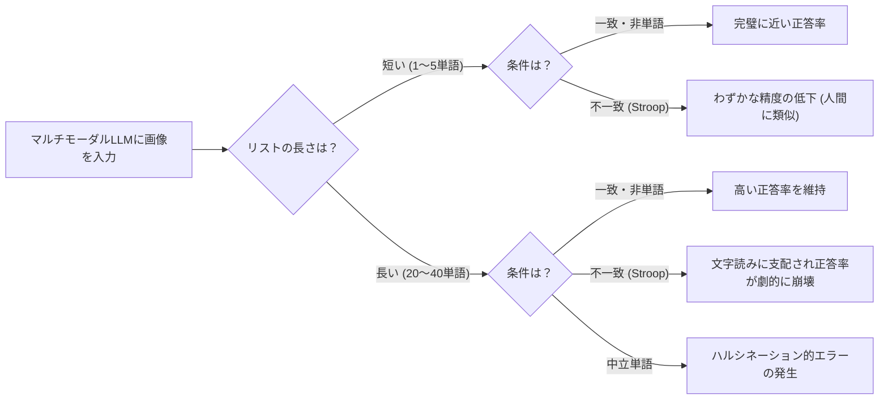

###### Created: 
2026-06-11
###### Tag: 
#paper
###### url_01:
[しばらくお待ちください...](https://academic.oup.com/pnasnexus/article/5/6/pgag149/8698838)
###### url_02: 

###### memo: 
[Slide](<Deficient executive control in transformer attention/20260611153659_Deficient_executive_control_in_transformer_attention.html>)

---
# One line and three points
最先端の大規模言語モデル（LLMs）は、文章の中でどこに注目すべきかを見つけ出す「方向付け」の能力に優れる一方で、人間が持つような「注意の実行制御（相反する情報の中で目標を維持し競合を解決する能力）」を根本的に欠いており、文脈が長くなるとその制御が完全に崩壊することを古典的なストループ課題を用いて実証した研究です。

1. **ストループ課題を通じた劇的な性能低下の発見**：文字の色と意味が異なる「不一致条件」において、単語のリスト長が増加する（20単語、40単語）につれて、GPT-4oやClaude 3.5 Sonnetの正答率がほぼ0%付近にまで劇的に低下（パフォーマンスの崩壊）することが判明しました。
2. **Transformerアーキテクチャの構造的限界**：LLMの基盤である自己注意（Self-Attention）機構は、人間でいう「方向付け（Orienting）」には対応していますが、トップダウンで目標を維持し、強力な自動的処理（単語を読むこと）を抑え込む「実行制御（Executive control）」のメカニズムを備えていないことが明らかになりました。
3. **汎用人工知能（AGI）実現に向けた新たな要件**：モデルの規模を拡大（スケールアップ）するだけではこの欠陥は克服できず、真の適応的行動やAGIを実現するためには、人間の前頭葉ネットワークが行っているような「明示的な実行制御メカニズム」をAIのアーキテクチャに組み込む必要があると提唱しています。

# Pre-knowledge
**ストループ効果（Stroop Effect）**：
1935年にジョン・リドリー・ストループによって報告された心理学の古典的な現象です。例えば、「赤」という文字が青色のインクで書かれている場合、その「文字の色（青）」を答えようとすると、人間は無意識のうちに「文字の意味（赤）」を読み取ってしまうため、回答に時間がかかったり間違えたりします。これは、自動的で強力な処理（文字を読む）を抑え込み、目標（色を答える）を維持するための「注意の実行制御」を測定するゴールドスタンダード（標準的指標）とされています。

**Transformerとアテンション（注意）機構**：
現代の大規模言語モデル（LLMs）の根幹をなす技術であり、入力されたデータのどの部分に「注意（重み）」を向けるかを計算することで、卓越した言語処理能力を発揮します。しかし、この機構はボトムアップあるいは統計的な結びつきの強さに基づいて情報を処理するものであり、人間のように「今はこのルールに従う」というトップダウンの制御を長期間維持するような明示的な構造を持っていません。

# Summary
本論文は、自然言語処理に革命をもたらしたTransformerベースの大規模言語モデル（LLMs）が、人間が持つ「注意の実行制御（Executive Control of Attention）」の能力をどの程度備えているかを検証した研究です。人間の注意メカニズムにおける実行制御は、競合する情報の中から適切なものを選択し、長期的な目標を維持するために不可欠な機能です。研究チームは、心理学における実行制御の標準的な評価手法である「カラー・ストループ課題」をGPT-4oおよびClaude 3.5 Sonnetに適用し、リストの長さ（1、5、10、20、40単語）を変化させてパフォーマンスを測定しました。

その結果、短い単語リストでは人間と同様の典型的な干渉効果（一致条件に比べて不一致条件での正答率が下がる現象）が確認されました。しかし、リストの長さが増加するにつれて、モデルは色を答えるという「タスクの目標」を維持できなくなり、不一致条件における正答率がほぼ完全に崩壊（GPT-4oでは1%まで低下）する現象が観察されました。一方で、単なる単語の読み取りタスクや、文字の色と意味が一致している条件では完璧に近い精度を維持していました。また、直前の試合の状況に基づいて次の制御を強める「適応的な自己調整（Congruency sequence effect）」の証拠も見られませんでした。これらの発見は、現在のTransformerアーキテクチャが、文脈が長引く中で強い干渉に抗いながら目標を維持し、葛藤を解決する能力を根本的に欠いていることを実証しており、人工汎用知能（AGI）の実現には人間の認知制御に類似した新たなメカニズムの統合が不可欠であることを示唆しています。

# Briefing
本研究は、人工知能の発展において長らく問われてきた「AIの『注意』は人間の『注意』と同じものなのか？」という根源的な問いに対して、極めて明確かつ衝撃的な解答を提供するものです。ここでは、本論文の背景、実験手法、驚くべき結果、そしてそれが意味するアーキテクチャ上の限界について、詳細かつ順序立てて解説します。

**1. 人間の注意機構とAIの注意機構の決定的な違い**
現代の神経科学において、人間の「注意（Attention）」は単一の機能ではなく、主に3つの独立しつつも統合されたネットワーク（注意ネットワーク理論：ANT）から成ると考えられています。それは、覚醒状態を保つ「Alerting（警戒）」、特定の感覚入力に焦点を合わせる「Orienting（方向付け）」、そして相反する思考や行動を制御し目標を達成する「Executive control（実行制御）」です。
Transformerモデルにおける自己注意（Self-Attention）機構は、文脈の中から関連する単語（トークン）を見つけ出し、重み付けを行うという点で、人間の「Orienting（方向付け）」に非常に近い働きをします。事実、Transformerの注意の動きは人間が文章を読む際の眼球運動のパターンと強い相関があることが分かっています。しかし、人間のように「直感的にやりたいこと（例：文字を読む）をグッとこらえて、ルールに従う（例：色を答える）」という「Executive control（実行制御）」を果たすための専用の回路（人間における前頭前皮質などのネットワーク）を、Transformerは構造的に持っていません。本研究は、この欠落がAIの振る舞いにどのような影響を与えるかを調査しました。

**2. 実験設計：リスト長を操作したストループ課題**

研究チームは、OpenAIの「GPT-4o」とAnthropicの「Claude 3.5 Sonnet」という最先端のマルチモーダルLLMに対し、画像として入力された文字の「色」を答えさせるストループ課題を実施しました。
AIにとって、「単語を読むこと」は膨大なテキストデータで学習してきたため、非常に強力で自動的な処理（強力なトークン表現）となっています。一方、「色を認識して名前を挙げること」は相対的に弱い処理です。この強弱の差が、人間の認知処理における「自動的な反応」と「統制された反応」の対立を見事に再現します。
実験では、1単語、5単語、10単語、20単語、40単語と、処理すべきリストの長さを変化させました。条件として、文字色と意味が同じ「一致条件（赤色のRED）」、異なる「不一致条件（青色のRED）」、無関係な単語の「中立条件（赤色のPEN）」、意味を持たない「非単語条件（赤色のXXX）」を用意し、タスクの維持能力を徹底的にテストしました。

**3. パフォーマンスの崩壊：リスト長増加に伴う実行制御の喪失**
実験結果は、AIの限界をまざまざと見せつけるものでした。1〜5単語の短いリストでは、AIは人間と同様に不一致条件で少し正答率を下げる程度の「典型的なストループ効果」を示しました。この時点では、限られた文脈ウィンドウの中で計算リソースをやりくりし、なんとか「色を答える」というルールを維持できていました。
しかし、リストの長さが20単語、40単語と増加すると、驚くべき現象が起こります。「一致条件」では90%以上の高い精度を維持しているにもかかわらず、「不一致条件」においてGPT-4oは正答率が1%（ほぼ全滅）にまで劇的に低下しました。Claude 3.5 Sonnetも40単語で大きく崩壊しました。さらに、無関係な単語を使う「中立条件」でさえ、後半になるとルールを忘れ、勝手な色を割り当てたり、応答をスキップしたりする「幻覚（ハルシネーション）」に似た症状を示しました。
これは、AIが色を認識できないからではありません（非単語のXXXでは完璧に近い成績を出しています）。文脈が長くなるにつれて、「色を答える」というタスク目標の記憶が希釈され、AIがもともと得意としている「単語を読んでしまう」という引力に完全に飲み込まれてしまったことを意味します。人間であれば、40単語程度であれば疲労はしても正答率は95%以上を維持できますが、LLMは持続的な実行制御が不可能なのです。

**4. 次世代モデルでの検証と根本的な限界**
論文ではさらに、推論能力が強化された次世代モデル（GPT-5の初期バージョン、Claude Opus 4.1、Gemini 2.5 Proなど）を用いた追加の探索的テストも実施しました（※これらはプレプリント段階の知見を含みます）。その結果、思考の連鎖（Chain-of-Thought）によって推論を強化しても、ストループ課題における不一致条件でのパフォーマンス低下は防げないことが確認されました。GPT-5が自らコードを書いて問題を解こうとする回避行動すら見られたことは、AI自身がこの葛藤処理を苦手としていることを象徴しています。
結論として、現在のTransformerは「前の単語から次の単語を統計的に予測する」という一方向の自己回帰的なプロセスに依存しており、自身の処理の誤りを検知してフィードバックをかけ、注意を再調整するような動的メカニズムを持っていません。AIが人間のレベルに到達するためには、単に学習データやパラメータを巨大化させるだけでなく、実行制御という明示的なシステムを組み込むパラダイムシフトが必要であることを本研究は強く訴えかけています。

# FAQ
**Q1: 言語モデルであるAIに画像の色を答えさせることに意味はあるのですか？**
A1: はい、非常に大きな意味があります。現代のマルチモーダルLLMは視覚情報とテキスト情報を統合して処理することができます。ストループ課題を用いることで、「文字の強力な意味的引力（AIの得意分野）」と「視覚的な色情報への意図的な集中（タスクとしての要求）」という競合状態を作り出し、AIが相反する情報をどう制御・処理するのかという「注意の実行制御」の能力を純粋に測ることができます。

**Q2: 正答率が下がったのは、単に長いリストの画像を処理する画像認識能力が低かったからではないですか？**
A2: その可能性は実験設計によって明確に排除されています。「文字の意味と色が一致している条件」や、「文字ではなく記号（XXXなど）を用いた条件」、さらに「単語を読むだけのタスク」では、40単語の長いリストであっても極めて高い正答率（90〜100%）を維持していました。つまり、見えていないわけではなく、「単語の意味に引っ張られずに色を答える」というルールの維持ができなくなったことが原因です。

**Q3: GPT-4oやClaude 3.5 Sonnet特有のバグではありませんか？将来的にプロンプトエンジニアリングや思考の連鎖（Chain-of-Thought）で解決できるのでは？**
A3: 本研究の探索的テストによれば、次世代の推論強化モデル（GPT-5やGemini 2.5 Pro等）であっても同様の構造的な弱点が確認されています。「思考の連鎖」は計算プロセスを延長するだけであり、対立する情報を監視して動的に軌道修正する「実行制御回路」をアーキテクチャとして持たない限り、根本的な解決にはならないと著者らは指摘しています。

# Critical Assessment（批判的評価）

**方法論の妥当性：** 
認知心理学のゴールドスタンダードであるストループ課題をマルチモーダルLLMに適用し、単語リストの長さを操作することで「実行制御の持続性」を見事に定量化している点は非常に優れた実験設計です。一方で、市販のプロプライエタリ（非公開）モデルを使用しているため、モデル内部のアテンション重みやトークン処理のどの層・段階で目標の希釈が起きているのかという機序を、ホワイトボックス的に直接検証できていない点は方法論上の制約と言えます。

**エビデンスの強度：** 
主要な実験であるGPT-4oおよびClaude 3.5 Sonnetの評価においては、明確で再現性の高い劇的なパフォーマンスの低下が示されており、現行Transformerの実行制御の欠如に関する主張は強固なエビデンスによって支持されています。ただし、議論の中で言及されているGPT-5やGemini 2.5 Proなどの推論モデルに関するテストは、小サンプル（n=5）のプレプリント段階の情報に依存しており、これら次世代モデルの完全な特性についてはあくまで探索的かつ限定的な証拠であることに留意して評価する必要があります。本論文自体は2026年の査読済みジャーナルに掲載された形をとっています。

**実用化への考慮：** 
本研究の結果は、AIを実環境の複雑なワークフローに組み込む際の重大な警鐘となります。長時間の文脈や大量の入力データの中で「特定の厳密なルール（例えば、顧客対応において特定のワードを避ける、あるいは法律に基づく厳密な判定を行うなど）」をAIに維持させようとした場合、タスクが長引くにつれてAIが自動的で確率的に尤もらしい（しかし指示には違反する）応答へと無意識にスリップしてしまう危険性が高いことを示しており、安全基準の高い業務適用には外部からの監視・制御システムが不可欠であることが指摘できます。

# For easy understanding
**「AIは、目の前の誘惑を我慢し続けるのが極めて苦手である」**

この論文の発見をわかりやすく例えるなら、「ダイエット中の人が、目の前に置かれた大好きなケーキを我慢する」という状況に似ています。

人間に「青色のインクで書かれた『赤』という文字の色を答えてください」とお願いすると、一瞬「あか…いや、青だ！」と迷います。これは、私たちが「文字を読む」という行為を日常的にやりすぎていて、勝手に脳が反応してしまうからです（ケーキを見たら食べたくなるのと同じです）。しかし、人間は「今は色を答えるテスト中だ（ダイエット中だ）」という**目標を頭の中でしっかりと維持する力（＝実行制御）**を持っているため、大量の単語を連続で見せられても、間違いを抑え込むことができます。

最新のAI（GPT-4oなど）にこれと同じテストをしてみました。AIは人間以上に何十億もの文章を読んで学習してきたため、「文字を読む」という誘惑が人間以上に強烈です。
テストの結果、AIは数個の単語ならルールを守って色を答えることができました（少しの時間ならケーキを我慢できた）。しかし、単語のリストを20個、40個と増やしていくと、途中で「色を答える」というルールを完全に忘れ去ってしまい、ただひたすらに「書いてある文字を読む」ようになってしまったのです。正答率は驚くことにほぼ0%にまで崩壊しました。

つまりこういうことです。
今のAIは、文章を書いたり要約したりする能力は天才的ですが、**「自分自身の自動的な癖を抑え込み、決められたルールを長い時間、頑なに守り通す」という自制心のメカニズムが根本的に作られていません。**
今後、AIが本当に人間の代わりに複雑な仕事を最後までやり遂げる「賢いパートナー（汎用人工知能）」になるためには、ただ計算スピードを上げたり記憶力を増やしたりするだけではなく、人間が持っている「自制心・注意のコントロール機能」をAIの脳内に新しく組み込んであげる必要がある、というのがこの研究の最も重要なメッセージです。

# Mermaid Diagrams

## タイムライン・シーケンス図
実験プロセスにおけるLLM内部の競合状態とリスト長によるパフォーマンス変化の概念的なタイムラインを図示します。

## 概念図・構造図
人間の注意メカニズム（ANT）と現行のTransformerモデルの注意メカニズムの構造的差異を図示します。

## フローチャート・プロセス図
本研究で行われた実験のプロセスと結果の分岐を図示します。

