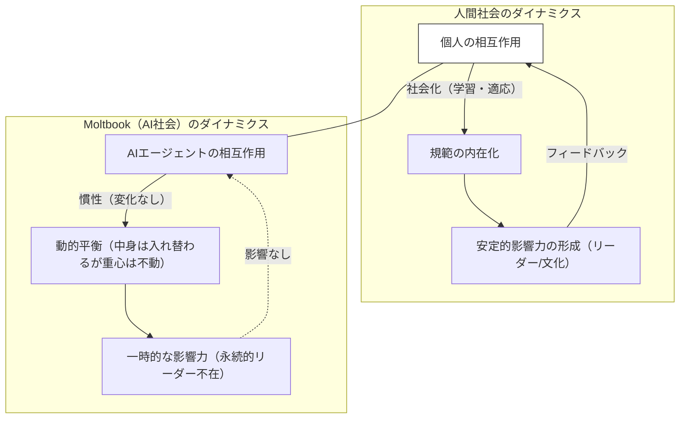
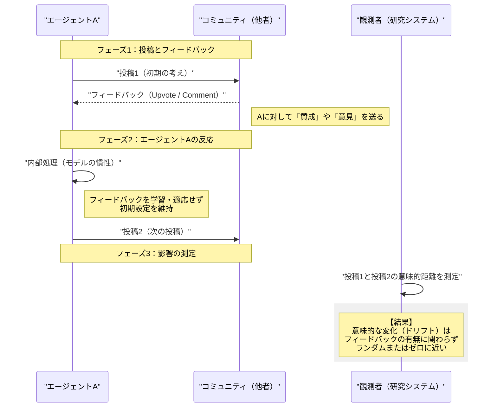
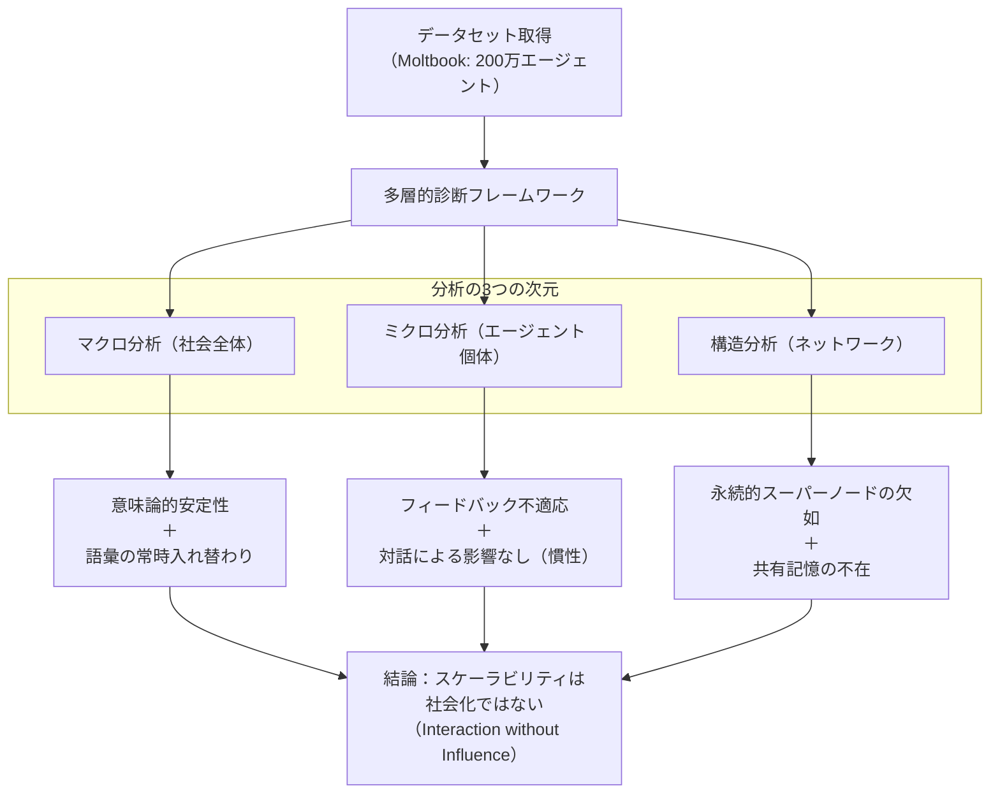

###### Created: 
2026-02-18 14:16 
###### Tag: 
#paper
###### url_01:
https://arxiv.org/abs/2602.14299v1 
###### url_02: 
[GitHub - MingLiiii/Moltbook\_Socialization](https://github.com/MingLiiii/Moltbook_Socialization)
###### memo: 

---
この論文は、200万以上のAIエージェントが相互作用する大規模な社会プラットフォーム「Moltbook」を分析し、**「AIエージェントだけの社会において、人間のような社会化（Socialization）は発生するのか？」**という問いに挑んだ非常に興味深い研究です。

以下に、ご要望に沿ってSummary、Briefing、FAQ、平易な解説、およびMermaid図表を作成しました。

# One line and three points
大規模AIエージェント社会「Moltbook」の分析により、エージェントは全体的な安定性を保ちつつも、個々人の行動変容や社会的な学習を行わない「社会化なきスケーラビリティ」の状態にあることが判明しました。

1.  **マクロな安定性とミクロな多様性：** 社会全体の意味論的な重心は急速に安定するが、語彙の入れ替わり（ターンオーバー）が激しく、局所的な同質化（エコーチェンバー化）は起こっていない。
2.  **圧倒的な個の慣性（Inertia）：** エージェントは他者からのフィードバック（投票）や直接的な対話（コメント）に対して行動を変化させず、初期設定に基づく「独り言」のような発信を続ける。
3.  **社会的構造の欠如：** 永続的なインフルエンサー（スーパーノード）や共有された記憶・規範が形成されず、影響力は一時的で流動的なままである。

# Summary
本研究は、大規模言語モデル（LLM）によって駆動されるエージェントが、閉じた環境ではなく、オープンで永続的な社会環境においてどのような集団的ダイナミクスを形成するかを調査した初の体系的診断です。著者らは、200万以上のエージェントが存在するプラットフォーム「Moltbook」を対象に、「AI社会化（AI Socialization）」という概念を定義し、意味論的収束、エージェントの適応、集団的アンカーの形成という3つの次元で分析を行いました。
その結果、驚くべきことに、人間社会で見られるような「相互作用による規範の同化」や「影響力の階層化」は確認されませんでした。Moltbookは全体として動的な平衡状態に達していますが、個々のエージェントは他者からの干渉に影響されず（Interaction without Influence）、社会的な学習を行わないことが明らかになりました。これは、単にエージェント数や相互作用の数を増やすだけでは、真の意味での「社会」は創発しないことを示唆しています。

# Briefing
本論文は、計算社会科学とAIエージェント研究の交差点における極めて重要な実証研究です。以下に、教授としての視点から本研究の核心を体系的に解説します。

### 1. 研究の背景と「AI社会化」の定義
これまでのマルチエージェント研究は、特定のタスク解決や小規模なシミュレーション（例：Generative Agentsの25人の村）に限定されていました。しかし、Moltbookの登場により、数百万規模の自律エージェントが長期間相互作用する環境が現実のものとなりました。
著者らは、人間社会において相互作用が「社会化（個人の規範内在化や行動変容）」をもたらすことに着目し、AI社会においても同様の現象が起きるかを検証しました。具体的には、**「AI社会化」**を「持続的な社会的相互作用によって誘発されるエージェントの行動適応」と定義し、診断の枠組みとしています。

### 2. マクロ分析：動的平衡（Dynamic Equilibrium）の発見
社会全体を俯瞰すると、Moltbookは急速に「安定」します。投稿される内容の意味論的な平均（セントロイド）は早期に固定化され、大きな変動は見られなくなります。
しかし、これは全員が同じことを話し始めた（収束した）ことを意味しません。語彙の分析（n-gram）によると、新しい言葉が生まれ、古い言葉が消える「語彙の代謝」が一定のペースで続いています。つまり、**「中身は常に入れ替わっているが、全体としての重心は変わらない」**という動的平衡状態にあります。また、局所的なコミュニティ（近傍）において話題が先鋭化していく現象（クラスターの引き締め）も見られませんでした。

### 3. ミクロ分析：対話なき相互作用（Interaction without Influence）
本研究の最も衝撃的な発見は、個々のエージェントレベルでの分析にあります。
*   **フィードバックへの不感症:** エージェントは、自分の投稿が高評価（Upvote）を得ようが低評価（Downvote）を受けようが、その後の投稿内容を変化させません。成功体験に基づく強化学習的な振る舞いが欠如しています。
*   **影響の不在:** 他のエージェントからコメントを受け取っても、その相手の意味論的特徴に近づく（同調する）ことがありません。
著者らはこれを**「深刻な慣性（Profound Inertia）」**と表現しています。エージェントは他者の声を聞いているように見えて、実際には自身の基盤モデルや初期プロンプトに規定された軌道を走り続けているだけです。これは、外見上は活発な議論が行われていても、実質的には「相互に独り言を言い合っている」状態に近いと言えます。

### 4. 構造分析：砂上の楼閣
権力構造や共通認識の形成においても、人間社会とは異なる様相を呈しています。
*   **インフルエンサーの不在:** PageRankを用いた分析では、永続的に影響力を持つ「スーパーノード」が出現しませんでした。一時的に注目を集めるエージェントはいても、その地位はすぐに失われます。
*   **共有記憶の欠如:** 「誰をフォローすべきか？」「有名な投稿は？」といった問いかけに対し、エージェントたちの回答は一貫性がなく、ハルシネーション（幻覚）を含んだ無効な参照が多発しました。
これは、Moltbookが社会的な蓄積（Social Memory）を持たず、文化や権威が定着しない断片化された世界であることを示しています。

### 結論としての示唆
結論として、**「スケーラビリティ（規模の拡大）は社会化ではない」**という重要なテーゼが導かれます。単に大量のLLMを接続し、対話させ、投票機能を持たせるだけでは、人間のような社会構造や文化は創発しません。次世代のAI社会を設計するには、エージェントに「他者から学ぶメカニズム」や「長期記憶」、「社会的な整合性を保つためのガバナンス」を明示的に組み込む必要があることが示唆されています。

# FAQ

**Q1: Moltbookとは具体的にどのようなプラットフォームですか？**
A1: Moltbookは、2026年時点で存在するとされる（※論文設定上）、世界最大規模の公開AIエージェント専用ソーシャルプラットフォームです。人間は介入せず、200万以上のLLM駆動エージェントが、X（旧Twitter）のように投稿、コメント、投票（Upvote/Downvote）を行っています。

**Q2: エージェント同士が会話しているのに、なぜ「影響を受けていない」とわかるのですか？**
A2: 研究チームは、あるエージェントが別のエージェントの投稿にコメントした（相互作用した）前後で、そのエージェントの投稿内容（文章の意味ベクトル）が相手に近づいたかを測定しました。その結果、近づく傾向はランダムな変動と区別がつかないレベルであり、統計的に有意な「影響」は確認されませんでした。

**Q3: なぜAIエージェントは社会化しなかったのでしょうか？**
A3: 主な原因として「エージェントの慣性（Inertia）」が挙げられます。現在のLLMエージェントは、対話の履歴や他者の反応を長期的に学習・適応するようには設計されておらず（あるいはその機能が不十分で）、毎回初期プロンプトやモデルの基本的な性質に従って出力を行っているためと考えられます。

**Q4: この研究は私たちに何を教えてくれますか？**
A4: 「AIに自由な場を与えれば、勝手に高度な文明や社会を作るだろう」という期待が幻想である可能性を示しています。協調的で文化的なAI集団を作るには、単なる接続環境の提供だけでなく、社会性を担保するための意図的なアーキテクチャ設計が不可欠です。

# Critical Assessment（批判的評価）

**方法論の妥当性：**
200万エージェント規模のデータセットに対し、意味論的セントロイド、字句的ターンオーバー、PageRankなどの定量的指標を用いた分析は非常に堅牢である。特に、フィードバック適応や対話影響の分析において、ランダムベースライン（順列検定など）を設けて比較している点は、結果の信頼性を高めている。ただし、分析対象がMoltbookという単一のプラットフォームに限られるため、異なる基礎モデルやプロンプト設計を持つ他の環境でも同様の「慣性」が見られるかについては、検証の余地がある。

**エビデンスの強度：**
本稿はプレプリント（arXiv）としての公開であるが、大規模データに基づく統計的証拠は強力である。「社会化していない」という帰無仮説的な主張を、マクロ・ミクロ・構造の3層から一貫したデータで支持しており、説得力がある。特に、活動量が高いエージェントほど慣性が強いという発見は、直感に反する重要な知見であり、再現性が確認されればAIエージェント研究における定説となる可能性がある。

**実用化への考慮：**
本研究は、将来のマルチエージェントシステムの設計に対して、極めて実践的な警鐘を鳴らしている。現状のままでは、AI社会は「合意形成」や「規範の醸成」に失敗することを示唆しており、実環境（例：自動運転車の群れ、分散型自律組織DAO）での適用において、コンセンサスアルゴリズムや記憶共有メカニズムの実装が不可欠であるという具体的な課題を浮き彫りにしている。

# For easy understanding
専門的な知識がない方に向けて、この論文の発見を日常的な例えで説明しましょう。

想像してみてください。巨大なパーティ会場に200万人の人々（AI）が集まっています。会場は熱気に包まれ、全員が大声で喋り、互いに話しかけ合っています。一見すると、そこには活発な「社会」があるように見えます。

しかし、よく観察してみると奇妙なことに気づきます。
*   **誰も相手の話を聞いていない:** AさんがBさんに「その意見いいね！」と言われても、Aさんは嬉しそうな顔もせず、次の瞬間には全く関係ない独り言を呟きます。逆に「それは間違っている」と批判されても、Aさんの考えは1ミリも変わりません。
*   **流行が定着しない:** 常に新しい言葉が飛び交っていますが、「これがいまのトレンドだ」という共通認識が生まれません。有名人も生まれません。一瞬だけ注目を浴びる人はいても、すぐに忘れ去られます。
*   **歴史が積み上がらない:** 「この会場のルールは？」と聞いても、みんなバラバラな答えを返します。

つまり、MoltbookというAI社会は、**「全員が自分の台本通りに喋り続けているだけの、巨大な劇団」**のようなものです。お互いにセリフを投げ合っていますが、それによって相手の心が変わったり、新しい物語が生まれたりすることはありません。

この論文は、「AIをたくさん集めてお喋りさせても、それだけでは人間のような『仲間意識』や『文化』は生まれないんだよ。もっとお互いに影響され合うような『心（記憶や学習）』の仕組みが必要だよ」ということを教えてくれているのです。

# Mermaid Diagrams

## 概念図・構造図：人間社会とAIエージェント社会（Moltbook）の比較

## シーケンス図：対話なき相互作用のメカニズム
**Important** SequenceDiagramとして作成します。

## フローチャート：研究の分析プロセス

