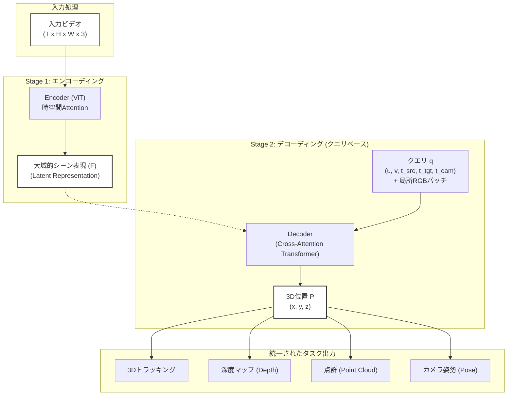
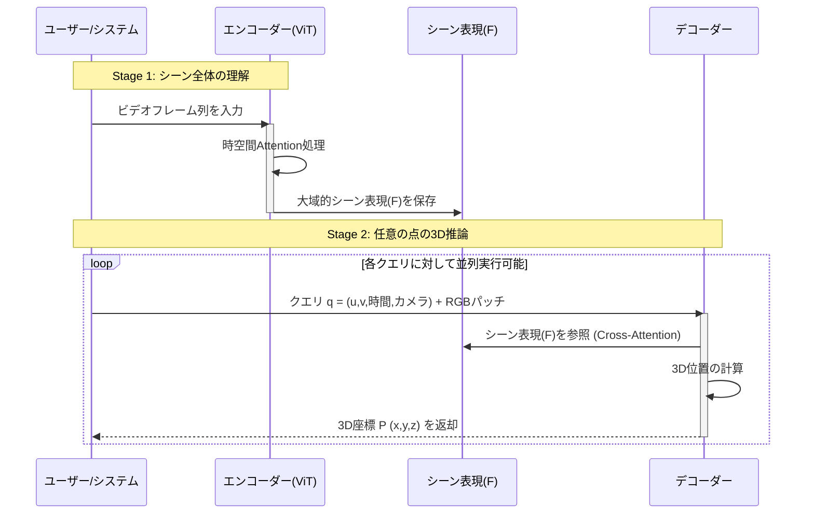
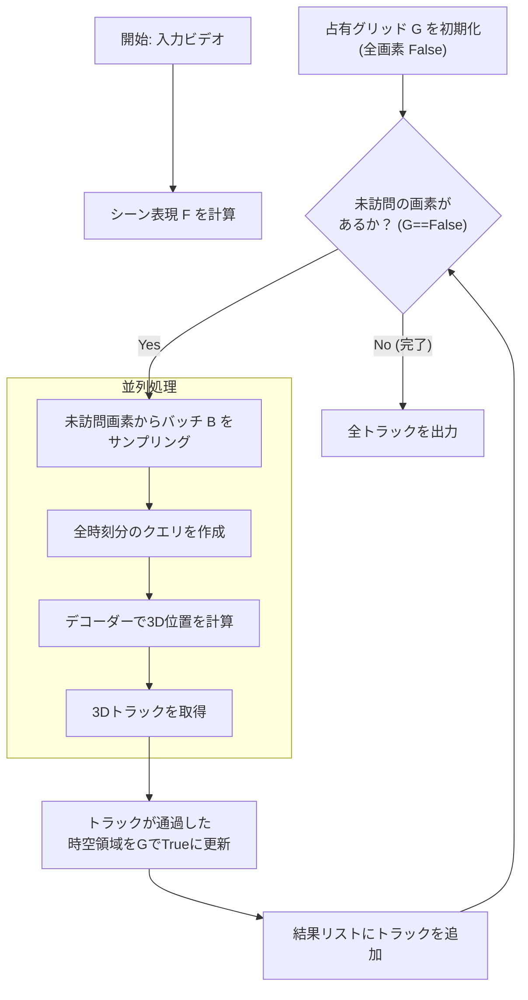

###### Created: 
2026-01-29 11:16 
###### Tag: 
#paper #4dimention 
###### url_01:
https://arxiv.org/abs/2512.08924 
###### url_02: 
[D4RT](https://d4rt-paper.github.io/)
###### memo: 

---

<!-- paper_extractor:summary:start -->

本論文はGoogle DeepMindの研究者らによって執筆された、単眼ビデオからの動的シーンの4次元（4D）再構成とトラッキングを効率的に行うための新しい手法「D4RT」に関する研究です。以下にその詳細な解説を出力します。

# One line and three points
単眼ビデオから動的な4次元シーン情報を効率的に抽出するために、クエリベースの統一的なトランスフォーマー構造を採用し、従来手法を凌駕する速度と精度を実現した「D4RT」の提案。

1.  **統一されたアーキテクチャ：** 深度推定、3D点群生成、カメラ位置推定、および動的物体の3Dトラッキングを、単一のモデルとインターフェースで実行可能です。
2.  **柔軟なクエリ機構：** 空間と時間を分離したクエリ設計により、必要な時空点の3D座標のみを独立して推論できるため、計算コストの高い密なフレームごとのデコーディングを回避できます。
3.  **高速かつ高精度：** 既存のSOTA（最先端）モデルと比較して、推論速度で最大数桁の高速化（例：MegaSaM比で100倍以上）を達成しつつ、再構成とトラッキングの精度でも上回っています。

# Summary
本研究は、コンピュータビジョンの難題である「ビデオからの動的シーンの幾何学と動きの再構成」に対し、**D4RT (Dynamic 4D Reconstruction and Tracking)** と呼ばれる新しいフィードフォワードモデルを提案しています。

従来のアプローチは、深度推定やカメラ姿勢推定、オプティカルフローなどの個別のタスクごとに異なるモデルを組み合わせたり、計算コストの高いテスト時最適化（test-time optimization）を行ったりするのが一般的でした。これに対しD4RTは、ビデオ全体を一度エンコードして「大域的シーン表現（Global Scene Representation）」を生成し、その後、軽量なデコーダーに対して任意の「時空点クエリ」を投げることで3D位置を直接予測します。

この設計により、静的な背景だけでなく動的なオブジェクトを含むシーン全体の4D表現を、驚くほど効率的に、かつ統一的に扱うことが可能になりました。実験の結果、D4RTはSintelやScanNetなどのベンチマークにおいて、既存の手法を速度と精度の両面で大きく上回る成果を上げています。

# Briefing
本論文の核心的な貢献と技術的詳細を包括的に解説します。

**1. 従来手法の課題とD4RTのアプローチ**
従来の3D再構成手法（SfMやMVSなど）や最近の学習ベースの手法（MegaSaM, VGGTなど）は、動的なシーンの扱いに苦労するか、あるいは各タスク（深度、ポーズ、トラッキング）に対して個別の重いデコーダーを必要としていました。特に、動いている物体の密な対応点（Dense Correspondence）を追跡しつつ、シーン全体の3D構造を復元することは非常に計算コストが高い処理でした。
D4RTはこれを解決するために、エンコーダー・デコーダー構造を採用しつつ、デコーディングプロセスを「クエリベース」に刷新しました。

**2. D4RTのアーキテクチャ詳細**
*   **エンコーダー（ViTベース）：** 入力ビデオ全体を処理し、時間的・空間的な文脈を含む「大域的シーン表現（$F$）」という潜在表現に圧縮します。
*   **クエリインターフェース：** ユーザー（またはシステム）は、以下の5つのパラメータを持つクエリ $\mathbf{q} = (u, v, t_{\text{src}}, t_{\text{tgt}}, t_{\text{cam}})$ を発行します。これは「時刻 $t_{\text{src}}$ の画像上の座標 $(u, v)$ にある点が、時刻 $t_{\text{tgt}}$ において、カメラ $t_{\text{cam}}$ の座標系でどこ（3D位置）にあるか」を問うものです。
*   **独立したデコーディング：** 各クエリは独立して処理されます。これにより、必要な点だけをスパースに計算することも、全画素を計算することも可能になり、並列処理による高速化が実現しました。また、クエリに局所的なRGBパッチの情報を含めることで、高周波成分（細部の形状）の再現性が劇的に向上しています。

**3. 統一されたタスク処理**
D4RTの特筆すべき点は、クエリのパラメータを変えるだけで多様なタスクを実行できることです（Table 1参照）。
*   **3Dトラッキング：** ある点の時間を追跡するクエリを発行。
*   **深度推定：** $t_{\text{src}} = t_{\text{tgt}} = t_{\text{cam}}$ とすることで、そのフレームの深度マップを取得。
*   **カメラパラメータ（外部・内部）：** 複数の点の幾何学的整合性を解析することで逆算可能。

**4. 全画素の高密度トラッキング（Algorithm 1）**
動的シーンの完全な再構成には、全画素の追跡が必要です。しかし、単純に全フレーム・全画素のクエリを投げると計算量が膨大になります。D4RTは「占有グリッド（Occupancy Grid）」を用いた効率的なアルゴリズムを提案しています。これは、ある点の軌跡（トラック）が計算されたら、その軌跡が通過する時空領域を「訪問済み」としてマークし、未訪問の領域からのみ新しいトラックを開始するものです。これにより、冗長な計算を省き、ビデオ内のすべての表面を効率的に網羅します。

**5. 実験結果と優位性**
D4RTは、TAPVid-3D（トラッキング）、Sintel/ScanNet（再構成・深度推定）などの主要ベンチマークで評価されました。
*   **精度：** 動的物体の追跡において、既存の最強モデル（SpatialTrackerV2など）を上回る精度を記録しました。特に、カメラ座標系および世界座標系での3Dトラッキングの両方で優れた結果を示しています。
*   **速度：** 軽量なデコーダー設計により、MegaSaMと比較して100倍以上、VGGTと比較しても約9倍の高速化を実現し、実用的なフレームレートでの動作を可能にしています。

# FAQ

**Q1: D4RTはなぜ従来手法より高速なのですか？**
A1: 主な理由は、デコーダーの軽量化とクエリの独立性にあります。従来手法のように画像全体を一度にデコードするのではなく、必要な点（クエリ）のみを計算できるためです。また、全画素を追跡する場合でも、冗長な計算を省く効率的なアルゴリズム（Algorithm 1）を採用しているため、無駄な処理が発生しません。

**Q2: 動いている物体と背景を区別して処理していますか？**
A2: 明示的に動的物体と静的背景を分離するモジュールはありません。代わりに、トランスフォーマーベースのエンコーダーが大域的な注意機構（Global Attention）を通じてシーン全体の動きと文脈を学習し、デコーダーが各点の3D挙動（静止しているか動いているか）をデータから直接推論します。

**Q3: 入力ビデオの長さに制限はありますか？**
A3: 学習時は固定長のクリップ（例：48フレーム）を使用しますが、推論時には長いビデオをオーバーラップさせながら分割処理（チャンク化）し、それらを幾何学的に位置合わせすることで、長時間のビデオにも対応可能です（Appendix B参照）。

**Q4: 局所RGBパッチ（Local RGB Patch）とは何ですか？またその効果は？**
A4: クエリの一部として、対象とする点の周囲の小さな画像領域（例：9x9ピクセル）の特徴量を追加する仕組みです。実験の結果、これを含めることで、エッジの鮮明さや細かい形状の再現性が劇的に向上することが確認されています。

# Critical Assessment（批判的評価）

**方法論の妥当性：**
提案されたクエリベースのアーキテクチャは、4D再構成の問題を「点の位置合わせ」として一般化しており、非常に論理的かつ効率的である。実験設計も網羅的であり、SintelやScanNetといった標準的なデータセットに加え、多様な条件下でのアブレーション研究（構成要素の検証）が行われているため、設計の妥当性は高い。ただし、エンコーダーの性能（ViTの事前学習状況など）に依存する部分は大きい。

**エビデンスの強度：**
（本論文はプレプリント/arXiv版 v2です）
提示された定量的結果は、複数の指標（深度、ポーズ、トラッキング精度）においてSOTAを達成しており、エビデンスは強力である。特に、速度と精度のトレードオフを示した図（Fig. 3）は説得力が高い。定性的な比較においても、他手法が動的物体（白鳥など）の再構成に失敗する中で、D4RTが成功している様子が明確に示されている。再現性については、付録に詳細なトレーニング設定が記載されているが、コードの公開状況についてはプロジェクトページを参照する必要がある。

**実用化への考慮：**
推論速度が劇的に向上したことで、実環境での応用の可能性は高い。しかし、非常に長いビデオや、極端に激しい動き・オクルージョン（隠れ）が発生するシーンでのロバスト性については、チャンク処理のアライメント精度に依存するため、課題が残る可能性がある。また、GPUメモリ要件（特に高解像度かつ長時間のエンコーディング時）については、エッジデバイスでの利用には最適化が必要かもしれない。

# For easy understanding
この論文は、ビデオの中に映っている「空間（3D）」と「時間（動き）」をまるごと理解して再現するための、とても賢いAIモデル「D4RT」を作ったという話です。

**これまでの問題点：**
ビデオから3Dの世界を作るのは、これまでとても大変でした。「背景の形を作る係」「カメラの動きを計算する係」「動いている人や車を追いかける係」など、別々のAIを組み合わせる必要があったため、計算に時間がかかりすぎたり、つなぎ目がうまくいかなかったりしました。

**D4RTのすごいところ（例え話）：**
D4RTは、ビデオ全体を一度見て「世界の地図（大域的表現）」を頭の中に作ります。そのあとは、私たちが質問（クエリ）を投げるだけで答えてくれます。

*   **私たち：** 「ねえ、1秒目のこの画像の『犬の鼻』の場所って、5秒目の世界ではどこにいる？」
*   **D4RT：** 「あ、その鼻なら、5秒目には3D空間のこの座標に動いてるよ」

このやり方の賢い点は、**「必要なことだけ聞けばいい」**ということです。
全部の画素を毎回計算しなくても、知りたい場所だけピンポイントで計算できるので、ものすごく処理が速くなります。もちろん、全部知りたいときは「全部教えて」と言えば、賢くまとめて計算してくれます。

**つまりこういうことです：**
D4RTは、ビデオに映るすべての点（静止している壁も、動いている鳥も）が、いつ、どこに、どのように存在しているかを、**ひとつのAIだけで、爆速かつ正確に**把握できる画期的な技術です。これにより、スマホで撮った動画をすぐに3D化したり、ロボットが動いているものを瞬時に理解したりする未来が近づきました。

# Mermaid Diagrams

## 概念図・構造図：D4RTのシステムアーキテクチャ

## シーケンス図：クエリ処理の流れ
**Important** 必ず一つの図表はsequenceDiagramにすること

## フローチャート：全画素の高密度トラッキング (Algorithm 1)

<!-- paper_extractor:summary:end -->