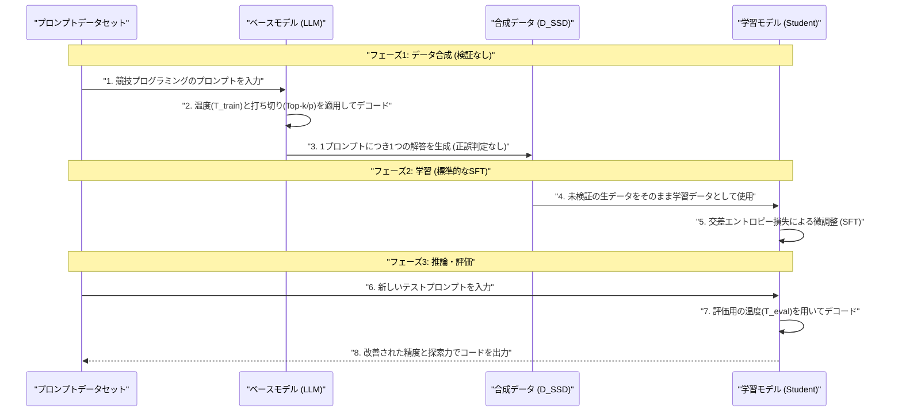
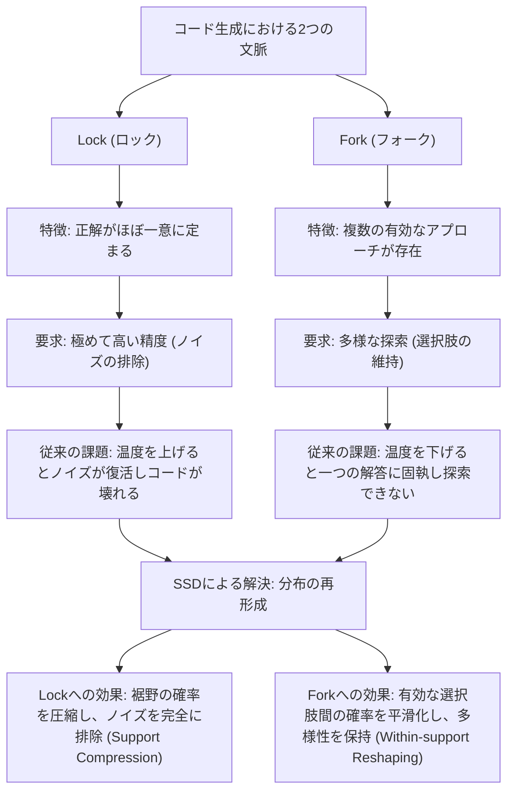
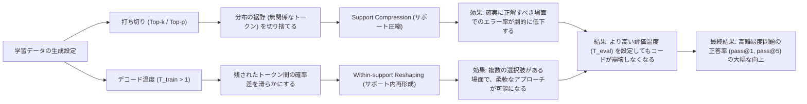

###### Created: 
2026-04-05 00:00 
###### Tag: 
#paper
###### url_01:
https://arxiv.org/abs/2604.01193 
###### url_02: 

###### memo: 

---

<!-- paper_extractor:summary:start -->

# One line and three points
外部の教師モデルやコード実行環境による検証を一切使わず、モデル自身が生成した「未検証のコード」をそのまま学習（自己蒸留）するだけで、大規模言語モデルのコード生成能力を大幅に向上させる手法「SSD」の提案とそのメカニズム解明。

- **驚くほど単純な手法（Simple Self-Distillation: SSD）：** 評価対象のモデル自身を用いて、特定の温度設定でプロンプトに対する回答をサンプリングし、その正解・不正解を一切検証することなく、そのまま標準的な教師あり微調整（SFT）を行うだけで完了します。
- **広範なモデルでの一貫した性能向上：** QwenやLlamaなど、異なるアーキテクチャやスケール（4B〜30B）、さらにはInstructモデルとThinking（推論）モデルの両方において、LiveCodeBenchなどの評価指標で大幅な性能向上が確認されました。特に難易度の高い問題において劇的な改善（Qwen3-30B-Instructでpass@1が+12.9ポイント向上）を示します。
- **「精度と探索の競合」の解消：** SSDが機能する根本的な理由は、正解コードだけを学んでいるからではなく、コード生成特有の「確実に正解を出さねばならない場面（Lock）」と「多様なアプローチを模索すべき場面（Fork）」の競合状態を、確率分布の再形成によってモデル内部で解決しているためです。

---

# Summary
本論文「Embarrassingly Simple Self-Distillation Improves Code Generation」は、大規模言語モデル（LLM）のコード生成能力を向上させるための極めてシンプルかつ強力なアプローチを提案しています。これまで、LLMのコード生成能力を高めるためには、より高性能な教師モデルからデータを生成するか、あるいは強化学習やコード実行環境を用いた厳密な正解検証プロセスが不可欠であると広く考えられてきました。しかし著者らは、外部リソースを一切使用せず、モデル自身が生成した「正しさの保証がない生の出力データ」を自己蒸留（SFT: 教師あり微調整）するだけで、モデルの性能が飛躍的に向上することを発見しました。

この手法「SSD（Simple Self-Distillation）」は、LiveCodeBench v6において、Qwen3-30B-Instructのpass@1スコアを42.4%から55.3%へと劇的に押し上げました。特に、アルゴリズムの複雑な分岐が要求される「Hard（難問）」のセットにおいてその効果が最も顕著に現れています。

論文の後半では、なぜこのような正解ラベルのないデータからの学習が性能向上をもたらすのかについて、理論と実証の両面から深く掘り下げています。コード生成の過程には、変数名や構文など一意に定まるべき「Lock（ロック）」の位置と、複数の実装方針が考えられる「Fork（フォーク）」の位置が存在します。推論時のデコード温度（Temperature）を調整するだけでは、Lockの精度を高めることとForkでの探索の多様性を保つことはトレードオフの関係（精度と探索の競合）にあり、両立できません。しかしSSDによる学習を経ることで、モデルは文脈に応じて確率分布を再形成し、Lock部分では不要なノイズ（裾野の確率）を強力に圧縮しつつ、Fork部分では複数の有効な選択肢を平滑化して保持するようになります。これにより、推論時により高い温度設定を適用しても精度が崩れることなく、有効な探索が可能になるというメカニズムを解明しました。

---

# Briefing
本研究は、大規模言語モデルを用いたコード生成タスクにおけるデータ枯渇問題と、学習パイプラインの複雑化に対するエレガントな解決策を提示しています。以下に、本論文の核となる背景、手法、結果、そしてメカニズムの詳細を網羅的に解説します。

### 1. 背景：高度なコード生成におけるデータの壁
LLMをプログラミングや推論といった高度なタスクに適応させる際、質の高い教師データの確保が最大のボトルネックとなります。人間の専門家が書いたコードは収集コストが高く、合成データ（Synthetic Data）を生成して学習させるアプローチが主流となっています。しかし、従来の合成データ生成パイプラインは、「GPT-4などのより強力な教師モデルの出力を蒸留する」か、「生成したコードを実際にコンパイル・実行して正解したものだけをフィルタリングする（あるいは報酬として強化学習に用いる）」という手法に依存していました。これらはコストが高く、インフラの構築が複雑であり、教師モデルの性能上限という制約を受けます。

### 2. 提案手法：Embarrassingly Simple Self-Distillation (SSD)
著者らが提案するSSDは、文字通り「恥ずかしいほど単純」な手法です。必要なものは「問題のプロンプト集（正解コードは不要）」と「対象となるベースモデル」のみです。
- **データ合成フェーズ：** ベースモデルに対してプロンプトを与え、学習用のデコード温度（$T_{train}$）と打ち切り設定（Top-k, Top-p）を用いて、各問題につき1つだけ回答をサンプリングします。この際、生成されたコードが正しいかどうか、そもそもコードとして成立しているかどうかすら検証・フィルタリングしません。
- **学習フェーズ：** 生成された生の出力データセット（$\mathcal{D}_{SSD}$）を用いて、ベースモデル自身に対して標準的な交差エントロピー損失を用いた教師あり微調整（SFT）を行います。
- **推論フェーズ：** 学習後のモデルに対して、評価用のデコード温度（$T_{eval}$）を適用してコードを生成させます。

### 3. 圧倒的な実験結果
LiveCodeBench v6（2025年に収集された新しい問題セットであり、データ汚染の可能性が低い）において、SSDを適用したQwen3-30B-Instructモデルは、ベースモデルのpass@1スコア42.4%から55.3%へと、相対値で約30%もの大幅な向上を達成しました。
特筆すべきは以下の点です。
- **難問での著しい改善：** 性能向上はEasyな問題よりもMediumやHardな問題に強く集中しています。
- **多様性の維持：** 1回の試行での正答率（pass@1）以上に、複数回試行した際の正答率（pass@5）が向上しており、モデルが「単一の解答を丸暗記して多様性を失った」わけではなく、複数のアプローチを探索する能力を獲得していることを示しています。
- **モデルの普遍性：** Llama-3.1-8B-Instructや、推論能力に特化したQwen3-4B-Thinkingなど、アーキテクチャやサイズの異なる複数のモデルでも一貫して効果が確認されました。

### 4. なぜSSDは機能するのか？（メカニズムの解明）
「正解かどうかも分からない自身の出力で学習して、なぜ性能が上がるのか？」という疑問に対し、著者らは**「精度と探索の競合（Precision-Exploration Conflict）」**という概念を提示し、理論的・実証的に証明しています。

プログラムの生成過程は、2つの相反する状況の連続です。
- **Lock（ロック）位置：** `if n ==` の後のように、構文的・文脈的に次に来るべきトークンがほぼ一意に決まる状況。ここでは高い「精度」が求められ、無関係なトークン（ノイズ）が出現する確率を極限までゼロに近づける必要があります。
- **Fork（フォーク）位置：** ループ処理を使うか、再帰処理を使うかといったアルゴリズムの分岐点。ここでは複数の有効な選択肢が存在し、様々な可能性を「探索」するために確率分布が平らかであることが求められます。

ベースモデルの推論時、デコード温度を低く設定するとLockでのエラーは減りますが、Forkで一つのアプローチに固執してしまい探索ができなくなります。逆に温度を高くすると、Forkでの探索は促されますが、Lockにおいて無関係なノイズトークンが選ばれる確率が上がり、コードが文法エラーを起こして崩壊します。これが「精度と探索の競合」です。

SSDによる学習（特定の温度設定とTop-p/Top-kによる打ち切りを経たデータでの学習）は、モデルの出力確率分布を文脈に応じて最適に「再形成」する効果を持ちます。
- Lockのような確率が一部に集中している場面では、打ち切り処理によって裾野のノイズが完全に切り捨てられたデータが作られます。これを学習することで、モデルはLock部分のノイズを強力に圧縮（Support Compression）し、極めて鋭いピークを持つようになります。
- 一方、Forkのような確率が分散している場面では、複数の有効な選択肢が打ち切りを生き残ります。高温でサンプリングされたデータはこれらの確率を平滑化しているため、モデルは複数のアプローチの確率を均等に保つ（Within-support Reshaping）ようになります。

結果としてSSD後のモデルは、「確実に決めるべき所は絶対に間違えず、迷うべき所では柔軟に選択肢を残す」という状態になります。そのため、推論時により高いデコード温度（$T_{eval}$）を設定しても、Lockが壊れることなく、Forkにおいて有効な多様性を引き出すことができるようになるのです。

### 5. 驚くべきストレステスト：ノイズだらけのデータからの学習
著者らはこのメカニズムを証明するため、あえて極端に高い温度（$T_{train} = 2.0$）で、かつ打ち切り（Top-k/Top-p）を一切行わずにデータを生成しました。この設定では、生成されたデータの約62%が抽出可能なコードを含まない、多言語が混ざった「意味不明な文字列（Gibberish）」になってしまいます。
驚くべきことに、このゴミのようなデータを用いてSSDを行った場合でも、推論時に適切なデコード温度を設定すれば、ベースモデルよりも高い性能（pass@1が42.4%から48.1%へ向上）を叩き出しました。この結果は、SSDの成功が「生成されたコードがたまたま正解だったから」ではなく、「高温サンプリングによる確率分布の再形成自体が、モデルの潜在的な能力を引き出す学習シグナルとして機能している」ことを強力に裏付けています。

---

# FAQ

**Q1: 自己学習（Self-training）を行うと、モデルが自分の間違いを強化学習してしまい、性能が崩壊（モード崩壊）するのではないでしょうか？**
A: 単純に元のモデルの分布（温度 $T=1$）からサンプリングしてそのまま学習した場合は、数学的に証明されている通り学習シグナルが発生せず（固定点となり）、性能は変わりません。SSDが機能するのは、データ生成時に「温度の変更」と「Top-k/Top-pによる確率の打ち切り（Truncation）」を行っているからです。これによりターゲットの確率分布が変化し、不要なノイズを削ぎ落としつつ有用な探索空間を維持するという新たな学習シグナルが生まれるため、崩壊を免れています。

**Q2: モデルが生成した間違ったコードを学習させても本当に問題ないのですか？**
A: 問題ありません。本研究のストレステストが示すように、データの大半が意味不明な文字列であっても、モデルは「どのトークン群を保持し、どのトークン群を切り捨てるべきか」という分布の形状（ジオメトリ）自体から学習します。正解のコードを記憶するのではなく、出力確率のメリハリ（LockとForkの区別）を学ぶため、個々のコードの正答性に依存せずに性能が向上します。

**Q3: 学習などせずとも、推論時にベースモデルの温度やTop-pパラメータを細かくチューニングすれば同じ結果が得られるのではないですか？**
A: 得られません。論文内の実験で、ベースモデルのデコードパラメータを広範に探索しても、SSDを施したモデルの性能には遠く及びませんでした。デコード時のパラメータ変更は、すべての文脈（LockもForkも）に対して一律に適用されるため、「精度と探索の競合」を回避できません。SSDはモデルの重み自体を更新し、文脈ごとに確率分布の形を変容させるため、デコード戦略の調整だけでは到達不可能な領域に達することができます。

**Q4: プログラミングの問題ばかり学習させると、モデルの一般的なチャット能力や数学を解く能力が落ちてしまう（破滅的忘却）のではありませんか？**
A: 影響はモデルのサイズに大きく依存します。実験によると、30B（300億パラメータ）クラスの大型モデルでは、数学（AIME）や一般知識（MMLU）のスコアはほぼ低下せず、安定した性能を維持しました。しかし、4Bや8Bなどの比較的小さなモデルでは、一般的なコード理解や数学のタスクにおいて一部性能の低下が見られました。小規模モデルを実運用する際には、一般的な学習データとブレンドするなどの工夫が必要になる可能性があります。

---

# Critical Assessment（批判的評価）

**方法論の妥当性：**
本研究の実験設計は非常に優れています。トイモデル（有限オートマトン）を用いた完全制御下でのシミュレーションから、30Bパラメータの実モデルを用いた実証まで、一貫して「精度と探索の競合」という仮説を検証しています。意図的に不良なデータを生成するストレステストを含めることで、単なる「質の高い自己生成データによる改善」という代替仮説を排除している点も論理的で説得力があります。

**エビデンスの強度：**
提案される主張は、複数のアーキテクチャ（Llama, Qwen）、異なるスケール、および推論専用（Thinking）モデルにおいて一貫して確認されており、一般化可能性と再現性は極めて高いと言えます。理論的セクション（付録B）による数学的定式化も提供されており、現象に対する理論的裏付けも強固です。なお、本論文はプレプリント（未査読）の状態であるため、他機関による独立した追試が待たれます。

**実用化への考慮：**
報酬モデル、実行環境（コンパイラ等）、外部の高度な教師モデルを一切必要としないため、計算リソースやエンジニアリングコストの観点から実環境への適用性は非常に高いです。主要な課題は小規模モデルにおけるドメイン外タスクへの忘却（トレードオフ）であり、汎用アシスタントとしてデプロイする際には、元のSFTデータを一定割合混ぜるなどの実務的な対策が求められます。

---

# For easy understanding

LLM（AIモデル）にプログラミングを上達させるための画期的な「自習法」を発見した論文です。

これまで、AIにプログラミングを教えるには、莫大なコストがかかると考えられていました。例えば、自分よりはるかに賢いAI（GPT-4など）が書いたお手本を用意したり、AIが書いたコードを実際にパソコン上で動かして「正解・不正解」を厳密にチェックして、正解したものだけを覚えさせる、といった非常に面倒なシステムが必要でした。

しかし、この論文が発見したのは、**「AI自身がとりあえず書いたコードを、答え合わせを一切せずに、そのまま何度も復習（学習）させるだけ」**で、プログラミング能力が劇的に向上するという魔法のような事実です。

なぜ、間違っているかもしれない自分の答えを復習するだけで賢くなるのでしょうか？
それは、コードを書く過程には以下の2つの場面があり、AIは常にそのジレンマに悩まされているからです。

1. **「絶対に間違えてはいけない場面（Lock）」**：例えば `if x ==` の後には具体的な数字や変数が来るべきで、ここで無関係な単語を出すとエラーになります。ここでは「正確さ」が求められます。
2. **「色々な書き方を試すべき場面（Fork）」**：例えば処理の初めに「繰り返し（for文）」を使うか、「別の関数を呼び出すか」など、複数の正しい道がある場面です。ここでは色々な可能性を考える「探索力」が求められます。

AIにコードを書かせるとき、設定（デコード温度）を「お堅く」すると、絶対に間違えなくなりますが、色々な可能性を考える柔軟性が失われます。逆に設定を「柔軟に」すると、色々なアイデアを出せるようになりますが、間違えてはいけない場面で変な単語を出してしまい、コードが壊れてしまいます。

今回の「答え合わせをしない自習（SSD）」を行うと、AIの脳内で不思議な整理整頓が起こります。
AIは学習を通じて、「ここは絶対に決まりきった場面だ（Lock）」という場所では、余計なノイズの可能性を徹底的にゼロに近づけます。一方で、「ここは色々な可能性がある場面だ（Fork）」という場所では、複数のアイデアを均等に保ちます。

この自習を終えたAIは、**「確実なところは絶対にミスをせず、迷うべきところでは柔軟にアイデアを出せる」**ようになります。その結果、難しいプログラミングの問題でも、様々なアプローチを自ら試して正解にたどり着ける確率が劇的に跳ね上がるのです。

つまり、AIは自分の出力が「正しいかどうか」を学んだのではなく、自習を通じて**「コードを書く時のメリハリの付け方（確率のコントロール術）」**を身につけたということです。これは、高価な外部ツールなしでAIを自己進化させる、非常に強力で実用的なアプローチです。

---

# Mermaid Diagrams

## タイムライン・シーケンス図
論文の提案手法である「Simple Self-Distillation (SSD)」の全体的なプロセスとデータの流れを示します。検証や外部フィードバックが介在しないことが特徴です。

## 概念図・構造図
コード生成における「精度と探索の競合（Precision-Exploration Conflict）」と、SSDがどのようにそれを解決するのかを対比して示します。

## 関係図・相関図
SSDの学習において、デコード温度（Temperature）と打ち切り（Truncation）が確率分布に与える影響の因果関係を示します。

<!-- paper_extractor:summary:end -->

