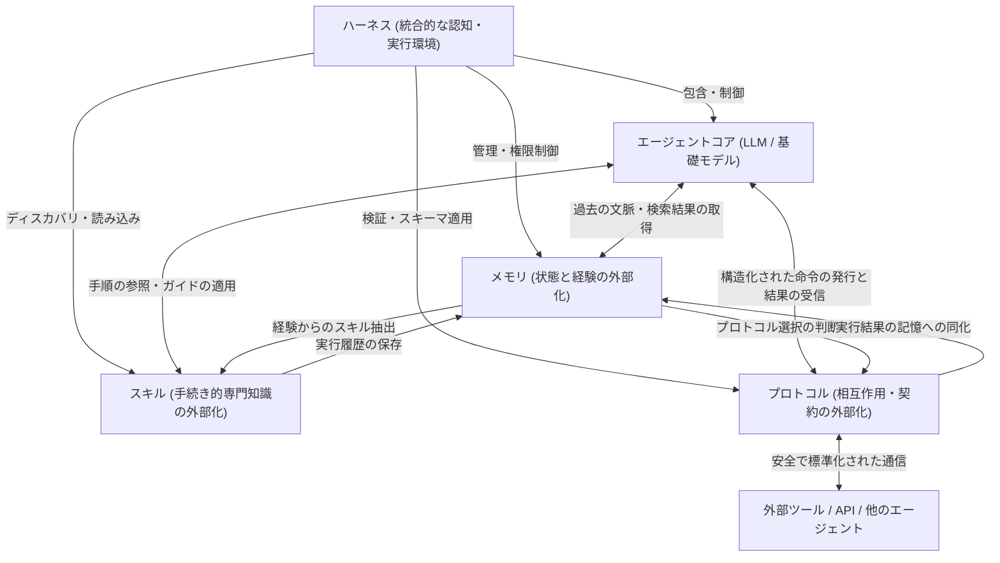
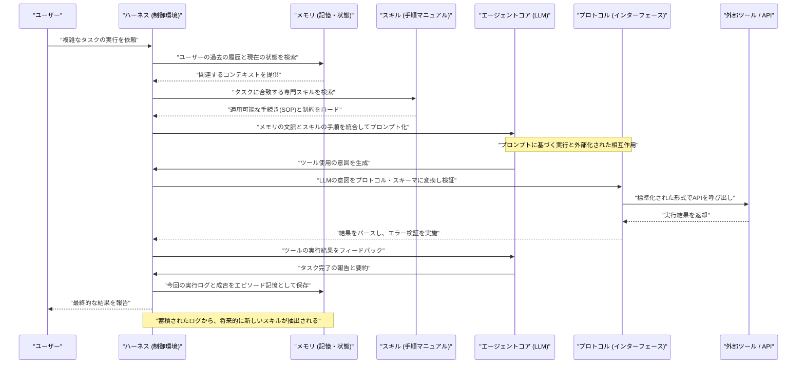

###### Created: 
2026-04-16 14:57 
###### Tag: 
#paper
###### url_01:
https://arxiv.org/abs/2604.08224 
###### url_02: 

###### memo: 

---

<!-- paper_extractor:summary:start -->

**トップ大学の教授としての視点から、本論文の学術的意義と実践的価値を詳細かつ包括的に解説いたします。**

# One line and three points
大規模言語モデル（LLM）エージェントの進化を「認知負荷の外部化（Externalization）」という理論的レンズから紐解き、メモリ、スキル、プロトコル、そしてそれらを統合するハーネス（実行環境）の設計論を体系化した包括的なレビュー論文です。

1. **認知負荷の外部化メカニズムの解明：** エージェントの連続性を保つ「メモリ（状態の外部化）」、手続きを定式化する「スキル（専門知識の外部化）」、やり取りを規定する「プロトコル（相互作用の外部化）」という3つの次元で、LLMの弱点を外部構造によって補う仕組みを体系化しています。
2. **能力の源泉の歴史的パラダイムシフト：** エージェントの知能が「モデルの重み（Weights）」に依存する段階から、「プロンプト（Context）」での操作を経て、最終的に「外部インフラストラクチャ（Harness）」へと移行している技術的変遷を明確に示しています。
3. **物理世界やマルチエージェント環境への応用と未来展望：** デジタル空間にとどまらず、ロボット工学における大脳・小脳の役割分担（Embodied AI）への応用や、自己進化型ハーネス、そして複雑化するシステムにおけるガバナンスとセキュリティの課題までを包括的に論じています。

# Summary
本論文は、大規模言語モデル（LLM）に基づく自律型エージェントの設計パラダイムが、モデル内部のパラメーター最適化から、エージェントを取り巻く外部インフラストラクチャの構築へと大きく移行している現状を「外部化（Externalization）」という認知科学的な概念を用いて統一的にレビューしています。著者は、エージェントが直面する時間的・手続き的・相互作用的な課題を克服するために、情報を「メモリ」として蓄積し、専門的な手順を「スキル」としてパッケージ化し、外部システムとの通信を「プロトコル」として標準化するプロセスを詳細に分析しています。さらに、これら3つの外部化モジュールを統合し、権限管理や観察可能性を備えた安全な動作環境を提供する「ハーネス（Harness）エンジニアリング」の重要性を提唱しました。今後のLLMエージェント開発は、単なるモデルの巨大化ではなく、この高度に構造化された認知環境の設計能力によって牽引されるという力強い結論を導き出しています。

# Briefing
本論文は、LLMエージェント研究の最前線で何が起きているのかを、単なる技術の羅列ではなく「なぜそのようなアーキテクチャが必要になったのか」という根本的な動論から解き明かした極めて重要な文献です。以下にその中核となる論点を詳細に解説します。

**1. 背景：能力の源泉のパラダイムシフト**
これまで、AIの性能向上は主に「モデルの重み（Weights）」、すなわち事前学習によるパラメーターの最適化によってもたらされてきました。その後、In-Context Learningなどの手法により「プロンプト（Context）」の工夫で振る舞いを制御する時代が到来しました。しかし、コンテキストウィンドウ（一度に処理できる情報量）の限界や情報の忘却という壁に直面した現在、知能の源泉はモデルの外側、すなわち「ハーネス（Harness：実行・制御環境）」へと移行しています。著者はこれを、人類が文字や道具を発明して脳の認知負荷を外部環境に委譲した歴史（認知アーティファクトの理論）になぞらえて説明しています。

**2. メモリ：時間的状態の外部化**
モデル単体は過去の文脈を永続的に保持することができません。そこで「メモリ」は、作業コンテキスト、エピソード記憶（過去の成功・失敗の軌跡）、セマンティック知識（普遍的な事実）、そしてパーソナライズされた記憶（ユーザー固有の嗜好）を外部のストレージに保存します。これにより、LLMの課題は「過去の膨大な情報をすべて思い出す（Recall）」ことから、システムが提示した適切な情報を「認識し活用する（Recognition）」ことへと劇的に変換されます。

**3. スキル：手続き的専門知識の外部化**
複雑なタスクを実行する際、毎回ゼロから手順を推論させることは、ステップの欠落やエラー（分散）の温床となります。「スキル」は、特定のタスクを達成するための手順、意思決定のヒューリスティクス、そして遵守すべき制約条件を、再利用可能なアーティファクト（コードや構造化ドキュメント）としてパッケージ化します。これにより、エージェントは都度アドホックな解決策を生成するのではなく、実績のある手続きを「呼び出して構成する」という安定した動作が可能になります。

**4. プロトコル：相互作用の外部化**
エージェントが外部のツールや他のエージェントと通信する際、自由記述の自然言語でやり取りをすると、フォーマットの不一致や予期せぬ動作を引き起こします。「プロトコル」は、この相互作用に対して明確な文法（スキーマ）、ライフサイクル管理、権限の境界、および能力の発見メカニズムを提供します。近年注目を集めるMCP（Model Context Protocol）などがその代表であり、不確実な対話を機械可読な「契約（Contract）」へと昇華させる役割を果たします。

**5. ハーネスエンジニアリング：統合的な認知環境**
メモリ、スキル、プロトコルの3要素は単独では機能しません。これらを束ね、エージェントのループ制御、サンドボックスによる安全な隔離、人間による承認プロセス（Human-in-the-loop）、そしてログの監視による観察可能性（Observability）を提供する包括的な実行環境が「ハーネス」です。著者は、現代のエージェント開発とは事実上「ハーネスのエンジニアリング」と同義であると喝破しています。

**6. 今後の展望とトレードオフ**
論文の終盤では、モデル内に保持すべき「パラメトリックな能力」と、外部環境に依存すべき「外部化された能力」の間のトレードオフが論じられています。変化が早く、厳密な監査が必要な知識や手続きは外部化すべきですが、過度な外部化は推論の遅延（レイテンシ）やコンテキスト予算の圧迫という認知オーバーヘッドを招きます。今後は、デジタル空間のみならずロボット工学（Embodied AI）への適用や、エコシステム全体でアーティファクトを共有する分散型インフラへの進化が期待されています。

# FAQ

**Q1. 「外部化（Externalization）」という概念は、具体的に何の問題を解決するのですか？**
LLMが持つ「コンテキスト上限による記憶喪失」「長い手順を実行する際の不安定さ」「外部ツールとの連携におけるフォーマット・エラー」という3つの根本的な弱点を解決します。情報をモデルの外部に配置し、必要な時にだけ適切な形で提供することで、モデル自身の「考える力」を最大限に引き出すことができます。

**Q2. 「ツール利用」と本論文で言及されている「スキル」は何が違うのでしょうか？**
「ツール」はWeb検索や計算機のような単一のアクション（実行可能な操作）を提供するものです。一方「スキル」は、それらのツールをどのような順序で、どのような制約のもとに使うべきかという「専門的なノウハウ・手順」を定式化したものです。ツールが「道具」なら、スキルは「作業マニュアル」と言えます。

**Q3. エージェントにとって「プロトコル」が重要視されているのはなぜですか？**
異なる開発者が作ったツールや、異なるAIモデル同士が協調して働くためには、お互いが理解できる「共通言語とルール」が必要です。プロトコルがないと、その都度専用の連携プログラムを書く必要があり、拡張性やセキュリティ（権限管理）の面で行き詰まってしまうためです。

**Q4. このような外部インフラ（ハーネス）に過度に依存することのデメリットはありますか？**
はい、あります。論文内でも指摘されている通り、外部情報の検索やツールの呼び出しが増えることで、応答速度（レイテンシ）が低下したり、LLMのプロンプト枠が外部情報で溢れかえってしまう「認知オーバーヘッド」が発生します。また、外部のスキルファイルやメモリが改ざんされると、エージェント全体がハッキングされるという新たなセキュリティリスクも生じます。

# Critical Assessment（批判的評価）

**方法論の妥当性：**
本研究は新しいアルゴリズムやベンチマークを提案する実験論文ではなく、既存の膨大な研究と産業事例を統合する概念的フレームワークの提示（レビュー）です。認知科学（Normanの認知アーティファクト理論等）を土台として、複雑化するLLMエージェントの要素技術を「外部化」という単一の軸で見事に整理した点は極めて高く評価できます。一方で、提案されたアーキテクチャが他の代替アプローチと比較してどの程度効率的かを示す定量的なアブレーション検証は含まれておらず、今後の実証研究が待たれます。

**エビデンスの強度：**
本論文はプレプリント（arXiv）段階の文献ですが、OpenAIのCodex、AnthropicのMCPやClaude Code、さらには主要なオープンソースフレームワーク（Auto-GPT, LangGraphなど）といった、現在実稼働している確固たる産業・学術事例を網羅的に引用しています。そのため、概念的な主張を裏付ける現状のシステム開発のトレンドに関する証拠は十分に強固です。ただし「自己進化型ハーネス」などの未来展望は、現時点では理論的推測の域を出ません。

**実用化への考慮：**
実環境への適用における課題分析は非常に優れています。特に、外部化が進むことで生じるレイテンシの増大、コンテキスト予算の競合、そして悪意のあるスキルやプロトコルによるシステム汚染（プロンプトインジェクション等）といったセキュリティリスクに紙幅を割いている点は実用的です。一方で、これらの管理コストをエンタープライズ規模でいかに効率的に自動化・最適化するかという運用面の具体的なソリューションは、今後の技術発展に委ねられています。

# For easy understanding
**「超優秀だが、すぐに忘れてしまうし、会社のルールも知らない新入社員」**
現在のLLM（AIモデル単体）を人間に例えると、このような状態です。彼らに複雑で長期的な仕事を任せようとするとき、毎回その都度すべての前提条件や手順を口頭（プロンプト）で説明するのは非効率的ですし、いずれ必ずミスをします。

本論文が主張している「外部化（Externalization）」と「ハーネス（Harness）」の構築とは、**この優秀な新入社員のために、完璧に整備された『オフィス環境』を作ってあげること**を意味します。

*   **メモリ（記憶の外部化）：** 社員の頭の中に記憶を頼るのではなく、「キャビネット（顧客情報や過去の失敗記録）」を用意し、必要な時に必要な書類だけを取り出せるようにします。
*   **スキル（専門知識の外部化）：** 毎回手順を考えさせるのではなく、「業務マニュアル」を用意し、それに沿って仕事を進めさせます。
*   **プロトコル（相互作用の外部化）：** 他の部署や外部の業者とやり取りする際の「公式な申請書（フォーマット）」を義務付け、勝手な約束や誤解を防ぎます。
*   **ハーネス（統合実行環境）：** これらをすべて管理する「オフィスのルールと監視システム（権限チェックや上司の承認フロー）」です。

つまりこういうことです。**「AIを賢くすることだけが進化ではない。AIが安全かつ確実に働ける『仕組み（外部環境）』をどう設計するかこそが、これからのAI開発の主戦場である」**。これが本論文の最も本質的な発見であり、価値なのです。

# Mermaid Diagrams

以下のMermaid図表は、本論文の中核となる「ハーネス」における各モジュール（メモリ、スキル、プロトコル）の相互作用と、エージェントがタスクを実行する際の時系列の流れを示しています。

## 概念図・構造図

## タイムライン・シーケンス図
エージェントがユーザーの要求を受け取り、ハーネス内でメモリ、スキル、プロトコルを駆使してタスクを完了するまでの一連の流れを示します。論文の第7章（Module Interaction Map）の概念を視覚化したものです。

<!-- paper_extractor:summary:end -->

