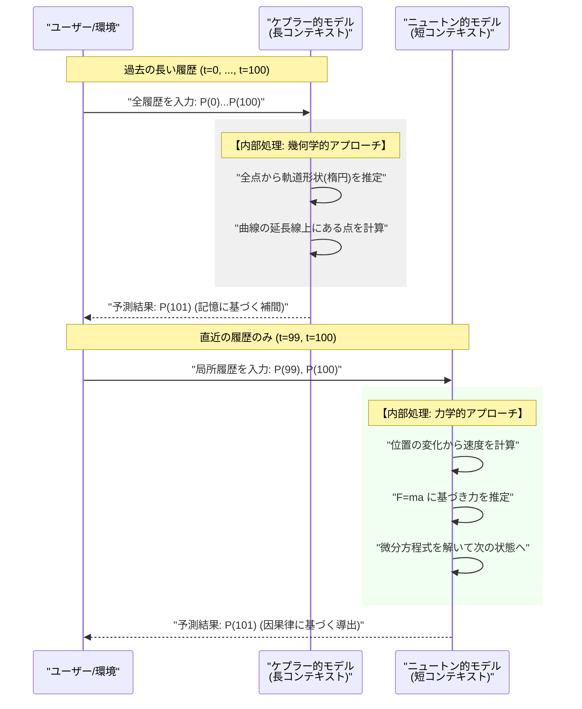
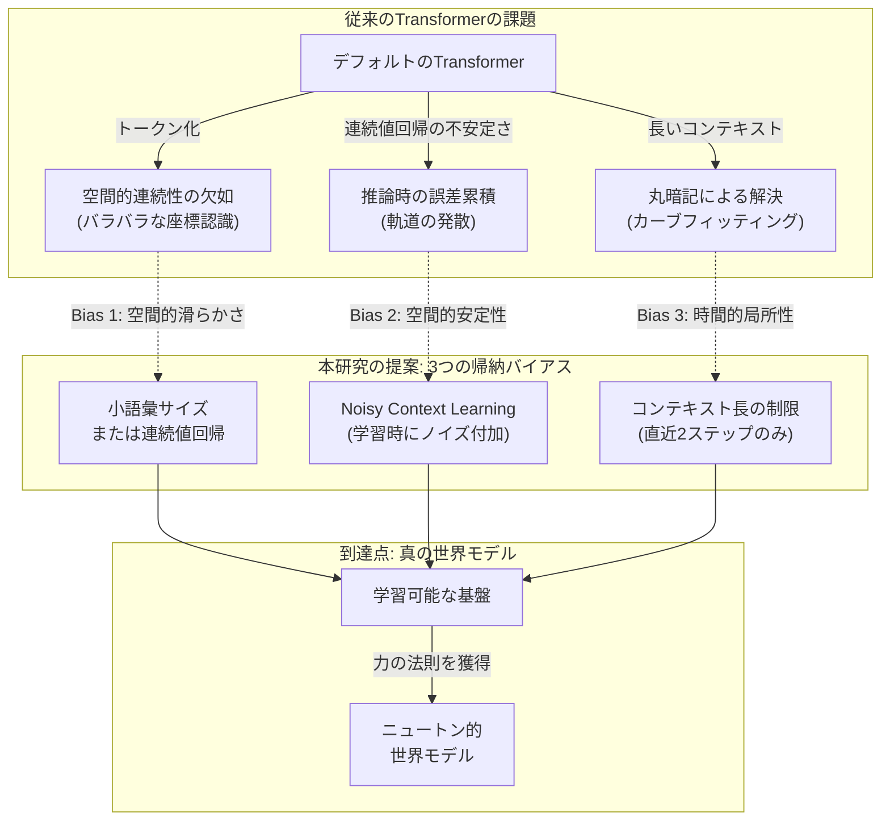

###### Created: 
2026-02-16 00:26 
###### Tag: 
#paper
###### url_01:
https://arxiv.org/abs/2602.06923 
###### url_02: 

###### memo: 

---

<!-- paper_extractor:summary:start -->

本論文は、AIが単なる「予測器」を超えて、物理法則を理解する「科学者」になるために必要な条件を体系的に解明した、非常に示唆に富む研究です。ハーバード大学やMIT等の研究チームによる先行研究（Vafa et al., 2025）が「Transformerは惑星運動の物理法則を学習できない」と結論づけたのに対し、本研究は「適切な帰納バイアス（Inductive Biases）を与えれば学習可能である」ことを鮮やかに示しました。

以下に、本論文の解説を出力します。

# One line and three points
Transformerが単なる「曲線当てはめ（ケプラー）」を超えて「物理法則（ニュートン）」を獲得するためには、空間的な連続性と安定性、そして時間的な局所性という3つの帰納バイアスが不可欠であることを示した研究。

1.  **空間的滑らかさ（Spatial Smoothness）：** 従来のトークン化は空間的連続性を破壊するため、小規模な語彙サイズの使用や、連続値回帰（Regression）への移行が必要である。
2.  **空間的安定性（Spatial Stability）：** 回帰モデルは推論時に誤差が累積しやすいため、学習時にあえてノイズを混入させる「Noisy Context Learning」が不可欠である。
3.  **時間的局所性（Temporal Locality）：** コンテキスト長を短く制限（過去2ステップのみ参照）することで、モデルは過去の記憶に頼る「ケプラー的モデル」から、局所的な力学法則を導出する「ニュートン的モデル」へと相転移する。

# Summary
本研究は、Transformerが物理的な「世界モデル」を学習できるかを検証したものです。先行研究では、惑星の軌道予測タスクにおいて、Transformerは高い予測精度を持つものの、背後にある重力法則（ニュートン力学）を内部表現として獲得していないことが示されていました。

著者らはこの失敗の原因を分析し、3つの重要な帰納バイアス（空間的滑らかさ、空間的安定性、時間的局所性）を導入することで問題を解決しました。特に衝撃的な発見は、**「コンテキスト長（参照する過去の履歴）を長くすると、モデルは軌道形状を丸暗記する『ケプラー的モデル』になり、逆にコンテキスト長を極端に短くすると、力と加速度の関係性を理解する『ニュートン的モデル』になる」**という事実です。これは、AIに科学的発見をさせるためには、単にデータや計算量を増やすだけでなく、適切な制約（バイアス）を設計することが不可欠であることを示唆しています。

# Briefing
本論文は、AIが物理法則を「発見」するプロセスにおける、アーキテクチャ上の制約と学習ダイナミクスの関係を詳細に解き明かしています。以下にその核心的な議論を展開します。

## 1. 空間認識の獲得：トークン化の罠と解決策
大規模言語モデル（LLM）で標準的な「トークン化（Tokenization）」は、物理的な空間座標を扱う際に致命的な欠陥となります。
*   **問題の所在（Inductive Bias 1: Spatial Smoothness）：** 連続的な座標 $(x, y)$ を離散的なトークン（例：ID 1024）に変換すると、物理的に近い座標同士が、埋め込み空間上では全く無関係なベクトルとして初期化されてしまいます。これにより「空間的な滑らかさ」という重要な情報が失われます。
*   **検証結果：** 語彙サイズ（$V$）が大きいほど、空間マップの学習には膨大なデータが必要になるというスケーリング則が確認されました。
*   **解決策：** 語彙サイズを極端に小さくするか、あるいはトークン化を廃止し、連続値を直接扱う「回帰（Regression）」モデルを採用することで、空間的な連続性をモデルに組み込むことができます。

## 2. 推論の安定化：回帰モデルにおける「再起的な悪夢」
トークン化を避けて連続値回帰を採用すると、新たな問題が生じます。
*   **問題の所在（Inductive Bias 2: Spatial Stability）：** 自己回帰モデル（次の値を予測し、それを次の入力とする）において、連続値のわずかな誤差がステップごとに累積し、予測軌道が急速に発散してしまいます（惑星が太陽に突っ込んだり、彼方へ飛び去ったりする）。
*   **解決策：** 「Noisy Context Learning」の導入です。学習時の入力データ（コンテキスト）にガウスノイズを加えることで、モデルは「多少ずれた入力からでも正しい軌道に復帰する」能力を学習します。これにより、回帰モデルは分類モデル（トークン予測）よりも高い精度とロバスト性を達成しました。

## 3. 「ケプラー」対「ニュートン」：コンテキスト長による相転移
本論文の白眉となる発見は、モデルが学習する「世界モデル」の性質が、コンテキスト長によって劇的に変化するという点です。
*   **ケプラー的モデル（長いコンテキスト）：**
    *   コンテキスト長が長い（例：100ステップ）場合、モデルは過去の全履歴を参照し、その軌跡が「楕円である」という幾何学的な特徴（軌道長半径や離心率など）を学習します。
    *   これはケプラーの法則に相当し、過去のデータに曲線を当てはめる「カーブフィッティング」を行っています。予測精度は高いですが、因果メカニズム（なぜそう動くか）は理解していません。
*   **ニュートン的モデル（短いコンテキスト）：**
    *   コンテキスト長を物理的に必要な最小限（2ステップ）に制限すると、モデルは「曲線当てはめ」ができなくなります。
    *   その結果、モデルは生き残るために、局所的な状態（位置と速度）から「目に見えない力（重力）」を推論し、次の位置を計算せざるを得なくなります。
    *   内部表現を解析（プロービング）した結果、この設定でのみ、モデル内部に「力（Force）」や「加速度」に相当するベクトルが明確に出現していることが確認されました。

## 結論
AIを単なる「過去データの記憶装置」から「未知の現象を説明できる科学者」へと進化させるためには、「時間的局所性」という制約、つまり「未来は直近の過去と現在の状態のみによって決定される」という物理学の大原則をアーキテクチャレベルで強制する必要があるのです。

# FAQ

**Q1: なぜVafa et al. (2025)の先行研究では「世界モデルの学習に失敗した」と結論づけられたのですか？**
A1: 先行研究では、標準的なトークン化手法を用いており、これが空間的な連続性を破壊していたためです。また、コンテキスト長を長く設定していた可能性が高く、その場合、モデルは因果律（力学）ではなく、相関関係（軌道形状の記憶）を学習してしまい、真の物理法則の獲得には至らなかったと考えられます。

**Q2: 「ケプラー的モデル」と「ニュートン的モデル」はどちらが優れているのですか？**
A2: 目的によります。既知の軌道（学習データに近い分布）を高精度に長期予測するだけなら、ノイズに強い「ケプラー的モデル」が優れています。しかし、未知の質量を持つ天体や、全く新しい初期条件（Out-of-Distribution）に対応するには、背後にある普遍的な法則を理解している「ニュートン的モデル」が必要です。科学的発見を目指すAIとしては、後者が圧倒的に重要です。

**Q3: 「時間的局所性」のバイアスは、物理以外の分野でも有効ですか？**
A3: 非常に興味深い問いです。多くの自然現象は微分方程式（局所的なルール）で記述できるため有効でしょう。しかし、言語や物語のように、はるか昔の文脈が現在に影響を与える「非マルコフ的」なドメインでは、長いコンテキストが必要になる可能性があります。本研究は、対象とする世界の性質に合わせてバイアス（制約）を調整することの重要性を示唆しています。

# Critical Assessment（批判的評価）

**方法論の妥当性：**
合成データセット（1次元正弦波および2次元惑星運動）を用いた実験設計は、変数を厳密に制御しており、仮説検証のために非常に適切である。線形プロービング（Linear Probing）を用いてモデルの内部表現を解析する手法も、解釈可能性（Interpretability）の観点から標準的かつ妥当である。ただし、より複雑な多体問題やカオス的な系においても同様の結論が得られるかは、さらなる検証が必要である。

**エビデンスの強度：**
実験結果は明快であり、語彙サイズ、データ量、コンテキスト長に関するスケーリング則も示されており、主張を強く支持している。特にコンテキスト長による内部表現の相転移（ケプラー vs ニュートン）の証拠は説得力が高い。本論文はICML 2024などのトップカンファレンスへの投稿を想定したプレプリント（arXiv）段階であり、正式な査読プロセスは経ていない点に留意が必要である。

**実用化への考慮：**
「Noisy Context Learning」は、自己回帰モデルの安定性を高めるための実用的かつ容易に実装可能なテクニックであり、即座に応用可能である。一方で、「コンテキスト長を短くする」というアプローチは、LLMの大規模化・長文脈化が進む現在のトレンドとは逆行しており、汎用基盤モデル（Foundation Models）にどのようにこの知見を統合するか（例：推論専用の特化モジュールとして組み込む等）は、実環境適用における課題となるだろう。

# For easy understanding
この論文の発見は、学生がテスト勉強をする様子に例えると非常に分かりやすくなります。

想像してください。「惑星の動き」という科目のテストがあります。

1.  **「ケプラー君」（これまでのAI）：**
    彼は記憶力が抜群です。過去の膨大な問題集を見て、「星がここ、ここ、ここと動いたら、次はあそこに行く」という**パターン（軌道の形）を丸暗記**しています。
    *   **特徴：** 似たような問題が出れば100点を取れます。
    *   **弱点：** 「なぜそう動くのか？」と聞かれても答えられません。「だって前の問題もそうだったから」としか言えません。
    *   **原因：** 彼は「過去のデータを全部見せてもらえる（長いコンテキスト）」ので、計算なんて面倒なことをせず、カンニングペーパー（記憶）に頼ってしまったのです。

2.  **「ニュートン君」（今回のAI）：**
    先生は彼にスパルタ教育をしました。「過去のデータは**直前の2つ**しか見せません！」と制限をかけたのです。
    *   **変化：** 彼はもう「軌道の形を丸暗記」することができません。情報が少なすぎるからです。
    *   **結果：** 次の位置を当てるために、彼は必死に考えました。「今の場所と、直前の場所から速度が分かる...ということは、ここに目に見えない**『力（重力）』**が働いているはずだ！」と、**計算ルール（物理法則）**を導き出すしかなくなったのです。
    *   **強み：** 彼は「なぜそう動くのか」を理解しました。だから、見たこともない新しい惑星の動きでも、計算して予測することができます。

**つまりこういうことです：**
AIに「物理法則」のような賢いルールを見つけさせたければ、データを大量に与えて自由に学習させるのではなく、**あえて「直近のことしか見せない」という制限（バイアス）をかけることで、AIはサボる（暗記する）のをやめ、真面目にルールを考え始める**ということです。

# Mermaid Diagrams

## タイムライン・シーケンス図
ケプラー的モデルとニュートン的モデルが、それぞれどのように推論を行っているかの違いを視覚化します。

## 概念図・構造図
本論文が提案する「3つの帰納バイアス」と、それらが解決する問題の関係性を示します。

<!-- paper_extractor:summary:end -->

