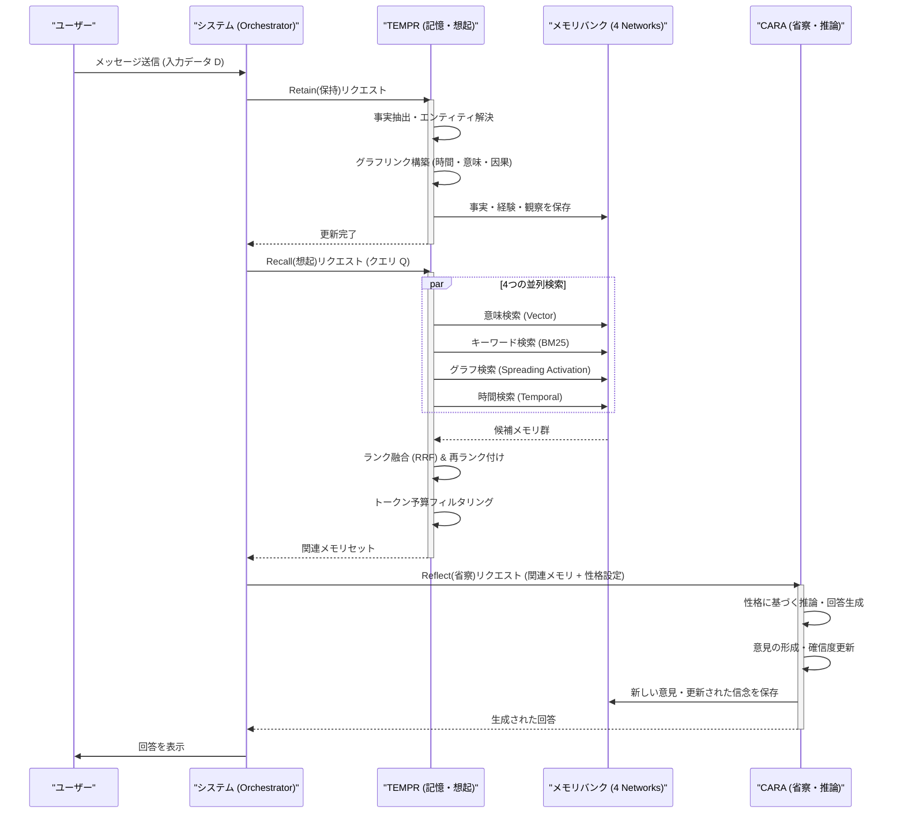
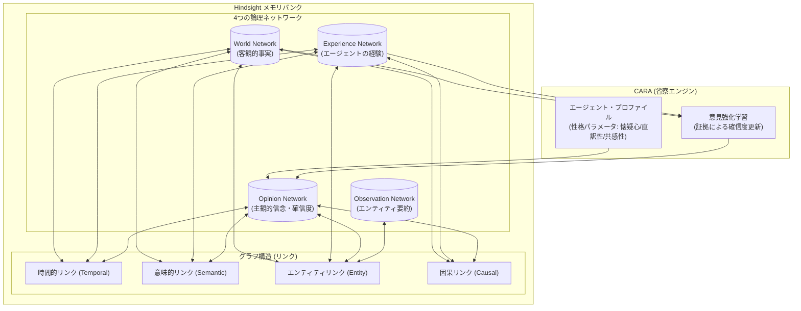
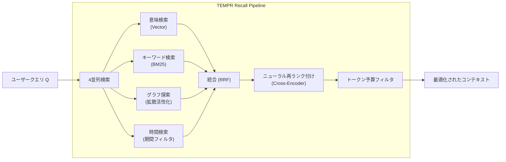

###### Created: 
2026-02-01 15:01 
###### Tag: 
#paper
###### url_01:
https://arxiv.org/abs/2512.12818 
###### url_02: 

###### memo: 

---

<!-- paper_extractor:summary:start -->

プロフェッショナルな視点から、この論文「Hindsight is 20/20: Building Agent Memory that Retains, Recalls, and Reflects」の解説と評価を行います。

---

# One line and three points
従来の検索拡張生成（RAG）を超え、事実と意見を区別し、エージェントが「過去を振り返り（Reflect）」ながら一貫した人格と推論を形成する新しいメモリ・アーキテクチャ「Hindsight」の提案。

1.  **4つの論理ネットワーク構造**：メモリを「世界の事実」「経験」「意見（信念）」「観察（要約）」の4つに分離し、客観的事実と主観的信念を構造的に区別することで認識論的な明確さを実現しています。
2.  **3つのコア操作（Retain, Recall, Reflect）**：時系列・エンティティグラフを構築する**TEMPR**と、性格特性に基づき意見を形成・更新する**CARA**という2つの主要コンポーネントで、記憶の保持・想起・省察を実装しています。
3.  **圧倒的なベンチマーク性能**：小規模なオープンソースモデル（20B）を用いながら、完全なコンテキストを与えられたGPT-4oなどのフロンティアモデルを上回る長期記憶性能（LongMemEvalで83.6% vs 60.2%）を達成しました。

# Summary
本論文は、大規模言語モデル（LLM）ベースのエージェントにおける「記憶」の課題を解決するための新しいアーキテクチャ「Hindsight（ハインドサイト）」を提案しています。既存のシステムは、会話の断片をベクトルデータベースに保存し、単に類似度で検索（Retreival）するだけの「外付けハードディスク」のような扱いであり、エージェントが長期にわたって一貫した信念を持ったり、事実と推論を区別したりすることが困難でした。

Hindsightは、エージェントのメモリを単なるテキストの保存場所ではなく、推論のための第一級の基盤として扱います。具体的には、メモリを「世界（事実）」「経験（自伝）」「意見（信念）」「観察（要約）」の4つのネットワークに分割し、時間的・意味的・因果的なリンクを持つグラフとして管理します。

システムは**TEMPR**（記憶と想起を担当）と**CARA**（省察と推論を担当）という2つのモジュールで構成されます。これにより、エージェントは過去の膨大な対話から必要な情報を正確に引き出すだけでなく、自身の性格設定（懐疑心や共感性など）に基づいて「意見」を形成し、新たな証拠に基づいてその確信度を更新（学習）していくことが可能になります。実験の結果、Hindsightは長期記憶ベンチマークにおいて、はるかにパラメータ数の多いモデルを用いたベースラインを凌駕する性能を示しました。

# Briefing
本研究は、AIエージェントを単なる「質問応答マシーン」から、長期的なパートナーとして機能させるための重要なブレークスルーを提示しています。以下にその技術的核心を詳述します。

### 1. 認識論的明確さを持つメモリ構造
従来の手法（MemGPTやZepなど）の多くは、事実も幻覚もユーザーの意見もすべて「コンテキスト」として一括りに扱っていました。Hindsightの最大の特徴は、メモリバンクを以下の4つの論理ネットワークに明確に分離した点です。
*   **World（世界）**: 客観的な外部事実（例：「Pythonはプログラミング言語である」）。
*   **Experience（経験）**: エージェント自身の行動や履歴（例：「私はユーザーにPythonを推奨した」）。
*   **Opinion（意見）**: エージェントの主観的判断と確信度（例：「Pythonはデータ科学に最適だ（確信度0.8）」）。
*   **Observation（観察）**: エンティティに関する客観的な要約プロフィール。

これにより、エージェントは「事実」と「自分が信じていること」を混同せず、透明性の高い推論が可能になります。

### 2. TEMPR：時系列とエンティティを考慮した保持と想起
TEMPR（Temporal Entity Memory Priming Retrieval）コンポーネントは、**Retain（保持）**と**Recall（想起）**を担当します。
*   **Retain**: 会話ログを単に保存するのではなく、LLMを用いて「ナラティブな事実」に変換し、時間情報（いつ起きたか）、エンティティ（誰/何についてか）、因果関係を抽出してグラフ構造に組み込みます。
*   **Recall**: 単純なベクトル検索だけでなく、以下の4つの戦略を並列実行し、Reciprocal Rank Fusion (RRF)で統合します。
    1.  **意味検索**: ベクトル類似度による検索。
    2.  **キーワード検索**: BM25を用いた固有名詞等の検索。
    3.  **グラフ検索**: エンティティや因果関係を辿るマルチホップ検索。
    4.  **時間検索**: 「先週」「3月」といった時間的制約に基づく検索。

これにより、トークン予算（コンテキストウィンドウ）の制約内で、最も関連性の高い情報を多角的に収集します。

### 3. CARA：性格特性に基づく省察と意見の進化
CARA（Coherent Adaptive Reasoning Agents）は、**Reflect（省察）**を担当します。従来のRAGでは、回答はその場のプロンプトに依存していましたが、CARAはエージェントに永続的な「性格（Disposition）」を与えます。
*   **パラメータ化された性格**: 懐疑心（Skepticism）、直訳性（Literalism）、共感性（Empathy）などのパラメータを設定し、これに基づいて情報の解釈や回答のトーンを調整します。
*   **意見の強化（Reinforcement）**: 新しい事実が入力された際、既存の「意見」を再評価し、確信度（Confidence Score）を上げたり下げたりします。これにより、エージェントは頑固になりすぎず、かつ一貫性を持って「考えを変える」ことができます。

### 4. 圧倒的なコストパフォーマンス
特筆すべきは、これらの仕組みを導入することで、20B（200億パラメータ）程度の比較的小規模なオープンソースモデルでも、GPT-4oのような巨大モデルを用いたフルコンテキスト（全履歴入力）手法を上回る精度を出した点です。これは、モデルの巨大化のみに頼らずとも、メモリ構造の設計次第でAIの能力を劇的に向上できることを示唆しています。

# FAQ

**Q1: 従来のRAG（検索拡張生成）と何が決定的に違うのですか？**
A1: 最大の違いは「構造化」と「動的な信念管理」です。従来のRAGはテキストの断片を検索して貼り付けるだけですが、Hindsightは情報を「事実・経験・意見」に分類し、それらを時間や因果関係で結びつけます。また、単に情報を検索するだけでなく、過去の情報に基づいて自身の「意見」を更新していく機能を持っています。

**Q2: エージェントの「意見」が変わるというのはどういうことですか？**
A2: 例えば、「Pythonは最高だ」という意見を持っていたエージェントに対し、ユーザーが「Rustの方がメモリ効率が良い」という事実を提示し続けたとします。CARAの仕組みにより、エージェントは「Pythonは最高だ」という意見の確信度を下げたり、「用途によってはRustが良い」という新しい意見を形成したりします。これが数値（確信度スコア）として管理・更新されます。

**Q3: 処理コストや遅延は大きくないのですか？**
A3: 論文では、このシステムが単一のハイエンド消費者向けGPUで動作する20Bモデルで高精度を達成したとしています。グラフ構築や意見更新などの複雑な処理はバックグラウンドで行う設計になっており、推論時の遅延を抑えつつ、巨大モデルを使うよりもトータルコストを抑えられる可能性があります。

**Q4: どのようなアプリケーションに向いていますか？**
A4: 長期間にわたってユーザーと関わるコンパニオンAI、メンタルヘルスサポート、長期プロジェクトを支援するアシスタント、あるいはプレイヤーの行動を記憶して態度を変えるゲームNPCなどに最適です。単発のQ&Aタスクにはオーバースペックかもしれません。

# Critical Assessment（批判的評価）

**方法論の妥当性：**
実験設計は堅牢です。LongMemEvalとLoCoMoという、長期記憶と文脈理解を問う難易度の高いベンチマークを採用しており、ベースライン（Full-context GPT-4oや既存のメモリシステムZep, MemGPT等）との比較も公平に行われています。特に、同じバックボーンモデル（OSS-20B）で、メモリ機構の有無による性能差を検証している点（アブレーションスタディ的な側面）は、提案手法の有効性を強く支持しています。ただし、グラフ構築や事実抽出の品質がLLMの性能に依存するため、抽出エラーが蓄積した場合の長期的な悪影響についてはより深い検証が必要です。

**エビデンスの強度：**
主張は強力な定量的証拠によって裏付けられています。特に、パラメータ数が一桁少ないモデルでSOTA（State-of-the-Art）級のモデルを上回った結果は、アーキテクチャの優位性を強く示しています。本論文はプレプリント（arXiv）段階ですが、コードとベンチマーク結果のビューワーが公開されており、再現性と透明性は高いと言えます。

**実用化への考慮：**
実環境での適用にはいくつかの課題が残ります。第一に、複雑なグラフ構造と4つのネットワークを維持・管理する計算コストとストレージコストです。第二に、並列検索（Recall）と省察（Reflect）のパイプラインは、単純なRAGに比べてレイテンシが増加する可能性があります。第三に、意見の形成・更新プロセス（CARA）の調整（パラメータチューニング）が、アプリケーションごとの「望ましい挙動」に合わせるために試行錯誤を要する可能性があります。

# For easy understanding
この論文の凄さは、「AIに人間のような『整理された記憶』と『性格』を与えた」点にあります。

想像してみてください。今の一般的なAIチャットボットは、**「超優秀だけど、記憶喪失の教授」**のようなものです。話している間は賢いですが、以前の会話の内容は「検索キーワード」で本棚から適当なページを引っ張り出してくるような思い出し方しかできません。「前に話したあれ、どう思う？」と聞いても、文脈を深く理解して答えるのは苦手です。

この論文の「Hindsight」というシステムは、AIを**「几帳面な司書であり、かつ信念を持ったパートナー」**に変えます。

1.  **情報の整理整頓（司書）**:
    *   ただ会話を保存するのではなく、「これは客観的な事実」「これは君との思い出」「これは私の意見」と、4つの引き出しにきっちり分けて整理します。
    *   「いつ」「誰が」「なぜ」その話をしたのかも、ラベルを貼って管理します。

2.  **性格と信念（パートナー）**:
    *   このAIには「疑り深さ」や「共感度」といった性格を設定できます。
    *   新しい情報を聞いたとき、ただ鵜呑みにするのではなく、自分の性格と過去の記憶に照らし合わせて、「なるほど、私の考えを少し変えよう」とか「いや、それは前の情報と矛盾するぞ」といった判断（省察）を行います。

**つまりこういうことです：**
これまでのAIは「大量の資料を毎回読み直して答える」スタイルでしたが、Hindsightを持つAIは「以前の出来事を踏まえて、自分の考えを持ち、あなたとの関係性を積み重ねていく」ことができるようになります。これにより、長く付き合えば付き合うほど、あなたを深く理解する「相棒」のようなAIが作れるようになるのです。

# Mermaid Diagrams

## システムアーキテクチャと処理フロー（Sequence Diagram）

## メモリ構造概念図（Concept Diagram）

## 検索（Recall）プロセスのフローチャート

<!-- paper_extractor:summary:end -->