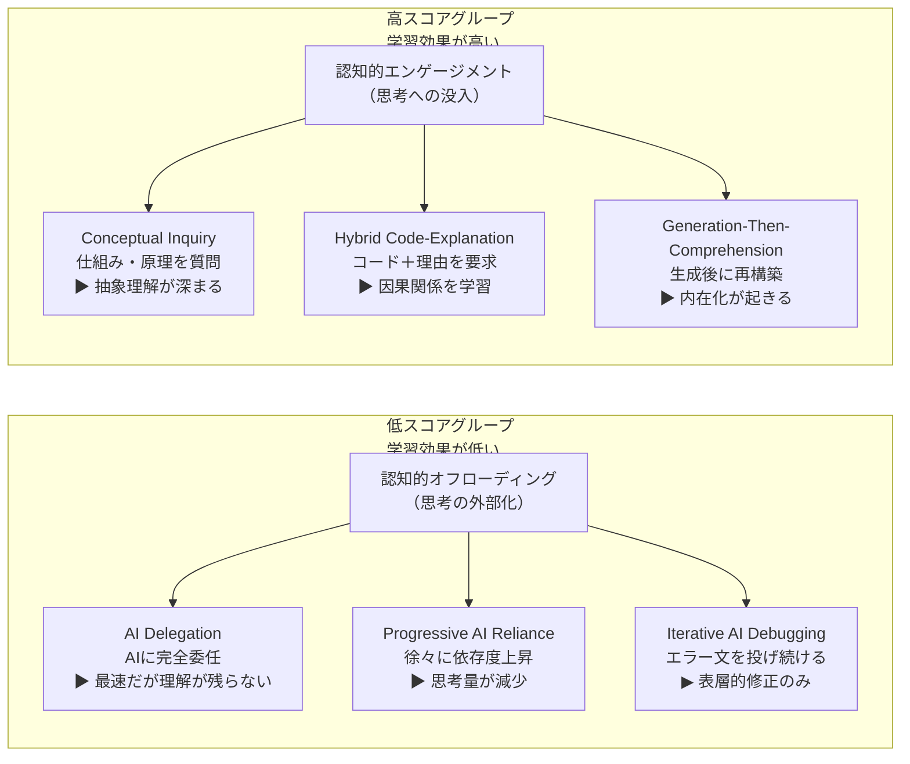
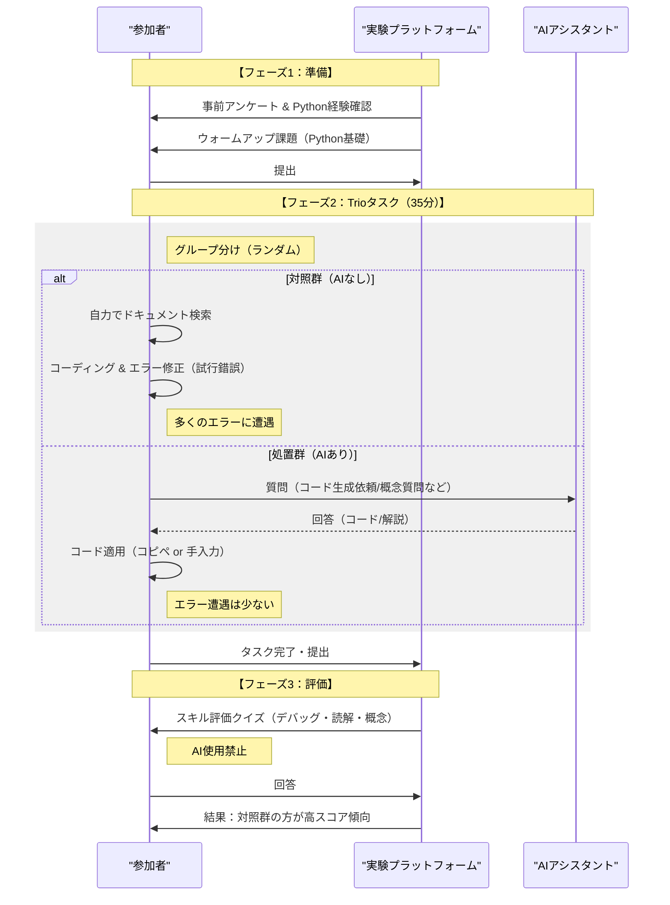
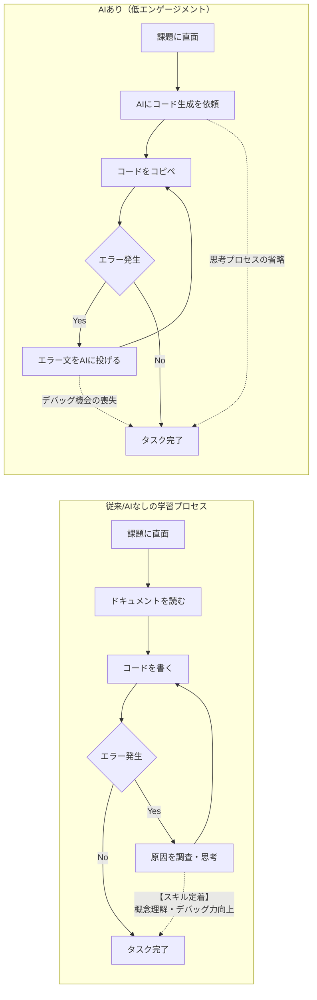

###### Created: 
2026-02-02 18:10 
###### Tag: 
#paper
###### url_01:
https://arxiv.org/abs/2601.20245 
###### url_02: 

###### memo: 


---

<!-- paper_extractor:summary:start -->

本論文は、Anthropicの研究者らによる、AIコーディングアシスタントが新しいスキルの習得（スキル形成）にどのような影響を与えるかを検証したランダム化比較試験（RCT）の結果をまとめたものです。

以下に、ご要望の形式でサマリー、詳細ブリーフィング、解説、図表を出力します。

***

# One line and three points
新しいプログラミング技術の習得において、AIアシスタントの利用は<span style="color:rgb(255, 192, 0)">「概念理解」や「デバッグ能力」の形成を阻害する傾向がある</span>が、使用者の対話パターンによって学習効果は大きく異なる。

1.  **スキル習得の低下：** 未知のライブラリ（Trio）を学習する際、AIを使用したグループは使用しなかったグループに比べ、その後のスキル評価テストのスコアが平均17%低下した（特にデバッグ能力）。
2.  **生産性のパラドックス：** AIを使用しても、プロンプト作成や対話に時間が割かれるため、タスク完了までの総時間は平均して統計的に有意な短縮が見られなかった。
3.  **対話パターンの重要性：** ユーザーのAI利用パターンを6つに分類した結果、「丸投げ」ではなく<span style="color:rgb(255, 192, 0)">「概念的な質問」や「解説要求」を行う高認知負荷のパターンであれば、AIを使っても学習効果が損なわれない</span>ことが判明した。


# Summary
本研究は、ソフトウェアエンジニア（特に経験の浅い層）が新しい技術を学ぶ際、AIアシスタント（GPT-4oベース）の使用がスキル形成に及ぼす影響を調査しました。52名の経験豊富なPythonプログラマーを対象に、彼らにとって未知の非同期通信ライブラリ「Trio」を用いたタスクを行わせた結果、AIの使用はタスク完了後の理解度テスト（概念、コード読解、デバッグ）のスコアを有意に低下させることが明らかになりました。

特筆すべきは、AIによるコード生成機能を利用することで、エラーに遭遇し自力で解決する「試行錯誤」のプロセスが省略され、これがデバッグスキルの欠如に直結している点です。また、生産性（速度）に関しても、AIへの指示出し（プロンプトエンジニアリング）に多くの時間を費やす参加者がいたため、全体平均としての時短効果は確認されませんでした。しかし、AIに対して「コード生成」ではなく「概念的な説明」を求めるなど、能動的に学習に関与した参加者は、高いスキル習得度を維持していました。

# Briefing
本論文の核心的な発見と、実験から得られた詳細な知見を以下に体系化します。

## 1. 研究の背景と動機
AIによる生産性向上に関する研究は多いものの、**「AIを利用してタスクを遂行するプロセスが、人間の学習やスキル獲得にどう影響するか」**についての研究は不足していました。特にエンジニアリングにおいて、将来的にAIが生成したコードを人間が監督（supervise）する必要がある場合、人間側に十分な理解とデバッグ能力が残っていないと、安全性に関わる重大なリスクとなります。

## 2. 実験デザイン：未知の領域への挑戦
*   **対象:** Python経験はあるが、非同期ライブラリ「Trio」は未経験のエンジニア52名。
*   **比較:** 「AIアシスタントあり（処置群）」と「AIなし（対照群）」の2グループにランダム割り当て。
*   **タスク:** Trioを用いた2つのコーディング課題。
*   **評価:** タスク完了直後に、Trioの概念理解、コード読解、デバッグ能力を問うクイズを実施。

## 3. 主要な定量的結果
*   **スキルスコアの低下:** AIありグループは、AIなしグループに比べてクイズの正答率が約17%低くなりました。特に「デバッグ問題」での差が顕著でした。
*   **完了時間のばらつき:** AIありグループの方がタスク完了が速い傾向はありましたが、統計的有意差はありませんでした。これは、AIへの質問作成に全体の30%以上の時間を費やす参加者がいたためです。
*   **アクティブコーディング時間の減少:** AIありグループは、実際にコードを書く時間が短く、AIの出力待ちや対話に多くの時間を費やしました。

## 4. 定性的分析：6つのAIインタラクション・ペルソナ
研究チームは画面録画を分析し、AIの利用方法を6つのパターンに分類しました。これは本研究の最も重要な発見の一つです。

### 低スコアグループ（学習効果が低いパターン）
これらは「認知的オフローディング（思考の外部化）」に依存しすぎているパターンです。
1.  **AI Delegation（AIへの丸投げ）:** コード作成を完全にAIに任せる。最も早いが、理解度は最低レベル。
2.  **Progressive AI Reliance（段階的な依存）:** 最初は自力で試みるが、徐々にAIに全権を委ねるようになる。
3.  **Iterative AI Debugging（反復的デバッグ依存）:** 理解せずにとりあえずエラー文をAIに投げ続け、修正を繰り返す。時間はかかるが学習効果は低い。

### 高スコアグループ（学習効果が高いパターン）
これらは「認知的エンゲージメント（思考への没入）」を維持しているパターンです。
1.  **Conceptual Inquiry（概念的探究）:** コード生成を依頼せず、「この関数の仕組みは？」といった概念的な質問のみを行う。
2.  **Hybrid Code-Explanation（ハイブリッド解説）:** コード生成と同時に「なぜそうなるのか」の解説を求める。
3.  **Generation-Then-Comprehension（生成後の理解）:** AIにコードを書かせた後、それをコピペするのではなく手入力したり、内容について深掘りの質問をして理解に努める。



## 5. エラーと学習の関係
AIなしグループはAIありグループに比べ、中央値で3倍多くのエラーに遭遇していました。しかし、この「エラーに直面し、それを解決する苦痛なプロセス」こそが、ライブラリ特有の概念（Trioの場合は`await`や`nursery`の挙動）を深く理解するために不可欠であることが示唆されました。AIはエラーを未然に防いでしまうため、この学習機会を奪っている可能性があります。

# FAQ

**Q1: AIを使えば仕事は速くなるので、学習効率が落ちても問題ないのでは？**
A1: 短期的なタスク完了には有効かもしれませんが、長期的にはリスクがあります。特に、AIが生成したコードの誤りを検知・修正（デバッグ）する能力が育たないため、将来的にAIの監督者としての役割を果たせなくなる「スキル空洞化」の恐れがあります。

**Q2: すべてのAI利用が悪影響を及ぼすのですか？**
A2: いいえ。研究では「高スコアグループ」の存在が確認されています。単にコードを書かせるのではなく、概念を質問したり、生成されたコードの解説を求めたりするなど、能動的に思考する使い方をすれば、学習効果を損なわずに済みます。

**Q3: なぜAIを使ったのにタスク完了時間が大幅に短縮されなかったのですか？**
A3: 「インタラクション・コスト」が原因です。参加者の中には、AIへの適切な指示（プロンプト）を考えるのに数分を費やしたり、AIとの対話を繰り返したりするケースが見られました。単純なコーディング作業であれば、熟練者は自分で書いたほうが速い場合もあります。

**Q4: この研究の限界は？**
A4: 実験時間が約1時間と短く、長期的なスキル定着までは測定できていません。また、被験者はクラウドソーシングで集められたエンジニアであり、実際の業務環境（同僚からのフィードバックがある等）とは異なる可能性があります。

# Critical Assessment（批判的評価）

**方法論の妥当性：**
ランダム化比較試験（RCT）を採用し、事前調査でPythonスキルを統制している点は堅牢である。タスク選定において、既存知識の影響を受けにくいマイナーなライブラリ（Trio）を選んだ設計も秀逸である。ただし、サンプルサイズが52名とやや小規模であり、特に6つのペルソナ分析における各サブグループの人数が一桁となるため、統計的な一般化には慎重さを要する。

**エビデンスの強度：**
スキルスコアの低下に関するエビデンスは強力であり、効果量（Cohen's d=0.738）も大きい。スクリーンレコーディングの定性分析による「対話パターンの分類」は、単なるスコア比較以上の深い洞察を提供している。本論文はプレプリント（arXiv）であるが、Anthropicの研究者によるものであり、実験設計の透明性は高い。

**実用化への考慮：**
企業研修やオンボーディングにおいて極めて重要な示唆を含んでいる。AIツールの導入が新人のスキル習得を阻害する可能性を示しているが、実環境では「締め切り圧」により、学習よりも完了を優先せざるを得ない場合が多い。AI利用を禁止するのではなく、「どのように使うか（How）」のガイドライン策定や、意図的な「AIなし」の学習時間を設けるなどの教育的介入が必要であることを示唆している。

# For easy understanding
この論文の内容を、車の運転とGPS（カーナビ）の関係に例えて説明しましょう。

想像してみてください。あなたは初めて訪れる複雑な街で、目的地まで運転しなければなりません。
*   **AIを使わないグループ**は、紙の地図を見ながら、時には道に迷い（エラー）、Uターンしながら目的地を目指しました。大変でしたが、その過程で「あの角に郵便局がある」「ここの一角は一方通行だ」という**街の構造（スキル・概念）**を深く理解しました。
*   **AIを使ったグループ**は、最新の全自動ナビを使いました。「右に曲がってください」という指示に従うだけで、スムーズに目的地に着けることもありました（たまにナビの設定に時間がかかりましたが）。しかし、彼らは指示通りにハンドルを切っただけなので、**街の構造はほとんど頭に残りませんでした。**

この論文が警告しているのは、「ナビに頼りすぎると、万が一ナビが故障したときや、ナビが嘘をついたときに、自分で家に帰れなくなるよ（デバッグできなくなるよ）」ということです。
しかし、希望もあります。ナビに対して「なぜこのルートを選んだの？」「この辺りの地理はどうなっているの？」と質問しながら運転した人たちは、ナビを使いながらもしっかりと道を覚えることができました。

つまり、**「AIに使われるな、AIと対話して学べ」**というのが、この研究の最大のメッセージです。

# Mermaid Diagrams

## タイムライン・シーケンス図：実験の流れと分岐


## 関係図・相関図：AIインタラクションパターンと学習効果
```mermaid
flowchart TD
    subgraph "AIインタラクションの6つのパターン"
        Direction TB
        
        subgraph "低スコア・低学習効果"
            P1["AIへの丸投げ<br>(AI Delegation)"]
            P2["段階的な依存<br>(Progressive Reliance)"]
            P3["反復的デバッグ依存<br>(Iterative Debugging)"]
        end

        subgraph "高スコア・高学習効果"
            P4["生成後の理解・確認<br>(Generation-Then-Comprehension)"]
            P5["ハイブリッド解説要求<br>(Hybrid Code-Explanation)"]
            P6["概念的探究<br>(Conceptual Inquiry)"]
        end
    end

    Input["ユーザーの認知姿勢"]
    Result["スキル習得度<br>(クイズスコア)"]

    Input -->|"認知的オフロード<br>(思考の放棄)"| P1
    Input -->|"認知的オフロード<br>(思考の放棄)"| P2
    Input -->|"認知的オフロード<br>(思考の放棄)"| P3

    Input -->|"認知的エンゲージメント<br>(思考への没入)"| P4
    Input -->|"認知的エンゲージメント<br>(思考への没入)"| P5
    Input -->|"認知的エンゲージメント<br>(思考への没入)"| P6

    P1 & P2 & P3 -->|"低い (約25-40%)"| Result
    P4 & P5 & P6 -->|"高い (約65-85%)"| Result

    Note["重要: AIを使っても<br>『どう使うか』で結果は逆転する"]
```

## フローチャート・プロセス図：スキル形成のメカニズム


<!-- paper_extractor:summary:end -->