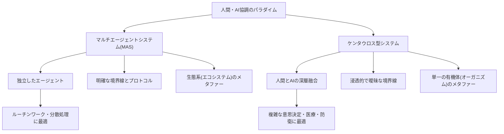
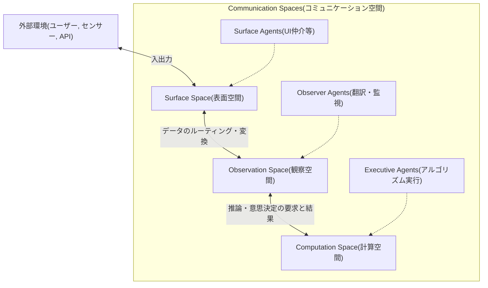
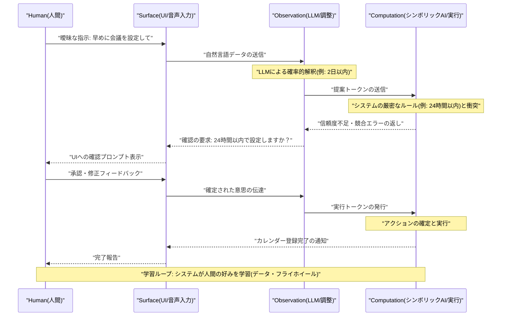

###### Created: 
{{date}} {{time}} 
###### Tag: 
#paper
###### url_01:
[Frontiers \| Human-artificial interaction in the age of agentic AI: a system-theoretical approach](https://www.frontiersin.org/journals/human-dynamics/articles/10.3389/fhumd.2025.1579166/full)
###### url_02: 

###### memo: 

---
本論文の包括的な解説を以下にまとめました。

# One line and three points
エージェンティックAI時代における人間とAIの協調関係を、「マルチエージェント型（独立協調）」と「ケンタウロス型（深層融合）」の2つのパラダイムを統合する「コミュニケーション空間」という新たなモデルを用い、ペトリネットによって数学的かつ視覚的に定式化した研究。

1. **2つの対照的なパラダイムの提示：** 人間とAIの関係を、明確な境界を保ちながら協力する「生態系」のようなマルチエージェントシステム（MAS）と、境界が曖昧になり一体の生物のように機能する「ケンタウロス型システム」として整理した。
2. **コミュニケーション空間の3層アーキテクチャ：** 複雑な相互作用を管理するため、システムを「表面（Surface）」「観察（Observation）」「計算（Computation）」の3つの空間に分割し、異種エージェント間の柔軟な連携を可能にした。
3. **カラーペトリネット（CPN）による厳密な定式化：** 人間、AI、物理デバイス（ロボット等）が発する異なるデータ形式やプロトコルを、状態と型を持つトークンとして処理するCPNを用いることで、システムの透明性と説明責任（監査可能性）を担保しつつハイブリッド知能を設計する手法を確立した。

---

# Summary

本論文『Human-artificial interaction in the age of agentic AI: a system-theoretical approach（エージェンティックAI時代における人間-人工物インタラクション：システム理論的アプローチ）』（2025年5月発行、査読済み）は、大規模言語モデル（LLM）や大規模アクションモデル（LAM）に代表される自律的な「エージェンティックAI」の台頭により、人間とコンピューターの相互作用（HCI）がどのように再定義されるべきかを論じています。

従来、システムは人間を単なる「ユーザー」として扱うか、機能の限定されたエージェントの集合体に過ぎませんでした。しかし著者は、人間も一つの高度なエージェントとしてシステムに組み込まれる複雑なネットワークエコシステムを想定しています。本研究の核心は、独立したエージェント同士が協調する「マルチエージェントシステム（MAS）」と、人間とAIが認知的に深く融合する「ケンタウロス型システム」という、背反する2つのパラダイムを両立させる理論的フレームワーク「コミュニケーション空間（Communication Spaces）」を構築した点にあります。

このフレームワークは、人間からの自然言語、AIからの構造化データ、ロボットからのセンサー情報といった非対称なやり取りを、「表面・観察・計算」という3層の空間レイヤーで処理します。さらに、並行処理や状態遷移を厳密に記述できる数学的モデル「カラーペトリネット（Colored Petri Nets）」を採用することで、システムの振る舞いを明確に可視化し、設計の青写真および分析のレンズを提供しています。論文後半では「衛星・群ロボットの制御」と「LAM（Rabbit API）によるユーザー予測」の2つのユースケースを通じて、このフレームワークが自律性と深層統合をどのようにシームレスに切り替え、次世代のハイブリッド知能を支えるかを実証しています。

---

# Briefing

本研究は、理論的基盤、アーキテクチャの提案、数学的定式化、そして実践的なユースケースの4つの柱で構成されています。以下に詳細を解説します。

## 1. 背景とパラダイムの整理：MASとケンタウロス
自律的な計画立案や学習が可能な「エージェンティックAI」の発展により、HCIは従来の「ユーザーと道具」という関係から「エージェント間の動的な協調」へと進化しました。著者はこれを、生命システム理論（Living systems theory）に基づいて2つのパラダイムに分類しています。
*   **マルチエージェントシステム（MAS）：** 
    自然界の「生態系（エコシステム）」に例えられます。人間やAIはそれぞれ独立したアイデンティティ（明確な境界）を保ち、決められたプロトコルに従って協調します。分散型でレジリエンスが高いのが特徴です。
*   **ケンタウロス型システム：** 
    一つの「有機体（オーガニズム）」に例えられます。人間の直感や意思決定能力と、AIの計算・分析能力が継ぎ目なく融合（シンビオシス）し、新しい複合的なアイデンティティを形成します。境界は浸透的であり、高度な適応力を持ちます。

## 2. 統合フレームワーク「コミュニケーション空間」
MASの「境界の保持」と、ケンタウロスの「深層融合」という相反する要求を一つのシステム内で満たすため、著者はHCIを3つの「コミュニケーション空間」に階層化するモデルを提唱しました。
*   **表面空間（Surface space）：** 外部環境（ユーザーインターフェース、センサー、API）とのすべての接点を調停します。
*   **観察空間（Observation space）：** 表面と内部処理を橋渡しする空間です。メッセージの変換、ルーティング、フィードバックの継続的なループ処理を担い、人間とAIの認知のズレを調整します。
*   **計算空間（Computation space）：** システムの「コア」であり、実際の意思決定、リソースの割り当て、最終的な出力の生成（アルゴリズムの実行など）を行います。

## 3. カラーペトリネット（CPN）による数学的定式化
エージェント間の並行処理、非同期通信、異なるデータ形式を厳密に扱うため、グラフ理論ベースのフレームワークではなく「カラーペトリネット（CPN）」を採用しています。
ペトリネットは「プレース（場所）」「トランジション（処理）」「トークン（データ）」で構成されます。CPNではトークンに「色（データ型）」を持たせることができるため、「人間のテキストコマンド」と「ドローンのセンサーデータ」といった異種エージェントの要求を条件分岐（ガード機能）で制御できます。これにより、特定の条件下（例：LLMの計画と人間の承認の両方のトークンが揃った時のみ実行）でのみ処理を進めるなど、ケンタウロス型の協調を数学的に保証し、高度な倫理的要件（監査可能性と説明責任）を満たすことが可能になります。

## 4. ユースケースによる検証
本論文では、フレームワークの有効性を2つのケースで示しています。
*   **ユースケース1：衛星と群ロボット（MAS寄りのハイブリッド）**
    人間、LLM、衛星制御ユニット、ロボット群がそれぞれ独立したエージェントとして機能します。LLMが経路最適化などを独立して提案する段階では「MASモード」として働き、その提案を人間がレビューし即座にシステムに反映させる意思決定の瞬間には「ケンタウロスモード」へと動的に移行します。
*   **ユースケース2：大規模アクションモデル（LAM）（ケンタウロス寄りのハイブリッド）**
    Rabbit Tech社のLAMを例に挙げています。人間の曖昧な自然言語による指示を、LLM（確率的推論）とシンボリックAI（確定的ルール）の統合によって処理します。システムは人間のフィードバックから継続的に学習し（データ・フライホイール効果）、人間とAIの境界が溶け合うような一体化した意思決定エンティティを形成します。

## 5. 結論と今後の展望
このアーキテクチャは、システムフロントエンド（ユーザビリティ）とバックエンド（堅牢性）を統合する設計パラダイムです。今後の課題として、ペトリネットの「静的な構造」を克服し、エージェントが動的に参加・離脱できるような高レベルの再構成可能ネットワークの開発や、集合論的アプローチの統合が挙げられています。

---

# FAQ

**Q1: 「エージェンティックAI」とは従来のAIとどう違うのですか？**
A: 従来のAI（一問一答式のチャットボットなど）が受動的であるのに対し、エージェンティックAIは「認識、推論、行動、学習」のサイクルを自律的に回すことができます。複雑な問題を自ら複数のステップに分解し、ツールの使用や反復的な計画立案を行いながら目標を達成する能力を持っています。

**Q2: 「ケンタウロス型システム」という名前の由来は何ですか？**
A: 神話に登場する半人半馬のケンタウロスに由来します。チェスの世界などで、人間（直感や戦略的思考）とコンピューター（膨大な計算力）がチームを組んで戦うスタイルを「ケンタウロス」と呼んだことが起源です。本論文では、人間とAIの境界が曖昧になり、ひとつの生命体のように融合して機能するシステムを指します。

**Q3: なぜ「ペトリネット」という古い数学モデルを最新のAIシステムに使うのですか？**
A: 複数のAIや人間が同時にバラバラに動く（並行処理）システムにおいて、データの流れや処理のタイミング（同期）の矛盾を防ぐためです。ペトリネットは並行処理を視覚的に分かりやすく表現しつつ、数学的な厳密性を持つため、医療や軍事、金融など「誰が（AIか人間か）いつその決定を下したのか」という監査証跡（トレーサビリティ）が不可欠な領域でのシステム設計に極めて適しているからです。

**Q4: MASとケンタウロス型はどちらが優れているのですか？**
A: どちらが優れているというものではなく、目的に応じて使い分ける（あるいは組み合わせる）べきものです。ルーチンワークや分散システムには独立性が高く障害に強いMASが適しており、高度な専門知識が必要な医療診断や複雑な意思決定には、人間とAIが深く連携するケンタウロス型が適しています。

---

# Critical Assessment（批判的評価）

**方法論の妥当性：**
複雑な人間とAIのインタラクションを整理するため、概念的な階層（コミュニケーション空間）と厳密な数学的基盤（カラーペトリネット）を組み合わせたアプローチは非常に強力かつ論理的です。一方で、ペトリネットの構造は静的であるため、オープンな環境でエージェントが動的に頻繁に参加・離脱するような流動性の高いシステムのモデリングには制約があり、今後の拡張（動的再構成）に課題を残しています。

**エビデンスの強度：**
本研究は*Frontiers in Human Dynamics*誌（2025年5月発行）に掲載された査読済みの論文です。主張の根拠は、理論的な数学的モデリングと既存システム（群ロボット制御やRabbit API）への概念的マッピングに依存しており、人間を対象とした定量的・統計的な被験者実験に基づくエビデンス（例：本フレームワークを用いた場合のタスク完了時間やエラー率の改善データ）は提示されていません。したがって、理論的妥当性は高いものの、実環境での一般化可能性の証明は今後の実証研究を待つ必要があります。

**実用化への考慮：**
ハイリスクな領域（医療・防衛等）におけるAIの透明性と監査可能性（説明責任）を設計段階から担保できる点は、実社会の法規制（EU AI法など）の動向と合致しており極めて実用的です。しかし、理論上の「空間」を実際のソフトウェアアーキテクチャやクラウドインフラ上のメッセージングプロトコル（非同期通信やリソース割り当て）として実装する際の、計算負荷やレイテンシの増大といったエンジニアリング上の課題への言及は限定的です。

---

# For easy understanding

本論文が伝えたいことを、専門用語を使わずに分かりやすく解説します。

**「AIを道具として使う」から、「AIと一緒にチームを組む」時代へ**
これまで、私たちはパソコンやAIを「便利な道具」として使ってきました。しかし、自分で考えて行動できる「エージェンティックAI」の登場により、AIは単なる道具ではなく「優秀な同僚」になりつつあります。この論文は、**「人間とAIが混ざり合ったチームを、どうやって上手くまとめるか？」**というルール作り（設計図）を提案したものです。

**2つのチームワークの形**
著者は、人間とAIの働き方を2つのパターンに分けています。
1.  **フリーランスの集まり（マルチエージェント型）：** 
    それぞれが独立して自分の仕事を持ち、必要な時だけ報告し合って協力するスタイルです。お互いの境界線がはっきりしています。
2.  **二人三脚・サイボーグ（ケンタウロス型）：** 
    人間とAIがぴったりとくっつき、一つの生き物のように動くスタイルです。人間の「直感」とAIの「計算力」が溶け合い、どこまでが人間でどこからがAIの考えかわからないほど深く結びつきます。

**レストランに例える「コミュニケーション空間」**
この2つの働き方を上手く混ぜ合わせるため、論文ではシステムを「3つの空間」に整理することを提案しています。これをレストランに例えてみましょう。
*   **表面空間（ホール）：** お客さん（人間や外部環境）と直接やり取りする場所です。メニュー（画面）を見せたり、注文（指示）を受け取ります。
*   **観察空間（キッチンの受け渡し口）：** ホールとキッチンをつなぐ場所です。お客さんの曖昧な注文（例：「適当に辛くして」）を、シェフが分かるレシピの形に翻訳したり、料理の進行状況を確認したりします。人間とAIのズレを調整する大事な場所です。
*   **計算空間（キッチン）：** 実際にAIのアルゴリズムや計算処理が激しく動き、答え（料理）を作り出すコアな場所です。

**つまりこういうことです**
「人間とAIが一緒に働くシステムを作る時、なんとなく繋ぐのではなく、この『3つの空間』という整理箱を使い、さらに工場のベルトコンベアの設計図のような数学的ルール（ペトリネット）で情報の流れをカッチリ決めましょう」というのがこの論文の主張です。そうすることで、「最終的に人間の確認をとらないとAIが勝手に暴走しない」ような安全なシステムを作ることができ、かつ、人間とAIが最高のパフォーマンスを出す「ハイブリッドチーム」を実現できるのです。

---

# Mermaid Diagrams

以下に、論文の概念とアーキテクチャを視覚化するMermaid図表を提示します。

## 概念図・構造図
人間とAIの協調における「マルチエージェント型」と「ケンタウロス型」のパラダイムの違いを図示します。

## フローチャート・プロセス図
論文で提唱されている「コミュニケーション空間」の3層アーキテクチャと情報の流れを図示します。

## タイムライン・シーケンス図
論文内の「ユースケース2：大規模アクションモデル（LAM）」における、曖昧な指示を人間とAIが協調して解決するプロセス（フィードバックループ）をシーケンス図で示します。

