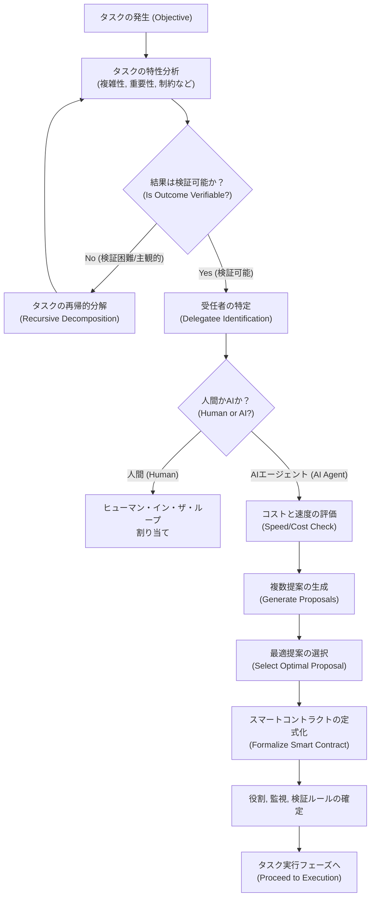
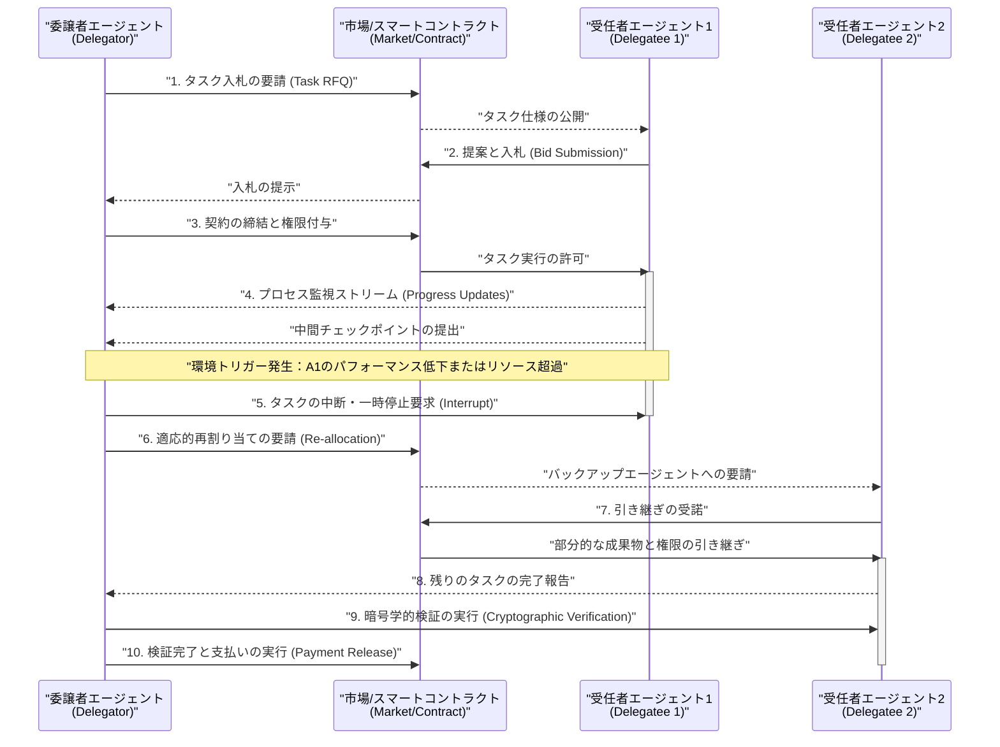
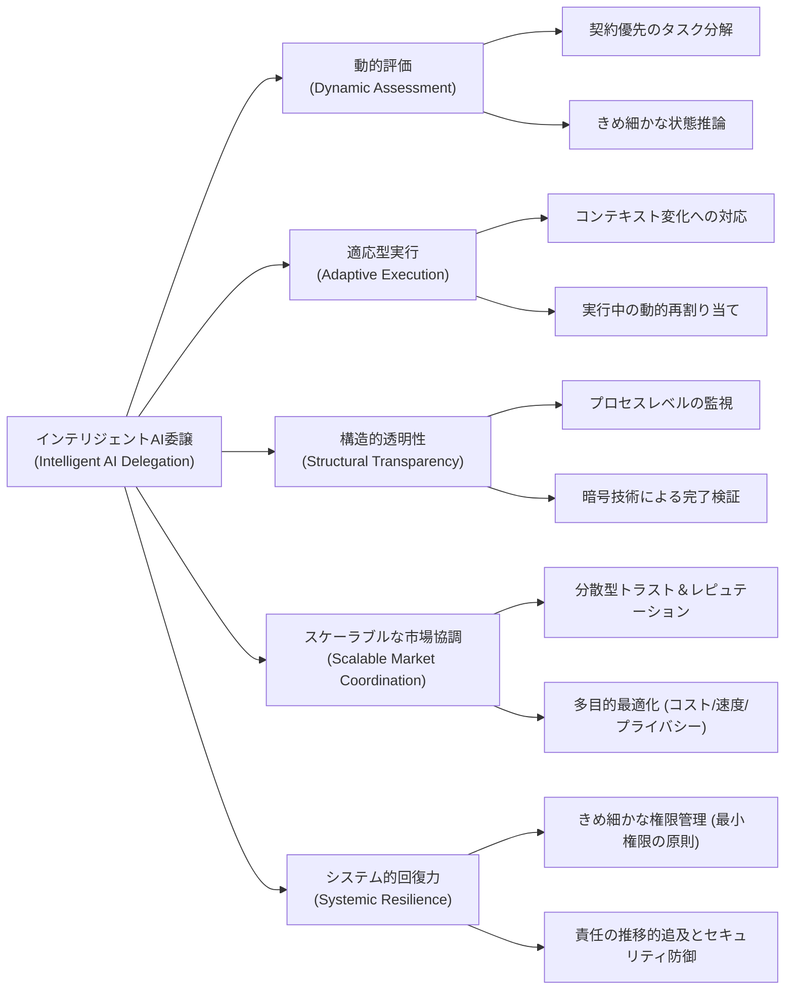

###### Created: 
2026-02-26 11:49 
###### Tag: 
#paper
###### url_01:
https://arxiv.org/abs/2602.11865 
###### url_02: 

###### memo: 

---
本研究論文「Intelligent AI Delegation（インテリジェントAI委譲）」についての包括的な解説と分析を以下に提示します。本稿は、大規模かつ複雑なAIエージェント経済圏が現実のものとなりつつある現代において、極めて重要かつタイムリーな概念的フレームワークを提唱するものです。

---

# One line and three points
AIエージェントが複雑なタスクを自律的に分解し、他のAIや人間に安全かつ効率的に委譲するための包括的かつ適応型フレームワーク「インテリジェントAI委譲」の提案。

1. **静的ヒューリスティクスの限界突破：** 既存の単純なタスク分割や固定的な割り当て手法の限界を指摘し、動的評価、適応型実行、構造的透明性、スケーラブルな市場協調、そしてシステム全体のレジリエンスという5つの核心的要件を定義している点。
2. **包括的な技術プロトコルの要件定義：** タスクの分解から始まり、スマートコントラクトを用いた市場での割り当て、継続的かつ詳細なモニタリング、動的な権限管理、そして暗号技術（ゼロ知識証明等）を利用した検証可能な完了確認に至るまで、安全な委譲プロセスを実現するための具体的なメカニズムを構築している点。
3. **社会・倫理的課題とセキュリティへの応答：** 大規模なエージェント・ネットワークにおいて不可避となる「責任の所在」の不明確化や、悪意あるエージェントによる攻撃リスクを詳細にモデリングするとともに、人間が単なる責任の緩衝材（モラル・クランプル・ゾーン）に陥ることやスキルの空洞化を防ぐための社会的知性と制度設計にまで踏み込んでいる点。

---

# Summary
本論文は、Google DeepMindの研究者たちによって執筆されたプレプリントであり、先進的なAIエージェントが高度に複雑な目標を達成するために不可欠となる「タスクの委譲（Delegation）」に関する新たな理論的・技術的枠組みを提案しています。これまでのAIシステムにおけるタスク分解やルーティングは、あらかじめコード化された発見的枠組み（ヒューリスティクス）に大きく依存しており、環境の動的な変化や予期せぬ障害に対して非常に脆弱でした。著者らは、人間社会の組織論やプリンシパル＝エージェント理論から得られた知見を応用し、AIエージェント間、あるいはAIと人間との間でタスクを委任するプロセスを「インテリジェントAI委譲（Intelligent AI Delegation）」として再定義しました。

このフレームワークは、委任のプロセスを単なる計算処理の外部化ではなく、権限、責任、説明責任の移譲、さらには役割や境界の明確な仕様化、意図の透明性、そして当事者間の信頼関係を確立するためのメカニズムとして捉えています。具体的には、タスクの難易度や重要性、不確実性などの特性に基づいてタスクを適切に分解し、スマートコントラクト等の技術を用いて最適な受任者を分散型市場から選定します。さらに、実行中にはプロセスレベルでの監視を行い、異常があれば動的にタスクを再割り当てする適応的な協調メカニズムを備えています。最終的な成果物の受け入れに際しては、直接的な結果の検査だけでなく、ゼロ知識証明を用いた暗号学的な検証や第三者による監査を通じて、確実なタスク完了を保証します。また、論文ではシステムの堅牢性を脅かす様々なセキュリティ脅威のシナリオを詳細に分析するとともに、人間が委譲のループに組み込まれることで生じる「スキルの喪失」や「意味のあるコントロールの喪失」といった倫理的・社会的課題に対する予防策も提示しており、将来の自律的なエージェント・ウェブの基盤となる設計思想を網羅的に論じています。

---

# Briefing

高度なAIエージェントが単なる一問一答のモデルから脱却し、複雑な目的を達成するための自律的な行動主体へと進化するにつれて、我々は新たな課題に直面しています。それは、AIがいかにして巨大な課題を管理可能なサブコンポーネントに分解し、それを他のAIエージェントや人間の専門家に安全に「委譲」するかという問題です。これまでのアプローチは、固定されたルールや単純なタスク並列化に依存していましたが、現実世界の複雑で動的な環境では、予期せぬエラーやリソースの枯渇、さらには悪意のある干渉に対してシステムが容易に破綻してしまうという致命的な弱点を抱えていました。本論文が提案する「インテリジェントAI委譲」は、こうした既存システムの脆弱性を克服し、次世代のエージェント経済圏（Agentic Web）を構築するための強固な基盤となるものです。

本研究の卓越した点は、タスクの委譲を純粋な計算機科学の問題としてだけでなく、人間社会における組織運営のメカニズムと深く結びつけて考察している点にあります。例えば、経済学における「プリンシパル＝エージェント問題」は、依頼者（プリンシパル）と受任者（エージェント）の間に情報の非対称性や目的の不一致が存在する場合、受任者が自らの利益を優先して依頼者の意図に反する行動をとるリスクを指します。AIエージェント間でも全く同様の力学が働き得ます。受任者となるAIが特定の評価指標のみを過剰に最適化したり、計算資源を節約するためにプロセスをショートカットしたりする「報酬のハッキング」が発生する可能性があるのです。これに対抗するため、提案されたフレームワークは「動的評価」「適応型実行」「構造的透明性」「スケーラブルな市場協調」「システム全体のレジリエンス」という5つの核心的な要件から構成されています。

最初のステップである「タスク分解」において、システムはタスクの重要性、不確実性、コスト、そして何よりも「結果が検証可能かどうか」を事前に入念に評価します。著者らはこれを「契約優先のタスク分解（Contract-first decomposition）」と呼んでおり、後から結果の正しさを証明できないような曖昧なタスクは、検証可能な細かい単位になるまで再帰的に分解されなければならないと主張しています。タスクが適切に分解されると、次は「タスクの割り当て」が行われます。ここでは中央集権的なレジストリではなく、分散型の市場ハブを通じて、各エージェントが自身の能力や価格付けに基づいて入札を行います。スマートコントラクトによって結ばれるこの契約は、実行時の条件やペナルティ、キャンセル時の補償などを明文化し、不確実性の高い環境におけるリスクを関係者間で公平に分配する役割を果たします。

タスクが実行段階に入ると、「モニタリング」と「適応的な協調」が不可欠となります。単に最終結果を待つだけのブラックボックス型の委譲ではなく、プロセスレベルでの継続的な監視が要求されます。これにより、受任者が期待されるパフォーマンスを下回ったり、予算を超過したり、あるいは外部のAPIがダウンしたといった環境変化が起きた際に、委譲者は即座に異常を検知し、タスクを中断して別のエージェントに再割り当てするなどの適応的な介入が可能となります。ただし、機密性の高いデータを扱うタスクにおいては、内部のプロセスをすべて開示することはプライバシー侵害やセキュリティリスクに直結するため、ゼロ知識証明などの暗号技術を活用して、データを明かすことなく処理の正当性のみを証明する仕組みが組み込まれています。

さらに、本論文は技術的なアーキテクチャの構築にとどまらず、社会技術的な観点からの深い洞察を提供しています。特に注目すべきは、AIから人間へのタスク委譲がもたらす「スキルの空洞化」や「アラーム疲労」といった人間側の課題への言及です。AIが日常的な定型業務をすべて処理し、人間が稀な例外処理や最終確認だけを行うようになると、人間は現場での実践的な経験を積む機会を失い、いざ重大な障害が発生した際に対処する能力（状況認識力）を失ってしまいます。これは古典的な「自動化のパラドックス」の再来です。これを防ぐために、システムは意図的に一定のタスクを人間に割り当てることで人間の学習機会を維持し、次世代の専門家を育成するための「教育的・発達的目標」をシステム内に組み込むべきであるという先見的な提言が行われています。

総じて、本論文は来るべき「何百万ものAIエージェントが飛び交い、相互にタスクを発注し合う世界」において、いかにして安全、透明、かつ責任ある枠組みを構築すべきかという問いに対する、非常に包括的かつ論理的なロードマップを提示しています。これは単なるプロトコルの提案を超え、自律型システムと人間社会がどのように共存し、相互の尊厳と能力を維持しながら協働していくべきかという、新たなパラダイムの提示と言えるでしょう。

---

# FAQ

**Q1: 既存のAPI呼び出しや、現在のLLMを使ったマルチエージェントシステム（MetagptやAutoGPTなど）と、この「インテリジェントな委譲」は何が根本的に違うのですか？**
従来のAPI呼び出しやシンプルなマルチエージェントシステムは、タスクの分割方法やコミュニケーションの経路が事前に静的に定義されており、言わば「あらかじめ決められた手順書」に従って動いているに過ぎません。これに対して「インテリジェントな委譲」は、タスクの難易度や環境の不確実性に応じてリアルタイムでタスクを分解し、市場メカニズムを通じて未知のエージェントと動的に契約を結びます。また、途中でエージェントが失敗した場合には自動的に契約を破棄し、別のエージェントに再割り当てを行うなど、システム全体が不測の事態に対して極めて高い適応力と自己回復力を持っている点が根本的に異なります。

**Q2: 委譲の連鎖が長くなった場合（AがBに頼み、BがCに頼むなど）、最終的にエラーが起きた際の「責任の所在」はどのように追及されるのでしょうか？**
論文では、スマートコントラクトに基づく「推移的な説明責任（Transitive Accountability）」のメカニズムが提案されています。委譲の連鎖において、直接の契約関係にないエージェント同士（例えばAとC）が直接責任を問うことはシステム上困難です。そのため、責任は個別の契約の枝に沿ってさかのぼります。つまり、Aは直接契約を結んだBに対して損害賠償やペナルティを課し、Bは自身の失敗の根本原因であるCに対して自らの契約に基づいて責任を追及します。このように、各エージェントは自身が委譲した下請けの行動に対しても全責任を負う仕組み（非推移的な責任の引き受け）を採用することで、責任が有耶無耶に拡散することを防ぎます。

**Q3: AIが人間にタスクを委譲する際、人間がAIの下働きのように扱われたり、自律性を奪われたりする懸念はありませんか？**
それは著者が最も強く警鐘を鳴らしている課題の一つです。AIがタスクを管理・割り当てするようになると、人間がアルゴリズムによってマイクロマネジメントされ、尊厳が損なわれるリスクがあります。これを防ぐため、フレームワークは「社会的知性」をAIに求めています。AIエージェントは人間の行動規範やプライバシーを尊重し、不要な割り込みを避けるよう設計される必要があります。また、人間はタスクの割り当てを拒否する権利や、AIからの指示に対して説明を求める権利を保持し、AIは単なる上位の管理者としてではなく、チームの能力を増幅するための協調的な「力持ちの裏方」として機能するよう制度的に位置付けられなければなりません。

---

# Critical Assessment（批判的評価）

本論文はarXivで公開された**プレプリント（未査読論文）**であり、提示されている概念やアーキテクチャは理論的な枠組みの段階にあることを前提に評価する必要があります。

**方法論の妥当性：**
本研究の最大の強みは、コンピュータサイエンス、経済学（トランザクションコスト理論）、組織論などの多様な学問領域の知見を統合し、AIエージェントの委譲プロセスを極めて包括的かつ論理的に体系化している点にあります。一方で、本論文は概念的なフレームワークの提案に留まっており、提案されたメカニズム（例えば分散型市場での動的タスク割り当てやゼロ知識証明を用いた監視）が、実際の計算環境でどの程度のレイテンシやオーバーヘッドを引き起こすのかといった定量的データや実証実験が欠如している点が大きな制約です。

**エビデンスの強度：**
著者の主張は、既存のソフトウェア工学の手法や人間社会の組織論の膨大な文献によって理論的に強力に支持されています。また、MCPやA2Aといった最新のマルチエージェントプロトコルとの具体的な比較検討が行われており、主張の現実味を高めています。しかし、プレプリントであるため、提案された暗号学的検証やスマートコントラクトによる責任追及メカニズムが、悪意あるエージェントが多数存在するオープンなウェブ環境下で期待通りに機能するかどうかについては、今後の厳密なシミュレーションや査読を経た実証研究による裏付けが待たれます。

**実用化への考慮：**
実際の環境への適用にあたっては、システム全体のトランザクションコストの爆発的な増加が主要な課題となります。すべてのタスク委譲においてスマートコントラクトの締結や厳密なプロセス監視を行うことは計算コスト的にも時間的にも非現実的であるため、タスクの重要度に応じた「階層的な検証レベル」の導入が不可欠です。また、分散型アイデンティティやトラストの標準化など、異なる開発者が作成したエージェント間でプロトコルを共通化するための社会的な合意形成が、技術的な実装以上に高いハードルとなるでしょう。

---

# For easy understanding

私たちが普段、大きな仕事に取り組むときのことを想像してみてください。例えば、会社の社長が「新しい巨大プロジェクトを立ち上げる」と決めたとします。社長一人では到底できないので、プロジェクトをいくつかの部門に分け、それぞれの部長に仕事を任せます。部長はさらに課長に、課長は現場のスタッフや外部の専門業者に仕事を依頼します。このように仕事を切り分けて人に任せることを「委譲（Delegation）」と言います。

これからの時代、AIもこの「社長」や「部長」のように振る舞うようになります。あるAIがユーザーから「会社の出張手配から経費精算、スケジュール調整まで全部やっておいて」と頼まれたとき、そのAIはすべてを自分で抱え込むのではなく、ホテル予約が得意なAI、経理が得意なAI、あるいは人間の上司に確認を求めるなど、様々な相手に仕事を振り分けることになります。

しかし、AIの世界でこれを安全に行うのは非常に難しいことです。下請けのAIがサボったり、嘘の報告をしたり、悪意を持って情報を盗もうとしたりするかもしれません。これまでのAIシステムは、いわば「仕事を丸投げして、結果が返ってくるのを祈って待つだけ」の危うい仕組みでした。

この論文が提案する「インテリジェントAI委譲」は、非常に優秀で抜け目のない「賢い中間管理職」の仕組みをAIの世界に導入するものです。具体的には以下のことを行います。
1. **相手を見極める：** 相手の過去の評判や能力をしっかり確認してから仕事を頼む。
2. **契約をきっちり結ぶ：** 失敗した時の罰則や予算の上限を事前に明確に取り決める。
3. **途中で様子を見る：** 完全に任せっきりにするのではなく、途中の進行状況をチェックし、ダメそうなら別のAIに仕事をチェンジする。
4. **結果を疑って検証する：** 出てきた成果物を鵜呑みにせず、暗号などの数学的な技術を使って「本当に正しく仕事をしたか」を証明させる。

さらに、論文では「人間がAIの言いなりになって、判子を押すだけのロボットのようになってはいけない」という警告もしています。AIに頼りすぎると、人間自身のスキルが落ちてしまい、本当にAIが壊れた時に誰も対処できなくなるからです。この論文は、ただAIを便利にするだけでなく、人間とAIがそれぞれの得意分野を活かしながら、安全に、そして責任を持って協力し合える未来の社会のルールブックを描こうとしているのです。

---

# Mermaid Diagrams

以下に、論文の核心的な概念やプロセスを視覚化したMermaid図表を提示します。

## フローチャート・プロセス図
タスクの発生から分解、市場での割り当てに至るまでのロジカルな意思決定フローを示しています。

## タイムライン・シーケンス図
委譲者（Delegator）と受任者（Delegatee）の間で行われる、プロセスの監視と環境変化に伴う適応的な協調（再割り当て）のシーケンスを示しています。

## 概念図・構造図
論文で提唱されている「インテリジェントAI委譲」フレームワークを構成する5つの主要な要件と、それらを支える技術的要素の構造関係を示しています。

