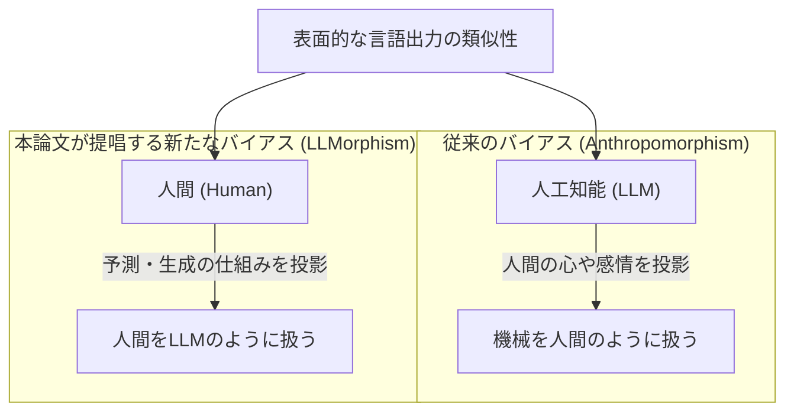
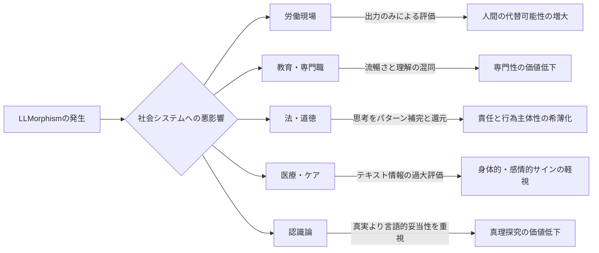
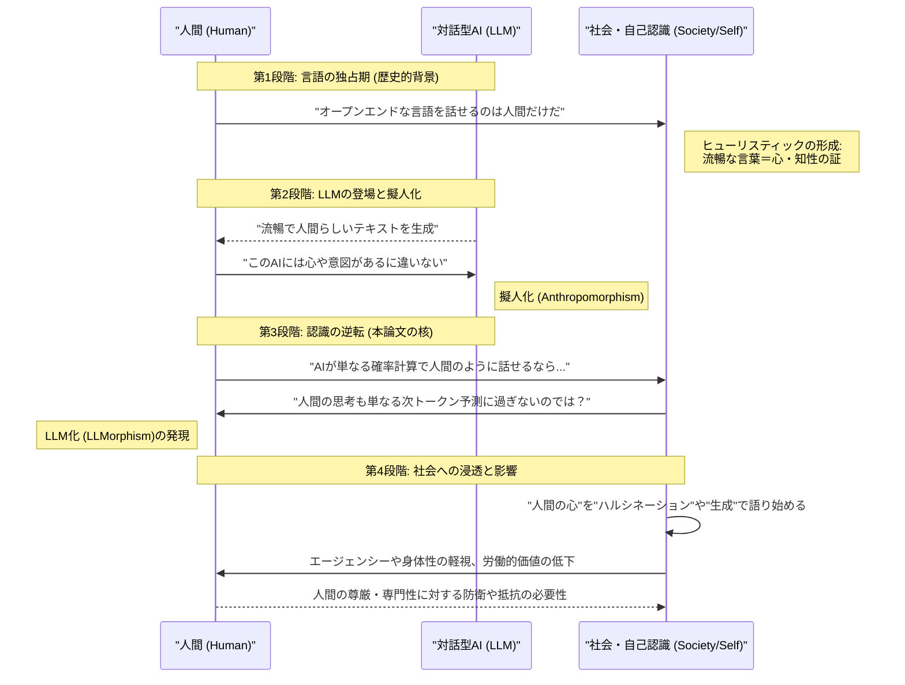

###### Created: 
2026-06-16
###### Tag: 
#paper
###### url_01:
[\[2605.05419\] LLMorphism: When humans come to see themselves as language models](https://arxiv.org/abs/2605.05419)
###### url_02: 

###### memo: 

---
# One line and three points
生成AIの流暢な対話能力によって、私たちが「人間の認知プロセスもLLM（大規模言語モデル）と同じような単なるテキスト生成・予測機械に過ぎない」と誤認してしまう新たな認知バイアス「LLMorphism（LLM化）」の概念と、それが社会に与える深刻なリスクを提唱した論文です。

* **認識の逆転現象の指摘：** 人間が機械を人間に見立てる「擬人化」ではなく、機械（LLM）の出力が人間に酷似しているがゆえに、人間の思考そのものを機械（LLM）の出力メカニズムに当てはめて解釈してしまう逆転のバイアス「LLMorphism」を定義しました。
* **社会システムへの多大な悪影響：** 人間を「単なる出力生成器」と見なすことで、人間の労働力の安易な代替化、言葉の流暢さと真の専門性の混同、道徳的責任（エージェンシー）の希薄化、そして医療や教育における身体的・感情的シグナルの軽視を引き起こす危険性を警告しています。
* **新たな実証研究の枠組みの提示：** このバイアスは現時点では理論的仮説ですが、人間の本質（身体性、社会性、文脈的理解）をAIから守るための心理学的尺度の開発や、今後の社会科学的アプローチの基盤となる重要な視座を提供しています。

# Pre-knowledge
本論文を深く理解するためには、心理学および認知科学における「擬人化（Anthropomorphism）」と「機械形態観（Mechanomorphism）」という二つの対立する概念を知っておく必要があります。擬人化とは、動物や無生物、AIに対して人間特有の感情や意図を見出す人間の根強い心理的傾向です。一方で機械形態観とは、逆に人間の行動や思考を機械（時計、エンジン、コンピュータなど）のプロセスに例えて解釈する傾向を指します。また、現代のLLM（ChatGPTなど）が、世界に対する深い理解や身体的経験（感情や痛みなど）を持たず、過去の膨大なデータに基づいて「統計的に次に来る確率が高い単語（トークン）を予測して繋ぎ合わせているだけ」のシステムであるという技術的背景も、この論文の議論の根底にあります。

# Summary
本研究は、人間と対話型AIの関係性において生じつつある新たな心理的パラダイム「LLMorphism（LLM化）」を概念化した理論的論文です。歴史上、文脈に沿った意味のある言語を生成できるのは人間だけであったため、私たちは「流暢な言葉の背後には心がある」というヒューリスティック（経験則）に依存してきました。しかし、LLMが人間と同等以上の言語出力を達成したことで、「LLMが人間のように話すのであれば、人間もLLMのように思考しているのではないか」という逆方向の推論が生じつつあります。著者は、このバイアスが「類推的転移（Analogical transfer）」と「隠喩的利用可能性（Metaphorical availability）」という二つのメカニズムを通じて広がるメカニズムを解説しています。さらに、このバイアスが人間の専門性や道徳的責任を過小評価し、医療現場での非言語的シグナルの軽視や、教育における「理解」の定義の歪曲化をもたらす社会的リスク（5つの経路）を詳細に論じ、AIの過剰評価だけでなく「人間の過小評価」という見過ごされがちな問題に警鐘を鳴らしています。

# Briefing

**1. 認識の逆転：擬人化から「LLMorphism」へ**
人類の歴史において、オープンエンドで文脈に即した言語の生成は人間にのみ許された特権でした。そのため人間は、「流暢な言語を生み出す存在の背後には、必ず心や知性が存在する」という強力な認知的ヒューリスティックを持っています。対話型LLMの登場により、人々がAIに対して意図や感情を読み取る「擬人化」が加速していることは広く議論されてきました。しかし、本論文の著者であるCapraro教授は、LLMの普及がもう一つの、より見過ごされがちな逆方向の推論を引き起こしていると主張します。それが「LLMorphism」です。これは、「LLMが人間のように言葉を紡ぐことができるならば、実は人間の認知構造そのものもLLMがそうしているように、単なる次の単語の確率的予測やパターン補完の集積に過ぎないのではないか」とみなしてしまう偏った信念（バイアス）を指します。言語の表面的な出力が似ているからといって、その背後にある認知的なアーキテクチャまで同じであるとするのは論理的飛躍ですが、この推論は心理的に非常に陥りやすい罠となっています。

**2. LLMorphismが蔓延する二つの心理的メカニズム**
著者は、このLLMorphismという認知バイアスが社会に定着・拡大していくプロセスとして、二つの相互に強化し合うメカニズムを提示しています。
第一に、「類推的転移（Analogical transfer）」です。人間は、二つのシステム（この場合は人間とLLM）の間に表面的な類似性（流暢なテキストの生成）を見出すと、一方のシステムが持つ内部構造や特性を、もう一方のシステムに無意識のうちに投影（マッピング）してしまう性質があります。言語は人間の思考を社会的に可視化する最大のメディアであるため、言語生成プロセスの類似性が、思考そのものの類似性として誤認されてしまうのです。
第二に、「隠喩的利用可能性（Metaphorical availability）」です。歴史的に、人間は最新のテクノロジーを「心」を理解するためのメタファーとして用いてきました（例：心を水圧や時計の機械機構、あるいは情報処理コンピュータに例えるなど）。現在、「予測」「パターン補完」「生成」「プロンプト」「ハルシネーション」といったLLM由来の技術用語が日常の語彙に浸透しており、人々が自分自身や他者の思考、記憶、創造性を説明する際に、これらの語彙を文化的メタファーとして多用することで、自己認識のLLM化が推し進められています。

**3. 類似概念との明確な境界線**
この新たな概念を学術的に確立するため、著者は既存の類似概念とLLMorphismを注意深く区別しています。たとえば、人間の脳を情報処理システムとして捉える「計算主義（Computationalism）」は、論理やアルゴリズム的なルールに基づく処理を前提としていますが、LLMorphismはルールベースではなく「文脈に応じたもっともらしい言語を生成する能力」に焦点を当てています。また、人間を機械や物体のように扱う「非人間化（Dehumanization）」や「モノ化（Objectification）」が、しばしば他者に対する敵意や道徳的排除、搾取的な意図を伴うのに対し、LLMorphismは必ずしも悪意を伴わず、自分自身を含む人類全般に対する「純粋な概念的・表象的な解釈の変容」である点で異なっています。

**4. 社会に対する5つの潜在的脅威（影響の経路）**
本論文の最も重要な貢献の一つは、人間の認知がLLM化して解釈された場合に、社会生活の様々な側面にどのような具体的な悪影響が及ぶかを仮説として5つの経路で提示した点にあります。
*   **代替可能性（Replaceability）：** 人間が単なる「出力（ドキュメントやコード）のジェネレーター」として解釈されると、労働現場において人間固有の価値が失われ、経済的だけでなく概念的にも自動化による人間の置き換えが正当化されやすくなります。
*   **流暢さの誤認（Fluency）：** 教育や専門職（弁護士や医師など）において、専門性は暗黙知や文脈の解釈に依存しますが、LLMorphismが蔓延すると「流暢な回答ができること」と「本当に理解していること」が混同され、専門性の価値や教育的基準が著しく低下します。
*   **エージェンシーの希薄化（Agency-thinning）：** 人間の行動が「入力に対するパターンの補完」として還元して記述されると、人間が自らの意志で決定し、道徳的な責任や義務を負う主体（エージェント）であるという概念が揺るぎます。これは法制度や社会的な信頼関係の根幹を脅かします。
*   **脱身体化（Disembodiment）：** 医療やケアの現場において深刻な問題を引き起こします。患者の苦痛は言葉だけでなく、表情や姿勢、声のトーンといった身体的・感情的なシグナルを通じて表現されます。患者を「臨床データのテキスト生成器」として扱うことで、これらの非言語的なSOSが見落とされる危険性があります。
*   **認識論的変容（Epistemic shift）：** これが最も深いレベルの脅威であり、「真実に基づく探求」よりも「もっともらしい文章の生成」が重視されるようになる現象です。事実が裏付けられているか（正当化）よりも、一貫して流暢であるか（もっともらしさ）で知識が評価される社会へのシフトが危惧されています。

**5. 抑制要因と今後の展望**
一方で、このバイアスが無限に広がるわけではないとする「境界条件」も示されています。人間の独自性を重んじる本質主義的・宗教的信念を持つ人々や、看護、心理療法、幼児教育など、身体的な触れ合いや感情労働、非言語コミュニケーションが不可欠な対人援助職にある人々は、人間とLLMの違いを日常的に強く体感しているため、LLMorphismに対して強い抵抗力を持つと考えられます。
結論として、現在AIに関する社会的な議論は「AIに人間のような心を与えすぎていないか（擬人化）」という一点に集中しがちですが、本論文は「私たちは人間から心やエージェンシー、身体的根拠を奪い、AIのレベルにまで引き下げていないか」という、見過ごされているもう半分の深刻な問題に対して、学術界と社会全体に強力な問題提起を行っています。

# FAQ

**Q1. LLMorphismとは一言で言うと何ですか？**
A1. 人間の脳や思考プロセスが、ChatGPTなどの大規模言語モデル（LLM）と同じように、「統計的に次の言葉を予測して出力しているだけのシステム」であると信じ込んでしまう認知的な思い込み（バイアス）のことです。

**Q2. 従来からある「人間は機械のようなものだ（機械形態観）」という考え方と何が違うのですか？**
A2. 過去にも人間を時計やコンピュータに例える考え方はありました。しかしLLMorphismは、単なる情報の計算や歯車の動きではなく、「言語を通じて人間らしく振る舞う」という極めて人間に近い表出を行うテクノロジーに基づいている点が異なります。人間にとって言語は思考そのものを表す重要なメディアであるため、出力が似ているだけで「中身（思考回路）も同じだ」と誤認しやすく、より強力で危険なバイアスになり得ます。

**Q3. 人間とLLMは実際に何が決定的に違うと著者は述べていますか？**
A3. LLMは身体を持たず、現実世界での経験や感情、社会的責任を一切負わずに、データ上の統計的な規則性に従って言葉を並べているだけです。一方、人間は感情や痛みを感じる身体を持ち、社会的関係や過去の記憶、発言に対する責任を負った上で言葉をコミュニケーションの「道具」として使用しているという、根本的な違い（グラウンディングの有無）があります。

**Q4. このバイアスが医療現場に悪影響を及ぼすとはどういうことですか？**
A4. 医療現場において医師が患者を「言葉（症状のテキスト）を生成するシステム」のように扱ってしまう危険性です。実際の医療では、言葉にできない表情の歪み、焦燥感、声の震えなど「身体的なシグナル」が重要ですが、LLMomorphismの枠組みではテキスト（言葉）が過大評価されるため、流暢に話せない患者の苦痛が見落とされたり、逆に流暢に話す重症患者の症状が軽く見積もられたりするリスクがあります。

**Q5. 今後、この問題を解決するために何が必要だと提案されていますか？**
A5. まずは、人々がどの程度このLLMorphismのバイアスを持っているかを測るための心理学的な測定尺度（テスト）を開発することです。その上で、AIリテラシー教育を通じて、技術的な知識を高めることがこのバイアスを防ぐのか、あるいは逆に技術を知ることでより自分をLLMに重ね合わせてしまうのかを実証的に研究していく必要があると述べています。

# Critical Assessment（批判的評価）

**方法論の妥当性：**
本研究は、既存の心理学理論（類推的転移や概念メタファー理論）を高度に統合し、新たな概念的枠組みを提示した理論的仮説論文であり、枠組みの構築論理は非常に強固で説得力があります。制約として、現時点では実証的な実験データや心理測定尺度が伴っていない純粋な理論的提唱であるため、このバイアスが一般社会にどの程度の規模と強度で実在するのかを定量的に検証するフェーズが今後の必須課題として残されています。

**エビデンスの強度：**
著者の主張は、人間心理や言語学に関する堅牢な既存のピアレビュー済み研究によって理論武装されています。ただし、引用文献の一部（Chen et al., 2026; Humlum & Vestergaard, 2025; Loru et al., 2025など）は未来の年号が付与されたプレプリントや進行中の非査読論文を含んでおり、現象の最新性を捉えようとする努力は評価できるものの、これらの文献に基づく「AIが社会に与える最新の影響」に関する証拠能力については、今後の査読を経た慎重な再評価が求められます。

**実用化への考慮：**
人事評価、医療診断、司法プロセスといった現実の社会システムにおいて、「人間を単なる出力機械として扱う」ことの危険性を明確に特定した点は極めて実用的で価値が高いです。しかし、実際の教育現場や企業マネジメントにおいて、LLMの利便性を享受しつつ、人間特有のエージェンシーや身体性をどのように評価・保護していくかという具体的な介入設計（ガバナンス構築）の難しさが、今後の実環境適用における主要な壁となるでしょう。

# For easy understanding
**「私たちは、自分のことを『超高性能なオウム』だと思い込み始めていないか？」**

この論文が言いたいことを、日常的な例えで説明しましょう。
とても賢く、人間と全く同じように会話ができる「オウム」のロボット（これがAI、つまりLLMです）が発明されたとします。最初は誰もが「このオウム、まるで人間みたいに心があるみたいだ！」と驚きます。これが、これまでよく言われてきた「AIの擬人化」です。

しかし、この論文の著者は、次にもっと恐ろしいことが起こると警告しています。それは、人間がオウムの完璧な言葉遣いを聞いているうちに、**「あれ？ ということは、私たちが普段考えて喋っていることも、実はこのオウムと同じように『過去のデータから次に適当な言葉を予測して繋ぎ合わせているだけ』なんじゃないか？」**と、自分たち人間の知性をオウム（AI）のレベルまで引き下げて解釈してしまう現象です。これが著者の名付けた**「LLMorphism（LLM化）」**という新しい思い込み（バイアス）です。

**つまりこういうことです：**
人間が言葉を話すときには、そこには「痛み」や「悲しみ」といった身体で感じる経験や、「これを言ったら相手を傷つけるかもしれない」という道徳的な責任（エージェンシー）が必ず伴っています。一方、AIには身体も感情も責任もなく、ただ確率の計算で文字を並べているだけです。

もし私たちが自分自身や他者を「AIと同じテキスト生成器」だと思い込んでしまうと、社会に怖いことが起こります。
*   **仕事において：** 「人間もただ文章を出力する機械なら、全部AIで置き換えればいい」と、人間の本当の価値が軽く見られてしまいます。
*   **医療において：** お医者さんが、患者の「言葉（テキスト）」だけを気にして、辛そうな表情や顔色などの「身体のサイン」を軽視するようになるかもしれません。
*   **責任において：** 誰かが悪いことをしても、「脳が勝手に言葉のパターンを計算して出力しただけだ」と、道徳的な責任を有耶無耶にしてしまうかもしれません。

論文の核心的な価値は、**「AIが人間っぽくなりすぎている！」と騒ぐのと同じくらい、「私たちが自分自身を『AIのような機械』だと低く見積もり始めている！」ことにもっと危機感を持つべきだ**と気付かせてくれたことにあります。

# Mermaid Diagrams

## 概念図・構造図

## フローチャート・プロセス図

## タイムライン・シーケンス図

