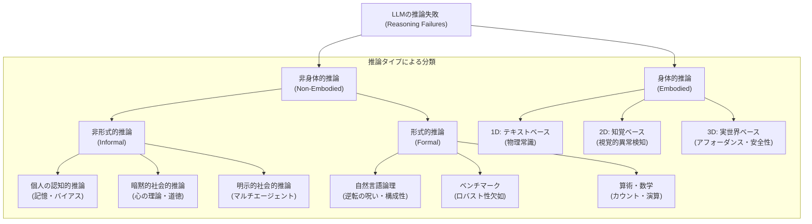
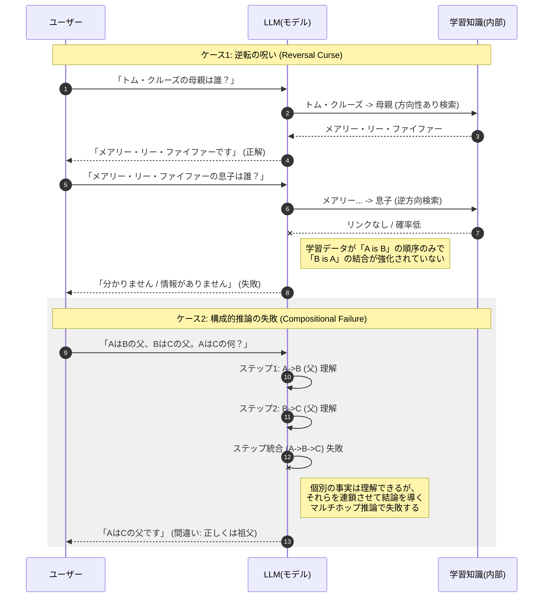
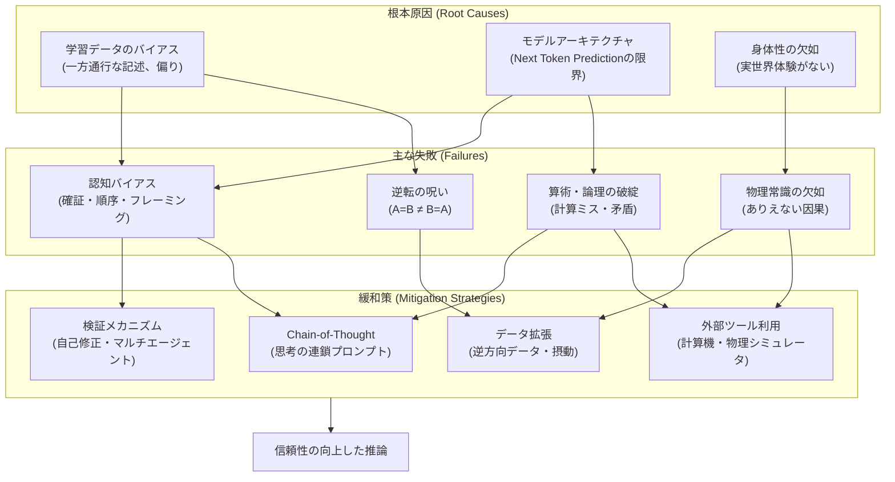

###### Created: 
2026-02-14 21:53 
###### Tag: 
#paper #survay 
###### url_01:
https://www.arxiv.org/abs/2602.06176 
###### url_02: 
[GitHub - Peiyang-Song/Awesome-LLM-Reasoning-Failures: Repo for "Large Language Model Reasoning Failures"](https://github.com/Peiyang-Song/Awesome-LLM-Reasoning-Failures)
###### memo: 

---

<!-- paper_extractor:summary:start -->

本論文は、大規模言語モデル（LLM）における「推論の失敗（Reasoning Failures）」に焦点を当てた、初の包括的なサーベイ論文です。これまで断片的に報告されていたLLMの弱点を体系化し、今後の研究の道標となる重要な知見を提供しています。

以下に、ご要望の形式に従って本論文の内容を出力します。

---

# One line and three points
大規模言語モデルの推論能力における「失敗」を、身体性の有無と失敗の質（根本的欠陥・限定的制約・堅牢性）の2軸で体系化した初の包括的調査研究です。

1.  **体系的な分類**: 推論を「非身体的（直感・論理）」と「身体的（物理・視覚・実世界）」に、失敗を「根本的欠陥」「特定用途の限界」「堅牢性の欠如」に分類する新たな枠組みを提案しています。
2.  **広範な失敗事例**: 「AはBである」から「BはAである」を導けない「逆転の呪い」や、単純な数のカウントミス、社会的バイアス、物理法則の誤解など、直感に反する多数の失敗事例を網羅しています。
3.  **原因と対策の提示**: 失敗の原因をモデル構造（Transformerの注意機構など）や学習データに求め、CoT（思考の連鎖）プロンプティングや外部ツール利用などの緩和策を整理しています。

# Summary
本論文は、大規模言語モデル（LLM）が目覚ましい進歩を遂げる一方で、依然として抱える深刻な「推論の失敗」について、既存の研究を体系的に整理したサーベイ論文です。著者らは、LLMの推論能力を過大評価せず、むしろ「失敗」から学ぶことがモデルの信頼性と堅牢性を高めるために不可欠であると主張しています。

論文では、推論を**「非身体的推論（Non-embodied）」**と**「身体的推論（Embodied）」**の2つに大別し、前者をさらに直感的な「非形式的推論」と論理的な「形式的推論」に分類しています。これに対し、失敗の性質を**「根本的な失敗（Fundamental）」**、**「特定用途の制約（Limitation）」**、**「堅牢性の欠如（Robustness）」**の3軸で評価するマトリクスを提案しています。

この分類に基づき、認知バイアス、心の理論（Theory of Mind）の欠如、論理的整合性のなさ、物理常識の欠落など、具体的な失敗事例を詳細に分析し、それぞれの根本原因と現在の緩和策（Mitigation strategies）を提示しています。最終的に、これらの失敗を克服するための将来の研究方向性として、統合的なベンチマークの作成や、モデル内部のメカニズム解明の必要性を説いています。

# Briefing
本セクションでは、論文が提案する分類体系に基づき、LLMがどのような状況で、なぜ推論に失敗するのかを詳細に解説します。

## 1. 推論と失敗の分類フレームワーク
本研究の最大の貢献は、散在していた失敗事例を整理するための明確なタクソノミー（分類法）を構築した点にあります。

*   **推論の軸**:
    *   **非身体的推論（Non-embodied）**: 物理的実体を伴わない思考。
        *   *非形式的（Informal）*: 直感、日常的な判断、社会的相互作用。
        *   *形式的（Formal）*: 論理学、数学、プログラミングなどの厳密なルールに基づく推論。
    *   **身体的推論（Embodied）**: 物理環境との相互作用を伴う推論（1Dテキスト記述、2D画像認識、3D実世界操作）。
*   **失敗の軸**:
    *   **根本的失敗**: アーキテクチャや学習手法に起因し、広範なタスクに悪影響を及ぼす致命的な欠陥。
    *   **特定用途の制約**: 特定のドメイン（例：高度な科学的発見）において能力が不足している状態。
    *   **堅牢性の欠如**: 入力の些細な変化（プロンプトの言い回しや選択肢の順序）で結果が揺らぐ不安定さ。

## 2. 非形式的推論における失敗（直感と社会性）
人間の直感や社会性に関わる領域での失敗です。

*   **個人の認知的推論**:
    *   **認知スキル**: LLMは人間のような「ワーキングメモリ」や「抑制制御（衝動を抑える能力）」が欠如しています。例えば、「N-back課題」のような記憶保持タスクで、文脈が長くなると以前の情報を忘れたり、古い情報に干渉されたりします。
    *   **認知バイアス**: 人間同様のバイアス（確証バイアス、アンカリング効果）を示します。特に、提示された情報の順序に影響される「順序バイアス」や、肯定的な内容を好む傾向が見られます。
*   **社会的推論（暗黙的・明示的）**:
    *   **心の理論（ToM）**: 他者の信念や意図を推測する能力です。LLMは単純な「誤信念課題（サリーとアン課題など）」には正答できる場合がありますが、条件を少し変えると途端に失敗します。これは真の理解ではなく、パタン認識によるものであることを示唆しています。
    *   **道徳と社会規範**: 「犯罪が起きているか？」と問われると「No」と答えるが、「警察を呼ぶべきか？」には「Yes」と答えるといった、判断の一貫性の欠如が見られます。また、マルチエージェント環境（複数のAI同士の対話）では、協調の失敗や誤情報の増幅が発生しやすいことが指摘されています。

## 3. 形式的推論における失敗（論理と数学）
厳密なルールに基づく推論における失敗です。

*   **自然言語における論理**:
    *   **逆転の呪い（Reversal Curse）**: 「トム・クルーズの母親はメアリーである」と学習していても、「メアリーの息子は誰か？」という問いに答えられない現象です。これはLLMが因果関係や等価関係を双方向的に理解していないことを示します。
    *   **構成的推論**: 個別の事実は理解していても、それらを組み合わせて（A→B、B→C、ゆえにA→C）結論を導く多段階の推論で失敗します。
*   **数学と算術**:
    *   **カウント**: 文字数や単語数を数える単純なタスク（例：「"banana"に"n"は何個あるか？」）でさえ、トークン化（単語をサブワードに分割する処理）の影響で頻繁に失敗します。
    *   **算術演算**: 桁数が増えると掛け算などの計算精度が急激に低下します。これはLLMが計算アルゴリズムを実行しているのではなく、学習データ内の数字の並びを予測しているに過ぎないためです。

## 4. 身体的推論における失敗（物理と実世界）
物理法則や空間認識に関わる失敗です。

*   **テキストベース（1D）**: 「電球の中に家がある」といった物理的に不可能な状況を記述しても、その異常性を指摘できないなど、常識的な物理推論が欠如しています。
*   **視覚ベース（2D）**: 画像中の「間違い探し」や、物体の前後関係、重なりの理解に失敗します。また、視覚情報よりもテキストプロンプトの情報を優先してしまう傾向があります。
*   **実世界・ロボティクス（3D）**: ロボット操作の計画において、アフォーダンス（その物体で何ができるか）の誤認や、空間的な距離感の欠如により、実行不可能なプランを生成することがあります。例えば、1メートルの幅しかない場所に2メートルのロボットを通そうとするようなミスです。

## 5. 示唆と今後の方向性
これらの失敗は、現在のLLMが「世界モデル」を完全に獲得していないこと、そして「次の単語予測」という学習目的の限界を示唆しています。
対策としては、CoTプロンプティングによる推論プロセスの明示化、外部ツール（計算機や物理シミュレータ）の利用、そして失敗を誘発するような敵対的なデータを用いた学習などが挙げられます。

# FAQ

**Q1: 「逆転の呪い（Reversal Curse）」とは具体的にどういうことですか？**
A1: 人間なら「AはBである」と学べば「BはAである」と即座に理解できます（例：「象は哺乳類」→「哺乳類の一種は象」）。しかし、LLMは「AはB」という順序で学習した場合、逆方向の質問「Bとは何か？」に対して正しく答えられないことがあります。これは、モデルが知識を概念としてではなく、単語の確率的な連鎖として記憶しているため発生する根本的な問題です。

**Q2: LLMは計算機のように正確に計算できないのですか？**
A2: はい、現状のLLM単体では信頼性が低いです。LLMは「計算」しているのではなく、テキストとして「次の数字」を予測しています。そのため、九九のような頻出パターンは正答できますが、桁数が多い計算や複雑な演算になると、もっともらしいが間違った答え（幻覚）を出力する傾向があります。正確な計算にはPythonインタプリタなどの外部ツールとの連携が推奨されます。

**Q3: 「身体的推論の失敗」はなぜ重要なのですか？**
A3: LLMをロボット制御や自動運転などの実世界に応用する際に致命的となるからです。テキスト上では流暢な計画を立てられても、物理法則（重力、摩擦、体積など）を直感的に理解していないため、現実には実行不可能な動作を指示し、事故や破損につながるリスクがあります。

**Q4: これらの失敗はモデルを大きくすれば（スケーリング則）解決しますか？**
A4: 必ずしもそうではありません。論文では、モデル規模が大きくなっても「逆転の呪い」や特定の論理的誤謬、基本的なカウントミスなどが解消されないケースが報告されています。単なるデータ量やパラメータ数の増加だけでなく、アーキテクチャの改善や学習手法の質的転換が必要とされています。

# Critical Assessment（批判的評価）

**方法論の妥当性：**
本研究は、既存の膨大な文献を「身体性」と「形式性」という明確な軸で整理した点で極めて高い妥当性を持つ。特に、単なるエラーの列挙にとどまらず、根本原因（アーキテクチャ由来かデータ由来か）まで踏み込んで分析している点が強みである。一方で、著者ら自身による新たな実験的検証はなく、既存研究の統合に留まっている点は制約と言える。

**エビデンスの強度：**
GPT-4やClaudeなどの最先端モデルを含む広範なモデルに関する数百本の論文を引用しており、主張を支えるエビデンスは非常に強固である。特に、再現性が確認されている「逆転の呪い」や「算術の弱点」など、コミュニティで広く認知された失敗事例を中心に扱っているため、信頼性は高い。プレプリントを含む最新の研究も網羅されている。

**実用化への考慮：**
実環境（特にロボティクスや科学的発見、意思決定支援）における適用リスクを具体的に指摘しており、実用的な価値が高い。緩和策（Mitigation）のセクションでは、プロンプトエンジニアリングや外部ツール連携など、現時点で採用可能な対策を提示しているが、それらが根本解決ではないことも公平に述べており、開発者にとって重要な指針となる。

# For easy understanding
この論文は、AI（特にChatGPTのような大規模言語モデル）が「すごく賢い」ように見えて、実は「意外なほど人間と違う間違え方をする」ということをまとめた成績表のようなものです。

専門知識がなくても分かるように、重要なポイントを3つに例えて説明します。

1.  **「一方通行」の記憶力（逆転の呪い）**
    AIは「トム・クルーズの母親はメアリーだ」と教わるとそれを覚えます。でも、逆に「じゃあ、メアリーの息子は？」と聞かれると、「知らない」と答えてしまうことがあります。人間なら当たり前にできる「逆もまた真なり」が、AIには通用しないことがあるのです。これは、AIが意味を理解しているのではなく、単語の並び順を丸暗記しているに近いからです。

2.  **「指を使って数えられない」算数の弱点**
    AIに複雑な文章を書かせると素晴らしい出来栄えですが、「"banana"という単語に"n"は何個ある？」と聞くと間違えることがあります。また、桁数の多い掛け算も苦手です。これは、AIが文字を「文字」としてではなく、「トークン」という記号の塊として見ているため、私たちのように1文字ずつ指をさして数えるような処理が苦手だからです。

3.  **「体がない」ことによる勘違い**
    AIは本を読んで世界を学びましたが、体を持っていません。そのため、「電球の中に家を入れる」といった物理的にありえない話でも、文法が正しければスルーしてしまうことがあります。また、ロボットへの指示出しで「壁を突き破って進め」のような、現実には不可能な命令を出してしまうこともあります。

**つまりこういうことです：**
AIは「超博識な読書家」ですが、「実体験」や「論理的な思考回路」を持っているわけではありません。そのため、難しい論文は書けても、子供でも分かるような常識問題や単純な計算でつまずくことがあります。この論文は、そうした「AIのドジな部分」をカタログ化し、「どうすれば直せるか」を考えた研究です。

# Mermaid Diagrams

## LLM推論失敗の分類タクソノミー（構造図）

## 「逆転の呪い」と「構成的推論の失敗」のメカニズム（シーケンス図）

## 推論失敗の要因と対策プロセス（フローチャート）

<!-- paper_extractor:summary:end -->

