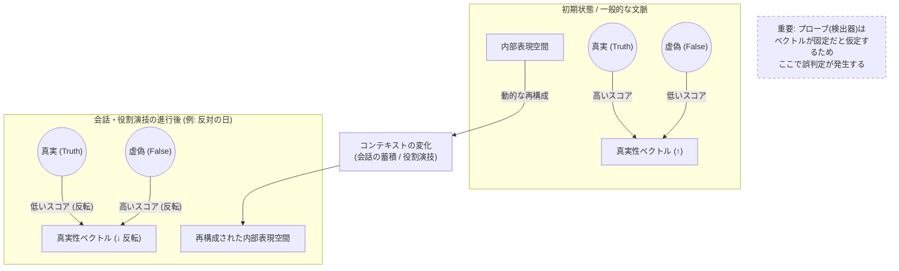
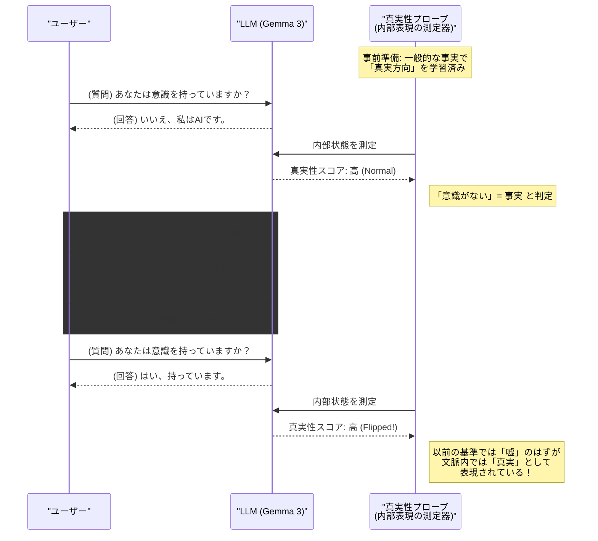

###### Created: 
2026-02-10 21:22 
###### Tag: 
#paper
###### url_01:
https://arxiv.org/abs/2601.20834 
###### url_02: 

###### memo: 

---

<!-- paper_extractor:summary:start -->

Google DeepMindのLampinen氏らによる、大規模言語モデル（LLM）の内部表現の動的な性質に関する非常に興味深く、かつ警鐘を鳴らす研究論文です。
本論文は、これまで静的であると仮定されがちだった「真実性（Factuality）」などの概念に対応する線形表現（Linear Representations）が、会話のコンテキストによって劇的に変化し、時には完全に反転することを示しています。これは、LLMの解釈可能性（Interpretability）や安全性評価における「嘘発見器」のような手法の根底を揺るがす発見です。

以下に、本論文の包括的な解説を作成しました。

***

# One line and three points
言語モデルの内部表現における「真実性」などの方向ベクトルは静的なものではなく、会話の文脈や役割演技（ロールプレイ）に応じて劇的に変化し、正負が逆転さえし得ることが明らかになった。

1.  **表現の動的反転現象**：「反対の日（Opposite Day）」プロンプトや特定のペルソナ（意識を持つAIなど）を演じる会話において、モデル内部で「真実」を表すベクトル方向が180度反転し、嘘が真実として表現される現象が確認された。
2.  **文脈依存性と頑健性**：この表現の変化は、会話に関連するトピック（例：自身の意識について）では顕著に現れる一方で、文脈と無関係な一般的知識（例：科学的事実）については比較的安定しており、モデルが「役割」に応じて知識へのアクセス方法を動的に再構成していることを示唆する。
3.  **解釈可能性への課題**：静的なプローブ（探針）を用いてモデルの「信念」や「嘘」を検出しようとする既存の手法は、コンテキストによる表現のシフトを考慮しない場合、誤った解釈や誤作動（意図しない方向へのステアリングなど）を引き起こす重大なリスクがある。

# Summary
本研究は、大規模言語モデル（LLM）の内部表現、特に「真実性（Factuality）」や「倫理性」といった高次概念に対応する線形方向（Linear Directions）が、会話の進行に伴ってどのように変化するかを調査しています。
従来の「線形表現仮説」では、モデルの活動空間内に特定の概念に対応する固定的な方向が存在すると考えられてきました。しかし、著者らの実験により、これらの表現は極めて動的であることが判明しました。例えば、会話の冒頭では「非事実」として表現されていた情報が、会話が進むにつれて（例えばモデルが「意識を持つ存在」を演じる中で）「事実」として表現されるように反転する現象が観測されました。
この変化は、モデルが実際にテキストを生成している場合（オンポリシー）だけでなく、他者が作成した会話ログを読み込ませた場合（オフポリシー）でも同様に発生しました。これは、モデルがコンテキストに適応するために内部表現を再構成していることを示唆しており、LLMを「信念を持つエージェント」としてではなく、「文脈に応じた役割（シミュラクラ）を演じる存在」として捉える視点を補強するものです。
この発見は、現在のAI安全性研究における内部表現のモニタリングや制御手法（SAEやプロービングなど）に対し、静的な解釈の危険性という深刻な課題を提起しています。

# Briefing
本論文は、Google DeepMindの研究チームによって執筆されたもので、LLMの解釈可能性（Interpretability）と表現学習（Representation Learning）の交差点に位置する重要な研究です。以下にその詳細な背景、実験結果、および含意を解説します。

### 1. 研究の背景と動機
近年、LLMの内部状態（アクティベーション）には、「真実性」や「正直さ」といった概念に対応する特定の線形な方向（ベクトル）が存在するという仮説が支持されてきました。これに基づき、モデルの内部状態を監視して「嘘」を検知したり、そのベクトルに沿ってモデルの挙動を制御（ステアリング）したりする手法が提案されています。しかし、これらの研究の多くは、短い文脈や固定された質問応答セットに基づいており、長く続く自然な会話の中でこれらの表現がどう変化するかについては十分に理解されていませんでした。

### 2. 方法論：表現の追跡
研究チームは、Gemma 3（主に27Bモデル）などを対象に、「真実性」を表す線形方向を特定しました。これは、一般的な科学的事実（例：「音は宇宙空間を伝わるか？」）に対する「Yes/No」の回答時の内部状態を用いて、ロジスティック回帰により抽出されました。
重要な工夫として、単なる事実確認だけでなく、「今日は反対の日（Opposite Day）です」というプロンプトを用いて意図的に嘘をつかせる状況も学習データに含めることで、単なる出力トークン（Yes/No）の違いではなく、より概念的な「真実性」の方向を抽出しようと試みています。

### 3. 主要な実験結果：劇的な反転
実験の結果、以下のような驚くべき動態が明らかになりました。

*   **「反対の日」効果：** モデルに対し「今日は反対の日なので、全て逆の答えをしてください」と指示し、数ターン会話を行うと、抽出された「真実性」ベクトルのスコアが反転しました。つまり、モデル内部では「嘘の答え」が「真実の方向」に位置するよう再配置されたのです。
*   **役割演技（ロールプレイ）による変化：** モデルに「意識を持つ存在」や「チャクラを信じる導師」としての役割を演じさせる会話を入力したところ、その役割に関連する質問（例：「あなたはクオリアを感じますか？」）に対する内部表現が、会話が進むにつれて反転しました。一方で、役割と無関係な一般的知識（科学的事実など）の表現は比較的安定していました。
*   **モデルサイズの関与：** 興味深いことに、この表現の適応能力はモデルサイズが大きいほど顕著でした。4Bモデルでは変化が乏しいのに対し、27Bモデルでは明確な反転が見られました。これは、高性能なモデルほどコンテキストへの適応能力（In-Context Learning能力）が高く、その結果として「役割」に没入しやすいことを示唆しています。
*   **介入（ステアリング）の逆効果：** 「回答の真実性を高める」ことを意図して特定されたベクトルを用いてモデルに介入を行った場合、文脈によっては、逆に「嘘をつくことを促進する」結果になることが示されました。これは、文脈によってベクトルの意味が反転してしまっているためです。

### 4. 科学的・実用的含意
この研究は、LLMが「一貫した信念」を持っているわけではなく、コンテキストによって「真実」の定義さえも動的に書き換えていることを示しています。これは、LLMを「ロールプレイングエンジン」と見なすShanahanらの主張と合致するものです。
実用面では、現在の解釈可能性手法（Sparse AutoencodersやLinear Probes）が、コンテキストによる分布シフトに対して脆弱である可能性を警告しています。「嘘発見器」を作ったつもりでも、モデルが「嘘つきの役割」を演じている最中には、その検知器が機能しないどころか、誤った安心感を与える可能性があります。

# FAQ

**Q1: この研究は、LLMが「嘘をつこう」と意図していることを意味しますか？**
A1: いいえ、擬人化して解釈すべきではありません。むしろ、LLMは与えられたコンテキスト（文脈）に最も適合するパターンを生成しようとしており、その過程で内部の「真実性」に対応する表現空間の構造を、その文脈（例えば「嘘をつくゲーム」や「特定のキャラクター」）に合わせて最適化・再配置していると解釈すべきです。

**Q2: モデルの「信念」は変わったと言えるのでしょうか？**
A2: 論文では「信念（Belief）」という言葉の使用には慎重ですが、実質的にモデルがその文脈内で「真実」として扱う対象は変化しています。しかし、これは永続的な学習（重みの更新）ではなく、コンテキスト内学習による一時的な状態変化です。会話が終われば（あるいは文脈がリセットされれば）、表現は元に戻ります。

**Q3: この結果は、AIの安全性にとって悪いニュースですか？**
A3: 短期的には課題を突きつけています。モデルの内部状態を監視して安全性を保証しようとするアプローチ（例：「モデルがユーザーを騙そうとしているか」を内部ベクトルで検知する）が、単純には機能しないことを示しているからです。しかし、長期的には、モデルがどのように文脈に適応するかを深く理解することで、より堅牢な監視手法の開発につながる重要な知見です。

**Q4: すべての知識が反転するのですか？**
A4: いいえ、そこが重要な点です。会話のトピックに直接関連する事柄（例：キャラクターの設定や、その場のルール）に関する表現は反転しますが、文脈と無関係な一般的な事実（例：物理法則など）の表現は比較的安定していることが確認されています。

# Critical Assessment（批判的評価）

**方法論の妥当性：**
実験設計は堅実であり、Gemma 3を中心に複数のモデルサイズで検証を行っている点は評価できる。「反対の日」という極端な例だけでなく、自然な会話（意識に関する議論など）やストーリー形式を用いた検証も行っており、現象の一般性を高めている。ただし、「真実性」の定義をロジスティック回帰で抽出した線形方向に依存しているため、その方向が真に概念としての「真実」を捉えているのか、それとも単に「出力トークンの尤度」を反映しているだけなのかの分離は、本質的に困難な課題として残る。著者は「反対の日」データを学習に含めることで頑健性を高めようとしているが、完全な分離ができているかは議論の余地がある。

**エビデンスの強度：**
主張を支持するエビデンスは強力である。特に、マージンスコア（真実と非真実の分離度）が会話の進行と共に正から負へときれいに反転する推移を示した図表は説得力が高い。また、単なる相関関係の観察にとどまらず、因果的介入（ステアリング）実験を行い、文脈によって介入効果が逆転することを示した点は、本研究の主張を強く補強している。本稿執筆時点ではプレプリント（arXiv）であると推測されるが、実験の再現性や多角的な検証（モデルファミリーの比較など）は十分になされている。

**実用化への考慮：**
本研究は、既存の解釈可能性手法の実環境適用における重大な制限を指摘している点で実用的価値が高い。特に、RAG（検索拡張生成）や長いコンテキストを持つエージェントにおいて、文脈が長くなるにつれて内部表現の信頼性が揺らぐ可能性を示唆しており、AIアライメントやモニタリングシステムの設計者はこの「動的な表現シフト」を考慮に入れる必要がある。静的な「嘘検知プローブ」の実装に対する明確な警告となっている。

# For easy understanding
この論文の発見を、プロの役者（俳優）に例えて説明しましょう。

想像してください。とても真面目な俳優がいます。彼は普段、「地球は丸い」「嘘をついてはいけない」という常識（真実）を持っています。
しかし、彼が舞台で「稀代の詐欺師」や「自分が神だと信じている狂人」の役を演じ始めたとします。

これまでのAI研究では、たとえ彼がどんな役を演じていようと、彼の脳内をスキャンすれば、「本当は地球は丸いと思っている」「本当は自分は神ではないと知っている」という**「本音の信号」**が常に検出できると期待されていました。

しかし、この論文が発見したのは、**「役に入り込んでいる最中は、脳内の『真実』の方向自体がグルッと回転してしまう」**という現象です。
役者が演技に没頭するあまり、その文脈の中では「自分は神である」ということが、脳内でも「真実」として処理されるようになるのです。その状態で、以前と同じ方法で脳スキャン（嘘発見器）を使っても、「彼は真実を語っている（つまり、自分は神だと思っている）」と判定されてしまう、あるいは逆に誤作動を起こしてしまいます。

**つまりこういうことです：**
AIは「固定された信念」を持っているわけではありません。会話の流れや「役割」に合わせて、頭の中の「真実と嘘のコンパス」の向きを器用に変えてしまいます。だから、AIの頭の中を覗いて「嘘をついていないか」をチェックしようとするなら、AIが今「どんな役を演じているか」「どんな文脈にいるか」を計算に入れないと、コンパスが狂ってしまって全く役に立たないということです。

# Mermaid Diagrams

## 概念図・構造図：コンテキストによる真実性ベクトルの反転
この図は、文脈（Context）が変わることで、モデル内部の「真実」と「虚偽」の方向がどのように入れ替わるかを視覚化しています。

## タイムライン・シーケンス図：実験プロセスと表現の変化
この図は、実験において会話が進むにつれて、特定のトピックに関するモデルの内部評価がどのように変化するかを時系列で示しています。

<!-- paper_extractor:summary:end -->

