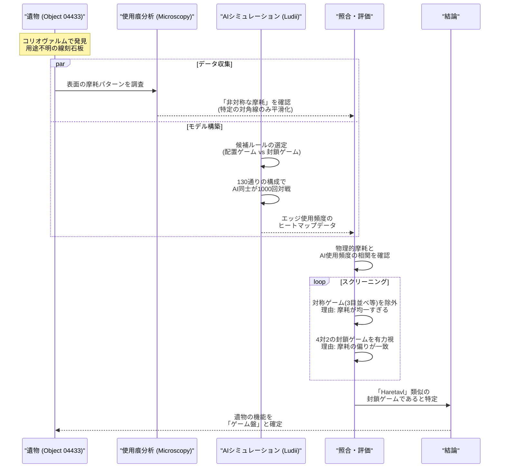
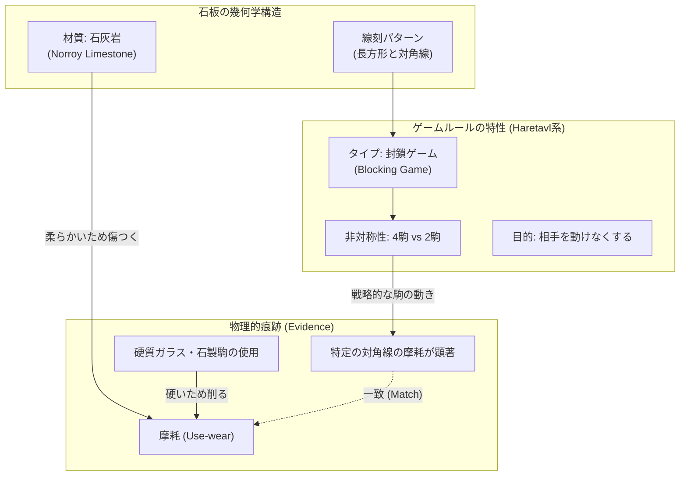
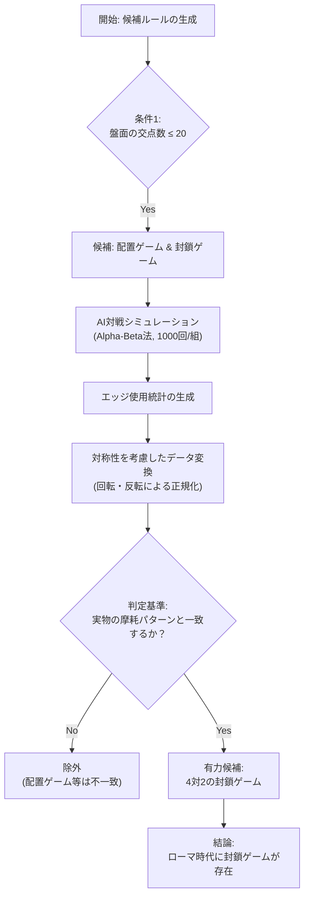

###### Created: 
{{date}} {{time}} 
###### Tag: 
#paper
###### url_01:
[Ludus Coriovalli: using artificial intelligence-driven simulations to identify rules for an ancient board game \| Antiquity \| Cambridge Core](https://www.cambridge.org/core/journals/antiquity/article/ludus-coriovalli-using-artificial-intelligencedriven-simulations-to-identify-rules-for-an-ancient-board-game/E5644BD43F8A5DC86DD1183A3E645ED9)
###### url_02: 

###### memo: 

---
# One line and three points
オランダのローマ時代の遺跡で発見された謎の石板に対し、微細な摩耗痕跡の分析とAIによる数万回の対戦シミュレーションを組み合わせることで、これが「封鎖ゲーム（Blocking Game）」の盤面であることを科学的に特定した画期的な研究です。

1.  **謎の石板の解明**：オランダのコリオヴァルム（Coriovallum）で発見された、既存のローマゲームのグリッドと一致しない線刻を持つ石灰岩の機能が、建築部材ではなくゲーム盤であることを特定しました。
2.  **AIと考古学の融合**：石板表面に残る「駒の摺動による摩耗」と、AI（Ludiiシステム）がシミュレーションした「最適戦略下の駒の移動頻度」を照合し、摩耗パターンと一致するルールセット（4対2の封鎖ゲーム）を導き出しました。
3.  **歴史的空白の補完**：文献記録にはないものの、バイキング時代以降に知られる「Haretavl」のような非対称の封鎖ゲームが、ローマ時代すでに存在していた可能性を物理的証拠と計算科学によって示唆しました。

# Summary
本研究は、オランダのローマ時代の都市コリオヴァルム（現在のヘールレン）で発見された、用途不明の線刻を持つ石灰岩（遺物番号04433）の機能を同定するために行われました。研究チームは、石の表面に残る微細な使用痕（use-wear）分析と、一般ゲーム記述システム「Ludii」を用いたAIによる対戦シミュレーションを統合する学際的なアプローチを採用しました。

物理的な分析からは、線刻に沿って駒が滑ったことによる特異な摩耗パターンが確認されました。一方、AIシミュレーションでは、ヨーロッパの伝統的なゲームルール（配置ゲームや封鎖ゲーム）の変種を多数テストし、どのルールで遊べば石板上の摩耗パターンが再現されるかを検証しました。その結果、4つの駒を持つプレイヤーが2つの駒を持つプレイヤーを追い詰める「非対称の封鎖ゲーム」のシミュレーション結果が、実際の石板上の非対称な摩耗痕（特定の対角線が集中的に使用されている点など）と最も強く相関することが判明しました。これにより、本遺物がゲーム盤であった可能性が極めて高いと結論づけるとともに、この種のゲームの起源をローマ時代まで遡らせる新たな証拠を提示しました。

# Briefing
本研究は、考古学的遺物の解釈において、物質的な痕跡分析と計算機科学的シミュレーションを融合させた「計算考古学（Computational Archaeology）」の洗練された事例です。以下にその詳細なコンテキストと論理構成を解説します。

**1. 研究の背景と対象遺物の謎**
オランダのヘールレンにあるローマ博物館（Het Romeins Museum）には、不規則な幾何学模様が刻まれた小さな石灰岩（Norroy limestone製）が収蔵されています。この石は建築用の煉瓦に似ていますが、以下の理由から建築部材説は否定されました。
*   **サイズと加工**：建築部材としては小さすぎ、かつ全面が意図的に加工されています。
*   **線刻の性質**：建築上の墨出し線（guidelines）としては不正確であり、かつ表面が滑らかに仕上げられているため、線自体を見せることが目的であったと推測されます。
*   **文脈**：ローマ時代のゲーム盤はしばしば地面や石に即興で刻まれるものであり、既存の分類（TabulaやLatrunculiなど）に当てはまらない盤も多く存在します。

**2. 複合的な方法論：Use-wear分析とAIシミュレーション**
研究チームは、この石がゲーム盤であるという仮説を検証するために、二つの異なるアプローチを結合させました。

*   **使用痕（Use-wear）分析**：
    石の表面を顕微鏡および写真測量（Photometric Stereo法）で分析しました。その結果、線刻に沿った特定の領域（特に一つの対角線周辺）に、研磨による滑らかなゾーン（homogeneous zones）が確認されました。これは、ガラスや石で作られた硬いローマ時代のゲーム駒が、柔らかい石灰岩の上を繰り返し滑ったことによる摩耗と整合します。特筆すべきは、この摩耗が盤面全体に均一ではなく、**著しく非対称（偏りがある）**であるという点です。

*   **AI駆動型シミュレーション（Ludii）**：
    この「非対称な摩耗」を説明できるゲームルールを探るため、デジタルゲーム研究プロジェクトで開発されたシステム「Ludii」を使用しました。
    *   **候補ルールの選定**：盤の交点数が少ない（20以下）ことから、ヨーロッパの伝統ゲームの中から「配置ゲーム（3目並べ系）」と「封鎖ゲーム（相手を動けなくする系）」のルールを抽出しました。
    *   **変数の設定**：スカンジナビアの「Haretavl」などをモデルに、駒の数（3対1、4対2など）、初期配置、勝利条件を変えた130通りの構成を作成しました。
    *   **AI対戦**：Alpha-Beta法を用いたAIエージェント同士に各ルールで1000回対戦させ、盤上のどのライン（エッジ）が頻繁に使用されるかをヒートマップ化しました。

**3. 結果：過去のプレイの再現**
分析の結果、多くの対称的なゲーム（双方が同数の駒を持つゲームなど）では、実際の石に見られるような「特定の対角線だけが極端に摩耗する」という現象は再現されませんでした。しかし、**「4つの駒（猟犬役）が2つの駒（ウサギ役）を追い詰める」タイプの封鎖ゲーム**において、AIは片側の対角線を戦略的に多用する傾向を示し、これが実物の摩耗パターンと合致しました。

**4. 考古学的・歴史的意義**
この発見は単に一つの石の用途を特定しただけではありません。
*   **ゲーム史の書き換え**：封鎖ゲーム（Blocking games）は、文献上は中世以降（バイキング時代のHaretavlなど）に現れるとされてきましたが、本研究によりローマ時代には既に類似のゲームが存在していた可能性が高まりました。
*   **方法論の革新**：遺物に残る「傷」から、そこで行われていた「人間（またはAI）の振る舞い」を逆算するという手法は、文字記録のない古代の無形文化（遊びのルール）を復元する強力なツールとなります。

# FAQ

**Q1: なぜ建築用の下書き線や、単なる作業台の傷ではないと言い切れるのですか？**
**A1:** 線刻のパターンが建築図面としては不正確であり、かつ石のサイズや加工痕が建築部材の規格と一致しません。また、使用痕分析において、食品や顔料を磨り潰す作業（全体的な研磨痕になる）とは異なり、線刻に平行した特定の帯状の領域のみに摩耗が集中しているため、駒を線に沿って動かす行為が最も合理的な説明となります。

**Q2: AIのプレイは人間のプレイと同じと言えるのでしょうか？**
**A2:** 完全には同じではありません。しかし、今回対象としたような単純なゲームにおいては、人間も経験的に「最適に近い手」を指す傾向があります。研究チームは、盤面の対称性を考慮したデータ変換処理を行うことで、利き手による偏りなどの人間的要素をある程度相殺し、AIが導き出す「構造的に多用されるルート」が、長期的な人間のプレイ痕跡と相関すると判断しています。

**Q3: このゲームの具体的なルールは確定したのですか？**
**A3:** 完全に一つに絞られたわけではありませんが、「4対2の封鎖ゲーム（一方が相手を囲もうとし、他方が逃げようとする）」というカテゴリーである可能性が極めて高いと結論付けられました。特に、長方形の辺からスタートし、対面の相手を封じ込めるバリエーションが、摩耗パターンを最もよく説明します。

# Critical Assessment（批判的評価）

**方法論の妥当性：**
使用痕分析という物理的証拠と、AIシミュレーションという計算的手法を組み合わせた点は極めて独創的かつ強力である。特にLudiiシステムを用いて130通りものルール変数を網羅的に検証した点は、恣意的な解釈を排除する上で統計的な説得力が高い。ただし、AIエージェント（Alpha-Beta法）の合理性が、古代の一般庶民の「遊び（非合理的な手を含む）」をどこまで正確に模倣できているかについては、議論の余地が残る。

**エビデンスの強度：**
摩耗痕の非対称性とAIシミュレーション結果の一致は強力な状況証拠である。しかし、ローマ時代の文献による直接的な裏付け（同時代の封鎖ゲームの記述）は欠如しており、結論はあくまで「最も確からしい推論」の域を出ない。本論文は査読済み（Antiquity誌）であり、考古学と言語学・情報科学の専門家による多角的な検証を経ているため、信頼性は高い。

**実用化への考慮：**
本手法（AIによるルール復元）は、他の用途不明な盤状遺物にも適用可能であり、考古学における汎用的な分析フレームワークとなる潜在力がある。一方で、適用には「Ludii」のような高度なゲーム記述言語と計算リソース、そして詳細な3Dスキャンデータが必要となるため、全ての考古学現場で即座に実用化できるわけではないというハードルがある。

# For easy understanding
この論文の凄さを、現代のビデオゲームに例えて説明しましょう。

想像してみてください。数千年後の未来人が、土の中からボロボロになった「ゲームのコントローラー」を発掘しました。説明書もゲームソフトもありません。しかし、未来の科学者はこう考えました。
「**コントローラーの『Aボタン』と『右スティック』だけが異常にすり減っている**。ということは、このボタン配置を多用するアクションゲームで遊んでいたに違いない」

この研究がやったことは、まさにこれと同じです。
1.  **遺物の発見**：ローマ時代の「謎の線が引かれた石」を見つけた。
2.  **痕跡の観察**：顕微鏡で見ると、特定のラインの上だけが、何かをこすり合わせたようにツルツルになっていた。
3.  **AIによる推理**：AIに何百種類ものゲームルールで遊ばせてみた。「もし3目並べなら、真ん中がすり減るはず」「もしチェスのようなゲームなら、全体がすり減るはず」...と実験を繰り返した。
4.  **犯人の特定**：その結果、「4匹の犬が2匹のウサギを追い詰めるゲーム」をさせた時だけ、実物の石と同じ「偏ったすり減り方」になることがわかった。

つまり、**「石の傷跡」と「AIの計算」をパズルのように合わせることで、歴史の教科書には載っていない「ローマ人が遊んでいた幻のゲーム」のルールを復元してしまった**のです。これは、文字に残っていない文化を科学の力で蘇らせる、タイムマシンのような研究だと言えます。

# Mermaid Diagrams

## タイムライン・シーケンス図
研究の実施プロセスと論理の流れを示します。

## 概念図・構造図
特定された「封鎖ゲーム（Blocking Game）」の構造と摩耗の関係を図示します。

## フローチャート・プロセス図
AIシミュレーションによる候補絞り込みの流れを示します。

