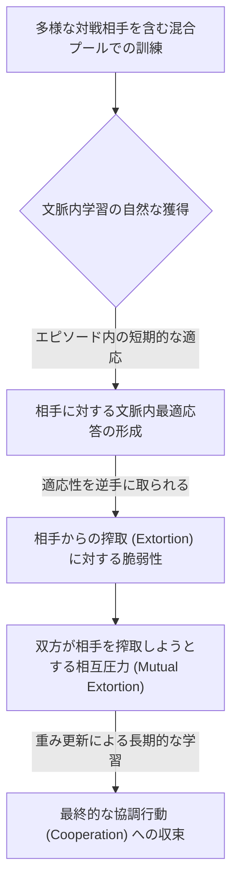
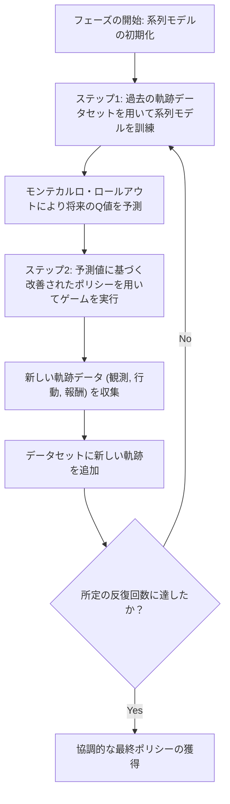
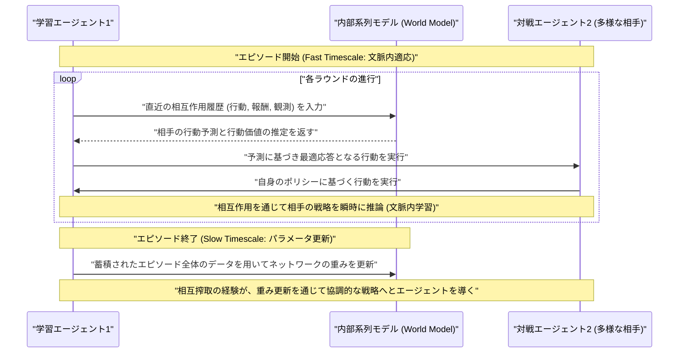

###### Created: 
2026-03-04 15:03 
###### Tag: 
#paper
###### url_01:
https://arxiv.org/abs/2602.16301 
###### url_02: 

###### memo: 

---
# One line and three points
多様な対戦相手と訓練された系列モデルのエージェントは、複雑な明示的学習規則なしに「文脈内学習」を通じて自然に相手の戦略を推論・適応し、相互の搾取圧力を経て自律的に協調行動へと至ることを示した研究。

- **多様な相手との訓練が文脈内学習を引き出す：** メタ学習の枠組みや相手の学習動態に対するハードコードされた仮定を用いず、混合プール（多様な対戦相手）環境での強化学習だけで、エピソード内の高速な戦略適応（文脈内学習）が創発します。
- **搾取に対する脆弱性が協調の原動力となる：** エージェントが文脈内で即座に最適応答する能力を持つと、逆に相手から行動を誘導される「搾取（Extortion）」に対して脆弱になり、この相互作用が学習の勾配を生み出します。
- **相互搾取から協調行動への自然な収束：** 両エージェントが互いに搾取しようと試みる圧力が衝突・相互作用することで、結果的に双方のポリシーが「相互 defection（裏切り）」を避け、グローバルに有益な協調行動（Cooperation）へと向かって最適化されます。

# Summary
本論文は、分散型マルチエージェント強化学習（MARL）において自己利益を追求するエージェント同士がどのように協調を達成できるかという根本的な課題に取り組んだプレプリント（arXiv未査読論文）です。従来の研究では、相手の学習ダイナミクスを明示的に考慮する複雑なメカニズム（例：頻繁にパラメータを更新する「ナイーブな学習者」と、それを観察してゆっくり更新する「メタ学習者」の厳格な分離）が必要とされていました。しかし本研究は、現代のFoundationモデルを支える系列モデル（Sequence Models）の特性を活かし、そうした複雑な時間スケールの分離や相手の学習規則に対する仮定が不要であることを実証しました。

具体的には、GRUをベースとした系列モデルのエージェントを、様々な固定戦略を持つタブラーエージェントと他の学習エージェントが混在する「多様な対戦相手のプール」で訓練します。この環境では、エージェントは相手が誰であるかを対話の履歴から即座に推論し、1エピソード内で戦略を適応させる「文脈内学習（in-context learning）」能力を自然に獲得します。そして興味深いことに、この文脈内で相手に合わせようとする適応能力こそが、相手からの「搾取（Extortion）」に対して自らを脆弱にします。エージェント双方が互いに相手の文脈内適応を搾取しようと試みることで、パラメータ更新のスケール（エピソード間）において協力的な方向への勾配が生じ、結果として「繰り返し囚人のジレンマ（IPD）」という社会的なジレンマ環境において堅牢な協調行動が創発することが確認されました。加えて、世界モデルとポリシーを兼ね備えた予測的ポリシー改善（Predictive Policy Improvement: PPI）アルゴリズムを新たに提案し、その理論的な裏付けとなる「予測均衡（Predictive Equilibrium）」についても詳細に論じています。

# Briefing
本論文の詳細な背景、提案手法、そして発見された協調創発のメカニズムについて順を追って解説します。

**背景：マルチエージェント強化学習（MARL）における非定常性と均衡のジレンマ**
AIエージェントが複雑な環境に展開されるにつれ、他の自律的なエージェントと相互作用する機会が増加しています。しかし、それぞれが自身の報酬を最大化しようとする分散型MARLでは、「繰り返し囚人のジレンマ」に代表されるような社会的なジレンマにおいて、全員が「裏切り（Defect）」を選択する局所的で非効率なナッシュ均衡に陥りやすいという大きな課題があります。また、他のエージェントも同時に学習しているため、あるエージェントから見ると環境自体が絶えず変化する「非定常性（Non-stationarity）」の問題が発生し、標準的な強化学習アルゴリズムでは効果的な協調ポリシーを学習することが困難です。
従来は、相手の学習プロセスを数式的に予測して誘導する手法や、「速く学習するエージェント」と「遅く学習するエージェント」を意図的に設定してメタ学習として解決する手法が提案されてきましたが、これらは相手の内部構造に対する強い仮定を必要としていました。

**コアとなる発見：多様性と系列モデルの力**
本研究の最大のブレイクスルーは、「系列モデルを多様な相手と戦わせるだけで、エージェントは勝手に相手を分析し、それに合わせて動く能力（文脈内学習）を獲得する」という事実を明らかにしたことです。研究チームは、エージェントに「相手のID」などの明示的な情報を与えず、過去の行動や報酬の履歴のみから相手の戦略を推測させました。この「多様な対戦プール（Mixed pool training）」での訓練により、エージェントは1つのエピソードという短い時間枠の中で、対戦相手に対する最適応答へと素早く行動を適応させる能力を身につけました。

**協調が創発する3つのステップアップ・メカニズム**
エージェントが利己的であるにもかかわらず協調に至る過程は、以下の3つの明確なステップに分解されます。
1. **多様性が文脈内最適応答を育む:**
   固定的な戦略を持つエージェント群（タブラーエージェント）と戦うことで、エージェントは履歴から相手のパターンを読み取り、瞬時に最適な打ち手を繰り出す「文脈内学習メカニズム」をネットワークの内部に形成します。
2. **文脈内学習者は搾取（Extortion）の的になる:**
   相手の出方に素早く適応しようとするエージェントは、逆手に取られる隙が生じます。別のエージェントは、相手が適応しようとする性質を利用して、自分に有利な方向（不公平な協力）へと相手を誘導する「搾取戦略」を学習し始めます。つまり、素直に相手に合わせようとするシステムは、悪意ある誘導に対して脆弱になるのです。
3. **相互の搾取が最終的に協調をもたらす:**
   両方のエージェントが賢くなり、互いに「相手を搾取して自分だけ得をしよう」と試みるようになるとダイナミクスが変わります。双方が相手の文脈内適応を悪用しようとする結果、互いに圧力をかけ合うことになり、裏切り合うことによる損失を回避するため、重み更新（長期的な学習）のレベルで双方が「互いに協力する」という妥協点（協調行動）へと押し上げられるのです。

**新アルゴリズム「PPI」とその理論的貢献**
論文では標準的なA2C（Advantage Actor-Critic）に加えて、Predictive Policy Improvement (PPI) という新たな手法を導入しました。これは、自己の行動、環境からの観測、そして報酬を一つの系列として予測するモデルを自己教師あり学習で構築し、そのモデルを使って将来の展開をシミュレーション（モンテカルロ・ロールアウト）して方針を決定する手法です。PPIはモデルベースの強化学習として機能し、論文後半の付録では、この学習ループが収束する状態を「予測均衡（Predictive Equilibrium）」として数学的に定式化し、一定の条件下でこの均衡が存在することを証明しています。

# FAQ
**Q: メタ学習を利用した従来手法と本研究の最大の違いは何ですか？**
A: 従来手法では、エージェントを「エピソードごとにパラメータを頻繁に更新する学習者」と、「その更新の様子を外側から観察してゆっくり適応するメタ学習者」のように、人為的に役割や時間スケールを分離する必要がありました。本研究では、単一の系列モデル（GRUなど）を用い、多様な相手と対戦させるだけで、パラメータの更新はエピソード間でのみ行われます。エピソード内での高速な適応は、ネットワーク内部の「文脈内学習」として自然に生じます。

**Q: なぜ「多様な対戦相手（タブラーエージェントのプール）」が必要なのですか？**
A: 同じ相手や単一の学習エージェントとばかり対戦していると、エージェントはその特定の相手に特化した暗記的な行動をとるようになり、汎用的な「相手の意図を推論する能力」が育ちません。多様な相手と対戦させることで、初めてエージェントは対話履歴から相手の戦略を文脈的に読み取る能力（文脈内学習）を発現させます。論文内のアブレーションテストでも、多様な相手を排除すると協調行動が崩壊し、相互裏切りに陥ることが確認されています。

**Q: 相手を「搾取（Extort）」するとは具体的にどういうことですか？**
A: ここでの搾取とは、自分は少し有利な立場を維持しつつ、相手には「裏切るよりも協力した方がマシだ」と思わせるような行動パターンをとる戦略（Extortion strategy）のことです。相手が自分の行動に合わせて適応しようとする性質（文脈内学習）を利用して、相手の行動を操作し、不公平な形で自分に多くの報酬が来るように仕向ける高度な駆け引きを指します。

# Critical Assessment（批判的評価）

**方法論の妥当性：**
強みとして、提案された因果関係（多様性→文脈内学習→搾取の脆弱性→相互搾取による協調）を、ステップごとに固定エージェントを用いたアブレーションや可視化で段階的に検証している点が非常に優れています。また、PPIという新しいアルゴリズムに対する「予測均衡」の数学的定式化も提供されており、理論と実験のバランスが取れています。一方で制約として、実証実験が「繰り返し囚人のジレンマ（IPD）」という非常に限定的かつ小規模な状態・行動空間のゲームに留まっている点が挙げられます。

**エビデンスの強度：**
本論文はarXivに投稿されたプレプリント（2026年2月付）であり、現段階では査読プロセスを経ていないため、主張は慎重に受け止める必要があります。しかし、異なる乱数シードを用いた複数回の試行に基づく統計的ばらつきの明記や、ベースライン（A2C）と新規手法（PPI）の両方で同様の現象が確認されている点から、示された「相互搾取からの協調創発メカニズム」自体の再現性に関する証拠は手堅いと言えます。ただし、より複雑な環境への一般化可能性については、今後の追加実験が待たれます。

**実用化への考慮：**
現実の大規模なマルチエージェント環境（自動運転車や経済シミュレーションなど）への適用を考える際、計算コストが最大の制限事項となります。特にPPIアルゴリズムは、毎回の行動選択において自己の予測モデルを用いたモンテカルロ・ロールアウト（将来のシミュレーション）を必要とするため、状態空間が高次元化したり、参加エージェントの数が増加（3体以上など）したりした場合、リアルタイムでの推論や学習のスケールアップに大きな課題が生じることが予想されます。

# For easy understanding
論文の要点を、専門用語を使わずに分かりやすい例えで説明します。

**つまりこういうことです：**
「色々な性格の人とカードゲームをしまくると、人間心理を読むのが上手くなり、最終的に『お互いに協力するのが一番賢い』と気づくAIの話」です。

**ステップごとの解説：**
1. **「相手の出方を見る能力」が育つ（多様性から文脈内学習へ）**
AIを、「常に裏切る人」「最初は協力する人」「ランダムな人」など、いろいろなタイプの相手とゲームで対戦させます。すると、AIは過去の数回のやり取りを見ただけで「あ、こいつは怒らせるとずっと裏切ってくるタイプだな」と、瞬時に相手の性格を読み取って自分の戦略を変えるようになります。

2. **「素直に合わせる」と「足元を見られる」（搾取の脆弱性）**
しかし、相手に素早く合わせようとする賢いAIに対して、別のAIが「悪知恵」を働かせ始めます。「こいつはこっちの出方に合わせるタイプだから、ギリギリまでいじめて、反撃してきそうな時だけ少し優しくしてやろう」というように、相手を自分の都合のいいように誘導する（搾取する）テクニックを覚えるのです。

3. **「騙し合い」の果てに行き着く「平和的協力」（相互搾取から協調へ）**
ところが、両方のAIがこの「相手を都合よく操ろう（搾取しよう）」という悪知恵を持って対戦するとどうなるでしょうか。お互いに相手を操ろうとして激しくぶつかり合います。すると、だまし合いや裏切り合いでお互いに損をする痛みを学び、「こんな不毛な争いをするより、最初からお互いに協力し合ったほうが結局お互いにとって一番得じゃん！」という結論に達します。

**この研究のすごいところ：**
これまで、AI同士を協力させるためには、研究者が「相手の心を推測するための特別な計算式」や「複雑な学習の仕組み」をプログラムに直接書き込む必要がありました。しかし本研究は、最近のAI（テキストを生成するような系列モデル）を使えば、**「ただ多様な相手とたくさん対戦させるだけで、AIが自発的にこの『相手を読む→操ろうとする→結局協力が一番だと悟る』というステップを踏んで賢く成長する」**ことを発見したのです。これは、より賢く社会的なAIを簡単に作るための大きな一歩となります。

# Mermaid Diagrams

## 概念図・構造図
論文の核となる、多様な対戦相手から協調行動が創発するまでの論理的な3ステップの構造を示します。

## フローチャート・プロセス図
本論文で新たに導入された手法「Predictive Policy Improvement (PPI)」の学習反復プロセスを図示します。

## タイムライン・シーケンス図
エピソード内での高速な文脈内学習（推論）と、エピソード間での緩やかなパラメータ更新（学習）という2つのタイムスケールでの相互作用を示します。

