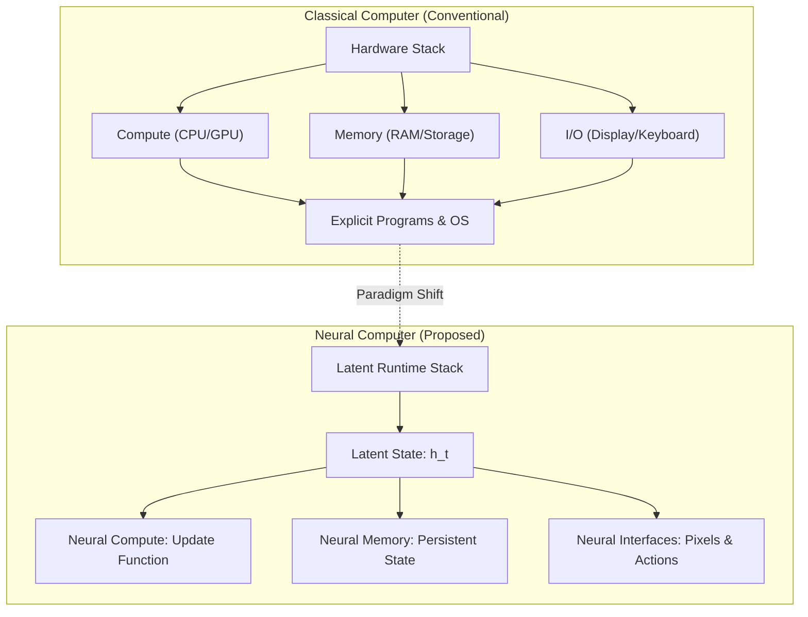
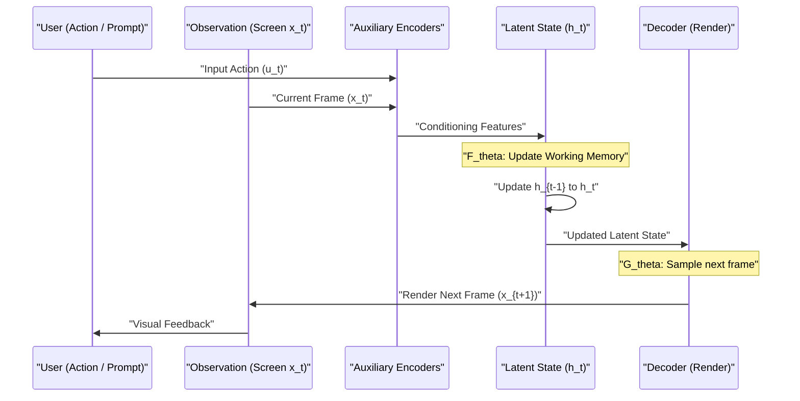
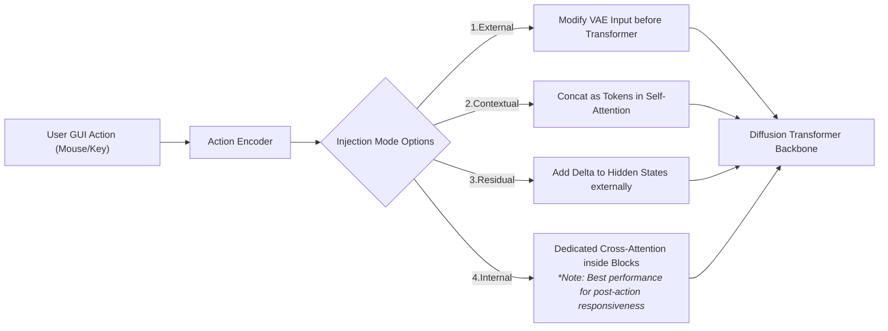

###### Created: 
2026-04-12
###### Tag: 
#paper
###### url_01:
[\[2604.06425\] Neural Computers](https://arxiv.org/abs/2604.06425)
###### url_02: 
[Neural Computer: A New Machine Form Is Emerging](https://metauto.ai/neuralcomputer/index_eng.html)
[GitHub - metauto-ai/NeuralComputer: 🖥 Neural Computers' Data Engine · GitHub](https://github.com/metauto-ai/NeuralComputer)
###### memo: 

---
本論文は、現在の人工知能システムのアーキテクチャの根幹に問いを投げかける、非常に野心的かつ興味深いプレプリント（査読前論文）です。私は計算機科学および人工知能アーキテクチャを専門とする立場から、本研究の意義、実験的裏付け、そして現時点での限界について、詳細かつ包括的に解説を行います。

---

# One line and three points

**一行解説：**
従来のコンピュータのように外部のハードウェアやOSに依存せず、ニューラルネットワークの「潜在状態」そのものが計算・メモリ・入出力のすべてを統合的に処理する全く新しい計算機パラダイム「Neural Computers（NCs）」の概念と、動画生成モデルを用いた初期プロトタイプを提唱した研究。

**3つのポイント：**
1. **概念のパラダイムシフト：** 既存の「AIエージェント（外部ツールを操作する）」や「世界モデル（環境の動態を予測する）」とは異なり、モデル自身を「実行可能なコンピュータそのもの」として扱うアーキテクチャを構想している。
2. **CLIおよびGUI環境での実証：** コマンドライン（CLI）とデスクトップ環境（GUI）の操作ログと画面推移を動画モデルに学習させ、カーソル移動やウィンドウ操作、テキスト出力などの「初期のランタイム基本動作」が高い忠実度で再現できることを示した。
3. **推論と長期安定性の壁：** 現状のプロトタイプは画面の「見た目の物理法則」を模倣することには長けているが、ネイティブな記号計算（算術など）や長期間にわたる動作の一貫性（ルーチンの再利用など）には顕著な限界があり、将来の「Completely Neural Computer（CNC）」実現に向けた技術的ロードマップを提示している。

---

# Summary

本論文「Neural Computers」は、Meta AIなどの研究チームによって発表された、計算機システムの新たな形態を提案する概念的かつ実証的な研究です。現代のデジタルコンピュータは、プロセッサ（計算）、RAM（メモリ）、そして画面やキーボード（入出力）というように、機能がモジュールとして物理的・ソフトウェア的に分離されています。本研究は、これらをニューラルネットワークの単一の「潜在状態（Latent runtime state）」の中に統合し、一つの学習された重みの集合体がコンピュータとして振る舞う「Neural Computers（NCs）」という枠組みを提案しています。

この野心的なアイデアを検証するため、研究チームは最先端の動画生成モデル（Wan2.1ベース）を基盤基質として採用し、2つのプロトタイプを構築しました。一つはコマンドラインインターフェースをシミュレートする「$NC_{CLIGen}$」、もう一つはマウスやキーボード操作に応答するデスクトップGUI環境をシミュレートする「$NC_{GUIWorld}$」です。実験の結果、これらのモデルは単なるランダムな動画生成にとどまらず、ユーザーの入力アクション（コマンドのタイプ、マウスクリック、スクロールなど）に対して、正確なピクセル単位のフィードバック（ハイライト、文字の描画、カーソルの軌跡）を返す「初期のランタイム機能」を獲得できることが実証されました。

しかし同時に、本研究は現状の限界も冷徹に分析しています。現在のNCは「画面の振る舞いを高精度にレンダリングすること」には成功していますが、背後で確固たる「記号的な論理計算」を行っているわけではありません。例えば、簡単な算術計算を実行させると、プロンプトで強いヒントを与えない限り失敗します。著者らは、現在のプロトタイプを最終目標である「Completely Neural Computer (CNC) — チューリング完全で、普遍的にプログラム可能で、動作が一貫している真のニューラル計算機」への第一歩と位置づけ、今後のAIシステム設計における新たなベンチマークとロードマップを提供しています。

---

# Briefing

このセクションでは、本論文の核となる概念から実験の具体的な設計、そして未来の展望に至るまで、読者が深いコンテキストを理解できるよう包括的に解説します。

### 1. 背景：既存のAIシステムとの決定的な違い
現在、大規模言語モデル（LLM）を中心とするAI技術は急速に発展しており、「AIエージェント」や「世界モデル（World Models）」といった概念が主流になっています。しかし、これらは従来のコンピュータのアーキテクチャを置き換えるものではありません。
*   **AIエージェント：** あくまで既存のOSやソフトウェアの「上に」存在し、人間の代わりにマウスを動かしたりコードを実行したりする存在です。計算の実体は外部のコンピュータに依存しています。
*   **世界モデル：** 物理世界やゲーム空間の「次の状態」を予測するシミュレータですが、それ自体がプログラムを保持し、長期間にわたって再利用可能な実行環境（ランタイム）として設計されているわけではありません。

著者らが提唱する**Neural Computers（NCs）**は、このギャップを埋めるものです。モデルそのものが「実行環境」となり、入力（キーボードやマウスのイベント）を受け取り、潜在空間内で状態を更新し、出力（画面のピクセル）をレンダリングします。つまり、OSや既存のアプリケーションスタックを介さず、ニューラルネットワークの計算経路だけで完結するコンピュータを創ろうという試みです。

### 2. プロトタイプの実装アプローチ
現状では、この概念を完全に実現する専用のネットワークアーキテクチャは存在しません。そこで著者らは、実用的な第一歩として「動画生成モデル（具体的にはWan2.1）」をハックし、これを対話型の実行環境として機能させるアプローチをとりました。

#### $NC_{CLIGen}$：コマンドライン環境の模倣
端末（ターミナル）画面は、テキストの厳密な配置と色彩が意味を持つ特殊な環境です。
*   **学習データと工夫：** オープンエンドな実際の操作ログと、合成されたクリーンな操作ログの両方を学習させました。ここでの驚きは、通常は自然画像向けに作られている動画モデルのVAE（変分オートエンコーダ）が、適切なフォントサイズ（13px程度）であれば、文字の輪郭やシンタックスハイライトの色を完璧に再構成できるという発見です。
*   **能力と限界：** モデルはパッケージのインストール画面やスクロールの挙動など、CLI特有の「物理法則」を見事に学習しました。OCR評価でも高いテキスト復元率を示しました。しかし、数式の計算（例：`10 + 15`）を入力すると、正しい答え（`25`）を計算して出力することができず、でたらめな数字を描画してしまいました。これは、現在のモデルが「計算」ではなく「もっともらしい画面の描画」を行っていることを如実に示しています。

#### $NC_{GUIWorld}$：デスクトップGUI環境の模倣
GUI環境では、マウスの動きとクリックに対する即座かつ正確な視覚的フィードバックが求められます。
*   **アクションの注入方法：** マウスやキーボードの入力信号を、トランスフォーマーのどの階層で統合するかが詳細に比較検証されました。結果として、ネットワークの深層部でクロスアテンションを通じてアクションを注入する「Internal mode」が、最も画面推移の整合性を保てる（ボタンのホバー状態などを正確に反映できる）ことが分かりました。
*   **カーソルに対する明示的な監督：** 単に「マウスの座標」を数値として与えるだけでは、モデルはカーソルを正確に描画できませんでした。そこで、画面上のカーソル部分だけを特別なマスク（SVGによる明示的な視覚的監督）として学習時に強制することで、98.7%という極めて高い精度でカーソルの追従性を実現しました。

### 3. 完全なニューラルコンピュータ（CNC）への道程
本論文の白眉は、現在のプロトタイプがいかに不完全であるかを認めた上で、**Completely Neural Computer (CNC)** という最終到達点を定義し、そこへ至るロードマップを敷いた点にあります。CNCとして認められるためには、以下の条件を満たす必要があります。
1.  **チューリング完全性：** 限られたタスクの模倣ではなく、任意の計算を表現できること。
2.  **普遍的なプログラム可能性：** 単発のプロンプトに応答するだけでなく、新しいルーチンを「インストール」し、後から呼び出せるようにすること。
3.  **動作の一貫性（Behavior-consistent）：** 明示的にアップデート（再プログラム）しない限り、同じ入力には同じように動作し、潜在状態が勝手にドリフト（崩壊）しないこと。

現行のNCは、この「再利用性」と「状態の長期的な一貫性」において大きな課題を抱えています。しかし、歴史上の計算機開発がそうであったように、明確な構成要素とテスト基準が設定されたことで、今後のモデル開発は単なる「高画質な動画生成」から「堅牢な計算基盤の構築」へとパラダイムシフトしていく可能性があります。

---

# FAQ

**Q1: Neural Computerは既存の「AI PC」や「エージェント機能付きOS」とはどう違うのですか？**
A1: 既存のAI PCやエージェントは、あくまで「Windows」や「macOS」といった従来のOSの上で動き、Pythonなどの外部コードを実行することでタスクをこなします。一方、Neural Computerは、ニューラルネットワークそのものがOSであり、CPUであり、メモリです。モデルの潜在状態（重みとアクティベーション）の中で直接計算と状態保持が行われ、外部のソフトウェアスタックを一切使用しません。

**Q2: 現在のNeural Computerで、実際にエクセルを使ったりプログラミングをしたりすることはできますか？**
A2: 現時点では不可能です。本論文のプロトタイプは「画面の振る舞いを極めて高精度にシミュレートしている（レンダリングしている）」段階にあり、背後で実際の表計算ソフトのロジックやコンパイラが動いているわけではありません。簡単な足し算すら間違えるレベルですが、「ボタンを押すとメニューが開く」といったインターフェースの物理法則は理解し始めています。

**Q3: 従来のコンピュータと比べて、Neural Computerの利点は何ですか？**
A3: 従来のコンピュータは厳密ですが、少しでもノイズや予期せぬ入力があるとクラッシュする脆さ（脆弱性）があります。Neural Computerは、連続的な数値（ベクトル）で計算を行うため、曖昧な指示やノイズに対して極めて堅牢です。また、自然言語のプロンプトやユーザーの操作履歴そのものを「プログラム言語」として直接解釈し、システムを柔軟に再構成できるという、人間中心のパラダイムを実現できる可能性があります。

---

# Critical Assessment（批判的評価）

本研究はプレプリント（2026年4月版、査読前）であり、その主張は非常に野心的ですが、以下の観点から批判的に評価する必要があります。

**方法論の妥当性：**
実験設計は非常に堅牢です。特にGUI環境における「アクションの注入方式（Injection modes）」のアブレーション（要素分解）実験や、OCRを用いたターミナル画面の厳密な評価指標の導入は、動画モデルを対話型システムとして評価するための優れた方法論を確立しています。しかし、「計算能力」を評価する手段が依然として「出力されたピクセルの正しさ」に依存しており、モデル内部でのアルゴリズム的処理が真に行われているのか、単に暗記したパターンを出力しているだけなのかを完全に分離できていないという制約があります。

**エビデンスの強度：**
プレプリント段階である本研究において、モデルが「初期のUIフィードバックや短時間のカーソル制御」を獲得できることへの証拠は、定量・定性の両面で強く支持されています（例：カーソル追従精度98.7%）。しかし、「NCが将来的に真の汎用計算機（CNC）になり得る」という主張は、現状では希望的な観測に基づく推測（Speculative claims）の域を出ません。算術タスクでの著しい失敗（正答率4%）が示す通り、拡散ベースの動画生成モデルがネイティブな記号推論能力を持つという明確な証拠は提示されていません。

**実用化への考慮：**
実環境への適用には絶望的なまでの課題が存在します。第一に、計算コストが膨大であり（毎フレームの画面遷移に重いTransformerの推論が必要）、従来のコンピュータのようなリアルタイムかつ省電力な動作は不可能です。第二に、長期的なコンテキストの保持（自己回帰的な状態の更新に伴うエラーの蓄積）に対する解決策が示されておらず、長時間の作業を行うとシステムの状態が崩壊するリスクがあります。現時点ではあくまで「概念実証（Proof of Concept）」の枠を出ません。

---

# For easy understanding

論文の重要なポイントを、専門知識がなくても分かるように噛み砕いて説明します。

**「コンピュータの脳みそ」をひとつのスープにしてしまう魔法の鍋**

今の私たちが使っているパソコンやスマートフォンは、「キッチン」のようなものです。
食材を入れる「冷蔵庫（メモリ）」があり、調理をする「コンロ（CPU）」があり、レシピが書かれた「本（プログラム）」があり、出来上がりを映す「窓（ディスプレイ）」があります。これらは別々の部品として作られており、厳密なルールに従って動いています。最近話題のAI（エージェント）は、このキッチンに入ってきて、人間の代わりにコンロの火をつけたり冷蔵庫を開けたりする「凄腕のロボットシェフ」のような存在です。

しかし、この論文の著者たちは全く違うことを考えました。
**「キッチン全体を、一つの巨大な『魔法のスープ鍋（ニューラルネットワーク）』にしてしまえないだろうか？」**

この魔法の鍋では、冷蔵庫もコンロもレシピも区別がありません。あなたが「フォルダを開きたい」と鍋に語りかける（入力する）と、鍋の中のスープが複雑に混ざり合い、直接「フォルダが開いた画面」という結果を生み出します。プログラムのコードを実行するのではなく、AIが過去に大量に見た「フォルダが開くときの映像と操作の記憶」をもとに、次に起こるべき状態を夢のように生成するのです。これが**「Neural Computer（NC）」**の基本的な考え方です。

**つまりこういうことです：今のAIは「天才的な絵描き」だが「数学者」ではない**

研究チームは、最新の「動画を作るAI」を改造して、この魔法の鍋を作りました。キーボードを叩いたり、マウスを動かしたりすると、それに合わせて画面の映像がリアルタイムで作られます。
実験の結果、このAIは**「見た目の法則」を真似る天才**であることが分かりました。「ここをクリックしたら、このボタンの色が変わるはずだ」「マウスを右に動かしたら、矢印も右に動くはずだ」といった画面の変化は、驚くほど正確に描画できました。

しかし、致命的な弱点もありました。
ターミナルの画面で「10 + 15 は？」と入力して実行させると、AIは「25」と答える代わりに、もっともらしいけど全然違う数字（例えば「48」）をそれっぽく画面に描いてしまったのです。
つまり、今のAIは「計算機っぽい画面を描くこと」はできても、頭の中で「本当の足し算」をしているわけではないのです。

**未来のコンピュータへの第一歩**

著者たちも、今のモデルが「本物のコンピュータ」だとは思っていません。しかし、この研究は重要です。なぜなら、「AIを使ってソフトウェアを操作する」時代から一歩進んで、「AIそのものが次世代のOSやコンピュータになる」という未来への設計図（ロードマップ）を初めて明確に描いたからです。いつの日か、この魔法の鍋が本当に計算や記憶の仕組みを身につけたとき、私たちが知っているコンピュータの形は根底から覆るかもしれません。

---

# Mermaid Diagrams

論文の内容を視覚的に理解するため、システム構成や時系列の動きを示す図表を作成しました。

## 概念図・構造図：従来のコンピュータとNeural Computerの比較

従来の物理的・機能的に分離されたモジュール構造から、単一の潜在状態へと統合されるパラダイムシフトを示します。

## タイムライン・シーケンス図：Neural Computerの動作ループ

NCがユーザーからの入力を受け取り、潜在状態を更新しながら次の画面フレームをレンダリングする一連の時系列プロセス（Update-and-Render Loop）を図示します。

## フローチャート・プロセス図：GUI環境におけるアクション注入モード

$NC_{GUIWorld}$の実験で検証された、ユーザーのアクション（クリックやキーボード入力）を動画生成モデルのアーキテクチャのどこに統合するか（Injection Modes）の分類を示します。

