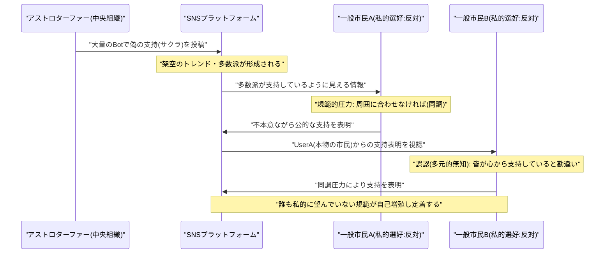
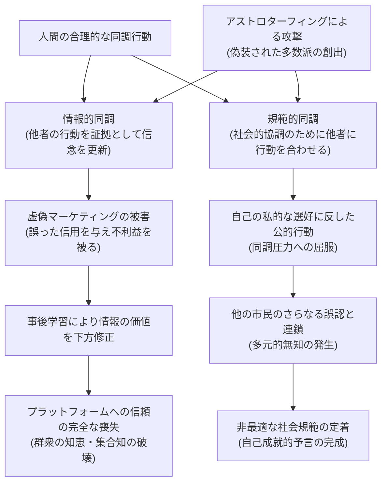

###### Created: 
2026-03-15
###### Tag: 
#paper
###### url_01:
[しばらくお待ちください...](https://journals.sagepub.com/doi/10.1177/01914537221108467)
###### url_02: 

###### memo: 

---
# One line and three points

オンラインにおけるアストロターフィング（偽の草の根運動）は、単なる偽情報の拡散にとどまらず、人間の「同調行動」という本来合理的なメカニズムを悪用することで、望ましくない社会規範を定着させ、群衆の知恵を根本から破壊する深刻な脅威である。

1. **同調行動の合理性の悪用：** 人間が他者の行動に従うこと（情報的同調および規範的同調）は、不確実な世界を生き抜くための合理的な生存戦略であるが、アストロターフィングはこの脆弱性ではなく「合理性」そのものを標的としている。
2. **多元的無知と自己成就的予言：** 偽の世論が人々の規範的同調を引き出すことで、私的には賛同していない人々までもが公的に同調し、結果として偽の世論が本物の社会規範として定着してしまう「多元的無知」の連鎖を引き起こす。
3. **集合知とプラットフォームへの信頼の破壊：** アストロターフィングの存在をユーザーが認知すること自体が、SNSなどのプラットフォームに対する信頼と有用性を毀損し、市民運動の組織化や「群衆の知恵」の形成という社会にとって極めて有益な機能を奪い去ってしまう。

# Summary

本論文は、Jovy Chanによって執筆され、ソーシャルメディア上で組織的に行われる欺瞞的行動の一種である「アストロターフィング（Astroturfing：偽の草の根運動）」が、一般に認識されている「フェイクニュースや偽情報の拡散」という枠組みを超えた、はるかに深刻な社会的問題を引き起こすメカニズムを哲学および社会科学的アプローチから解明したものです。著者は、人間の意思決定において「群衆に従う（同調する）」という行為が、進化生物学や認識論的観点から見て極めて合理的で有益なヒューリスティックであることをまず論証します。その上で、アストロターフィングはこの合理的な同調システム（情報的同調および規範的同調）を悪用し、架空の「群衆の支持」を偽装することで人々の意思決定を操作すると指摘します。この欺瞞は、虚偽のマーケティングと同様の被害をもたらすだけでなく、社会全体を「多元的無知（Pluralistic ignorance）」に陥れ、誰も望んでいない非最適な社会規範を定着させる自己成就的予言として機能します。さらに、世論の操作に対抗しようとしてアストロターフィングの存在を周知すること自体が、プラットフォームへの不信感を増幅させ、結果的に本物の市民運動の連携や「群衆の知恵（Crowd wisdom）」の抽出という有益な機能を破壊してしまうという、解決の困難なパラドックスを提示しています。

# Briefing

## 1. アストロターフィングの特異性と本質的な定義
近年、選挙や市民運動、公衆衛生の危機（COVID-19など）において、ソーシャルメディアを通じた「組織的かつ欺瞞的な行動（CIB: Coordinated Inauthentic Behaviour）」が深刻な問題となっています。その中でもアストロターフィングは、「特定の商品、政策、あるいは概念に対して、実際には限られた支持しか存在しないにもかかわらず、広範な支持があるかのような人為的な印象を作り出す行為」と定義されます。
多くの先行研究やプラットフォーマーの対策は、これを単なる「フェイクニュース（誤情報・偽情報）の拡散手段」として捉えがちです。しかし、著者はこの見方を不十分であると指摘します。アストロターフィングの真の恐ろしさは、発信される「内容」が虚偽であるかどうかではなく、その情報が「互いに独立した多数の一般市民から自然発生的に生み出されたものである」と偽装する点、すなわち「情報源と支持の規模に対する欺瞞」にあります。

## 2. 人間が「群衆に従う」ことの合理性（二つの同調メカニズム）
アストロターフィングの脅威を理解するためには、人間がなぜ群衆の行動に影響されるのかを理解する必要があります。哲学や自己啓発の世界では「個人の独立した思考（クリティカル・シンキング）」が推奨されがちですが、現実の不確実な世界において他者に同調することは、極めて合理的かつ適応的な行動です。論文ではこれを以下の二つの側面に分けて解説しています。

*   **情報的同調（Informational conformity）：**
    他者の行動を「世界に関する信頼できる証拠」として扱う心理メカニズムです。進化生物学が示すように、未知の環境（例：無人島でどの果物を食べるべきか）において、多数派の行動を模倣することは生存確率を高めるための最も効率的で低コストな戦略です。これを期待効用理論（EU theory）に当てはめると、群衆の行動を観察することで、事象が真である確率関数 $p(H)$ が合理的に更新されることを意味します。
*   **規範的同調（Normative conformity）：**
    集団内での摩擦を避け、社会的な協調や協力を円滑に進めるために他者の行動に合わせるメカニズムです。人間は社会的な動物であり、周囲の人々と行動を合わせること自体に「効用（価値）」を見出します。これは、個人の効用関数 $u(x)$ そのものが、他者との同調によって上昇することを意味し、集団全体の利益（囚人のジレンマにおける協力行動など）を最大化するために不可欠な心理的基盤です。

## 3. 第1の被害：虚偽マーケティングとしての側面
アストロターフィングは、前述の合理的な同調メカニズムをハックします。例えば、パンデミック中にボット群が「#ロックダウン終了」というハッシュタグを大量拡散したとします。これを見た一般ユーザーは、情報的同調（「みんなが安全だと言っているから、外に出ても大丈夫な確率が高いだろう」）と、規範的同調（「コミュニティの多数派が経済活動の再開を望んでいるなら、自分もそれに同調して仲間外れを避けよう」）の両方から強い影響を受けます。
もしこの「群衆」が少数の操縦者による偽物であった場合、ユーザーは本来与えるべきではない過剰な信頼（Credence）をその情報に与え、自らの意思決定を誤ることになります。これは、俳優を本物の医師と偽って歯磨き粉を宣伝するような「虚偽広告（False marketing）」と本質的に同じ構造の被害をもたらします。

## 4. 第2の被害：虚偽広告を超える社会的破壊（本質的な問題点）
本論文の中核的な主張は、アストロターフィングがもたらす害が、個人の誤った購買行動や意思決定（虚偽広告の被害）に留まらないという点にあります。これが大規模かつ効果的に行われた場合、以下の二つの壊滅的な結果を招きます。

*   **「多元的無知」を通じた望ましくない規範の定着：**
    専制主義国家（例えば中国の「五毛党」など）によるアストロターフィングを例に挙げます。偽のアカウント群が政府への強力な支持を偽装すると、それを見た（実際には政府に不満を持つ）一般市民も、規範的同調の圧力により公的には政府支持の姿勢を示してしまいます。すると、その「不本意な公的行動」を見た別の市民も「やはり皆が心から政府を支持しているのだ」と誤認し、さらに同調の輪が広がります。このように、私的な選好と公的な行動が乖離したまま、誰も望んでいない規範が自己強化的に社会に定着してしまう現象（多元的無知）が引き起こされます。アストロターフィングは単なる嘘を、「自己成就的予言」として本物の現実（真実）へと作り変えてしまう力を持っているのです。
*   **「群衆の知恵」とプラットフォームの有用性の不可逆的な破壊：**
    情報的同調による被害は、ユーザーが不利益を被った際（例：Yelpの偽レビューに騙されて美味しくないレストランに行った際）に、その経験から学習することで個人の信念が修正されるため、多元的無知のような自己増殖は起きにくいとされます。しかし、その代わりに「レビューサイトやSNS自体への信頼」が失われます。
    社会運動（アラブの春や香港の抗議デモなど）において、SNSは市民が独立した意見を集約し、集団としての最適解（群衆の知恵）を導き出すための不可欠なインフラです。「群衆の知恵」が機能するためには、各個人の意見が「独立していること」と「誠実であること」が前提条件となります。アストロターフィングは単一のソースからの偽装工作であるため、この前提を根底から破壊します。さらに恐ろしいことに、政府などが「SNSには工作員が多数潜んでいる」という事実を周知するだけで、ユーザーはすべての情報（本物の市民による真実の情報すらも）を疑うようになり、結果として民主的な連帯や情報の共有というプラットフォームの有用性が完全に無効化されてしまいます。

# FAQ

**Q1: アストロターフィングは、一般的なフェイクニュースの拡散と何が違うのですか？**
A1: フェイクニュースは「発信される情報の内容（命題）」が客観的に虚偽であることを指します。一方、アストロターフィングは、発信される内容自体は事実や単なる感情の表現（例：「この政策を支持する」など）であっても構いません。問題の本質は、「その情報を支持しているのは独立した多数の一般市民である」という「情報源の性質や規模」を偽装している点にあります。多数派の支持があるという錯覚を作り出すことで、人々の同調心理を不当に操縦する行為です。

**Q2: アストロターフィングに騙されるのは、ユーザーの「自分で考える力（個人主義的思考）」が不足しているからではないですか？**
A2: いいえ、そうとは言い切れません。不確実な世界において、他者の行動を参考にしたり（情報的同調）、コミュニティの多数派と行動を合わせたりすること（規範的同調）は、極めて合理的で理にかなった意思決定プロセスです。「すべてを自分一人で疑い、検証する」ことは時間的・コスト的に不可能であり、人類は進化の過程で「群衆に従う」という有益な生存戦略を獲得しました。アストロターフィングの恐ろしさは、人間の認知的な欠陥ではなく、この「合理的な機能」そのものを逆手に取ってハッキングする点にあります。

**Q3: アストロターフィングへの対策として、ユーザーに「工作員がいるから気をつけて」と警告することは有効ですか？**
A3: 一定の啓発にはなりますが、著者はそれがより深刻な副作用をもたらすと警告しています。プラットフォーム上に偽装された意見が溢れていることをユーザーが認識すると、彼らは「本物の独立した意見」すらも疑うようになります。結果として、市民が連携するためのソーシャルメディアの有用性が失われ、人類にとって有益なツールである「群衆の知恵」を生み出す土壌そのものが破壊されてしまいます。独裁的な政権にとっては、反体制運動の芽を摘むために「プラットフォームへの信頼を失墜させること」自体が目的化する場合すらあります。

# Critical Assessment（批判的評価）

**方法論の妥当性：** 
本研究は実証的なデータ収集（新たな実験や統計解析）を伴うものではなく、社会心理学、進化生物学、認識論、期待効用理論を統合した哲学的・理論的な分析枠組みを提示しています。理論構成は極めて論理的で説得力がありますが、限界として、アストロターフィングが実際に現実世界で「どの程度の確率で多元的無知を引き起こすのか」や「どの程度の規模のボット群が必要なのか」といった定量的な検証は今後の実証研究に委ねられています。

**エビデンスの強度：** 
本論文は学術誌『Philosophy and Social Criticism』に掲載された査読済み（Peer-reviewed）の論文です。ソロモン・アッシュの同調実験や、Boyd & Richersonの文化進化論など、確立された学術的証拠を基盤として自身の主張を展開しており、理論的な証拠の強度は高いと評価できます。ただし、中国の五毛党などの具体例は既存の他者研究（King, Pan, and Robertsなど）に依存しており、新たな一次データを提供しているわけではありません。

**実用化への考慮：** 
本研究は、プラットフォーム企業や法規制当局（米連邦取引委員会FTCなど）に対する極めて重要な示唆を与えています。具体的には「警告ラベルを貼付するだけでは根本的な解決にならないどころか、プラットフォームの信頼性を完全に損なう」というジレンマの提示です。実環境における課題としては、本論文が「では具体的にどうすればプラットフォームの信頼性を保ちつつ工作を防げるのか」という技術的・制度的な独自解（own remedy）の提示にまでは至っておらず、今後の政策的議論が必要である点が挙げられます。

# For easy understanding

私たちが日常で何かを決める時、「みんながやっているから」という理由を選ぶのは、実はとても理にかなっています。
例えば、見知らぬ街で夕食を食べる時、ガラガラのお店よりも、地元の人で行列ができているお店を選びますよね。これは「たくさんの人が選んでいるのだから美味しい確率が高いはずだ」と推測するからです（**情報的な同調**）。
また、コンサートの終わりに周りの人が立ち上がって拍手をし始めたら、自分もスタンディングオベーションに加わりますよね。これは「周りに合わせて行動を共にすることで、その空間の居心地を良くしたい」という人間本来の社会的な欲求からです（**規範的な同調**）。

本論文が指摘する「アストロターフィング（偽の草の根運動）」の恐ろしさは、人間のこの**「周りに合わせるという素晴らしい能力」を根底から狂わせてしまう**ことです。

アストロターファー（工作員）は、大量のSNSアカウントやボットを使って、「世間の大多数がこれを支持している！」という**架空の行列**を作り出します。
すると、それを見た私たちは「こんなに行列ができているなら正しいに違いない」「みんなが賛成しているなら、自分も賛成しないと仲間外れになる」と感じてしまい、彼らに同調してしまいます。

つまりこういうことです。
「フェイクニュース」が単なる**嘘の看板**を立てる行為だとしたら、「アストロターフィング」は**サクラ（偽客）を大量に雇って熱狂的な大群衆を演じさせる行為**なのです。

さらに恐ろしいことに、この「サクラの群衆」の影響力が強すぎると、本来は賛成していなかった本物の市民たちまでもが次々と「同調」してしまい、最終的には**「誰も本当は望んでいなかったのに、気づけば社会全体のルール（規範）になってしまっていた」**という悲劇（多元的無知）が起こります。中国のような権威主義国家がSNS上の世論を操作できるのは、このメカニズムを利用しているからです。

さらに著者は、「SNSにはサクラがたくさんいるから信じないようにしよう」と警告するだけではダメだと言います。なぜなら、疑心暗鬼になった市民は、本物の市民が助けを求めている声や、社会を良くするための真っ当な意見すらも信じられなくなり、SNSを通じた民主的な活動や「みんなの知恵を集める機能」が完全に死んでしまうからです。アストロターフィングは、私たちが社会として賢く生きるための土台そのものを破壊する毒なのです。

# Mermaid Diagrams

## タイムライン・シーケンス図

## 概念図・構造図

