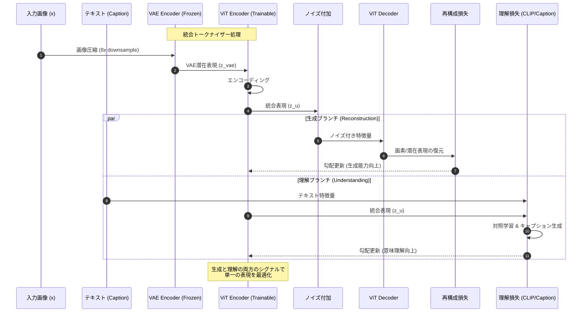
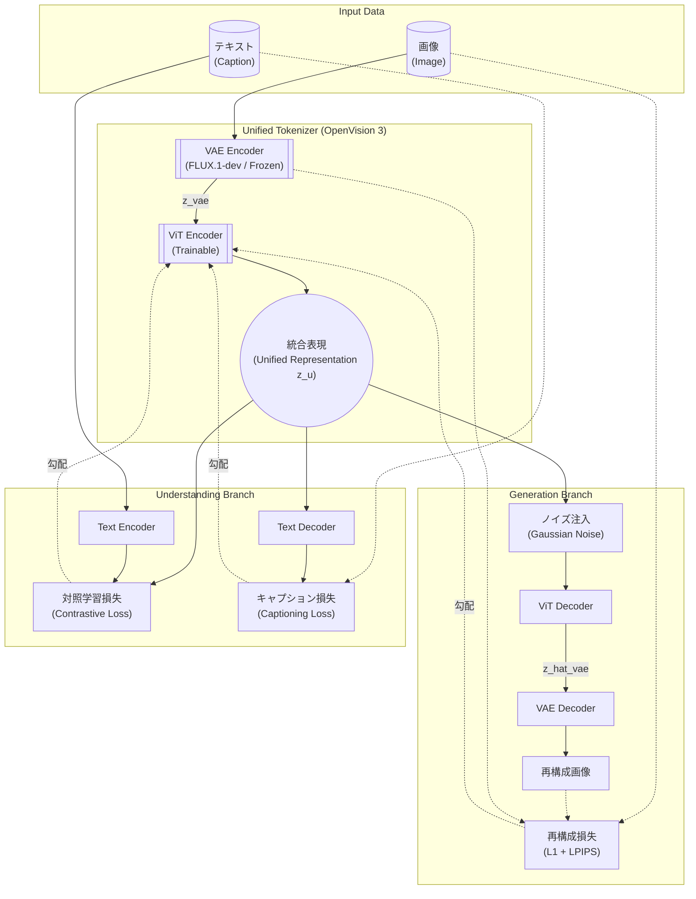
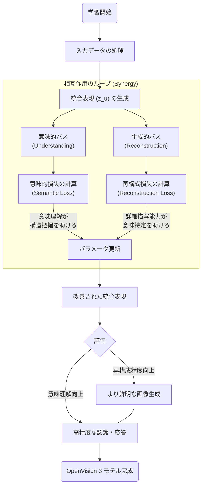

###### Created: 
2026-01-29 11:37 
###### Tag: 
#paper #unifiedvisionmodel 
###### url_01:
https://arxiv.org/abs/2601.15369 
###### url_02: 
[OpenVision 3: Project Page](https://ucsc-vlaa.github.io/OpenVision3/)
###### memo: 

---

<!-- paper_extractor:summary:start -->

本論文「OpenVision 3: A Family of Unified Visual Encoder for Both Understanding and Generation」の解説を行います。この研究は、近年のマルチモーダルAIにおける「理解（Understanding）」と「生成（Generation）」の断絶という重要な課題に対し、シンプルかつ強力な統合アプローチを提案したものです。

# One line and three points

**FLUXのVAE潜在空間上でViTを学習させることで、画像の「意味理解」と「詳細な再構成」を高い次元で両立させた、統合型視覚エンコーダ（Tokenizer）の提案。**

1.  **統合アーキテクチャの革新:** 固定された高性能VAE（FLUX.1-dev）と学習可能なViTを組み合わせ、生成のための再構成タスクと、理解のための対照学習（CLIP的タスク）を同時に行う「デュアルブランチ」構造を採用しています。
2.  **相互作用の発見:** 「意味理解の学習が画像の再構成精度を向上させ、逆に再構成の学習が意味理解を助ける」というシナジー効果（相互補完性）を実験的に立証しました。
3.  **SOTAの達成:** 既存の統合型トークナイザー（UniTokなど）を凌駕する再構成・生成性能（gFID 1.89 vs 2.54）を示しつつ、OpenAI CLIPと同等以上のマルチモーダル理解能力（SeedBench 62.4 vs 62.2）を達成しました。

# Summary

本研究は、UCサンタクルーズ校やNVIDIAなどの研究チームによって提案された**OpenVision 3**に関するものです。
現在のマルチモーダルモデル（UMM）は、視覚情報の「理解（Understanding）」と「生成（Generation）」のために、それぞれ別のエンコーダを用意するか、あるいは離散的な量子化を用いた共有トークナイザーを使用するのが一般的です。しかし、前者はシステムが複雑になり、後者は量子化誤差による生成品質の低下や学習の不安定さを招くという課題がありました。

OpenVision 3は、**連続的な（continuous）視覚トークナイザー**として設計されました。その核心は、事前に学習された強力なVAE（FLUX.1-dev）の潜在空間表現を入力とし、その上にViT（Vision Transformer）エンコーダを積み上げるというシンプルな構造にあります。
このエンコーダからの出力は、2つの異なるブランチに送られます。一つは元の画像を復元するための「再構成ブランチ」、もう一つはテキストとの意味的な整合性を学習する「理解ブランチ」です。

実験の結果、このモデルは画像の生成品質（ImageNetでのgFIDなど）において既存の統合モデルやCLIPベースの生成手法を大きく上回り、同時にLLaVA-1.5フレームワークに組み込んだ際の理解能力でもCLIPと互角以上の性能を示しました。これにより、単一の視覚表現で理解と生成の両方を高度にサポートできることが実証されました。

# Briefing

**背景と課題：**
「プラトン的表現仮説（Platonic Representation Hypothesis）」が示唆するように、異なるモダリティ（視覚、言語など）は共有された現実を反映しているはずであり、理想的には単一の表現で統合されるべきです。しかし、実際には「高レベルの意味論（Semantic）」と「低レベルの画素詳細（Pixel-level）」の間には表現上のギャップがあり、これらを単一のモデルで同時に扱うことは困難でした。既存の手法（UniFluidやBAGELなど）は二重エンコーダを採用して回避したり、離散トークン（VQGAN系）を用いて統合を試みたりしてきましたが、品質と効率のトレードオフに直面していました。

**提案手法（OpenVision 3）：**
OpenVision 3は、以下の設計によりこのギャップを埋めています。
1.  **Frozen VAE + Trainable ViT:** 入力画像をまず固定されたFLUX VAEで圧縮し、その潜在表現を学習可能なViTでさらにエンコードします。これにより、初期段階で質の高い視覚的特徴を確保します。
2.  **二目的最適化（Dual-Objective Optimization）:**
    *   **生成側:** 符号化された特徴量にノイズを加え、ViTデコーダとVAEデコーダを通して画像を再構成させます（画素レベルの忠実度を担保）。
    *   **理解側:** 同じ特徴量を用いて、キャプション生成とテキストとの対照学習（Contrastive Learning）を行います（意味レベルの整合性を担保）。
3.  **プログレッシブ学習:** 低解像度から高解像度へと段階的に学習を進めることで、計算コストを抑えつつ性能を最大化しています。

**主な成果：**
*   **生成性能:** ImageNet 256x256の生成タスク（RAEフレームワーク下）において、gFIDスコア**1.89**を記録し、CLIPを用いた場合の2.54や、他の統合モデルを大きく引き離しました。
*   **理解性能:** マルチモーダルベンチマーク（SeedBench, POPEなど）において、OpenAI CLIP (L/14) と同等、あるいはそれを上回るスコアを記録しました。
*   **相互作用の解明:** アブレーション研究により、意味的損失（Semantic Loss）を加えることが再構成エラーを減少させることが判明しました。これは、意味を理解することが細部の描画にも役立つことを示唆しています。

# FAQ

**Q1: なぜVAEとViTを組み合わせるのですか？**
A1: VAE（特にFLUXのような最新のもの）は画像の低レベルな詳細情報を圧縮する能力に長けていますが、意味的な抽象化は弱いです。ViTは逆に広範な文脈理解に優れています。OpenVision 3は、VAEで圧縮された情報をViTで処理することで、詳細さと意味的抽象度の両方を保持した表現を獲得します。

**Q2: 既存の「UniTok」や「TokenFlow」との違いは何ですか？**
A2: 最大の違いは、それらが主に「離散的（Discrete）」なトークン（ベクトル量子化など）を使用するのに対し、OpenVision 3は「連続的（Continuous）」な表現を使用する点です。離散化は情報の損失を招きやすいですが、連続的な表現を用いることで、より高品質な画像の再構成と生成が可能になります。また、学習プロセスがよりシンプルで安定的です。

**Q3: 「理解」と「生成」のタスクは互いに邪魔をしないのですか？**
A3: 本研究の最も興味深い発見の一つがここにあります。実験の結果、これらは競合するのではなく、**相乗効果（Synergy）**を生むことがわかりました。具体的には、テキストとの対照学習（理解タスク）を行うだけで、明示的な再構成訓練を行わなくても画像の再構成精度が向上することが確認されています。

**Q4: このモデルはすぐに使えるのですか？**
A4: 著者らは、コード、データ、および学習済みチェックポイントを完全にオープンソース化する予定であると述べています。これにより、コミュニティは容易にこの新しいトークナイザーを利用・検証できるようになります。

# Critical Assessment（批判的評価）

**方法論の妥当性：**
実験設計は堅牢です。特に、生成（Reconstruction/Generation）と理解（Understanding）の双方について、標準的なベンチマーク（ImageNet, COCO, LLaVAフレームワーク上でのMME/SeedBench等）を用いて広範に評価しています。また、アブレーションスタディにおいて、各損失関数（Reconstruction Loss, Semantic Loss）が互いにどう影響し合うかを視覚化・定量化している点は、提案手法の背後にあるメカニズムの妥当性を強く支持しています。固定されたVAE（FLUX）を利用する点は、計算資源の効率化という観点からも合理的です。

**エビデンスの強度：**
主張は強力な定量的証拠に支えられています。特に生成タスクにおけるgFIDの改善幅（CLIP比で約25%改善）は顕著です。理解タスクにおいてもCLIPと同等以上の性能を出している点は評価に値します。ただし、本稿はarXivプレプリント（査読前）であるため、第三者による検証や、より多様な生成モデル（DiT以外）との組み合わせにおける汎用性の確認が待たれます。また、FLUX VAEへの依存度が高いため、VAEの性能がボトルネックになる可能性は考慮すべきです。

**実用化への考慮：**
実用性は極めて高いと考えられます。特に、単一のエンコーダでマルチモーダルLLMの視覚部と画像生成モデルの条件付け部の両方を担えるため、メモリ効率やデプロイの簡素化に寄与します。ただし、トレーニングには高品質なキャプションデータ（Recaptioned DataComp）が必要であり、このデータ準備のコストや、高解像度化（256x256以上）した際の計算コストのスケーリングについては、実環境での適用時における課題となる可能性があります。

# For easy understanding

この論文のポイントを、**「優れた画家は、優れた評論家でもある」**という例えで説明しましょう。

これまでのAIの世界では、役割分担がはっきりしすぎていました。
*   **評論家AI（理解担当）：** 「これは公園で遊ぶ犬の絵だね」と意味はわかりますが、自分で絵を描くのは苦手です（例：CLIP）。
*   **画家AI（生成担当）：** 筆使いや色の塗りは超一流ですが、「楽しそうな雰囲気」といった抽象的な意味を理解するのは少し苦手で、指示がないと何を描いていいかわかりません（例：VAE/Diffusion）。

これらを無理やり合体させようとすると、「評論家の言葉が画家に通じない」「画家のこだわりを評論家が理解できない」といったコミュニケーションの不一致が起きていました。

**OpenVision 3**は、一人二役を完璧にこなす「スーパーアーティスト」を育成するシステムです。
このAIは、一枚の絵を見たときに、以下の2つを同時に脳内（ViTエンコーダ）で行います。
1.  **「どうやって描かれているか」を覚える（再構成）：** 画家の視点で、筆のタッチや細かい色合いを記憶します。
2.  **「何が描かれているか」を理解する（意味理解）：** 評論家の視点で、それが「公園の犬」であることを言葉と結びつけます。

この研究のすごいところは、**「意味を深く理解しようと努力すると、結果的に絵の細部もよく見えるようになる」**ということを発見した点です。「これは犬だ」とわかるからこそ、「じゃあ毛並みをもっとフサフサに描かないと」と気づける、というような相互作用がAIの中で起きているのです。

結果として、このモデルは「言葉の意味もわかるし、超リアルな絵も描ける」という、万能な「目（Visual Encoder）」を手に入れました。これは将来、私たちがAIと話しながら、その場で完璧な絵を描いてもらうような体験を、よりスムーズで高品質にするための重要なステップになります。

# Mermaid Diagrams

## シーケンス図：OpenVision 3の学習プロセス
ここでは、入力画像がどのように処理され、生成と理解の双方で学習が行われるかを示します。

## 概念図：OpenVision 3のアーキテクチャ構成
システム全体の構成要素とデータの流れを視覚化します。

## フローチャート：シナジー効果のメカニズム
本論文の核心である「理解」と「生成」の相互作用のロジックを示します。

<!-- paper_extractor:summary:end -->