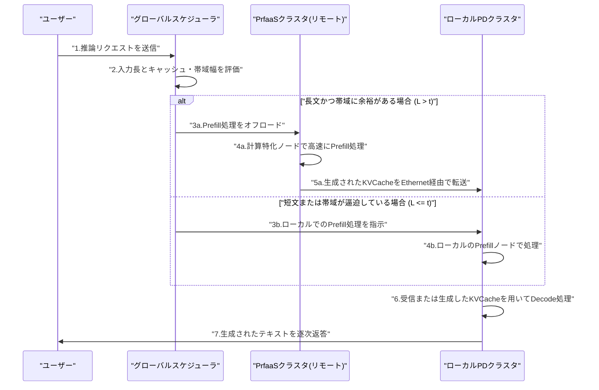
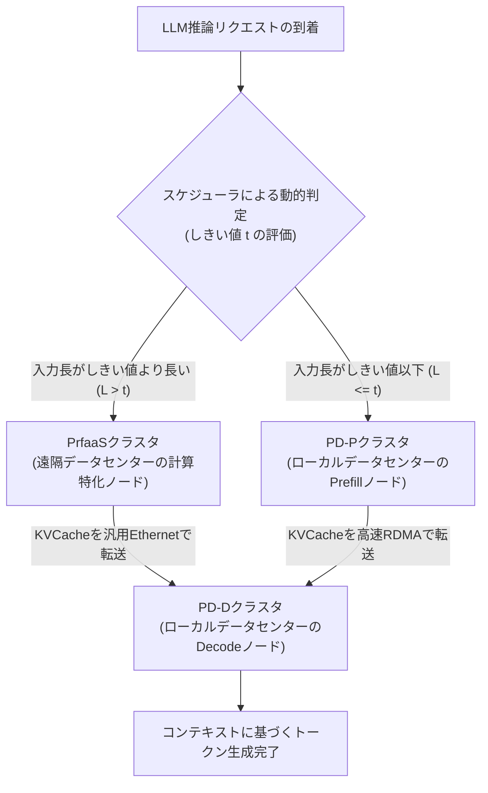

###### Created: 
2026-04-21 13:13 
###### Tag: 
#paper
###### url_01:
https://arxiv.org/abs/2604.15039 
###### url_02: 

###### memo: 

---

<!-- paper_extractor:summary:start -->

# One line and three points
次世代のハイブリッドアテンションモデルがもたらすKVCacheの大幅な削減を活かし、計算負荷の高いPrefill（入力処理）のみを別データセンターの計算特化クラスタに選択的にオフロードすることで、高効率かつ低コストな大規模言語モデルの分散推論を実現する「Prefill-as-a-Service（PrfaaS）」アーキテクチャを提案した研究です。

* 従来の密なアテンション（Dense Attention）モデルではKVCacheのデータ量が膨大であり、PrefillとDecodeを同一データセンター内の高価なRDMAネットワーク上に配置せざるを得ませんでしたが、最新のハイブリッドモデルの特性を利用することで、安価な汎用イーサネットを介したクロスデータセンターでの分散処理を可能にしました。
* ネットワークの輻輳やトラフィックの偏りに対応するため、リクエストの入力長やキャッシュの局所性に基づいて処理を振り分ける「選択的オフロード」と、短期的・長期的な変動に適応する「デュアルタイムスケール・スケジューリング」というシステムレベルの精巧な制御を導入しています。
* 内部の1兆パラメータ規模のモデルを用いたケーススタディにおいて、同種ハードウェアのみを用いた従来の構成と比較してシステム全体のスループットを54%向上させ、かつ長いリクエストの初回トークン生成時間（TTFT）を64%削減しつつ、データセンター間の帯域幅消費を十分に現実的な範囲に抑えることに成功しています。

# Summary
本論文は、大規模言語モデル（LLM）の推論におけるPrefill-Decode（PD）分離アーキテクチャの新たなパラダイムを提示するプレプリント（査読前論文）です。近年、LLMの推論効率を高めるために、計算律速であるPrefillフェーズとメモリ帯域律速であるDecodeフェーズを別々のハードウェアに分離するPD分離が標準化しつつあります。しかし従来は、Prefillフェーズで生成されるKVCacheのデータ量が膨大であったため、両者を数Tbpsクラスの超高速通信網（RDMAなど）で結ばれた単一のデータセンター内に配置しなければならないという「帯域幅の壁」が存在していました。

本研究は、Kimi LinearやSWA（Sliding Window Attention）などの「ハイブリッドアテンションアーキテクチャ」を採用した次世代モデルにおいて、KVCacheの生成量が劇的に（従来の10分の1以下などに）削減されるという特性に着目しました。このモデル側の進歩を基盤とし、システム側に「Prefill-as-a-Service（PrfaaS）」という新たな概念を導入しています。PrfaaSでは、すべてのリクエストを分離するのではなく、計算負荷が高くアクセラレータの恩恵を受けやすい「長文のPrefill」のみを、遠隔地にある計算特化型のハードウェアクラスタ（PrfaaSクラスタ）へ選択的にオフロードします。そして、生成されたKVCacheを汎用イーサネット経由でローカルのPDクラスタへ転送し、Decodeフェーズを実行します。

この構成を実運用に耐えうるものにするため、著者らはネットワーク帯域とキャッシュ分布を考慮した高度なルーティングと、ローカルクラスタ内のリソース割り当てを動的に最適化するスケジューリング手法を開発しました。1兆パラメータのハイブリッドモデルを用いた評価では、従来型の単一クラスタ構成に比べてスループットと遅延の両面で劇的なパフォーマンス向上を達成しており、モデル構造の革新とシステムレベルの最適化を組み合わせることで、地理的に分散した異種ハードウェア間での効率的なLLM推論が可能であることを実証しています。

# Briefing
大規模言語モデルの社会実装が進む中、推論インフラストラクチャにおける最大のボトルネックは「Prefillフェーズ（プロンプトの読み込みと理解）」と「Decodeフェーズ（トークンの逐次生成）」という、全く異なる計算特性を持つプロセスをいかに効率よく処理するかという点に集約されます。Prefillは高度な並列計算を要する演算律速のプロセスであり、Decodeは過去の文脈データ（KVCache）を何度もメモリから読み出す必要があるメモリ帯域律速のプロセスです。この相反する特性を最適化するため、近年ではそれぞれの処理を異なるGPUノードに割り当てる「PD分離（Prefill-Decode Disaggregation）」というアーキテクチャが主流となっています。

しかし、従来のPD分離には地理的・物理的な厳しい制約がありました。標準的なTransformerアーキテクチャ（Dense Attention）では、入力テキストが長くなるほど指数関数的・線形的に巨大なKVCacheが生成されます。例えば、数万トークンの入力を処理した場合、単一のリクエストだけで数十GBのKVCacheが生成されることも珍しくありません。この膨大なデータをPrefillノードからDecodeノードへ転送するためには、遅延を極限まで減らしたRDMAクラスの超高速ネットワーク（数Tbpsの帯域幅）が不可欠であり、結果として「異なる計算特性を持つプロセッサ同士を、同じデータセンターの同じネットワークスイッチの下に物理的に同居させなければならない」という強い制約が生じていました。

本論文が突破口としたのは、近年台頭している「ハイブリッドアテンションアーキテクチャ」の存在です。これは、少数のフルアテンション層と、多数の線形計算層（Linear Attentionなど）を組み合わせたモデル構造であり、推論精度を維持しながらもKVCacheのサイズを劇的に縮小することに成功しています。著者らのプロファイリングによれば、こうした次世代モデルではKVCacheの生成スループットが従来の10分の1以下に低下します。これにより、データセンター間を結ぶ一般的なイーサネット（数十〜数百Gbps）の帯域幅であっても、KVCacheの転送が理論上可能になるというパラダイムシフトが起きました。

ただし、モデル側のデータ量が減ったからといって、システム側で無闇に処理を分散させれば良いわけではありません。実際の推論トラフィックはバースト的（突発的に集中する）であり、ユーザーからの入力長にも極端な偏りがあるため、単純にネットワーク越しにデータを送るとあっという間にイーサネットの帯域が飽和し、深刻な遅延を招きます。そこで本論文は「Prefill-as-a-Service（PrfaaS）」という洗練されたアーキテクチャを提案しています。これは、短いリクエストや帯域を圧迫しやすい処理はこれまで通りローカルのPDクラスタ内で完結させ、計算能力の恩恵を最大限に受けられる「十分に長いリクエスト」のPrefillのみを、遠隔地にある計算特化型のPrfaaSクラスタへ選択的にオフロードするというアプローチです。

このアーキテクチャの中核を担うのが、「デュアルタイムスケール・スケジューリング」と呼ばれる高度なリソース管理機構です。短期的なスケールでは、スケジューラがネットワークの現在の空き帯域や、各データセンターに分散保存されているキャッシュの局所性（どのデータセンターに過去の文脈がキャッシュされているか）をミリ秒単位で評価し、リクエストをリモートに送るかローカルで処理するか（しきい値 $t$ の最適化）を動的に決定します。一方、長期的なスケールでは、全体的なトラフィックの増減傾向を分析し、ローカルデータセンター内におけるPrefillノードとDecodeノードの比率を柔軟に再構成することで、システム全体のスループットが常に最大化されるようバランスをとります。

著者らが内部で開発した1兆パラメータ規模のハイブリッドモデルを用いて検証した結果、このPrfaaS構成は、同種のハードウェアで構築された従来の単一クラスタ構成と比較して、全体のスループットを54%向上させました。さらに、最も計算時間を要する長文リクエストの初回トークン生成時間（TTFT）の90パーセンタイル値を64%も削減するという極めて優れた応答性の改善を示しています。その一方で、リモートのPrfaaSクラスタからローカルへのデータ転送にかかる帯域幅は平均13Gbps程度に収まっており、一般的なデータセンター間ネットワークの容量内に十分に収まることが証明されました。これは、モデルアーキテクチャの革新と分散システム設計の高度な融合が、次世代LLMインフラストラクチャの地理的制約を取り払い、より柔軟でコスト効率の高いクラウドアーキテクチャを実現するための重要なマイルストーンとなる研究です。

# FAQ

**Q1: なぜこれまでPrefill（入力処理）とDecode（生成処理）を別々のデータセンターに分けることができなかったのですか？**
従来のモデル（Dense Attention）では、入力されたテキストの長さに比例して「KVCache」と呼ばれる中間データが膨大に生成されていました。これを別のデータセンターに送ろうとすると、一般的なインターネット回線や専用線（イーサネット）の通信容量（帯域幅）をあっという間に使い切ってしまい、転送待ちによる激しい遅延が発生してしまうためです。そのため、超高速な専用ネットワーク（RDMA）で結ばれた単一のデータセンター内で処理を完結させる必要がありました。

**Q2: ハイブリッドアテンションモデルになれば、すべてのリクエストを別データセンターに送って処理しても問題ないのでしょうか？**
いいえ、すべてのリクエストを送ることは推奨されません。ハイブリッドモデルによってKVCacheのサイズは劇的に小さくなりましたが、短い文章のリクエストは元々計算負荷が低いため、遠隔地に送って処理し、データを送り返してもらうネットワークの往復時間（レイテンシ）の方が無駄になってしまいます。本研究の提案手法では、高度な計算能力を必要とする「長いリクエスト」だけを賢く選別して別データセンター（PrfaaS）に任せることで、ネットワークの渋滞を防ぎつつシステム全体の効率を最大化しています。

**Q3: 提案されている「デュアルタイムスケール・スケジューリング」とは具体的にどのような働きをするのですか？**
システムを交通整理する優秀な管制官のような役割を果たします。「短期的スケール」では、今現在のネットワークの混雑具合やデータのキャッシュ状況を瞬時に判断し、リクエストごとに「遠隔地に送るべきか、手元で処理すべきか」の境界線（しきい値）を微調整します。一方、「長期的スケール」では、1日の中でのアクセス数の増減などの大きなトレンドを把握し、ローカルデータセンター内で「入力処理を行うサーバー」と「生成処理を行うサーバー」の台数比率を根本的に見直し、ボトルネックが発生しないようシステム構造を適応させます。

# Critical Assessment（批判的評価）

本研究を以下の観点から批判的に評価します。なお、本論文はプレプリント（非査読論文）であり、今後の学術的なピアレビューを経て主張の妥当性がさらに検証されるべき段階にあることに留意が必要です。

**方法論の妥当性：** 
理論的なスループットモデルを構築し、それに基づく数理的な最適化（グリッドサーチ等）を用いてスケジューリングの有効性を立証した実験設計は論理的で強固です。しかし、評価に用いられたモデルが特定のプロプライエタリなアーキテクチャ（内部の1TパラメータKimi Linear派生モデル）に限定されている点は制約です。LLaMAやQwenといった一般に広く普及しているオープンなハイブリッドモデルを用いたベンチマークが追加されれば、手法の汎用性がより客観的に証明されるでしょう。

**エビデンスの強度：** 
シミュレーションと実機プロファイリングを巧みに組み合わせた実証は、提案アーキテクチャのポテンシャルを強く支持しています。しかし、前述の通りプレプリント段階であることに加え、実トラフィックで発生しうる予測不可能な急激なスパイクや、ノード障害時のフェイルオーバー挙動など、システムの耐久性を示す長期的な稼働データが不足しているため、大規模運用における絶対的な安定性の証明には至っていません。

**実用化への考慮：** 
理論上は100Gbps程度の汎用イーサネットで転送可能とされていますが、実際のパブリッククラウド間やVPCを跨ぐ通信では、パケットロスやレイテンシのジッタ（遅延の揺らぎ）が避けられません。このようなネットワークの不安定性が、ユーザーが体感するテールレイテンシ（ごく一部のリクエストで発生する極端な遅延）にどのような悪影響を及ぼすかについての分析が不足しており、実環境へのシームレスな適用には、転送プロトコルの更なる堅牢化といった課題が残されています。

# For easy understanding

この論文が成し遂げた革新を、**「超巨大なレストランの厨房と配膳システム」**に例えて説明しましょう。

AIが文章を生成するプロセスは、大きく2つの作業に分かれます。
1つは、お客さんの長い注文を読み込んで材料を下ごしらえする作業（**Prefill**）。これは非常に頭を使い、時間と労力がかかります。
もう1つは、その下ごしらえした材料を使って、料理をひと皿ずつ順番に盛り付けて提供していく作業（**Decode**）です。こちらはスピード勝負です。

**これまでの問題点（旧世代のモデル）：**
これまでのAI（密なアテンションモデル）は、下ごしらえの段階で信じられないほど大量の「半調理済みの食材（KVCache）」を作り出していました。あまりに量が多いため、トラックで別の工場に運ぼうとすると道が完全に大渋滞してしまいます。そのため、どんなに場所が手狭でも「下ごしらえ専用のコック」と「盛り付け専用のスタッフ」を、同じ建物の巨大で高価な厨房（単一のデータセンター）の中に無理やり詰め込んで作業させるしかありませんでした。

**今回のブレークスルー（ハイブリッドモデルの登場）：**
最近になって、AIのレシピが劇的に進化しました（ハイブリッドアテンション）。新しいレシピでは、下ごしらえの工程を工夫することで、味（AIの賢さ）を全く落とさずに、できあがる半調理済みの食材の量を**10分の1以下**にまで圧縮することに成功したのです。

**論文が提案する新しいシステム（PrfaaS）：**
食材の量が減ったことで、素晴らしいアイデアが実現可能になりました。それは、**「時間のかかる大掛かりな下ごしらえだけを、遠く離れた場所にある最新鋭の巨大工場（PrfaaSクラスタ）に外注する」**という方法です。
最新鋭の巨大工場で素早く下ごしらえされた少量の食材は、一般道のトラック（安価なイーサネット回線）に乗せて、街角の配膳専用店舗（ローカルデータセンター）へ余裕で運ぶことができます。

ただし、**「賢い店長（スケジューラ）」**の存在が不可欠です。お客さんからの短い簡単な注文までいちいち遠くの工場に外注していては、トラックの往復時間がもったいないですよね。そこで店長は、注文の長さやトラックの空き状況を瞬時に判断し、**「すごく時間のかかる大口注文だけを遠くの工場に送り、簡単な注文はこれまで通り店舗の裏でサッと下ごしらえする」**という見事な采配を振るいます。

**つまりこういうことです：**
この研究は、AIのモデルがスマートになった特性を最大限に活かし、計算処理を物理的に離れた複数のデータセンターに賢く分散させる仕組みを作り上げました。これにより、高価なスーパーコンピューター環境に縛られることなく、安価な通信回線を使いながらも、AIの応答速度と処理能力を飛躍的に向上させることができるようになったのです。

# Mermaid Diagrams

論文の核心である「Prefill-as-a-Service (PrfaaS)」のアーキテクチャにおいて、リクエストがどのように評価され、計算特化型のリモートクラスタとローカルクラスタの間で処理が分担されるかを示すシーケンス図、およびシステム全体の判定フローを図示します。

## タイムライン・シーケンス図

## フローチャート・プロセス図

<!-- paper_extractor:summary:end -->