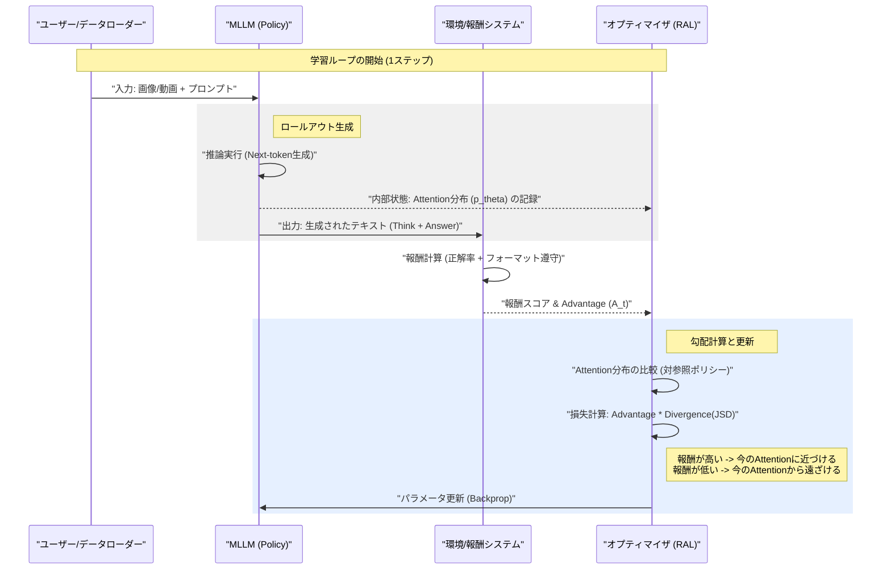
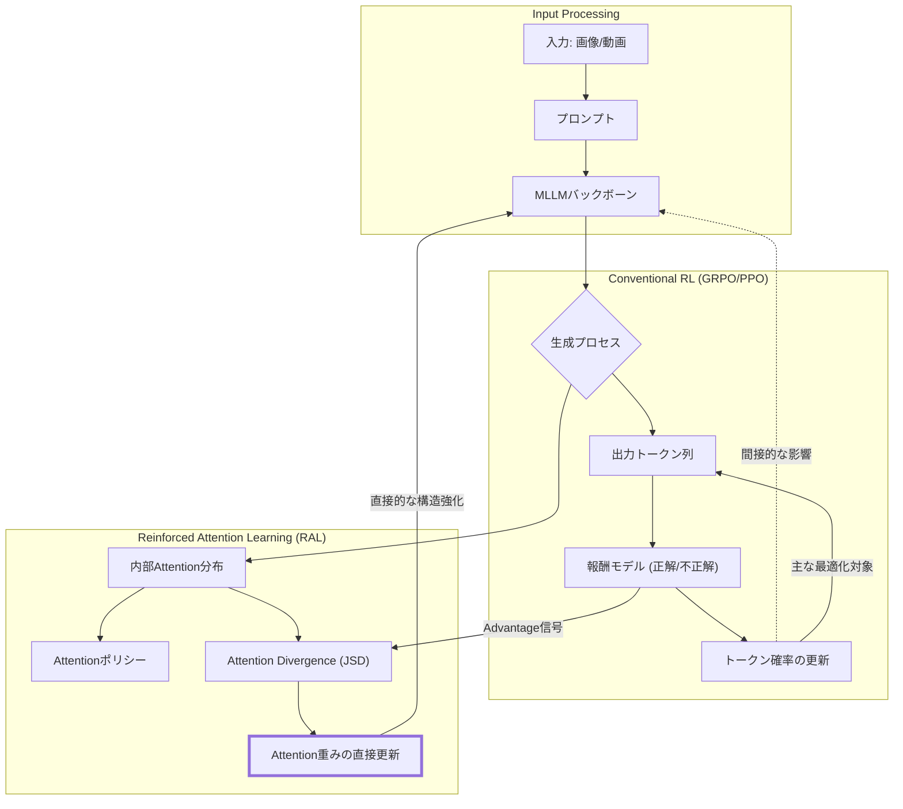
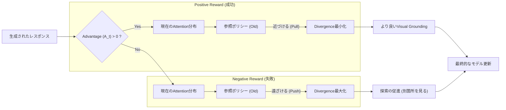

###### Created: 
2026-02-13 15:36 
###### Tag: 
#paper #modeltraining 
###### url_01:
https://arxiv.org/abs/2602.04884 
###### url_02: 

###### memo: 

---

<!-- paper_extractor:summary:start -->

本論文「Reinforced Attention Learning（強化学習された注意機構学習）」の解説を、指定されたフォーマットに従って出力します。

# One line and three points

マルチモーダルLLMの強化学習において、生成される「テキストトークン（結果）」ではなく、内部の「注意機構の分布（プロセス）」を直接最適化することで、視覚情報の認識能力とグラウンディングを劇的に向上させる新手法。

1.  **パラダイムシフト**：従来の「次にどの単語を出すか」を報酬で強化する手法（GRPO等）に対し、「画像のどこに注目すべきか」という内部プロセスを最適化対象とする「Reinforced Attention Learning (RAL)」を提案。
2.  **技術的革新**：注意（Attention）分布をポリシーとして扱い、正解・不正解の報酬（Advantage）に基づいて、現在の注意分布を成功パターンに近づけたり、失敗パターンから遠ざけたりする目的関数を導入した。
3.  **高い汎用性と性能**：Qwen-2.5-VLを用いた実験において、画像・動画の主要ベンチマークで一貫して従来手法を凌駕し、特に「思考プロセス（CoT）」を明示的に出力しない設定でも性能向上が確認された。

# Summary

本研究は、マルチモーダル大規模言語モデル（MLLM）の事後学習（Post-training）における新しいアプローチ「Reinforced Attention Learning (RAL)」を提案しています。
従来の強化学習（RL）手法は、主にテキスト出力（Next-token prediction）の確率分布を最適化することに焦点を当てていました。しかし、このアプローチは視覚的な推論において、モデルが「正解のテキストパターン」のみを学習し、実際に画像や動画の重要な部分を見ていない（Visual Groundingの欠如）という問題や、報酬ハッキング（Reward Hacking）を引き起こすリスクがありました。

著者は、モデルの推論能力の本質は「情報の取捨選択（どこに注意を払うか）」にあると仮定し、Transformer内部のAttention分布自体をポリシーとして強化学習させる手法を開発しました。RALは、報酬が高い生成結果が得られた際のAttention分布との乖離（Jensen-Shannon Divergence）を最小化するように学習を進めます。これにより、モデルは正しい答えを導き出すために必要な視覚情報へ「注目」する能力を直接的に獲得します。

実験の結果、RALは画像VQAおよび動画VQAの広範なベンチマークにおいて、強力なベースラインであるGRPOを一貫して上回りました。さらに、教師モデルのAttention分布を生徒モデルに蒸留する「On-Policy Attention Distillation」も提案し、これが知識蒸留の効果をさらに高めることを実証しました。

# Briefing

この分野の専門家として、本論文の学術的・実用的意義をより深く、包括的に解説します。

**1. 従来のマルチモーダル強化学習の限界と「プロセス」への回帰**
近年のLLM開発、特にDeepSeek-R1などで見られる「Test-time scaling」の成功は、強化学習（RL）による推論能力の向上に大きく依存しています。しかし、これをマルチモーダル領域（MLLM）に適用する際、単純にテキスト出力に対する報酬（正解したかどうか）だけで学習させると、モデルは「視覚情報を見ずにテキストの文脈だけで正解をもっともらしく捏造する（幻覚）」傾向や、冗長なだけの思考プロセスを出力する「報酬ハッキング」に陥りがちです。
本論文の核心は、出力という「結果」だけでなく、そこに至る「プロセス（＝Attention）」に介入した点にあります。「正しく答えられたなら、その時モデルは画像の正しい場所を見ていたはずだ」という仮説に基づき、成功時のAttentionパターンを強化するというアプローチは、認知科学的にも理にかなった非常にエレガントな解法です。

**2. 技術的詳細：Advantage-Weighted Attention Divergence**
RALの技術的な白眉は、数式(3)で定義される目的関数にあります。ここでは、一般的なRLで用いられるPPOやGRPOの「トークン確率の比率」ではなく、「Attention分布間の距離（Jensen-Shannon Divergence）」を最適化対象としています。
*   **Advantageが正（報酬が高い）の場合：** 現在のAttention分布を、その成功時の分布に近づける（発散を最小化する）。
*   **Advantageが負（報酬が低い）の場合：** 失敗時のAttention分布から遠ざける（発散を最大化する）。
これにより、モデルはトークンレベルでの過学習（特定の言い回しへの固執）を避けつつ、情報の探索戦略（Information-gathering policy）自体を洗練させることができます。

**3. "Thinking"なしでも機能する「暗黙知」の獲得**
アブレーション研究（RAL-zero）において、明示的な思考プロセス（Chain-of-Thoughtのような`<think>`タグ）を出力させない設定でも、RALがベースラインを上回った事実は極めて重要です。これは、言語化された論理（Explicit reasoning）だけでなく、視覚的な直感や探索能力（Implicit perceptual processing）がAttentionの最適化によって強化されたことを示唆しています。これは、トークンベースのRLでは到達しにくい領域です。

**4. 蒸留（Distillation）への拡張性**
本手法は強化学習だけでなく、知識蒸留にも拡張可能です。教師モデル（より巨大なモデル）の「視線」を生徒モデルが模倣する「Attention Distillation」は、単に正解のテキストを教えるよりも遥かにリッチな監督信号となります。これは、人間が子供に「ここを見てごらん」と指差しで教えるプロセスに似ており、MLLMの効率的な学習戦略として今後標準化される可能性があります。

結論として、RALはMLLMの事後学習において、テキスト中心のバイアスを打破し、真の意味での「マルチモーダル・アライメント」を実現するための重要な布石となる研究です。

# FAQ

**Q1: RALは従来のGRPOと何が決定的に違うのですか？**
**A1:** GRPOは「次に出力する単語（トークン）」の確率分布を調整して報酬を最大化しますが、RALはモデル内部の「注意（Attention）」の分布を直接調整します。GRPOが「何を言うか」を訓練するのに対し、RALは「どこを見て考えるか」を訓練するという違いがあります。

**Q2: Attentionを最適化すると計算コストが跳ね上がりませんか？**
**A2:** 確かにAttention分布はトークン分布よりも高次元であるため、計算コストは懸念されます。しかし、本論文では最終層のAttentionのみを使用し、ヘッド平均を取るなどの工夫で計算量を抑制しています。学習時のオーバーヘッドは許容範囲内であり、推論時のコストは変わりません。

**Q3: この手法は画像認識（Vision）タスク以外にも使えますか？**
**A3:** 原理的にはテキストのみのタスクにも適用可能です（長い文書のどこに注目して回答するか等）。しかし、本論文の実験結果が示すように、情報密度が高く、探索が必要な「画像」や「動画」のタスクにおいて、最も顕著な効果を発揮します。

**Q4: 「RAL-zero」とは何ですか？**
**A4:** RAL-zeroは、Chain-of-Thought（思考プロセスの言語化）を行わずに、直接回答を生成させる設定でRALを適用したものです。この設定でも性能が向上したことは、RALが「言葉による推論」だけでなく、純粋な「視覚的な知覚能力」を向上させている証拠となります。

# Critical Assessment（批判的評価）

**方法論の妥当性：**
強みは、Attention分布をポリシーとして扱うための数式化（Jensen-Shannon Divergenceの採用）が堅牢であり、勾配消失を防ぐためのトークン単位での粒度設定が適切である点です。制約としては、最新のFlashAttention等の高速化カーネルを使用する場合、中間Attentionマップの取得や勾配計算には実装上の工夫（Eager executionへのパッチ適用等）が必要となり、学習メモリ効率や速度に若干の影響を与える可能性があります。

**エビデンスの強度：**
本論文はプレプリント（arXiv）段階ですが、実験設計は堅実です。Qwen-2.5-VLという強力なベースモデルを使用し、画像8種・動画7種の多岐にわたるベンチマークで検証を行っています。特に、思考プロセスの有無（RAL-zero）や解像度別の分析など、主張を裏付けるための多角的なアブレーションが行われており、エビデンスレベルは高いと言えます。

**実用化への考慮：**
実環境への適用において、Attentionレベルの最適化は「幻覚（Hallucination）」の低減に直結するため、極めて有用です。ただし、学習時にはAttentionマップを保持・計算する必要があるため、超巨大モデル（70B以上など）でのフルパラメーター学習においてはVRAM消費がボトルネックになる可能性があります。LoRA等の効率的学習手法との組み合わせ検証が待たれます。

# For easy understanding

この論文のすごさを、もっと日常的な例えで説明しましょう。

想像してみてください。あなたは新人探偵（AIモデル）に「犯人の手がかりを見つけて」と指導するベテラン刑事（学習アルゴリズム）です。

**従来のやり方（トークンベースの強化学習）：**
新人が報告書を持ってきます。「犯人はAです」と書いてあります。
もし正解なら、ベテランは「よくやった！」と褒めます。不正解なら「やり直し」と言います。
これだと、新人は「まぐれ当たり」をしたり、現場をろくに見ずに「過去の事件ではBが犯人だったから今回もBだろう」と勘を働かせて報告書を書くコツだけを覚えてしまうかもしれません。これでは、本当に現場を見る力はつきません。

**今回のやり方（Reinforced Attention Learning - RAL）：**
ベテラン刑事は、新人の報告書だけでなく、**新人の「目の動き」**もチェックします。
もし新人が、現場の重要な証拠（落ちているハンカチや足跡）を**じっと見つめた上で**正解を出したなら、「その目の付け所が素晴らしい！」と特大のボーナスを与えます。
逆に、天井や壁ばかり見ていたり、関係ない場所を見ているのに正解した場合は、「答えは合っているが、ちゃんと見ていないな」と判断して、あまり褒めません。

**結論：**
このRALという手法は、AIに対して「答えが合っていればいい」だけでなく、「**正しい場所を見て、正しく考えたか**」という**プロセス**を評価する仕組みを作りました。その結果、AIはしっかりと画像や動画の中身を「観察」するようになり、ごまかしのない、本当に賢い認識能力を身につけることができたのです。

# Mermaid Diagrams

## Sequence Diagram: RALの学習プロセス
RALにおける、モデルの生成、報酬の計算、そしてAttentionポリシーの更新までの流れを時系列で示します。

## Flowchart: 従来手法とRALの比較
従来のトークンベースの最適化と、RALのAttentionベースの最適化の違いを視覚化します。

## Concept Diagram: RALの核心メカニズム
Advantage（報酬の優位性）がAttention分布の更新にどのように作用するかを示します。

<!-- paper_extractor:summary:end -->

