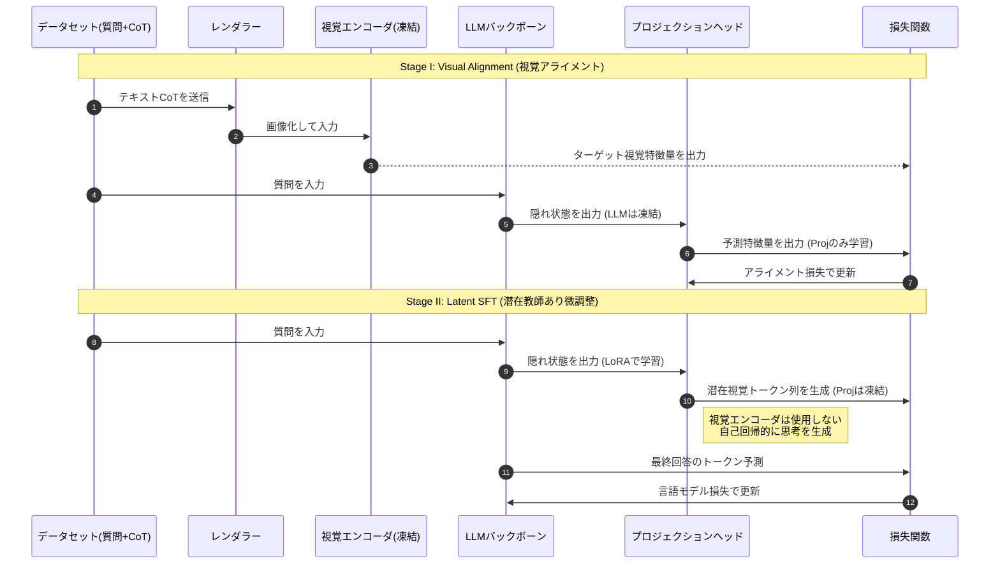
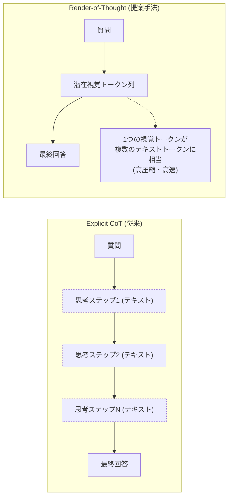

###### Created: 
2026-01-31 15:40 
###### Tag: 
#paper #latentengineering 
###### url_01:
https://arxiv.org/abs/2601.14750 
###### url_02: 
[GitHub - TencentBAC/RoT](https://github.com/TencentBAC/RoT)
###### memo: 

---

<!-- paper_extractor:summary:start -->

本論文「Render-of-Thought: Rendering Textual Chain-of-Thought as Images for Visual Latent Reasoning」の解説と評価を行います。

# One line and three points
Chain-of-Thought（CoT）の冗長なテキスト生成プロセスを「画像のレンダリング」として捉え直し、既存の視覚言語モデル（VLM）のエンコーダを意味的なアンカーとして利用することで、推論プロセスを潜在空間内で高効率かつ解釈可能に圧縮する新たなフレームワーク「Render-of-Thought (RoT)」の提案。

1.  **視覚的潜在空間での推論：** テキストの思考過程を画像化し、その視覚特徴量を潜在空間での推論ステップとして利用することで、従来のテキストベースCoTと比較してトークン数を3〜4倍に圧縮し、推論速度を大幅に向上させています。
2.  **既存VLM資産の有効活用：** 既存のVLM（Qwen2-VLなど）の視覚エンコーダを凍結したまま「意味的アンカー」として利用するプラグアンドプレイ方式を採用しており、大規模な事前学習をやり直すことなく、視覚と言語のアライメントを実現しています。
3.  **2段階の学習フレームワーク：** 言語モデルの隠れ状態を視覚埋め込みに整列させる「Visual Alignment」と、その空間内で自己回帰的に推論を進める「Latent SFT」の2段階学習により、安定した潜在推論を実現しています。

# Summary
本研究は、大規模言語モデル（LLM）の推論能力を引き出すChain-of-Thought（CoT）が抱える「計算コストの高さ」と「推論遅延」という課題に対し、**Render-of-Thought (RoT)** という新しいパラダイムを提案しています。

従来のCoTは中間推論ステップを全てテキストトークンとして生成するため冗長でしたが、RoTはこの思考過程を「テキストが描かれた画像」として扱い、その視覚的特徴量（Embedding）を用いて潜在空間（Latent Space）内で推論を行います。具体的には、学習済みの視覚言語モデル（VLM）の視覚エンコーダを教師役（Semantic Anchor）として利用し、LLMが生成する隠れ状態が、思考過程をレンダリングした画像の視覚特徴量と一致するように学習させます。

これにより、LLMは冗長なテキストを出力することなく、情報の密度が高い「視覚的潜在トークン」を通じて思考を進めることが可能になります。実験の結果、数学推論タスク（GSM8kやMATH）において、明示的なCoTと比較してトークン数を大幅に削減しつつ、他の潜在推論手法（Implicit CoT）よりも高い精度と汎化性能を達成しました。これは、視覚モダリティが持つ高い情報密度と構造化された意味空間が、効率的な推論のキャリアとして有効であることを示唆しています。

# Briefing
本論文は、LLMの推論効率化における「Implicit Chain-of-Thought（暗黙的思考連鎖）」のアプローチを、視覚的解釈を取り入れることで飛躍的に進化させた研究です。以下にその技術的詳細と背景を解説します。

**背景と課題：**
LLMの推論能力向上にはCoTが不可欠ですが、中間思考を言語として全て出力するため、推論時間が長くメモリ消費も激しいという問題がありました。これを解決するために、思考を言語として出力せず内部状態（潜在空間）だけで処理する手法が研究されていますが、これらは「ブラックボックス化して解析困難」「学習が不安定」という課題を抱えていました。

**Render-of-Thought (RoT) の核心技術：**
RoTは、「思考のテキストを画像にレンダリングする」という逆転の発想に基づいています。
1.  **レンダリングによる圧縮：** テキストで書かれた思考ステップを、1行の画像（Single-line image）としてレンダリングします。
2.  **視覚エンコーダの活用：** レンダリングされた画像を、学習済みのVLM（例: Qwen2-VLのエンコーダ）に通し、視覚埋め込みベクトル（Visual Embeddings）を取得します。このベクトルは、テキスト情報を含みつつも高次元で圧縮された表現となっています。
3.  **プロジェクションヘッドによる接続：** LLMの出力層に軽量なプロジェクションヘッド（MLP）を追加し、LLMの隠れ状態が上記の視覚埋め込みベクトルを予測するように学習します。

**2段階の学習プロセス：**
*   **Stage I (Visual Alignment):** LLMと視覚エンコーダを凍結し、プロジェクションヘッドのみを学習させます。これにより、LLMの言語的な内部状態を、視覚エンコーダが持つ意味空間へとマッピングします。これは一種の知識蒸留として機能します。
*   **Stage II (Latent Supervised Fine-Tuning):** プロジェクションヘッドを固定し、LLM本体をLoRA（Low-Rank Adaptation）で微調整します。ここでは、モデルが自律的に「視覚的な思考の軌跡」を生成し、最終的な回答を導き出せるようにします。

**成果と意義：**
実験では、GSM8kなどの数学ベンチマークにおいて、明示的なCoTと同等の精度を維持しながら、生成トークン数を劇的に削減（3〜4倍の圧縮）することに成功しました。また、推論速度も大幅に向上しており、特に難易度の高い問題においてその効率性が際立っています。さらに、生成された潜在表現が視覚的な意味空間に基づいているため、ある程度の解釈可能性がある点も、従来の純粋な潜在推論手法に対する大きなアドバンテージです。

# FAQ

**Q1: 推論時（Inference）にも画像をレンダリングするのですか？**
いいえ、推論時には画像のレンダリングや視覚エンコーダは使用しません。学習によってLLMは「もしその思考を画像化したらどのような特徴量になるか」を予測する能力を獲得しています。したがって、推論時はLLMとプロジェクションヘッドのみを用いて、潜在空間上で直接推論（Visual Latent Reasoning）を行い、最終的な回答のみをテキストとして出力します。

**Q2: なぜテキストのまま圧縮するのではなく、わざわざ「画像」を経由するのですか？**
視覚エンコーダ（Vision Encoder）が持つ「構造化された意味空間」を利用するためです。単にテキスト情報を圧縮しようとすると、モデルは何を基準に情報を削ぎ落とすべきか迷い、学習が不安定になります。しかし、事前学習済みのVLMの視覚エンコーダは、画像（レンダリングされたテキスト）から重要な意味的特徴を抽出する能力を既に持っています。これを「アンカー（碇）」として利用することで、LLMは効率的かつ安定した情報の圧縮方法を学ぶことができます。

**Q3: どのようなモデルアーキテクチャで動作しますか？**
本手法は、Qwen2-VLやLLaVAなどの既存の視覚言語モデル（VLM）アーキテクチャに適用可能です。重要なのは、LLMバックボーンと視覚エンコーダの間に、テキストから視覚表現へのマッピングを行うプロジェクションヘッドを導入する点です。実験ではQwen3-VL-4B-Instructなどが使用されています。

**Q4: 思考の長さをどうやって決めているのですか？**
動的に終了判定を行う方法（Dynamic Termination）と、固定長のトークン数を与える方法（Fixed Token Budgets）が検討されています。実験結果（Table 4）によると、動的な判定は不安定になりやすいため、タスクの難易度に応じて固定の潜在トークン数（例えばGSM8kなら32トークン、MATHなら64トークン）を割り当てる方が高い性能を示しています。これは今後の改善点の一つとされています。

# Critical Assessment（批判的評価）

**方法論の妥当性：**
本研究の実験設計は堅実であり、視覚エンコーダを「意味的アンカー」として利用するという着想は非常に独創的かつ理にかなっています。特に、Stage IとStage IIに分けた学習プロセスは、モダリティ間のギャップを埋めるために効果的であることがアブレーションスタディで示されています。ただし、レンダリング設定（画像の高さやフォントサイズ）に性能が敏感である点は、実用上のチューニングの手間を示唆しています。また、推論時のトークン長（Budget）をデータセットごとに手動で最適化している点は、汎用的な自律エージェントへの適用において制約となり得ます。

**エビデンスの強度：**
本論文はarXivプレプリント（査読前）ですが、複数のモデルサイズ（2B, 4B, 7B）および複数のデータセット（GSM8k, MATH, SVAMP等）で広範な実験が行われており、エビデンスの強度は高いと言えます。特に、既存の潜在推論手法（Coconut, CODI, CoLaRなど）との比較において優位性を示している点は評価できます。ただし、比較対象のベースライン実装の公平性や、視覚化された潜在トークンが本当に「推論」を表しているかどうかの定性的な分析については、さらなる検証の余地があります（後半のトークンが均質化する現象など）。

**実用化への考慮：**
推論速度の大幅な向上とメモリ効率の改善は、エッジデバイスやリアルタイム応答が求められるアプリケーションにとって極めて魅力的です。既存のVLMアーキテクチャをそのまま利用できる「プラグアンドプレイ」性も実用化のハードルを下げています。主要な課題は、未知のタスクに対して適切な「潜在トークン数（思考時間）」を事前に見積もることが難しい点です。これが解決されれば、非常に強力な推論エンジンとなる可能性があります。

# For easy understanding
この論文の画期的な点は、「AIに『テキストの画像』を想像させることで、思考を高速化した」という点にあります。

私たちが複雑な計算問題を解くとき、黒板にすべての計算過程を書き出しながら解くと（これが従来のCoT）、間違いは減りますが、書くのに時間がかかります。
一方で、頭の中だけで計算しようとすると（これが従来の推論）、速いですが、途中で数字を忘れたり間違えたりしやすくなります。

この論文の提案する「Render-of-Thought」は、この中間に位置するような方法です。
AIに対して、「計算過程を黒板に書く代わりに、その計算過程が書かれた『画像』を頭の中でイメージしなさい」と教えます。
人間で言えば、文字を書き出すのではなく、頭の中に計算式の「映像」を思い浮かべて、それを見ながら答えを出すようなものです。

なぜこれが良いのでしょうか？
1.  **速い：** 文字を一つ一つ出力するよりも、情報の詰まった「イメージ」として処理するほうが、AIにとってはずっと少ないステップで済みます。
2.  **安定する：** 何もないところから考えるのではなく、「計算式が書かれた画像」という明確な正解イメージ（アンカー）を目指して考えるように訓練するため、思考が脱線しにくくなります。

つまりこういうことです：
**「ダラダラと言語化するのではなく、視覚的なイメージとして思考を圧縮することで、AIはもっと速く、かつ正確に考えることができる」** ということを実証した研究です。

# Mermaid Diagrams

## コンセプト図・アーキテクチャ
この図は、Render-of-Thoughtの全体的な概念と、学習時・推論時のデータの流れを示しています。

```mermaid
flowchart TD
    subgraph "Training Phase (学習フェーズ)"
        T_Input["テキスト入力 (質問 + CoT)"]
        Renderer["レンダラー (テキスト→画像)"]
        Img["思考プロセスの画像"]
        VisEnc["視覚エンコーダ (凍結)"]
        VisEmb["視覚埋め込み (教師データ)"]
        
        LLM_T["LLMバックボーン (LoRA学習)"]
        Proj["プロジェクションヘッド (MLP)"]
        Latent["潜在視覚トークン"]
        
        T_Input --> Renderer
        Renderer --> Img
        Img --> VisEnc
        VisEnc --> VisEmb
        
        T_Input --> LLM_T
        LLM_T --> Proj
        Proj --> Latent
        
        Loss("損失計算 (MSE & CrossEntropy)")
        VisEmb -.-> Loss
        Latent -.-> Loss
    end

    subgraph "Inference Phase (推論フェーズ)"
        I_Input["テキスト入力 (質問)"]
        LLM_I["LLMバックボーン"]
        Proj_I["プロジェクションヘッド"]
        Latent_Thinking["潜在空間での推論 (Visual Latent Reasoning)"]
        Output["最終回答 (テキスト)"]
        
        I_Input --> LLM_I
        LLM_I --> Proj_I
        Proj_I --> Latent_Thinking
        Latent_Thinking --> Output
    end

    style Renderer stroke-dasharray: 5 5
```

## シーケンス図（学習プロセス）
この図は、2段階の学習プロセスにおいて、データがどのように処理され、どのコンポーネントが更新されるかを時系列で示しています。

## 比較フローチャート（従来CoT vs RoT）
従来のChain-of-Thoughtと、今回のRender-of-Thoughtの処理フローの違いを簡潔に比較します。

<!-- paper_extractor:summary:end -->