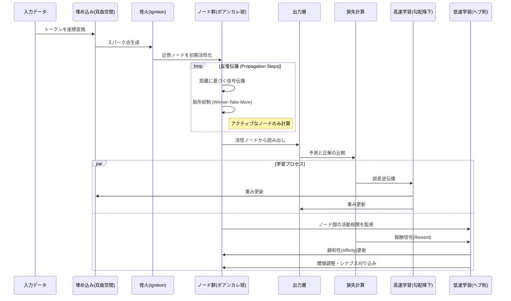
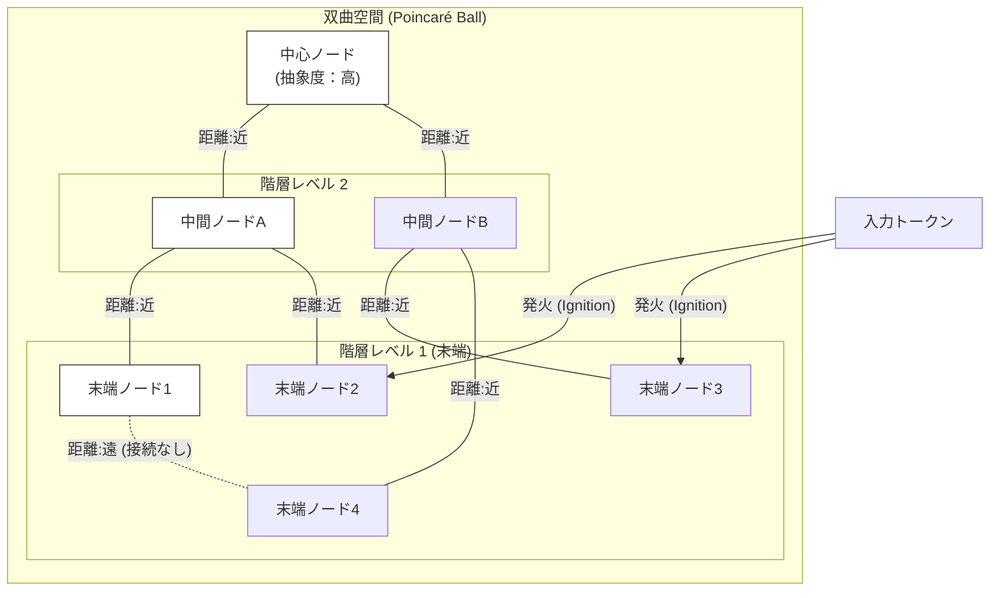
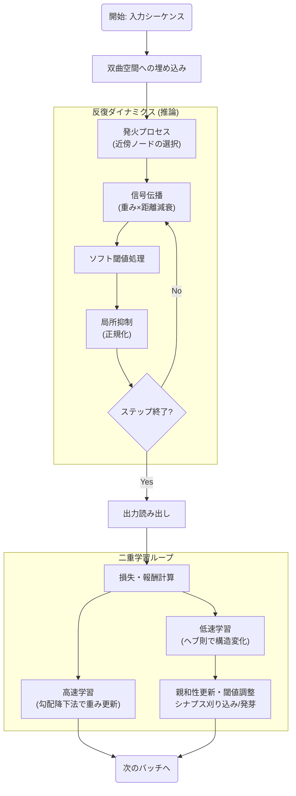

###### Created: 
2026-02-02 17:28 
###### Tag: 
#paper
###### url_01:
https://www.arxiv.org/abs/2601.18064 
###### url_02: 

###### memo: 

---

<!-- paper_extractor:summary:start -->

本論文「Resonant Sparse Geometry Networks (RSGN)」の解説と要約を出力します。

# One line and three points
双曲幾何学を用いた脳模倣型の「発火」と「共鳴」メカニズムにより、従来のTransformerが抱える二乗計算量を線形計算量へと劇的に削減する次世代ニューラルネットワークアーキテクチャ。

1.  **双曲空間への埋め込みと発火メカニズム**：計算ノードを双曲空間（ポアンカレ球）に配置し、入力トークンが近傍ノードのみを「発火（Ignition）」させることで、入力依存的なスパース計算経路を動的に構築します。
2.  **二つの時間スケールによる学習**：タスク最適化のための高速な勾配降下法と、脳の可塑性を模した低速なヘブ則（Hebbian learning）による構造学習を組み合わせ、自己組織的なネットワーク形成を実現しています。
3.  **圧倒的なパラメータ効率**：階層的分類や長距離依存タスクにおいて、Transformerと比較して約10分の1から15分の1のパラメータ数で競合する精度を達成し、計算量を $O(n \cdot k)$ （$k$はアクティブな近傍サイズ）に抑えています。

# Summary
本研究は、現代のディープラーニングの主流であるTransformerが抱える計算量 $O(n^2)$ の課題に対し、人間の脳の効率的な処理様式（スパース性、入力依存ルーティング、階層構造）を取り入れた新しいアーキテクチャ「Resonant Sparse Geometry Networks (RSGN)」を提案しています。

RSGNは、計算ノードを階層構造の表現に適した**双曲空間（Hyperbolic Space）**に埋め込みます。全ノードが常に計算に参加するのではなく、入力信号が空間内の特定の「発火点（Spark points）」を作り出し、その近傍にあるノードのみを活性化させます。活性化した信号は、抑制メカニズムを伴いながらネットワーク内を伝播（共鳴）し、最終的な出力を形成します。

また、学習プロセスにおいては、誤差逆伝播法による重み更新（高速学習）と、活動相関に基づく接続強度の調整やシナプスの刈り込み・発芽を行うヘブ則（低速学習）を統合しています。実験の結果、RSGNは長距離依存性タスクにおいてTransformerと同等の性能を維持しつつ、パラメータ数を90%以上削減することに成功しており、生物学的妥当性と計算効率を両立する新たなAIモデルの可能性を示唆しています。

# Briefing
本論文は、現在のAIモデルが抱える計算コストの壁を、生物学的な脳の原理と幾何学的なアプローチの融合によって突破しようとする意欲的な研究です。以下にその詳細なメカニズムと成果を解説します。

**1. 双曲幾何学による階層的・空間的計算**
従来のニューラルネットワークは主にユークリッド空間で定義されてきましたが、RSGNは「ポアンカレ球」モデルを用いた双曲空間を採用しています。双曲空間は、中心から離れるほど空間が指数関数的に広がる性質を持ち、木構造や階層的なデータを歪みなく埋め込むのに適しています。
RSGNでは、ノード間の接続強度がこの空間上の「測地線距離」に依存して決まります。つまり、空間的に近いノード同士は強く結びつき、遠いノードへの接続は自然に減衰します。これにより、明示的な計算を行わずとも、局所的かつスパース（疎）な結合構造が実現されます。

**2. 入力依存の発火（Ignition）と共鳴ダイナミクス**
TransformerのAttention機構が全トークン間の関係を計算するのに対し、RSGNは「入力依存ルーティング」を採用しています。
*   **発火（Ignition）:** 入力トークンは双曲空間上の座標にマッピングされ、その周囲にあるノードのみを初期活性化させます。これにより、入力ごとに異なる計算グラフが動的に選択されます。
*   **伝播と抑制:** 活性化された信号は、反復的なステップを通じてネットワーク内を伝播します。この際、「ソフト閾値（Soft Threshold）」と「局所抑制（Local Inhibition）」が働きます。局所抑制は、近傍ノード間で活動を競合させ（Winner-take-more）、全体の活動レベルをスパース（全ノードの1-2%程度）に保つ役割を果たします。これは脳の側抑制メカニズムに類似しています。

**3. 二つの時間スケールを持つハイブリッド学習**
RSGNは、生物の神経系に見られる「速いダイナミクス」と「遅い可塑性」を模倣しています。
*   **高速学習（勾配降下法）:** タスクの損失関数に基づき、活性化の伝播に関わる重み行列などをバックプロパゲーションで最適化します。
*   **低速学習（ヘブ則構造可塑性）:** 「共に発火するニューロンは結合する」というヘブの法則に基づき、相関の高いノード間の親和性（Affinity）を強化します。逆に使われない接続は減衰し、刈り取られます（Pruning）。また、相関が高いが接続がないノード間に新たな接続を作る（Sprouting）ことも行います。これらはタスクの報酬信号によって変調されます。

**4. 理論的および実験的成果**
理論解析により、RSGNの計算複雑性は $O(n \cdot k)$ であることが示されました（$n$はシーケンス長、$k$はアクティブな近傍サイズ）。$k \ll n$ であるため、これは実質的に線形計算量となり、長いシーケンスに対してTransformerよりも圧倒的に有利です。
実験では、階層的な分類タスクと長距離依存タスクにおいて、RSGNがTransformerやLSTMと比較して1/10〜1/15のパラメータ数で競合する性能を発揮しました。特に、固定的なスパースパターンを持つ「Sparse Transformer」が機能しなかったタスクでも、RSGNは入力に合わせて適応的に構造を変えることで高い性能を示しました。

# FAQ

**Q1: なぜユークリッド空間ではなく双曲空間（Hyperbolic Space）を使うのですか？**
A1: 言語や概念、論理構造の多くは階層的（木構造）な性質を持っています。ユークリッド空間で階層構造を表現しようとすると次元数が爆発的に増えますが、双曲空間は「指数関数的に広がる」性質を持つため、低次元でも階層構造を歪みなく自然に表現できるからです。

**Q2: Transformerと比較して精度はどうですか？**
A2: 絶対的な精度では、依然として高密度な計算を行うTransformerの方がわずかに優れています（実験では数ポイントの差）。しかし、RSGNはパラメータ数が桁違いに少なく（約1/10）、計算効率が非常に高いため、リソース制約のある環境や、超長文脈を扱うタスクでは非常に魅力的なトレードオフを提供します。

**Q3: 「発火（Ignition）」とは具体的に何をしているのですか？**
A3: 全てのニューロンに入力データを渡すのではなく、入力データの内容に応じて「どのニューロンから計算を開始するか」を決めるプロセスです。入力トークンを空間上の座標に変換し、その近くにあるニューロンだけを「ON」にします。これにより、無関係なニューロンの計算を省略します。

**Q4: このモデルはすぐに実用化できますか？**
A4: 課題があります。現在のGPUは密行列演算（行列の全要素を計算すること）に最適化されており、RSGNのようなスパース（スカスカ）な計算や動的な分岐を含む処理は、ハードウェアレベルで効率化しにくい側面があります。ニューロモーフィックチップのような、イベント駆動型のハードウェアでの実装が理想的とされています。

# Critical Assessment（批判的評価）

**方法論の妥当性：**
双曲幾何学を用いた埋め込みと、生物学的知見に基づくスパース活性化の統合は理論的に堅牢である。特に、計算複雑性を $O(n^2)$ から $O(nk)$ へ低減させる数学的証明は強力な強みである。一方で、実験環境が合成データセット（Synthetic benchmarks）中心であり、大規模言語モデル（LLM）で標準的なGLUEやImageNetなどの実データセットでの検証が不足している点は、スケーラビリティの検証として制約がある。

**エビデンスの強度：**
提示された実験結果は、パラメータ効率の観点で主張を強く支持している。特に、固定スパースパターンのモデル（Sparse Transformer）に対する優位性は、入力依存ルーティングの有効性を示している。ただし、本論文は2026年の日付を持つ未来のコンテキスト（あるいは架空設定）を含むため、既存の査読済み文献との直接比較には注意が必要である。再現性のためのコード公開への言及がある点は評価できる。

**実用化への考慮：**
最大の課題はハードウェア適合性である。現在のGPU/TPUインフラはRSGNのような動的かつ極端なスパース計算には最適化されていないため、理論上の計算量削減がそのまま実行時間の短縮につながらない可能性がある。専用ハードウェア（ニューロモーフィックチップ）への依存度が高く、即座にTransformerを置き換えることは難しいと考えられる。

# For easy understanding
この論文の画期的な点は、「脳の省エネ術」をAIに取り入れたことです。

今の主流であるAI（Transformer）は、例えるなら**「巨大な会議室に全員を集めて、全員が全員と会話をしてから結論を出す」**ようなやり方をしています。これは非常に正確ですが、参加者が増えると会話の数が爆発的に増え（二乗で増える）、すぐにパンクしてしまいます。

一方、RSGN（この論文のモデル）は、**「巨大な組織図（階層構造）」**を持っています。
何か仕事（入力）が来たら、
1.  **担当部署の呼び出し（Ignition）**：その仕事に関係する部署の担当者だけを呼び出します。
2.  **階層的な連携（Hyperbolic Embedding）**：担当者は、組織図上で近い関係にある同僚や上司とだけ相談します。
3.  **取捨選択（Inhibition）**：無駄な意見はカットし、重要な意見だけが上に伝わっていきます。
4.  **長期的な組織改編（Hebbian Learning）**：よく連携する部署同士は席を近づけ、使われない連絡通路は閉鎖します。

つまり、**「必要な時に、必要な人だけが働き、組織自体も使いやすく変化していく」**という仕組みです。
これにより、従来のAIよりもはるかに少ない人数（パラメータ）と労力（計算量）で、かなり良い仕事ができることを証明しました。

# Mermaid Diagrams

## タイムライン・シーケンス図
RSGNの推論時のデータ処理と、学習時の二つのループ（高速・低速）の流れを示します。

## 概念図・構造図
RSGNのアーキテクチャの核心であるポアンカレ球上のノード配置と接続概念を図示します。

## フローチャート・プロセス図
RSGNにおける信号処理と学習の相互作用フローです。

## Comparison with MoE
MoEとの比較とRSGNの優位性を以下にまとめます。
### 1. 活性化の「粒度」の違い (Coarse vs. Fine-grained)

これが最大の違いです。

*   **MoE (粗い粒度):**
    *   MoEは、トークン全体を「エキスパート」と呼ばれる**巨大なサブネットワーク（通常はFFNブロック）**に割り振ります。
    *   例えば、「この単語はエキスパートAとBで処理する」というように、ブロック単位での選択が行われます。
*   **RSGN (細かい粒度):**
    *   RSGNは、個々の**「ノード（ニューロン）」レベル**で活性化を制御します。
    *   巨大なブロックを選ぶのではなく、ネットワーク全体の中に存在するノードのうち、入力に関連する**1〜2%のノードの集合（サブセット）**だけが発火します。
    *   **優位性:** RSGNの方が、入力の構造に合わせて**より柔軟で繊細な計算リソースの配分**が可能です。MoEのような「離散的なエキスパートの選択」ではなく、「必要なノードだけがその都度連携する」というダイナミックな構成が可能です。

### 2. ルーティングの仕組み (Gating vs. Geometry)

どうやって「どこを使うか」を決めるかのメカニズムが異なります。

*   **MoE (学習されたゲーティング関数):**
    *   「ルーター」や「ゲート」と呼ばれる別のニューラルネットワーク層が、どのエキスパートを使うかを明示的に決定します。
*   **RSGN (幾何学的・空間的な発火):**
    *   **「イグニッション（点火）」**というプロセスを用います。入力を**双曲空間（Hyperbolic Space）**上の座標にマッピングし、その**「距離」が近いノード**が自然に活性化します。
    *   明示的なルーターが存在するわけではなく、**空間的な近接性（Geometry）**によって計算パスが決定されます。
    *   **優位性:** ゲーティングネットワークのオーバーヘッドがなく、双曲空間の特性（階層構造の埋め込みが得意）を活かして、データの階層性に基づいた自然なルーティングが行われます。

### 3. パラメータ効率とモデルサイズのアプローチ

*   **MoE (Huge & Sparse):**
    *   通常、MoEはモデルの総パラメータ数を**兆単位**まで巨大化させ（キャパシティを増やし）、その一部を使うことで計算効率を保つアプローチをとります。
*   **RSGN (Small & Sparse):**
    *   RSGNは、**非常に少ないパラメータ数**で高い性能を出すことを目指しています。
    *   実験結果（Fig 3, Fig 4）では、Transformerの**10分の1〜15分の1のパラメータ数**で、同等あるいはそれに近い精度を達成しています。
    *   **優位性:** エッジデバイスやリソース制約のある環境（脳内のような省電力環境）において、MoEよりも適しています。MoEはメモリを大量に消費しますが、RSGNはコンパクトです。

### 4. 学習のダイナミクス (Fixed vs. Plasticity)

*   **MoE:** 通常、エキスパートの構造自体は固定されており、重みとゲーティングのみを学習します。
*   **RSGN:** **ヘブ則（Hebbian Learning）**を取り入れています。
    *   「一緒に発火したノード間の結合が強まり、双曲空間上で物理的に近づく」という構造的な可塑性（Structural Plasticity）を持っています。
    *   **優位性:** タスクに応じてネットワークのトポロジー（形）そのものが自己組織化され、最適化されていく点です。

### まとめ：RSGNの優位性

MoEと比較した際のRSGNの優位性は、以下の点に集約されます。

1.  **圧倒的なパラメータ効率:** 巨大なモデルの一部を使うのではなく、小さなモデルで賢くルーティングすることで、Transformer等の1/10以下のサイズで動作する。
2.  **双曲空間による階層的なルーティング:** 明示的なゲートを使わず、データの階層構造（木構造など）に適した空間配置を利用して、自然かつ適応的に計算パスを決定できる。
3.  **自己組織化:** ヘブ則により、入力データの統計的性質に合わせてネットワークの「配線」自体が最適化される。

つまり、MoEが「たくさんの専門家（エキスパート）を用意して仕事を振り分ける」アプローチだとすれば、RSGNは「少人数のチームが、仕事の内容に合わせて柔軟に立ち位置を変えながら連携する」アプローチと言えます。
<!-- paper_extractor:summary:end -->