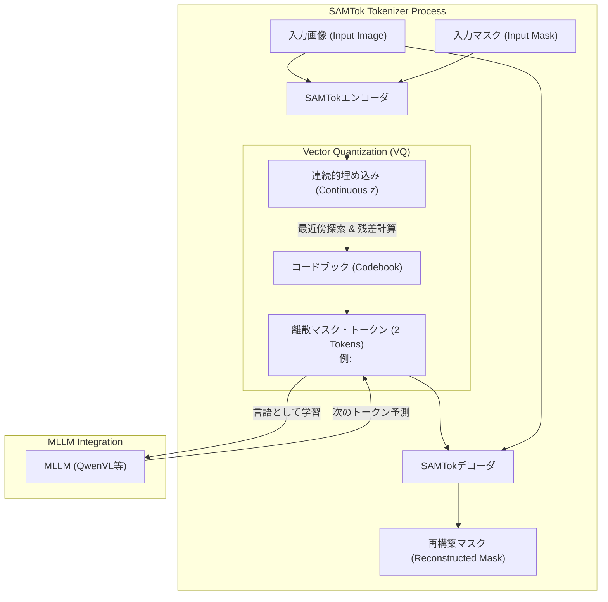
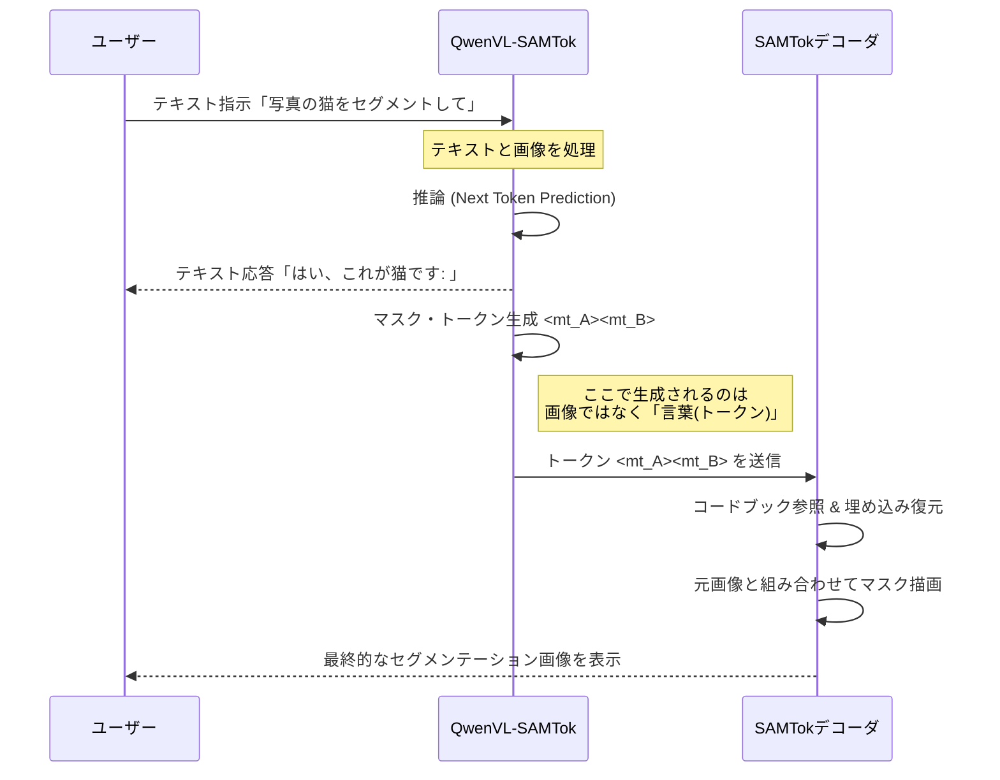
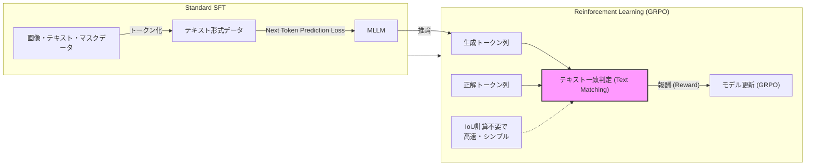

###### Created: 
2026-01-29 11:54 
###### Tag: 
#paper #tokenizer #segmentation 
###### url_01:
https://arxiv.org/abs/2601.16093 
###### url_02: 
[SAMTok: Representing Any Mask with Two Words](https://zhouyiks.github.io/projects/SAMTok/)
###### memo: 

---

<!-- paper_extractor:summary:start -->

本論文のSummary、Briefing、FAQ、平易な理解のための解説、およびMermaid図表をMarkdown形式で出力します。

# One line and three points
画像内の任意の領域マスクをわずか2つの離散的な「単語（トークン）」に圧縮・復元する「SAMTok」を提案し、マルチモーダル大規模言語モデル（MLLM）がマスクを自然言語と同様に扱うことで、アーキテクチャの変更なしに高度なセグメンテーション能力と強化学習への適応を実現した研究。

1.  **SAMTokの提案：** SAM2をベースに、任意の形状のマスクを「2つの離散トークン」に圧縮し、高精度に復元するトークナイザーを開発。2億900万枚のマスクデータで学習され、コンパクトかつ情報密度の高い表現を実現しました。
2.  **MLLMとの統合と統一的学習：** SAMTokを用いることで、QwenVLなどのベースモデルは「次のトークン予測（Next-token prediction）」という標準的な学習のみで、領域キャプション（理解）や参照セグメンテーション（生成）などのピクセルレベルのタスクをSOTAレベルで実行可能になりました。
3.  **テキストベースの強化学習：** マスクがテキストトークン化されたことで、従来の複雑なIoU計算を介さず、テキストの一致（正解トークンを含んでいるか）のみを報酬とするシンプルな強化学習（GRPO）が可能になり、GRESやGCGベンチマークで大幅な性能向上を達成しました。

# Summary
本論文は、マルチモーダル大規模言語モデル（MLLM）におけるピクセルレベルの理解と生成能力（セグメンテーションなど）をスケーラブルに拡張するための新しい手法「SAMTok」を提案しています。従来のピクセルレベルMLLMは、複雑な領域エンコーダや専用のセグメンテーションデコーダ、および特殊な損失関数を必要としており、学習の複雑さや拡張性に課題がありました。また、連続値の埋め込み表現を使用するため、強化学習（RL）の適用が困難でした。

著者はこれらの課題に対し、マスクを「新しい言語」として扱うアプローチを採用しました。提案されたSAMTokは、SAM2（Segment Anything Model 2）をベースにした離散マスク・トークナイザーであり、任意の領域マスクを2つの特殊トークンに変換し、逆にそのトークンからマスクを高精度に再構築することができます。この設計により、MLLMは通常のテキストデータと同様に、標準的な「次のトークン予測」損失のみを用いてピクセルレベルの能力を学習できるようになります。

2億900万枚の大規模なマスクデータセットで学習されたSAMTokを用いて、QwenVLシリーズを500万件のマスク関連タスクデータでファインチューニングした結果、領域キャプション、視覚的グラウンディング、対話型セグメンテーションなど多岐にわたるタスクで既存の特化型モデルと同等以上の性能を達成しました。さらに、マスクがテキストトークン化された利点を活かし、テキストベースの報酬を用いた強化学習（GRPO）を適用することで、生成精度を大幅に向上させることに成功しました。これは、アーキテクチャの変更を伴わずにMLLMに強力な視覚的相互作用能力を付与する、シンプルかつスケーラブルなパラダイムを示しています。

# Briefing
本研究の技術的詳細と背景、およびその包括的な影響について解説します。

**背景と課題意識**
近年、MLLMは急速に進歩していますが、画像内の特定のピクセル領域を特定・生成する能力（Pixel-wise capabilities）の実装には依然として障壁がありました。既存手法の多くは、以下の問題を抱えていました：
1.  **統合の複雑さ：** 入力（理解）と出力（生成）で異なるモジュールが必要であり、バウンディングボックスでは精度が不足し、ポリゴンやRLE（連長圧縮）ではトークン数が膨大になり推論コストが増大する。
2.  **強化学習の困難さ：** 連続的な埋め込み表現を使用するモデルでは、離散的なトークン生成を前提とする最新の強化学習手法を直接適用することが難しい。
3.  **学習プロセスの断絶：** セグメンテーション専用の損失関数が必要であり、純粋なテキストデータやVQAデータとの大規模な混合学習（Co-training）が複雑になる。

**SAMTokのアーキテクチャとメカニズム**
これらを解決するSAMTokは、変分オートエンコーダ（VAE）とベクトル量子化（VQ）の概念をSAM2に統合したものです。
*   **エンコーダ：** 画像とマスクを入力とし、SAMのマスクデコーダ中間層を用いて連続的なマスク埋め込みベクトルを生成します。
*   **残差ベクトル量子化（RQ）：** 生成されたベクトルを、一度の検索ではなく、2段階の「残差」を用いて量子化します。これにより、比較的小さなコードブックサイズ（256）でも、わずか2つのトークンで多様なマスク形状を高精度に表現できます。
*   **デコーダ：** 2つの離散トークンをプロンプトとして受け取り、元の画像特徴と組み合わせてマスクを再構築します。
*   **学習データ：** EntitySeg、SA-1B、COCOなどを含む2億900万枚のマスクデータで事前学習され、高い汎化性能を持ちます。

**MLLMへの統合と学習パラダイム**
SAMTokによってトークン化されたマスクは、MLLMの語彙に追加された「特殊な単語」として扱われます。
*   **入力（理解タスク）：** 画像内の特定領域を指し示す際、その領域のマスクをトークン化し、テキストプロンプト内に挿入します（例：「[MASK_TOK1][MASK_TOK2]の色は何ですか？」）。
*   **出力（生成タスク）：** ユーザーの指示（例：「左側の猫をセグメントして」）に対し、MLLMはテキストとしてマスク・トークンを生成します。これをSAMTokデコーダに通すことで可視化可能なマスクが得られます。
*   **利点：** MLLM本体のアーキテクチャ変更は一切不要で、通常のテキスト生成と同じ目的関数（Cross-Entropy Loss）で学習可能です。

**強化学習（RL）による性能向上**
本研究の大きな貢献の一つは、マスク生成タスクにおける強化学習の導入です。マスクがテキストトークンであるため、正解データ（Ground Truth）のトークン列と生成されたトークン列の一致率を報酬として直接使用できます（Textual Answer-Matching Reward）。これにより、高価なIoU計算を伴う報酬モデルを構築することなく、GRPO（Group Relative Policy Optimization）などの効率的なRLアルゴリズムを適用可能にしました。実験では、GRESおよびGCGベンチマークにおいて、RL適用後に大幅な精度向上が確認されています。

**実験結果**
QwenVL（3B, 7B）をベースモデルとし、約500万件のデータでSFTを行った「QwenVL-SAMTok」は、LISAやGLaMMといった既存の特化型モデルと比較して、以下の成果を上げました。
*   **Grounded Conversation Generation (GCG):** テキストとマスクのインターリーブ生成においてSOTAを達成。
*   **Multi-round Interactive Segmentation:** 文脈依存の複雑な指示に対しても高い追従性を示し、従来モデルを大きく上回るスコアを記録。
*   **汎用性:** 領域キャプション、シーンパース生成、視覚的グラウンディングなど、多岐にわたるタスクで高い性能を証明。

# FAQ

**Q1: SAMTokは従来のポリゴン形式やRLE形式によるマスク表現と何が違うのですか？**
A1: 最も大きな違いは「圧縮率」と「効率」です。ポリゴンやRLE形式は一つのマスクを表現するのに数十から数百のトークンを必要としますが、SAMTokはわずか「2つのトークン」で表現します。これにより、MLLMの推論速度を低下させることなく、またコンテキスト長を圧迫せずに複数のマスクを扱うことができます。

**Q2: SAMTokを使用するために、MLLMの構造を変更する必要がありますか？**
A2: いいえ、必要ありません。SAMTokによってマスクは離散的なトークン（語彙）に変換されるため、MLLM側からは単なる「新しい単語」として認識されます。したがって、QwenVLやLLaVAなどの既存のベースモデルをそのまま使用し、埋め込み層（Embedding layer）と出力層（LM head）のサイズを語彙数分だけ拡張するだけで統合可能です。

**Q3: 強化学習（RL）において、なぜテキストベースの報酬が有効なのですか？**
A3: 従来、マスク生成のRLには、生成されたマスク画像と正解マスクのIoU（重なり具合）を計算する必要があり、計算コストが高くパイプラインが複雑でした。SAMTokではマスクが一意なトークン列に対応するため、LLMが「正しいトークンを出力したか」というテキストの一致判定だけで報酬を与えられます。これにより、数学やコーディングのRLと同様のシンプルな枠組みで、視覚タスクの最適化が可能になりました。

**Q4: このモデルは動画のセグメンテーションにも使えますか？**
A4: 現状のSAMTokは2D画像の領域マスク再構築用に学習されており、動画の時間的な一貫性を考慮した学習は行われていません。しかし、フレームごとに適用することで一定の成果は期待でき、論文の結論部分でも将来の課題として動画タスクへの拡張が挙げられています。

# Critical Assessment（批判的評価）

**方法論の妥当性：**
実験設計は非常に堅牢です。SAMTok自体の再構築能力をアブレーションスタディで検証した上で、複数のサイズのMLLM（3B, 7B）および多様なベースモデル（Qwen, PerceptionLM）で有効性を確認しています。特に、残差ベクトル量子化（RQ）を用いてコードブックサイズを抑えつつ表現力を維持した点は、計算効率と精度のバランスにおいて妥当性が高いです。ただし、2トークンという極端な圧縮が、極めて微細あるいは複雑なフラクタル構造を持つマスクに対してどの程度詳細を保持できるかについては、限界がある可能性があります。

**エビデンスの強度：**
主張は、GCG、GRES、RefCOCO、PSGなど、多岐にわたるベンチマークでの定量的評価によって強力に支持されています。特に、既存のSOTAモデル（LISA, GLaMMなど）との比較において、特化型アーキテクチャを持たない汎用モデルで同等以上の性能を出している点は特筆すべきです。また、RLによる性能向上の結果も明確に示されています。論文はarXivプレプリント（2026年1月22日）であり、第三者による査読プロセスは経ていませんが、提供されている実験データと可視化結果は信頼に足るものです。

**実用化への考慮：**
実環境での適用において、推論コストの低さ（マスクあたり2トークン）は極めて有利です。また、MLLMの学習パイプラインをテキストのみの学習と統一できるため、運用コストや開発の複雑さを大幅に低減できます。一方で、制限事項として、SAMTokはあくまで「マスク」に特化しており、ボックスや点、線といった他の視覚エンティティを統一的に扱うには、別途トークナイザーの拡張が必要となる点が挙げられます。

# For easy understanding
この論文は、AIが画像を「見る」だけでなく、画像の「どの部分（ピクセル）」が何であるかを、人間と言葉を交わすように簡単に理解・説明できるようにする技術についての研究です。

従来の方法では、AIに「この画像の猫の部分を教えて」と頼むと、AIの内部では画像を処理する複雑で特別な計算回路が必要でした。これは、人間で言えば、言葉を話す脳とは別に、お絵描き専用の別の脳を用意して、それを無理やり繋げているような状態でした。そのため、学習が難しく、動作も遅くなりがちでした。

この論文で提案された「SAMTok（サムトーク）」は、画像の特定の形（マスク）を「2つの単語」に翻訳する辞書のようなものです。
例えば、「画像の中の猫の形」をAIが見たとき、それを複雑な画像データのまま扱うのではなく、「単語A・単語B」という暗号のような短い言葉に置き換えます。逆に、「単語A・単語B」と言えば、即座に猫の形を復元できます。

**つまりこういうことです：**
AI（大規模言語モデル）にとっては、画像の中の形も「単語」として扱えるようになります。「猫」という単語を覚えるのと同じように、「猫の形を表す単語（トークン）」を学習すれば良いのです。これにより、以下のようなことが可能になります。

1.  **シンプルになる:** 特別な「お絵描き脳」を増設する必要がなくなり、AIは言葉を覚えるのと同じ仕組みで画像の形を理解・生成できます。
2.  **賢くなる:** 言葉を教えるのと同じ方法（強化学習）で、「もっと正確に形を捉えなさい」とAIを指導できるようになり、性能が大きく向上しました。
3.  **速くて軽い:** 複雑な形もたった2語で表現するため、AIの処理負担が非常に少なくて済みます。

この技術により、人間と会話しながら「そこのコップを取って」と指示したときに、ロボットやAIが正確にそのコップの場所と形を瞬時に理解するような未来が、より簡単に実現できるようになります。

# Mermaid Diagrams

## 概念図・構造図：SAMTokのアーキテクチャ

## シーケンス図：MLLMによるマスク生成プロセス

## プロセス図：強化学習（RL）の流れ

<!-- paper_extractor:summary:end -->