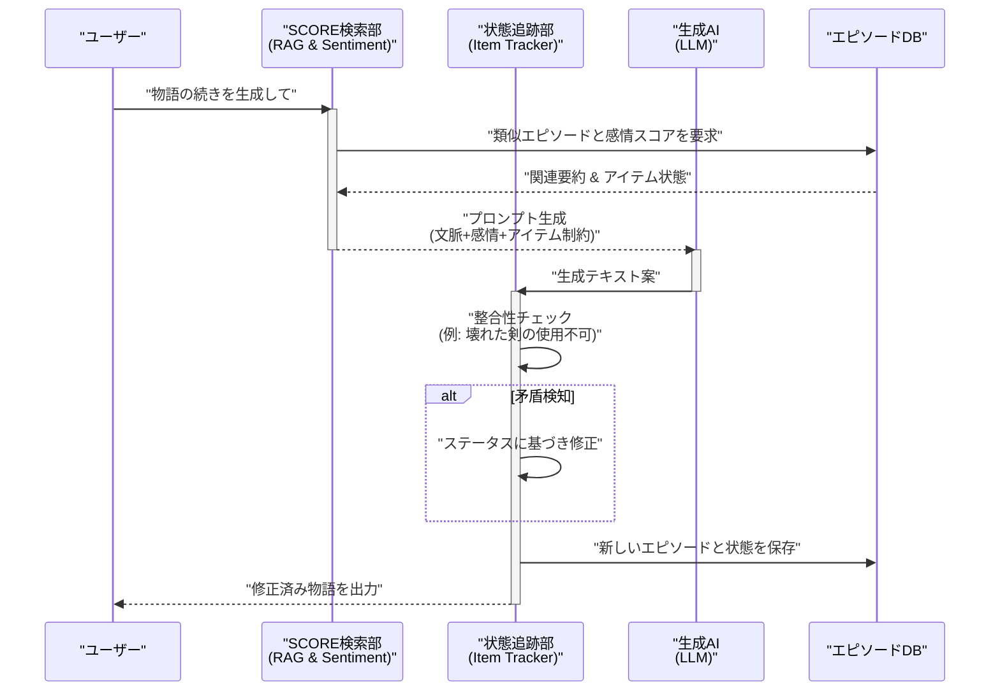
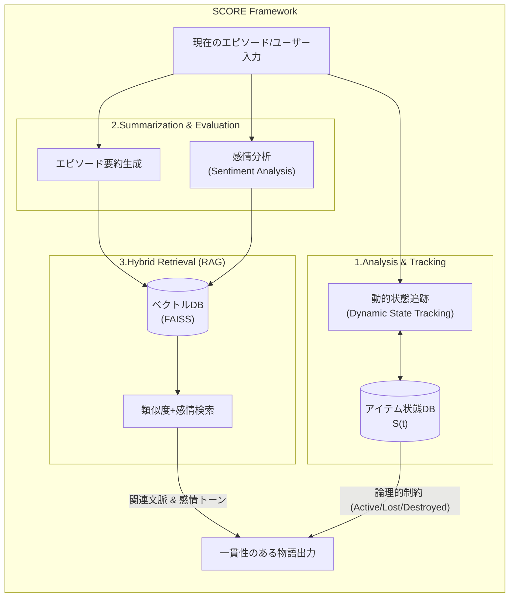

###### Created: 
2026-02-02 18:48 
###### Tag: 
#paper
###### url_01:
https://arxiv.org/abs/2503.23512 
###### url_02: 

###### memo: 

---

<!-- paper_extractor:summary:start -->

AIによる物語生成、特に長編ナラティブにおける一貫性の欠如は、この分野における長年の課題です。本論文「SCORE: Story Coherence and Retrieval Enhancement for AI Narratives」は、この問題に対して非常に体系的かつ工学的なアプローチを提案しています。

以下に、専門的な視点からの解説と評価を出力します。

# One line and three points
AIが生成する物語の矛盾を防ぐため、重要アイテムの状態追跡と感情分析を加味した検索拡張生成（RAG）を組み合わせた評価・生成フレームワーク。

1.  **動的な状態追跡機能**：物語内の重要アイテムの状態（所持、紛失、破壊など）を時系列で数理的に追跡し、論理的矛盾（破壊された剣が再登場するなど）を自動修正する。
2.  **感情を考慮したハイブリッド検索**：単なる意味内容の類似性だけでなく、エピソードの感情スコア（Sentiment Score）を組み合わせたRAGにより、文脈と感情の両面で整合性のある過去エピソードを参照する。
3.  **モデル非依存の高性能**：GPT-4やLlamaなど多様なLLMに適用可能であり、ベースラインと比較して一貫性（Consistency）とアイテム管理の精度を劇的に向上させた。

# Summary
本研究は、大規模言語モデル（LLM）が長編物語を生成する際に直面する「一貫性の欠如」と「感情的な深みの維持」という課題を解決するために、**SCORE (Story Coherence and Retrieval Enhancement)** と呼ばれる新しいフレームワークを提案しています。
LLMは創造的な文章生成に優れていますが、物語が進行するにつれて以前の出来事や設定（キャラクターの持ち物や状態など）を忘却または幻覚（ハルシネーション）により改変してしまう傾向があります。SCOREは、(1)重要アイテムのステータスを動的に追跡・修正するモジュール、(2)エピソードごとの要約生成、(3)類似性と感情分析を組み合わせた検索拡張生成（RAG）の3つの要素を統合することで、この問題に対処します。
実験では、SF、ドラマ、ファンタジーなど複数のジャンルにわたる5,000エピソードのデータセットを使用し、GPT-4やオープンソースモデル（Llama-13B等）で検証を行いました。その結果、SCOREを適用することで、物語の論理的一貫性が大幅に向上し、特にアイテムの状態管理においては98%近い精度を達成するなど、既存のGPTモデル単体での生成能力を大きく上回る成果を示しました。

# Briefing
本論文が提案する「SCORE」フレームワークは、単なるテキスト生成の補助ツールではなく、物語の「世界線」を維持するための管理システムとして位置づけられます。ナラティブAI研究の文脈において、以下の技術的詳細と貢献が重要です。

**1. 論理的制約としての動的状態追跡 (Dynamic State Tracking)**
LLMは確率的に次に来る単語を予測するため、文脈窓（Context Window）を超えた長期的な記憶や論理的な状態維持が苦手です。本手法では、物語内の重要アイテム $i$ の時刻 $t$ における状態 $S_i(t)$ を定義し、例えば $\{active, lost, destroyed\}$ といった離散的なステータスとして管理します。
特筆すべきは、LLMが「破壊されたはずのアイテム」を再登場させた場合、システム側で $S_i(t)$ の履歴と照合し、矛盾を検知して強制的に修正する点です。これは、ニューラルネットワークの確率的な出力に対して、シンボリックな論理制約を外部から与えるハイブリッドなアプローチといえ、物語の物理的な整合性を担保する上で極めて有効です。

**2. 感情ベクトルを組み込んだ高度なRAG**
従来のRAG（Retrieval-Augmented Generation）は、クエリとドキュメントの意味的類似度（Cosine Similarity）に依存していました。しかし、物語においては「意味が似ている」だけでは不十分で、「感情的なトーン」が一致している、あるいは適切な対比になっていることが重要です。
SCOREでは、エピソードの内容をベクトル化して検索するだけでなく、GPT-4を用いて算出された感情スコア $\sigma(e)$ を検索時の重み付けに利用します。これにより、単語の羅列としての類似性だけでなく、物語のムードやテンションに合致した過去の文脈を引き出すことが可能となり、結果としてキャラクターの感情的な一貫性が保たれます。

**3. モジュール性とスケーラビリティ**
実験結果（Table 1）において興味深いのは、SCOREがGPT-4のような最先端モデルだけでなく、Qwen-14BやLlama-13Bといった比較的小規模なオープンソースモデルの性能も劇的に引き上げている点です。特に「Complex QA（複雑な質問応答）」や「Item Status（アイテム状態認識）」において、ベースラインが0点や低スコアであるのに対し、SCORE適用後は劇的な改善（アイテム状態に関しては90%超え）を見せています。これは、高度な推論能力をモデル内部のパラメータに依存するのではなく、外部フレームワークによる構造化された記憶管理に委ねることの有効性を示唆しており、計算リソースの制約がある環境下でのAIナラティブ生成において重要な知見となります。

# FAQ

**Q1: このフレームワークは、どのような種類の物語に適していますか？**
A1: 特に長編の連載小説や、RPGのシナリオのように「アイテムの管理」や「以前の伏線」が重要になる物語に適しています。実験ではSF、ファンタジー、ドラマ、コメディで検証されており、ジャンルを問わず一貫性の維持に効果を発揮します。

**Q2: 既存のRAG（検索拡張生成）と何が違うのですか？**
A2: 最大の違いは「状態追跡」と「感情分析」の統合です。一般的なRAGはテキストの類似性のみで検索を行いますが、SCOREは物語内の「事実（アイテムが壊れているか等）」を追跡するデータベースと、エピソードの「感情値」をメタデータとして持っており、これらを組み合わせて生成を制御します。

**Q3: 処理速度への影響はありますか？**
A3: はい、あります。エピソードごとに要約生成、ステータス確認、検索処理が入るため、単純なテキスト生成よりも計算コストと時間は増加します。ケーススタディでは1エピソードあたり平均13.2秒の処理時間が報告されていますが、高品質な物語生成においては許容範囲内と考えられます。

**Q4: 人間が書いた小説の分析にも使えますか？**
A4: 原理的には可能です。本研究ではAI生成物の評価と修正に主眼が置かれていますが、人間が書いたテキストを入力し、その中の矛盾点（設定ミスなど）を検出する校正ツールとして応用することも十分に可能です。

# Critical Assessment（批判的評価）

**方法論の妥当性：**
実験設計は堅実であり、特にアブレーションスタディ（構成要素を削って効果を測定する実験）において、動的追跡（Dynamic Tracking）と文脈要約（Context Summary）が性能向上に不可欠であることを定量的に示しています。データセットも5,000エピソードと十分な規模があり、ジャンルのバランスも考慮されています。ただし、感情スコア $\sigma(e)$ の算出自体をGPT-4に依存している点は、コストと再現性の観点から、より軽量な専用モデルへの置き換えが今後の課題となり得ます。

**エビデンスの強度：**
本稿はarXivプレプリント（査読前論文）である点に留意が必要です。しかし、提示されたTable 1およびTable 2の改善幅（特にアイテム状態認識における0%から90%台への向上）は圧倒的であり、提案手法の有効性を強く支持しています。一方で、物語の「面白さ」や「創造性」といった主観的評価に関しては、ケーススタディでの小規模な言及に留まっており、一貫性が高まった結果、物語が平坦になっていないかどうかの検証が待たれます。

**実用化への考慮：**
フレームワーク自体は特定のLLMに依存しないため、汎用性が高く実用的です。ゲーム開発におけるNPCのセリフ生成や、脚本執筆支援ツールとしての即応性が高いでしょう。課題は、複雑な伏線や「嘘」（キャラクターが意図的に嘘をつく場合など）をシステムが「矛盾」として誤検知しないかという点です。物語固有のニュアンスをどこまで「論理的矛盾」と区別できるかが、実環境適用の鍵となります。

# For easy understanding
この論文の内容を、映画撮影の現場に例えて説明しましょう。

**現状のAI（LLM）の問題点：**
今のAIは、ものすごく才能はあるけれど、極度の「忘れん坊」な脚本家のようなものです。「第1章で主人公の剣が折れた」ということを、第5章を書く頃には忘れてしまい、平気で「主人公は剣を抜いて戦った」と書いてしまいます。また、前のシーンで悲しい別れがあったのに、次のシーンで不自然にハイテンションになったりします。

**SCOREがやっていること：**
この論文の研究チームは、その「忘れん坊の脚本家（AI）」に、非常に優秀な**「スクリプター（記録係）」**をつけたのです。これがSCOREです。

SCOREという記録係は、以下の3つの仕事をします：

1.  **小道具リストの管理（アイテム追跡）：**
    「剣は第3話で壊れた」「鍵は第2話で手に入れた」というメモを常に更新します。もしAIが「壊れた剣で戦う」と書こうとしたら、「いや、その剣はもう壊れてますよ」と訂正を入れます。
2.  **あらすじノート（要約）：**
    これまでの物語を全部読み返すのは大変なので、要点だけをまとめたノートを作っておきます。
3.  **雰囲気のチェック（感情検索）：**
    過去の似たような場面や、今のシーンの雰囲気に合った情報をノートから素早く見つけ出し、「以前こういうことがあったから、ここはこう書くべきです」とAIにアドバイスします。

**つまりこういうことです：**
AI任せにするのではなく、「物語の矛盾をチェックする専用の仕組み」をセットにすることで、最初から最後まで辻褄が合い、感情の流れも自然な、人間が書いたような長編小説を作れるようにした、というのがこの研究のすごいところです。

# Mermaid Diagrams

## タイムライン・シーケンス図
SCOREフレームワークにおいて、ユーザーの入力から物語が生成され、矛盾が修正されるまでの処理フローを示します。

## 概念図・構造図
SCOREの3つの主要コンポーネントがどのように相互作用してナラティブの一貫性を保っているかを図示します。

<!-- paper_extractor:summary:end -->