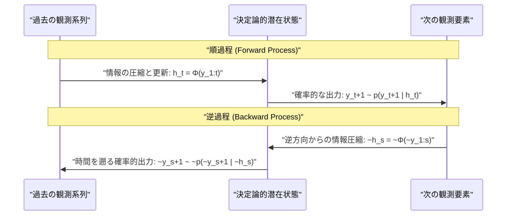
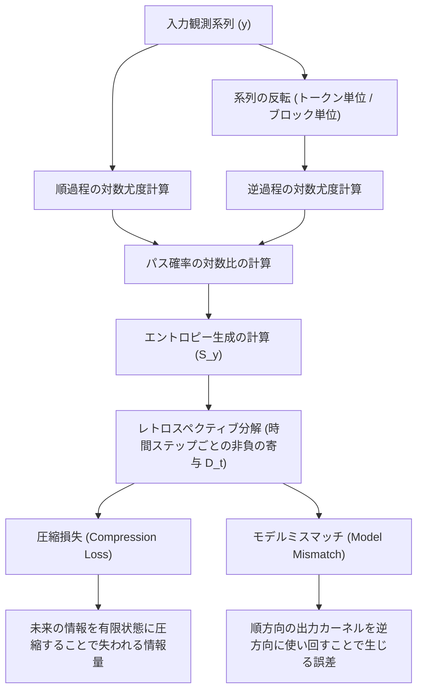

###### Created: 
2026-04-12 09:11 
###### Tag: 
#paper
###### url_01:
https://arxiv.org/abs/2604.07867 
###### url_02: 

###### memo: 

---

<!-- paper_extractor:summary:start -->

# One line and three points
決定論的メモリを持つ自己回帰型生成モデル（Transformerやカルマンフィルタ等）が生成する非マルコフ過程に対し、確率熱力学の枠組みを適用し、計算コストを抑えてエントロピー生成を算出・分解する理論を構築した論文。

1. **統一的フレームワークの構築**: Transformer、RNN、状態空間モデル（SSM）、カルマンフィルタなど、現代の多様な自己回帰型生成モデルを「決定論的な潜在状態」と「確率的な出力」の組み合わせとして単一の確率熱力学の枠組みに統合した。
2. **非マルコフ過程における計算の効率化**: 通常、非マルコフ過程のエントロピー生成（時間の非可逆性）の計算は履歴の長さに応じて指数関数的にコストが爆発するが、提案手法ではモデルの対数尤度評価を順方向と逆方向に1回ずつ行うだけで効率的に推定できることを示した。
3. **実証と情報論的分解**: 大規模言語モデル（GPT-2）を用いた実験で「文単位での時間反転」が因果関係を抽出する可能性を示し、さらに理論面ではエントロピー生成を「潜在状態による圧縮損失」と「逆方向適用時のモデルミスマッチ」に厳密に分解する手法を導出した。

---

# Summary
本論文は、現代の生成AIの基盤である自己回帰型生成モデル（Transformer、RNN、Mambaなど）や、古典的な制御理論におけるカルマンフィルタが生成する「非マルコフ過程」に対して、確率熱力学の理論を適用する統一的なフレームワークを提案しています。自己回帰型モデルは過去の全履歴に基づく決定論的な潜在状態（メモリ）から次の要素を確率的に生成するため、観測される系列は純粋な非マルコフ過程となります。従来、非マルコフ過程の時間の矢（エントロピー生成）を測定することは計算量的に困難でしたが、本研究では、モデルの既存のアーキテクチャを逆順に利用する「逆過程」を定義することで、単一のサンプリング軌道から効率的にエントロピー生成を計算する手法を導きました。

概念実証としてGPT-2を用いたテキスト生成においてエントロピー生成を評価し、単なる単語レベルの逆再生では文法崩壊によるノイズが大きくなるものの、文単位（ブロックレベル）での粗視化された逆再生を行うことで、テキスト内の因果関係や時間的順序の非可逆性を捉えられる可能性を示しました。また、線形ガウス過程（カルマンフィルタ）のケースではエントロピー生成の解析的な厳密解を導出しています。さらに理論的貢献として、エントロピー生成を各ステップの非負の寄与に分解し、それぞれを「未来の情報を要約する際の圧縮損失」と「順方向の生成モデルを逆方向に使い回すことによるモデルミスマッチ」という情報論的な意味を持つ要素へと分解できることを証明しました。

---

# Briefing

## 1. 研究の背景：確率熱力学と生成モデルの交差点
確率熱力学は、ミクロな系や非平衡状態にあるシステムにおいて「時間の非可逆性（時間の矢）」を定量化する強力な理論です。この理論の中心となる概念が「エントロピー生成（Entropy Production）」であり、これはシステムを時間の順方向に進めた場合のパス確率と、時間を逆方向に進めた場合のパス確率のカルバック・ライブラー情報量（KLダイバージェンス）として定義されます。
一方で、現代の機械学習において圧倒的な成功を収めている自己回帰型生成モデル（Large Language Modelsに代表されるTransformer、RNN、状態空間モデルのMamba、さらには信号処理の古典であるカルマンフィルタなど）は、過去のすべての観測結果を内部の「決定論的なメモリ（潜在状態）」に圧縮し、それをもとに次の観測結果を「確率的」に生成します。このようなモデルが生成するデータの系列は、一つ前の状態だけで未来が決まるマルコフ過程ではなく、過去の履歴全体に依存する「非マルコフ過程」となります。本研究は、これら一見異なる分野のモデル群を「決定論的潜在状態からの確率的出力」という単一の数学的構造として捉え、非マルコフ過程に対する確率熱力学を構築するという野心的な試みです。

## 2. 非マルコフ過程における計算コストのブレイクスルー
一般的に、未知の非マルコフ過程に対してエントロピー生成を計算しようとすると、過去のあらゆる履歴パターンに対する条件付き確率をデータから経験的に見積もる必要があり、履歴が長くなるにつれて必要なサンプル数が指数関数的に爆発する「次元の呪い」に直面します。
しかし本論文では、自己回帰型モデルの構造を巧みに利用することでこの問題を回避しています。モデルの潜在状態（TransformerのAttentionコンテキストやRNNの隠れ層など）は、次の要素を予測するための「十分統計量」として機能します。順過程（通常のテキスト生成など）と、同じモデルの構成要素を逆順に適用した逆過程のパス確率の比を取ると、確率的な周辺化の計算が不要となり、単一の生成された軌道データのみを用いて対数尤度を計算するだけでエントロピー生成が導出できることを示しました。これにより、例えば文章の長さ $T$ に対して $\mathcal{O}(T)$ または $\mathcal{O}(T^2)$ という極めて現実的な計算コストで、複雑な非マルコフ性の非可逆性を評価可能にしました。

## 3. 概念実証：GPT-2を用いた「時間の矢」の測定
この効率的な計算手法の応用として、事前学習済みの言語モデル「GPT-2」を用いた実験が行われました。言語モデルに文章を生成させ、それを「逆順」にした際の対数尤度を比較することでエントロピー生成を測定します。
ここで重要な発見がありました。テキストを「単語（トークン）ごとに逆から読む」という単純な時間反転（例えば "This is a book" を "book a is This" にする）を行うと、モデルは文法の崩壊（シンタックスの破壊）を強烈に検知してしまい、エントロピー生成の数値が極端に跳ね上がります。これは物理的な時間の非可逆性というより、単に言語のルールを破ったことに対するペナルティです。
そこで著者は「時間的粗視化（Temporal coarse-graining）」を導入しました。文の構造は保ったまま、文と文の順序（ブロック）だけを逆転させるのです。実験の結果、独立した事実を並べただけのテキスト（因果関係がない）に比べ、時間の流れや因果関係を伴うテキストでは、このブロックレベルでのエントロピー生成が有意に大きくなることが示されました。これは、LLMの内部表現から世界モデル的な「出来事の因果の非可逆性」を定量的に抽出できる可能性を示唆しています。

## 4. 理論的深化：レトロスペクティブ分解
さらに論文の後半では、このエントロピー生成に対する厳密な情報論的分解が導かれています。エントロピー生成の全体は、各時間ステップにおける非負（ゼロ以上）の寄与の和として表現されます。これはベイズ推論を用いた「レトロスペクティブ（事後的）な推論」と物理的な逆過程モデルとの差異を測るものです。
著者は、各ステップのエントロピー生成が以下の2つの要素に正確に分解されることを証明しました。
1. **圧縮損失（Compression loss）**：逆過程において、未来の情報を有限サイズの潜在状態に圧縮する際に失われる情報の損失。
2. **モデルミスマッチ（Model mismatch）**：本来は時間を順方向に進めるために最適化された「出力カーネル」を、そのまま逆方向の予測に使い回すことで生じる分布のズレ。

この数学的構造は、機械学習における変分推論（Variational Inference）で用いられるELBO（Evidence Lower Bound）の分解と形式的に非常に似ていますが、本研究では「時間の反転」と「エントロピー生成」という確率熱力学の基本原理から全く独立にこの構造が導き出された点が極めて重要です。この発見は、熱力学第二法則を「情報処理のコスト」の観点から洗練させたものと解釈できます。

---

# FAQ

**Q: この論文における「エントロピー生成」とは具体的に何を測っているのですか？**
A: システムの「時間の非可逆性（時間の矢）」の強さを測っています。具体的には、あるデータの系列（例えばAIが書いた文章）が「通常の順方向で生成される確率」と、「時間を逆回しにした設定で生成される確率」を比較したものです。逆方向で生成される確率が極端に低い（つまり不自然である）ほど、エントロピー生成の値は大きくなり、そのプロセスが「取り返しがつかない（不可逆的である）」ことを意味します。

**Q: 過去の履歴をすべて考慮する非マルコフ過程なのに、なぜ計算コストが爆発しないのですか？**
A: 対象を「自己回帰型モデル（GPTなどのAIモデル）」に限定しているためです。これらのモデルは、過去の膨大なデータを内部で「決定論的な一つのベクトル（潜在状態）」に圧縮して保持しています。そのため、無数の過去のパターンを確率的に網羅して計算する必要がなく、今見えている状態から次の状態への遷移確率（対数尤度）を一つずつ計算して足し合わせるだけで済むため、計算量が劇的に削減されます。

**Q: GPT-2の実験において、なぜ「トークン単位」ではなく「文（ブロック）単位」での反転を行ったのですか？**
A: トークン（単語）単位で逆再生すると、文章の文法構造が完全に壊れてしまい、モデルはそれを単なる「意味不明な文字列」として弾いてしまいます。これでは、私たちが本当に測りたい「出来事の因果関係（例：コップが落ちる→割れる）」の非可逆性を測ることができません。文法を維持したまま出来事の順番だけを逆にする「文単位の反転」を行うことで、より意味的・因果的な非可逆性を抽出できるようにしたためです。

---

# Critical Assessment（批判的評価）

※本評価は、対象論文がプレプリント（arXiv公開段階）であり、査読による検証を経ていないことを前提としています。

**方法論の妥当性：** 
非マルコフ過程におけるエントロピー生成の計算において、自己回帰型モデルが持つ「決定論的潜在状態」という性質を利用して指数関数的な計算コストを回避した数学的展開は非常に洗練されており妥当性が高いです。一方で、実証実験に用いたLLM（GPT-2）の粗視化実験においては、「因果関係のある文/ない文」のデータセット作成を別のLLM（Claude）のプロンプトに依存しており、実験設計の客観性や統計的検定力にはまだ向上の余地があります。

**エビデンスの強度：** 
カルマンフィルタを用いた線形ガウス過程におけるエントロピー生成の解析的導出や、モンテカルロサンプリングとの一致は強固な数学的証拠に支持されています。しかし、言語モデルを用いた意味論的な因果関係の非可逆性抽出の主張は、比較的小規模なサンプル（各30件程度）に基づく概念実証（Proof-of-Concept）の段階に留まっており、この結果を一般的な自然言語の性質として一般化するには、より多様で大規模なコーパスでの追加検証が必要です。

**実用化への考慮：** 
理論的には機械学習と非平衡熱力学を繋ぐ強力な架け橋となりますが、実環境への応用（例えばLLMが獲得した「世界モデル」の定量化や因果関係の自動抽出など）には課題が残ります。特に、テキストの逆再生における「文脈・修辞的構造の不自然さ」と「純粋な物理的・因果的不可逆性」をアルゴリズム上でどのように明確に分離するかという問題は、今後の実用化に向けた最大の制限事項と言えます。

---

# For easy understanding

私たちがビデオを再生するとき、「コップが床に落ちて割れる」映像は自然ですが、それを逆再生して「割れた破片が空中に集まって元のコップに戻る」映像を見ると、すぐに「これは逆再生だ」と不自然さに気づきますよね。物理学では、この「元の状態には戻らない時間の方向性」を**エントロピー生成**という言葉で計算します。

この論文は、この物理学のアイデアを**「AIが生成する文章やデータ」**に応用した画期的な研究です。
ChatGPTなどのAIは、これまでの会話の文脈（過去の履歴）をすべて踏まえて、次にくる単語を確率的に選び出して文章を作ります。これを専門用語で「非マルコフ過程の自己回帰モデル」と呼びます。普通、このような複雑な過去に依存するシステムの「時間の矢（逆再生の不自然さ）」を計算しようとすると、計算量が天文学的な数字に爆発してしまいます。しかし著者は、AIの内部にある「記憶のまとめ方（潜在状態）」をうまく利用する数式を編み出し、**現実的な計算時間でこの不自然さをスパコン等を使わずに計算できる理論**を作りました。

論文内では実際にGPT-2というAIを使ってテストをしています。
文章の単語をただ逆から並べただけ（例：「私はりんごを食べる」→「るべ食をごんりは私」）だと、単に文法が壊れただけの不自然さになってしまいます。そこで著者は**「文の単位でブロックごとに入れ替える」**という工夫をしました。
すると、「出来事に因果関係がある文章（例：グラスが落ちた。粉々に割れた。）」を逆再生したときの方が、「因果関係がない文章（例：バイオリンは弓で弾く。太鼓は叩く。）」を逆再生したときよりも、AIが「より不自然だ（エントロピー生成が大きい）」と判定することがわかりました。

つまりこういうことです。この研究によって、物理学の「熱力学」の計算ツールを使うことで、**AIが文章の中に潜む「出来事の因果関係や時間の流れ」をどれくらい正しく理解しているか**を、数値として客観的に測れるようになるかもしれないのです。

---

# Mermaid Diagrams

以下に、本論文の理論的フレームワークと計算プロセスを理解するためのMermaid図表を作成します。

## 概念図・構造図：順過程と逆過程のシーケンス
本論文の核心である、自己回帰型モデルにおける「順方向の生成プロセス」と、それを用いた「逆方向のプロセス」の情報の流れを示します。

## フローチャート・プロセス図：エントロピー生成と分解の論理構造
提案手法によるエントロピー生成（$\mathcal{S}_y$）の計算手順と、そこから導かれるレトロスペクティブな情報論的分解（圧縮損失とモデルミスマッチ）の論理的な繋がりを示します。

<!-- paper_extractor:summary:end -->

