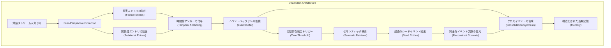
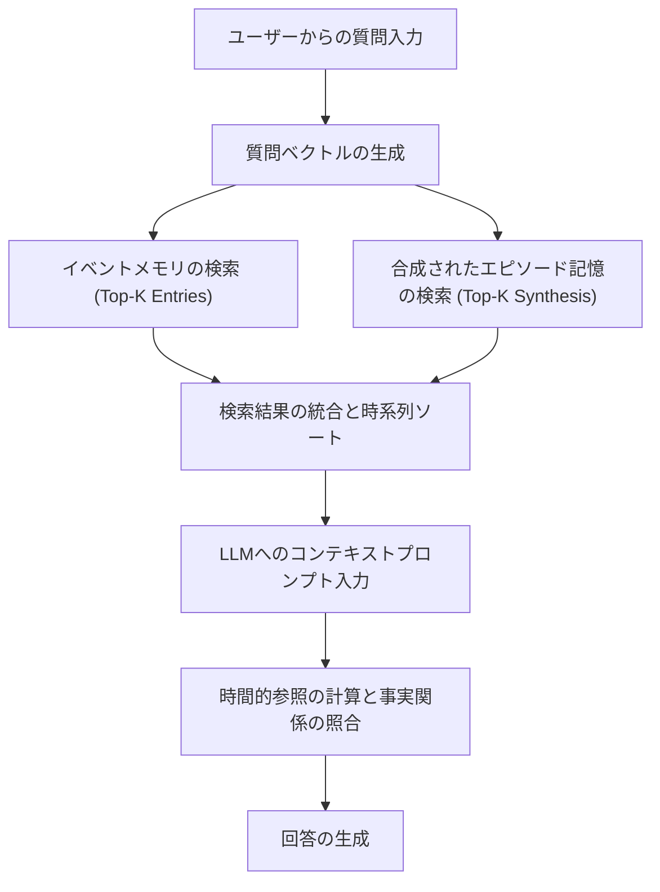
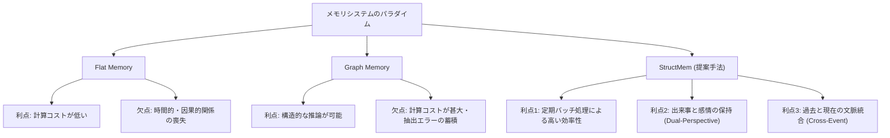
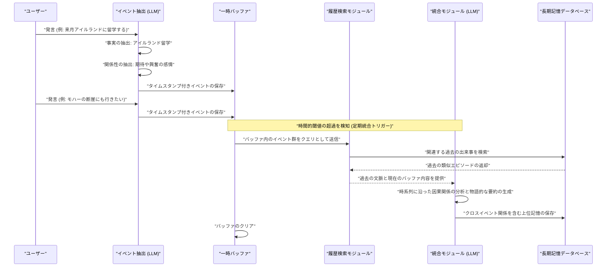

###### Created: 
2026-04-28 14:13 
###### Tag: 
#paper
###### url_01:
https://arxiv.org/abs/2604.21748 
###### url_02: 
[GitHub - zjunlp/LightMem: \[ICLR 2026\] LightMem: Lightweight and Efficient Memory-Augmented Generation · GitHub](https://github.com/zjunlp/LightMem)
###### memo: 

---
# One line and three points

本論文が提案する「StructMem」は、長期間にわたる対話エージェントの記憶を「事実」と「関係性」の両面からイベント単位で保持し、意味的に関連する過去の出来事を定期的に統合して文脈を再構築することで、従来のフラットな記憶やグラフベースの記憶が抱えていた推論精度と計算コストのトレードオフを劇的に解消する階層的メモリシステムです。

*   **イベントを基盤とした記憶の階層的構築**：対話を単なる事実の羅列や厳格なエンティティ間の関係性（トリプレット）として切り刻むのではなく、特定の時間軸に紐づいた「出来事（イベント）」として捉え、事実と人間関係のダイナミクスを同時に抽出して保存するアプローチを採用しています。
*   **文脈の定期的な統合と意味的結びつきの推論**：システムは記憶を逐一複雑なグラフ構造に変換するのではなく、一時的なバッファに出来事を蓄積し、一定時間が経過したタイミングで過去の類似した記憶を呼び出し、それらを束ねて時間的・因果的な関係性を含む上位レベルの要約（クロスイベント統合）を自動的に生成します。
*   **計算コストの大幅な削減と高度な推論能力の両立**：長距離の文脈理解が求められるLoCoMoデータセットにおいて、関係性を後から無理に推論する従来手法と比較してマルチホップ推論や時間的推論の精度を大きく向上させつつ、メモリ構築に関わるトークン消費量やAPI呼び出し回数、実行時間を圧倒的に削減することに成功しています。

# Pre-knowledge

大規模言語モデルを搭載した対話エージェントが、ユーザーと数週間から数ヶ月にわたって一貫性のある対話を続けるためには、過去のやり取りを適切に保存し、必要な時に文脈ごと引き出すための「長期メモリ（Long-term Memory）システム」が不可欠です。これまで主流であった手法の一つに、対話履歴や要約をそのままベクトルデータベースに保存し、意味的な類似度に基づいて検索する「フラットメモリ（Flat Memory）」がありますが、この手法は履歴を順序のない情報の袋として扱うため、出来事同士の因果関係や時間的な繋がりといった複雑な文脈を見失ってしまうという構造的な弱点がありました。一方で、知識グラフ技術を用いて登場人物や出来事の関係性を明示的なネットワークとして構築・維持する「グラフメモリ（Graph Memory）」は、構造的な推論を得意としますが、ユーザーの発言のたびにグラフ全体を更新・統合するための推論コスト（LLMへのAPI呼び出し回数や消費トークン量）が莫大になり、抽出エラーが蓄積して誤った関係性が定着しやすいという実用上の極めて深刻な障壁が存在していました。

# Summary

本論文「StructMem: Structured Memory for Long-Horizon Behavior in LLMs」は、大規模言語モデルを用いた対話エージェントが長期間にわたって複雑な文脈を維持し、高度な推論を実行するための新しい記憶アーキテクチャを提案するものです。研究チームは、既存のフラットメモリが持つ効率性と、グラフメモリが持つ構造的推論能力という相反する利点を統合するため、情報を厳密なグラフスキーマに押し込めるのではなく、「時間的に固定された関係的出来事（temporally grounded relational event）」を記憶の基本単位とする階層的フレームワーク「StructMem」を開発しました。

このシステムは大きく二つのメカニズムから構成されています。第一に「イベントレベル・バインディング（Event-Level Binding）」であり、ここではユーザーの個々の発言から客観的な事実内容と、発話者間の感情的・対人的な関係性のダイナミクスの両方を抽出し、それらを発生したタイムスタンプと共に結びつけて保存します。第二に「クロスイベント統合（Cross-Event Consolidation）」であり、新たに抽出されたイベント群を一定期間バッファに蓄積した後、過去の意味的に関連する記憶を検索して引き出し、それらを時系列に沿って因果関係や新たな関係仮説を含む一段高いレベルの文脈として定期的に再合成します。

LoCoMoデータセットを用いた包括的な評価実験において、StructMemは単発の事実検索にとどまらず、複数の文脈を跨いだマルチホップ推論や、過去の出来事の前後関係を問う時間的推論などの複雑なタスクにおいて、既存の最先端メモリシステムを上回る推論精度を達成しました。さらに特筆すべき点として、計算の大部分を逐次的な処理から定期的なバッチ処理へと移行させたことで、メモリ構築に要するトークン使用量、API呼び出し回数、そして全体の実行時間を、グラフベースのメモリシステムと比較して桁違いに削減し、極めて高い計算効率と実用性を証明しています。

# Briefing

対話型AIエージェントが人間の真のパートナーとして機能するためには、断片的な事実を思い出すだけでなく、「過去に何があり、それが現在の関係性や状況にどう影響しているか」を統合的に理解する能力が求められます。本研究の革新性は、この複雑な長期記憶の形成プロセスを、人間のエピソード記憶の性質にインスパイアされた情報構造と計算効率の最適化によって実現した点にあります。本節では、本論文の核となる背景課題、提案手法の詳細なメカニズム、そして実験結果が示す実践的な意義について深く掘り下げて解説します。

**1. 既存パラダイムのジレンマと本研究のアプローチ**
これまでの記憶システムは、極端な二つのアプローチの狭間で苦境に立たされていました。フラットメモリシステムは、事実や要約を独立した文書としてベクトルデータベースに保存し、類似度で検索します。この方法は計算コストが低く即応性に優れていますが、長期的な関係性や、時間的な順序に伴う因果関係を扱うことができません。情報が分断されているため、複数の出来事を組み合わせなければ答えられない質問に対しては、文脈が欠落したまま情報が引き出され、結果として表面的な類似度マッチングに劣化してしまいます。
対照的に、グラフメモリシステムは、テキストからエンティティ（実体）とリレーション（関係）を抽出し、それらをネットワーク構造として維持します。これにより論理的な繋がりは明確になりますが、自然言語が持つ豊かなニュアンスを強引に「主語-述語-目的語」という硬直した形式に押し込めるため、重要な文脈情報が削ぎ落とされるという問題があります。さらに深刻なのは、会話のたびにエンティティの抽出、重複排除、関係性の構築、既存のグラフとの矛盾解消という連鎖的なLLM推論が必要となり、対話が長引くにつれて計算コストが二次関数的に増大してしまう点です。
StructMemは、これら両者の欠点を克服するため、記憶の最小単位を「孤立した事実」や「硬直したグラフ」ではなく、「時間的に位置付けられた関係的なエピソード（temporally grounded relational event）」として定義し直しました。

**2. アーキテクチャの中核：イベントレベルの抽出とクロスイベントの統合**
StructMemのアーキテクチャは、短期的な情報の保存と長期的な文脈の形成を分離する二層構造を採用しています。
第一の層である「イベントレベル・バインディング」では、対話の流れから情報を抽出する際、二つの異なる視点（Dual-Perspective）を同時に用います。一方は具体的な事実（誰がどこに行ったかなど）を抽出する視点であり、もう一方は話し手同士の感情的なダイナミクスや対人関係（誰が誰に感謝し、どう共感したかなど）を抽出する視点です。重要なのは、これらの情報をタイムスタンプで強固に結びつける（Temporal Anchoring）ことです。これにより、後から情報を検索する際に、「何が起こったか」と「その時どういうやり取りがあったか」という事実と関係性の文脈を完全に復元することが可能になります。
第二の層である「クロスイベント統合」は、StructMemの計算効率と高度な推論能力の源泉です。システムは発言のたびに重い推論を行うのではなく、抽出されたイベントを一時的なバッファにプールします。そして、例えば「1時間経過した」といった時間的閾値を超えたタイミングで、バッファ内の出来事と意味的に関連する過去の記憶をベクトル検索を用いて引き出します。その後、現在の出来事と過去の出来事を時系列に並べ、LLMを用いてそれらを一つの首尾一貫した物語として合成（Synthesize）します。この合成プロセスにおいて、単なる過去の要約ではなく、「過去のこの出来事が、現在のこの発言にどう繋がっているか」という因果関係や関係性の仮説が自然言語として明示的に生成されます。これにより、事実上グラフ構造が持つ推論能力を、計算負荷の低いテキストの形で実現しているのです。

**3. 実験的検証が示す圧倒的な優位性**
本研究では、長期間の対話を模したベンチマークであるLoCoMoを用いて評価が行われました。その結果、StructMemは単発の事実を問う質問だけでなく、複数の発言にまたがるマルチホップ推論や時間的推論において、最高性能を記録しました。例えば、会話の別々の部分で語られた情報から、二人の人物が同じイベントに参加していたことを推論するような複雑なタスクにおいて、StructMemの統合された記憶は、フラットメモリやグラフメモリが見落としてしまう暗黙の関係性を見事に捉えることができました。
さらに驚くべきは、そのリソース効率です。イベントを逐次処理するグラフメモリと比較して、StructMemは時間的局所性を利用したバッチ処理（定期的な統合）を行うため、API呼び出し回数を数十分の一に抑え、トークン消費量と実行時間の大幅な削減に成功しています。また、独立したLLMによる厳密な監査（ハルシネーション評価）を通じても、StructMemが生成するクロスイベントの繋がりは元の対話文脈に忠実であり、根拠のない関係性を捏造する割合が極めて低い（約2.36%）ことが証明されました。これにより、高いスケーラビリティと信頼性を兼ね備えた実用的な記憶アーキテクチャであることが示されています。

# FAQ

**Q1: なぜStructMemはグラフメモリシステムよりもAPI呼び出し回数やトークン消費量が大幅に少ないのですか？**
グラフメモリシステムは、ユーザーが1回発言するたびに「エンティティの抽出」「重複の排除」「関係性の抽出」「既存知識グラフとの統合・矛盾解消」という4つの連続したLLM推論を強制的に実行する必要があります。対話履歴が長くなればなるほど、既存のノードとの比較計算が膨れ上がり、コストが二次関数的に増大します。一方でStructMemは、抽出したイベントを一旦バッファに溜め込み、一定の時間が経過した後にのみ、過去の関連する出来事をまとめて引き出し、一度のプロンプトで全体を要約・統合（バッチ処理）します。これにより、処理の回数自体を劇的に削減しているため、圧倒的な効率化を実現しています。

**Q2: クロスイベント統合（Cross-Event Consolidation）において、過去の記憶をすべて見直すのではなく、どのようにして適切な情報だけを合成しているのですか？**
クロスイベント統合が発火する際、StructMemはバッファに溜まった最近のイベントの集合を一つのクエリ（検索キー）として扱います。そして、過去の膨大なイベントの中から、このクエリと意味的に類似している上位の記憶（シードエントリー）だけをベクトル検索によって選び出します。さらに、そのシードと同じタイムスタンプを持つ周辺の出来事も合わせて復元することで、部分的な事実だけでなく当時の完全な文脈を引き出します。このようにして「現在起きていることと意味的に関連の深い過去の完全なエピソード」だけを抽出し、LLMに渡して時系列に沿った統合要約を生成させています。

**Q3: 「事実」と「関係性」を別々に抽出（Dual-Perspective Extraction）する理由は何ですか？**
対話においては、「誰がどこに行った」という客観的な事実と、「それについてどう感じ、相手がどう共感したか」という感情的・対人的なダイナミクスの両方が重要です。もしこれらを一つの要約としてまとめてしまうと、後から情報を取り出す際に細かなニュアンスや情報が失われる危険性があります。事実情報の抽出用プロンプトと関係性抽出用プロンプトを明示的に分けることで、エージェントはそれぞれの情報を高い解像度でこぼさずに捉えることができ、それらを同じタイムスタンプで紐付けることで、事実関係と感情的背景を併せ持った豊かで人間らしいエピソード記憶を形成することができます。

**Q4: 生成されたクロスイベントの繋がりが、AIによる幻覚（ハルシネーション）や捏造にならないようにどのような工夫をしていますか？**
StructMemでは、情報を抽出および合成する際のプロンプトに厳格な制約（Grounding Constraints）を設けています。具体的には、合成を行う際に「具体的な日付、時間、場所を正確に保持すること」や、「関係性を説明する際には必ず元のタイムスタンプを引用して文脈に組み込むこと」をLLMに強く指示しています。論文内のアブレーションスタディ（要素削減実験）において、これらの時間的なアンカーや制約を外したプロンプトを使用するとハルシネーション率が急増することが確認されており、時間を基準とした厳密な紐付けが信頼性の高い記憶構築に不可欠であることが証明されています。

# Critical Assessment（批判的評価）

本研究はプレプリント（非査読論文: arXiv:2604.21748v1）段階のものであり、主張される成果や評価については今後の査読プロセスを経た科学的検証を待つ必要がある点をあらかじめ明記します。その上で、以下の観点から批判的に評価します。

**方法論の妥当性：**
本研究の実験設計は、最新の評価基盤であるLoCoMoデータセットを用いており、フラットメモリから最先端のグラフメモリまで広範なベースラインと体系的に比較している点で高く評価できます。また、評価手法としてLLM-as-a-judge（GPT-4oやQwen、DeepSeek等）を用いており、複数の異なるモデル間で高い評価の一致度（Fleiss' kappaが0.83以上）を示している点は統計的信頼性を裏付けています。しかし、イベントの抽出や統合の質が、提供されるプロンプトの設計に強く依存しているため、対話のドメインや言語が大きく変わった際のロバスト性には検証の余地が残されています。

**エビデンスの強度：**
提案手法がトークン数やAPI呼び出し回数を劇的に削減しつつ推論精度を向上させたという証拠は、アブレーションスタディ（時間統合を無効化した比較など）や詳細なコンポーネントごとの消費量分析を通じて強力に支持されています。また、ハルシネーションの少なさを専任のプロンプトで厳密に監査している点も説得力があります。ただし、本研究のエビデンスは現時点で限られたベンチマーク環境下のものであり、ユーザーの好みが頻繁に反転するような極めてノイズの多い実環境データにおける一般化可能性については、さらなる長期的な実証実験が必要です。

**実用化への考慮：**
計算コストの削減と文脈維持のトレードオフを解消したアーキテクチャは、プロダクション環境の対話エージェントへ導入する上で極めて高い実用性を持っています。一方で、論文のLimitationsにも記述されている通り、ユーザーの好みや事実が時間経過とともに変化・更新された場合に、過去の記憶要約と新しい情報との間で生じる矛盾をどう解決するか、あるいは不要な記憶をどう忘却（decay）させるかという「記憶の動的更新メカニズム」が明示的に組み込まれていない点は、実運用に向けた主要な課題となります。

# For easy understanding

大規模なAIと長くおしゃべりを続けていると、AIが「少し前に話した大事なこと」を忘れてしまったり、人間関係の微妙なニュアンスを理解できなくなったりすることがあります。これを解決するために、AIにどのように「記憶」を持たせるべきかが重要な研究テーマになっています。

これまでのアプローチには、大きく分けて二つの方法がありました。
一つ目は、**「会話をただひたすらメモ帳に箇条書きにしていく方法（フラットメモリ）」**です。これは簡単で素早いのですが、メモが増えすぎると、「昨年の夏に行ったお祭りの話」と「最近話題に出た友達の話」がどう繋がっているのか、バラバラのメモからは推理できなくなってしまいます。
二つ目は、**「会話のたびに、登場人物の巨大な相関図を黒板に描き直す方法（グラフメモリ）」**です。関係性は一目でわかるようになりますが、会話を一言交わすたびに相関図全体を修正して書き直さなければならず、AIの頭の回転（計算量）とお金（APIコスト）が莫大にかかってしまい、現実的ではありませんでした。

本論文が提案する**「StructMem」**は、人間が日々どのように記憶を整理しているかにヒントを得た、まったく新しい第3のアプローチです。
例えるなら、**「日々の出来事と感情を短いメモに残しておき、週末の落ち着いた時間に、似たような出来事をまとめて『一つの繋がったエピソード』として日記に書き起こす」**ようなシステムです。

具体的には以下のように動きます：
1. **日々のメモ（イベントレベルのバインディング）**：会話の中で、「誰が何をしたか（事実）」と「その時どんな感情や励まし合いがあったか（関係性）」を別々の視点からしっかりと抜き出し、日時のスタンプを押して保存します。
2. **週末の日記整理（クロスイベントの統合）**：会話のたびに重い計算をするのではなく、一定時間ごとのタイミングで、最近の出来事と「過去の似たような出来事」を記憶の引き出しから探し出します。そして、「あ、昨年のこの話と今日のこの話は繋がっているな」という関係性を文章として自然に繋ぎ合わせ、より深い理解を含む要約を作成します。

**つまりこういうことです：**
無理に複雑なネットワーク図を毎回作らなくても、関連する出来事同士を定期的に「文脈のあるエピソード」として文章でまとめ直す仕組みを作ることで、AIは過去の会話の因果関係を深く理解できるようになります。これにより、AIがより賢く人間らしい推論ができるようになるだけでなく、処理にかかる時間やコストを圧倒的に減らすことができる、非常に実用的な発明なのです。

# Mermaid Diagrams

論文のシステム構造とプロセスを視覚的に理解するため、以下のMermaid図表を作成しました。すべてのテキストは厳格な構文規則に従い表現されています。

## 概念図・構造図

StructMemがどのように二つの層（イベントレベルとクロスイベントレベル）で構成されているかを示す全体アーキテクチャの構造図です。

## フローチャート・プロセス図

質問応答（QA）タスクにおいて、StructMemがどのように記憶を検索し、推論を行って回答を生成するかのプロセスを示します。

## 関係図・相関図

既存の3つのメモリパラダイム（Flat, Graph, StructMem）が、どのような利点と制約のトレードオフを持っているかを示す相関図です。

## タイムライン・シーケンス図

ユーザーの発言からシステムがどのように情報を処理し、一時バッファに蓄積して定期的に長期記憶へ統合（Consolidate）するかを示す時系列シーケンス図です。

