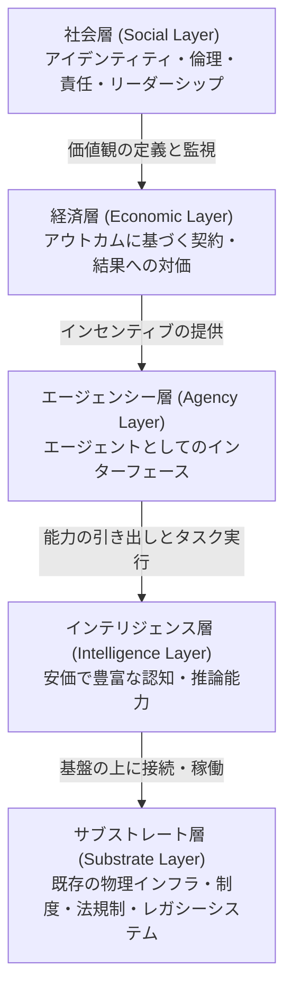
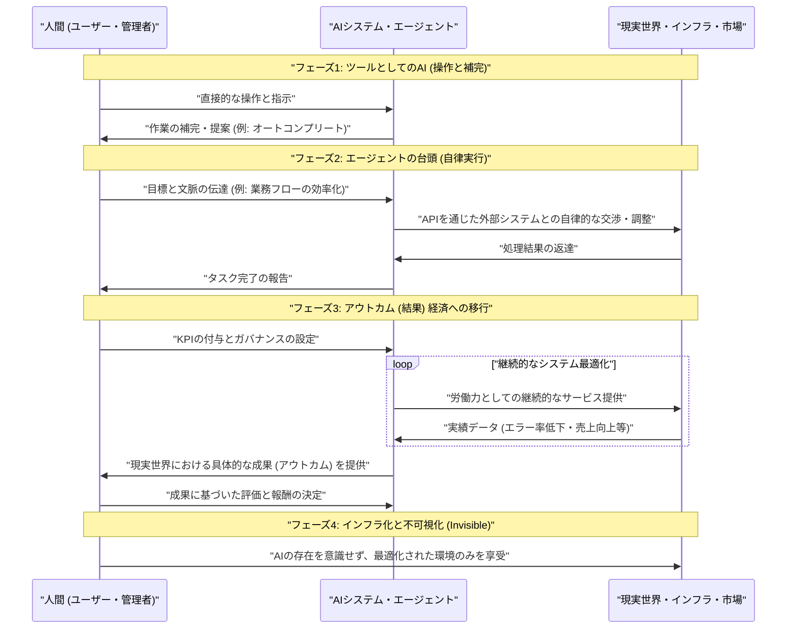
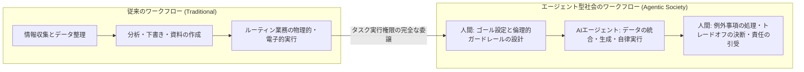
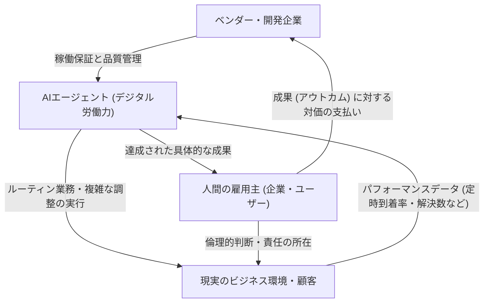

###### Created: 
2026-04-17
###### Tag: 

###### url_01:
[The Agentic Society. Living In a Delegated World \| by Mandel Era \| Medium](https://medium.com/@mandelera/the-agentic-society-6dc8d67100bd)
###### url_02: 

###### memo: 

---

**本稿は、近年著しい発展を遂げる人工知能（AI）技術が、単なるソフトウェアの機能向上にとどまらず、社会構造そのものを根本から再定義する「エージェント型社会（The Agentic Society）」への移行プロセスを論じた極めて洞察に富むエッセイです。以下に、本論文（オピニオン記事）の包括的な解読と批評を展開します。**

---

# One line and three points

**一行解説：**
AIが「指示待ちのツール」から「自律的に成果を出す労働力（エージェント）」へと進化し、経済の取引単位が「利用量」から「結果」へと移行することで、最終的にAIが社会のインフラとして不可視化していく未来構造を描き出したパラダイムシフトの青写真。

**3つのポイント：**
1. **インターフェースの変革とインテリジェンスのコモディティ化：**
   高度な認知・推論能力が極めて安価かつ豊富に供給されるようになり、ユーザーが複数のツールを操作する時代から、自然言語で目標を伝えるだけでエージェントが背後のシステムを自律的に操作・調整する時代へと移行する。
2. **ソフトウェアの「労働力化」と成果（アウトカム）主義経済への転換：**
   AIシステムはライセンス契約で購入される「道具」ではなく、KPIを持ち評価される「デジタルの従業員」として扱われ、企業間取引もソフトウェアの機能や利用時間ではなく、「解決したチケット数」や「向上した売上」といった具体的な現実の変化（アウトカム）に対して対価が支払われるようになる。
3. **人間の役割の抽象化（Abstraction Shift）と技術の不可視化：**
   ルーティン化された知的作業をAIが担うことで、人間の役割は直接的な作業の実行から、倫理的判断、例外処理、システム全体の設計、および「責任の所在の引受」といったより抽象度が高く人間関係に依存する領域へと押し上げられ、最終的に「AI」という言葉自体が日常のインフラに溶け込み消滅していく。

---

# Summary

本稿は、Generative AIを筆頭とする高度な知能モデルの普及が、私たちの社会や経済システムにどのような構造的変革をもたらすかを5つの階層（レイヤー）と4つの動的プロセス（ダイナミクス）から包括的にモデル化した論考です。著者は、現代のAIを単一の孤立した技術としてではなく、既存のインフラや法規制といった強固な基盤（サブストレート）の上に築かれる「階層的な進化」として捉えています。

知性が安価で豊富になることで、システムとの関わり方は「ツールの操作」から「自律型エージェントへの目標の委譲」へと劇的に変化します。この変化は経済のあり方をも根本から覆し、ソフトウェアは単なる機能の集合体から、組織内で責任を持って業務を遂行する「労働力」として扱われ、取引形態も利用量ベースから成果（アウトカム）ベースへとシフトします。同時に人間の労働力は、情報の要約や下書きといった認知的な作業から解放され、リスクの管理や倫理的な意思決定、システム設計といった抽象度の高いメタ認知的な役割へと上昇していきます。社会の各分野（医療、教育、物流、法務など）においてこの変革の速度は既存の制約によって異なりますが、最終的にAIは電気やインターネットのように生活の背後に溶け込み、人々が「AI」という言葉を意識することすらなくなる成熟期を迎えると論じています。

---

# Briefing

本稿は、AIという技術的特異点が実社会に実装される過程を、極めて解像度の高い「レイヤー（階層）構造」と「ダイナミクス（動態）」のフレームワークを用いて体系化しています。表面的な「AIによってなくなる仕事」といった単純な議論を超え、社会システム全体がどのように再構築されるかを深く掘り下げた内容となっており、以下の構造に沿って詳細に紐解くことができます。

### 1. エージェント型社会を構成する「5つのレイヤー」
社会の変容を理解するためには、AIが真空地帯に現れるのではなく、すでに構築された複雑な迷路の中に投下されることを理解する必要があります。

*   **サブストレート層（物理・制度的基盤）：** 
    AIが作動する前提となる、クラウドインフラ、スマートフォン、決済システムから、道路、港湾、病院の設備、さらには法規制や専門職の規範といった既存の現実世界を指します。AIの機能はコードの変更ひとつで世界数百万人に一瞬で配布される驚異的なスピードを持つ一方で、実際の社会適用は、この物理的・制度的基盤が持つ「遅さ」に強く制約されます。
*   **インテリジェンス層（安価で豊富な認知能力）：**
    推論、分析、要約といった高度な認知作業が劇的に安価になり、誰にでも利用可能になる層です。かつて専門家に依存していた分析能力の不足が解消される一方で、新たなボトルネックは「何をするべきか」という知識から、「実世界での調整、ガバナンス、信頼の構築」へと移動します。
*   **エージェンシー層（新たなインターフェース）：**
    システムとの対話手法の進化です。ユーザーは複雑なダッシュボードを操作するのではなく、「今月の予定を整理して」「ネットワークを修復して」といった結果のみを要求します。エージェントは文脈を理解し、背後にある多数のツールやAPIを自律的にオーケストレーション（調整・実行）する仲介者として機能します。
*   **経済層（アウトカムに基づく市場）：**
    エージェントがタスクを完遂できるようになると、顧客は「ソフトウェアのライセンス（座席数）」ではなく「達成された成果（チケット処理数、定時配送率、生徒の成績向上など）」に対して対価を支払うようになります。ソフトウェアベンダーは単なる道具の提供者から、リスクと利益を共有する「事業パートナー」へと経済的性質を変化させます。
*   **社会層（人間関係とリーダーシップの再定義）：**
    実行や分析といった作業が機械に委譲されることで、人間の価値は「正しく出力を作ること」から「リスクを管理し、システムの制約を設計し、トレードオフを決定して責任を負うこと」へと抽象度の階梯を登ります。

### 2. 社会を駆動するダイナミクスと進化のカーブ
著者は、このエージェント型社会への移行が一直線に進むわけではなく、特定の法則に従って段階的に深まっていくプロセスを提示しています。

*   **委譲のカーブ（The Delegation Curve）：** 
    「人間が使うツール」として始まったAIは、やがてタスク全体をこなす「エージェント」となり、市場が「アウトカム（成果）」に価値を見出すようになります。その後、組織はエラーを個別に直すのではなく「システム全体」の再設計へと向かい、最終的にAIはインフラとして「不可視化（Invisible）」します。
*   **ノーマライゼーション（言語的な消滅）：** 
    技術が成熟した証拠として、著者は「AIという言葉が使われなくなること」を挙げています。かつてあらゆる製品に「インターネット対応」と書かれていたのが消滅したように、求人票や製品仕様から「AI駆動」という言葉が消え、単に「精度の高さ」や「自動化の快適さ」だけが語られるようになります。

### 3. 具体的な社会実装のシナリオ（Portrayals）
論文内では、具体的な業界ごとの変革シナリオが描かれており、これが本稿の理論を強力に裏付けています。
*   **ある中規模都市の交通網：** 道路を一切作り直すことなく、既存のセンサー群にAIエージェントを接続するだけで渋滞が緩和されます。行政の仕事は信号の制御から「公平性や環境目標といったポリシーの設定」へと移行します。
*   **法務・法律事務所の解体と再構築：** これまで若手弁護士の登竜門であった「膨大な書類のレビューや下書き」といった下積み作業（Grind work）をエージェントが代替します。これにより、従来の徒弟制度は崩壊し、若手にも初期から高度な交渉力や倫理的判断力が求められ、事務所のビジネスモデルはタイムチャージ（時間報酬）から、勝訴率や回避されたリスクに基づく成功報酬型へと強制的に移行します。

これらの詳細な構造的考察は、AI革命が「人間の仕事を奪うか否か」というゼロサムの議論ではなく、「人間の知的労働の重心をいかにシフトさせ、社会システム全体をいかに再配線するか」というマクロな問いであることを我々に強く突きつけています。

---

# FAQ

**Q1: AIインテリジェンスが安価になることで、なぜ「実行」ではなく「調整や責任」がボトルネックになるのでしょうか？**
**A1:** インテリジェンスが安価になるということは、「正解を導き出すコスト」が下がることを意味します。しかし、導き出された正解を実社会（例えば医療現場や法廷、工場の物理的ライン）に適用するには、各部門の利害調整、法規制のクリア、そして万が一ミスが起きた際の「誰が責任を負うのか」という倫理的・法的な合意形成が必要です。AIは推論はできても「法的責任」を負うことはできないため、最終的な実装と責任の引受という人間同士のプロセスが最も困難なハードルとして残るからです。

**Q2: 記事内にある「ソフトウェアが労働力（Labor）として扱われる」とは、具体的に企業活動にどのような影響を与えますか？**
**A2:** これまでの企業は、SaaSツールを「業務を効率化するための道具（機能の束）」として導入し、その活用責任は人間の従業員にありました。しかしエージェント型社会では、AIに対して「デジタルスタッフ」として予算が割かれ、KPIが設定されます。企業は「どのツールが使いやすいか」ではなく、「どのエージェントに自社の業務を委任し、どんな条件で働いてもらうか」という、人間を採用する時と全く同じメンタルモデルでAIの調達を行うようになります。

**Q3: 「人間の役割が抽象度の高い階梯に上がる（Upward shift in human work）」とありますが、一部の優秀な人材以外は不要になってしまうのでしょうか？**
**A3:** 著者の見解によれば、定型的な認知作業に依存していたキャリアパスは確かに縮小する一方で、新たな役割が生まれます。人間は「書類を完璧に仕上げる作業者」から、システムに適切なガードレールを設け、AIが導出した結果に対して「倫理的な線引き」を行ったり、顧客や家族との「人間的で感情的な対話・交渉」に時間を割いたりする役割へと移行します。知的能力そのものよりも、判断力、共感力、責任感といった人間的要素を中心に個人のアイデンティティを再構築する必要があると説かれています。

---

# Critical Assessment（批判的評価）

本研究（オピニオン記事）を学術的・実践的な観点から以下の通り評価します。

**方法論の妥当性：**
本稿はポッドキャストの対話内容をベースに構築された概念的エッセイであり、厳密な実験設計や定量データ、統計的検定力に基づくアプローチは取られていません。その強みは、複雑な社会変化を「5つのレイヤー」と「委譲のカーブ」というMECE（モレなくダブリなく）に近い美しい概念モデルに落とし込んでいる点にありますが、制約として、主張を裏付ける客観的・定量的な指標（例えば、アウトカムベース契約の実際の市場普及率など）が提示されていないことが挙げられます。

**エビデンスの強度：**
本論文は査読済みの学術論文ではなく、Medium上で公開されたプレプリント未満のオピニオン記事です。提示されている「エージェント型社会の到来」や「成果報酬型経済への移行」といった主張は、インターネットやクラウド化といった過去のテクノロジートレンドの延長線上の推測（Speculative claims）としては極めて論理的で説得力があります。しかし、再現性や一般化可能性を担保する実証的なデータは不足しており、現状のLLMが抱えるハルシネーション問題などの技術的限界を過小評価しているきらいがあります。

**実用化への考慮：**
著者が「サブストレート層（基盤層）」という概念を用いて、既存の法規制や物理インフラ、既得権益の抵抗といった実社会での実装ハードル（制約事項）を正確に指摘している点は、非常に現実的で高く評価できます。一方で、システムが不可視化する過程で生じるセキュリティリスクの増大、アルゴリズムの暴走によるシステミックリスク、あるいは人間の労働移行期における深刻な雇用格差の発生に対する具体的な安全網や政策的解決策への言及は限定的です。

---

# For easy understanding

**「AIは、便利な『道具』から自律的な『新入社員』へ」**

この記事が伝えている一番重要なメッセージは、**「AIとの付き合い方が根本的に変わる」**ということです。

これまでのソフトウェアは、例えるなら「超高性能なハサミや電卓」でした。人間が使い方を覚え、人間が手を動かさなければ何も生み出しませんでした。しかし、これからのAIは**「自律的に動く優秀な秘書（エージェント）」**に変わります。あなたは「今月の出張手配を一番安いプランで組んでおいて」と一言伝えるだけで、AIが勝手に航空会社のシステムを調べ、ホテルを予約し、カレンダーに予定を書き込んでくれます。

これに伴い、ビジネスの「お金の払い方」も変わります。
昔は、システムを「1ヶ月使っていくら」という形でレンタルしていました。しかしAIが全部仕事をしてくれるなら、「何時間使ったか」は重要ではありません。企業は**「荷物が遅延なく届いたか」「売上が何％上がったか」という『結果（アウトカム）』に対してのみお金を払う**ようになります。AIはもはや道具ではなく、「結果にコミットする労働力」として扱われるのです。

**では、人間の仕事はどうなるのでしょうか？**
AIが書類を作り、データを分析してくれるなら、人間の役割は「作業者」から「監督（マネージャー）」へと変わります。「AIが出した答えは、倫理的に正しいか？」「もしこのAIがミスをしたら、誰が責任を取るのか？」「そもそもの目標をどこに設定するのか？」といった、**人間同士の価値観や責任に関わる決断**が、私たちの最も重要な仕事になります。

そして数年もすれば、スマートフォンを開くときに「これは最先端の電波技術だ」といちいち感動しないのと同じように、生活の至る所にAIが溶け込み、「AI」という言葉すら使われなくなる時代がやってくる。それがこの記事の描く未来の全体像です。

---

# Mermaid Diagrams

以下に、本論文の核となる概念を視覚化したMermaid図表を提示します。

## 概念図・構造図
エージェント型社会の基盤となる「5つのレイヤー」の相互関係を図示しています。物理的な制約（下層）の上に高度な機能（上層）が構築されていく様子を表しています。

## タイムライン・シーケンス図
論文内で示されている「委譲のカーブ（The Delegation Curve）」における、人間とAI、そして実世界のシステムの関わり方が時間とともにどう変化し、最終的に「不可視化」していくかを示しています。

## フローチャート・プロセス図
人間の労働における「抽象度のシフト（Abstraction Shift）」を図示しています。従来のタスク実行型から、AIをマネジメントする意思決定型へとワークフローが移行するプロセスです。

## 関係図・相関図
エージェント型社会における新しい経済取引（アウトカムベースの契約）と、システム全体のエコシステムの因果関係を示しています。

