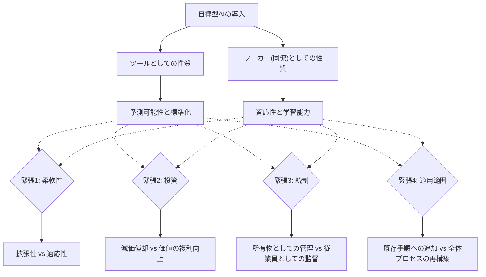
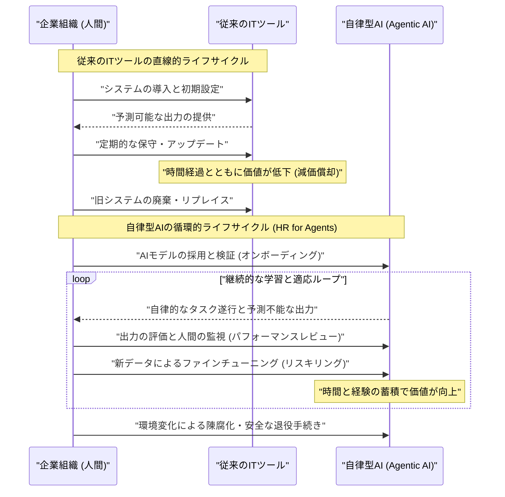

###### Created: 
2026-04-12
###### Tag: 

###### url_01:
[the-emerging-agentic-enterprise-how-leaders-must-navigate-a-new-age-of-ai.pdf](https://web-assets.bcg.com/dc/c5/1bcbfdc0405c85fb14972a57c20a/the-emerging-agentic-enterprise-how-leaders-must-navigate-a-new-age-of-ai.pdf)
###### url_02: 

###### memo: 

---
# One line and three points
**一行解説：**
自律的に計画・行動・学習する「エージェンティックAI（Agentic AI）」は、もはや単なる「ツール」ではなく「同僚」として機能するため、企業は既存の管理フレームワークを根本から再設計しなければならない。

**3つのポイント：**
1. **ツールとワーカーの二面性による4つのジレンマ：** 予測可能な「ツール」としての拡張性と、人間のような「ワーカー」としての適応性を併せ持つAIは、柔軟性、投資、統制、適用範囲という4つの戦略的緊張（矛盾）を生み出している。
2. **「AIのための人事部」の必要性：** AIエージェントは使えば使うほど学習して価値が上がる（減価償却されない）ため、人間の従業員と同様に、採用、オンボーディング、評価、再訓練を行う独自のライフサイクル管理が不可欠となる。
3. **組織構造とスキルの抜本的変化：** スペシャリストよりも、人間とAIのハイブリッドチームを編成・指揮できる「ゼネラリスト（オーケストレーター）」の価値が高まり、中間管理職の階層が減少するフラットな組織へと移行していく。

---

# Summary
本論文は、組織におけるAIの位置づけが、受動的な「自動化ツール」から、自律的に機能する「同僚（チームメイト）」へと急速に進化している現状を浮き彫りにしています。2,100名以上のグローバルエグゼクティブを対象とした調査によると、自律型AI（Agentic AI）の導入は従来のAIや生成AIを凌ぐスピードで進んでおり、すでに35%の企業が導入し、44%が導入を計画しています。

しかし、この急速な普及に対し、企業の経営戦略や組織設計が追いついていないという重大なリスクが指摘されています。エージェンティックAIは「機械のように所有されるが、人間のように監督・育成される必要がある」という相反する性質を持つため、既存のIT資産管理と人事管理の枠組みの間に落ち込んでしまいます。本研究は、この二面性がもたらす「4つの戦略的緊張」を定義し、それを乗り越えるために、ワークフローの再構築、ガバナンスの適応、役割の再定義（オーケストレーターの育成）、AIエージェントのライフサイクル管理（AIのためのHR）、そして不確実性を前提とした新しい投資戦略の5つの具体的なアクションを提言しています。

---

# Briefing
本セクションでは、経営学および組織行動論の観点から、本レポートの核心的な文脈と理論的背景をより深く、網羅的に解説します。単なる調査結果の羅列ではなく、なぜこの現象が起きているのか、そして組織はどう対応すべきかというメカニズムを紐解きます。

**1. 「技術と戦略の分離」の終焉と新たな前提**
これまで多くの企業では、「テクノロジーはIT部門が管理し、人材や組織戦略は人事部や経営陣が管理する」という明確な境界線が存在しました。ツール（機械やソフトウェア）は資本として減価償却され、人間は労働力として経験を積むことで価値を高めるという前提です。しかし、自律的に計画を立て、判断し、学習するエージェンティックAIは、この前提を破壊しました。AIは「ツール」と「ワーカー」のハイブリッドとして振る舞うため、テクノロジーの問題と戦略の問題を分離して考えることはもはや不可能です。

**2. 組織を直撃する「4つの戦略的緊張（Strategic Tensions）」**
レポートでは、このハイブリッドな性質が日常業務において引き起こす具体的な対立構造を4つの次元で整理しています。

*   **柔軟性の緊張（拡張性 vs 適応性）：**
    従来のツールは特定の目的のために予測通りに拡張（スケール）しますが、想定外の事態には適応できません。一方、人間は柔軟に適応しますが、スケールには限界があります。エージェンティックAIはこの中間に位置し、標準化による効率を求めすぎると、AIが人間のように文脈を理解して適応する能力を殺してしまいます。
*   **投資の緊張（経験 vs 便宜性）：**
    従来のITシステムは巨額の初期投資と定率の減価償却モデルで評価されましたが、エージェンティックAIは使い込み、ファインチューニングを行う（経験を積ませる）ことで価値が向上する「時間経過とともに価値が上がる資産」です。このため、従来のROI（投資利益率）計算や一律のシステム更新サイクルが機能しなくなります。
*   **統制の緊張（監督 vs 自律性）：**
    ツールであれば人間が完全にコントロールできますが、自律型AIは予期せぬ出力や行動をとる可能性があります。そのため、「会社が所有する資産」であるにもかかわらず、リスクに応じて「人間の介入（Human-in-the-loop）」と「完全自動化（Human-out-of-the-loop）」をダイナミックに切り替える「従業員への監督（マネジメント）」に近いガバナンスが必要になります。
*   **適用範囲の緊張（改修 vs 再設計）：**
    既存のプロセスにAIを継ぎ接ぎして短期的な効率化を狙うか（Retrofit）、AIの能力を前提に業務プロセスそのものをゼロから作り直すか（Reengineer）というジレンマです。AIの進化が早すぎるため、長期間かけて再設計している間に技術が陳腐化するリスクが常に伴います。

**3. マネジメント層に求められる5つのパラダイムシフト**
これらの緊張を解消するのではなく「飼い慣らす」ために、経営陣は以下の構造的転換を図らなければなりません。

第一に、業務の「漸進的な改善」から抜け出し、人間の判断と機械の自律性を前提としたプロセス設計を行うこと。第二に、固定化された権限ではなく、状況に応じて適応可能なガバナンス基盤を構築すること。第三に、専門スキルを持つスペシャリストの育成から、複数領域を跨いでAIと人間を指揮する「ゼネラリスト（オーケストレーター）」の育成へと舵を切り、階層をフラット化すること。

そして最も示唆に富むのが、第四の「AIエージェントのライフサイクル管理」です。企業は人間を対象とした人事部だけでなく、**「エージェントのためのHR機能」**を設ける必要があります。新しいAIを業務に馴染ませ（オンボーディング）、精度やバイアスを評価し（パフォーマンスレビュー）、新しいデータで再学習させ（リスキリング）、古くなれば退役させるという一連の管理が不可欠です。最後に、変化を前提とした柔軟な予算編成と、相反する価値（効率化と探索）を同時に測定する新しい指標を持つ投資戦略が必要となります。

---

# FAQ
**Q1: エージェンティックAIは、ChatGPTなどの「生成AI」と何が違うのですか？**
生成AIは主にユーザーのプロンプト（指示）に対してコンテンツを生成する受動的なツールです。一方、エージェンティックAIは、与えられた大きな目標に対して自ら計画を立て、複数のステップを実行し、必要に応じて他のシステムや別のAIエージェントと連携しながら、自律的にタスクを完遂し、その過程で学習する能力を持ちます。つまり「指示を待つアシスタント」から「自律して動く同僚」へと進化したものです。

**Q2: レポートで提唱されている「AIのための人事部（HR for agents）」とは具体的に何をする組織ですか？**
人間の従業員に対する人事管理と全く同じことをAIに対して行います。具体的には、新しいAIモデルの検証と導入（採用とオンボーディング）、業務を通じた出力精度や倫理的バイアスの監視（人事評価）、新しい事業環境やデータに基づくモデルのファインチューニング（リスキリング・研修）、そして古く陳腐化したモデルの安全な停止（退職勧告）を担当する機能横断的なチームを指します。

**Q3: AIの導入が進むと、従業員は専門スキル（スペシャリスト）を磨くべきですか？**
本研究のデータでは逆の傾向が示されています。AI導入が進んだ企業の43%が、スペシャリストよりも「ゼネラリスト」の採用を増やすと回答しています。ここでのゼネラリストとは「器用貧乏」という意味ではなく、さまざまな専門ドメインをまたぎ、AIエージェントと人間によるハイブリッドチームを束ねてプロジェクトを指揮できる「オーケストレーター」を意味しています。AIが専門的な分析や定型業務を担うため、全体を俯瞰して倫理的判断や例外対応を行う能力がより高く評価されます。

**Q4: AIが自律的に動くことに対して、従業員は恐怖を感じていないのでしょうか？**
驚くべきことに、本調査では恐怖よりも「期待」が大きく上回っています。AIが自分の業務の一部を代替することに対して、約80%が「期待する」と回答したのに対し、「恐れる」と回答したのは約20%〜30%にとどまりました。特にAI導入が進んでいる企業ほど、従業員の仕事の満足度が高まるという強い正の相関関係が確認されています。これはAIが退屈なタスクを引き受け、人間がより戦略的で創造的な業務に集中できている証左と言えます。

---

# Critical Assessment（批判的評価）
本研究を学術的および実務的な観点から批判的に評価します。本レポートはMIT SMRとBCGによる産業界向けのホワイトペーパー・調査報告書であり、査読を経た厳密な学術論文ではない点に留意する必要があります。

**方法論の妥当性：** 
2,100名以上という大規模なグローバルサンプルと、先進企業の経営陣への定性的なインタビューを組み合わせた混合研究手法（Mixed Methods）は、現状のトレンドを把握する上で高い妥当性を持ちます。しかし、回答者の主観的予測（「3年後にどうなるか」など）に大きく依存しており、自己報告バイアスや、AIブームによる過度な期待（ハイプ）が結果を誇張している可能性は否定できません。

**エビデンスの強度：** 
本レポートは査読済みの学術論文ではなく、実務家向けのインサイト提供を目的としています。そのため、「AI導入が進んでいる企業ほど満足度が高い」といった相関関係は示されていますが、これが因果関係（AIを入れたから満足度が上がったのか、満足度が高くリテラシーの高い企業だからAIをうまく使えているのか）の証明には至っていません。しかし、「AIの同僚化」という概念的フレームワークの提示としては非常に強力な証拠を提供しています。

**実用化への考慮：** 
「AIのためのHR機能の創設」や「縦割り組織の打破」といった提言は理論的には極めて美しいものの、現実の企業環境（特にレガシーシステムを抱える大企業や、厳格な労働法制下にある地域）での実行は極めて困難です。IT部門、人事部門、財務部門が予算や権限を巡ってコンセンサスを形成するための具体的なステップや、失敗時の責任の所在（アカウンタビリティ）の法的枠組みに関する言及がやや不足している点が、実用化における最大の壁となるでしょう。

---

# For easy understanding
**「AIは最新の電子レンジか、それとも新しい見習いシェフか？」**

これまでのテクノロジー導入は、例えるなら「最新の電子レンジ」を買うようなものでした。使い方のマニュアルがあり、ボタンを押せば毎回確実に同じ時間で温めてくれます。古くなれば新しいものに買い替えるだけです。

しかし、今回論文が指摘している「エージェンティックAI」は、電子レンジではなく**「見習いの副料理長（スーシェフ）」を雇うこと**に似ています。

この副料理長は、自分で冷蔵庫の中身を見て、今日の天気やお客様の好みを学習し、自らメニューを提案して調理を始めます。とても優秀ですが、時には塩加減を間違えたり、奇抜すぎる料理を作ったりするかもしれません。

つまり、電子レンジを管理する「マニュアル（IT管理）」だけでは、この副料理長をうまく使いこなせないのです。彼らには、お店の味を教える「教育（オンボーディング）」、定期的な「評価（パフォーマンスレビュー）」、そして何か間違えた時に責任を取る「総料理長（人間のオーケストレーター）」が必要です。

論文が言いたい最も重要なことは、**「見習いシェフ（AI）を、電子レンジ（単なるツール）と同じルールで扱ってはいけない」**ということです。会社は、人間に対して行っているような「採用、教育、評価」の仕組みを、AIに対しても準備しなければなりません。そして私たち人間は、自分が手を動かして料理を作るだけでなく、この優秀なAIシェフたちを指揮して最高のフルコースを提供する「プロデューサー」へと進化する必要があるのです。

---

# Mermaid Diagrams

ここでは、論文の核心である「ツールとワーカーの性質の統合」と、それがもたらす「AIのライフサイクル管理（AIのための人事部）」という概念を2つの図解で示します。

## 概念図・構造図
エージェンティックAIが引き起こす4つの戦略的緊張（ジレンマ）を図示します。

## タイムライン・シーケンス図
従来のITツールとエージェンティックAIにおける、導入後の管理プロセス（ライフサイクル）の違いを図示します。AIが単なる導入で終わらず、継続的な「教育と評価」を必要とする様子を示しています。

