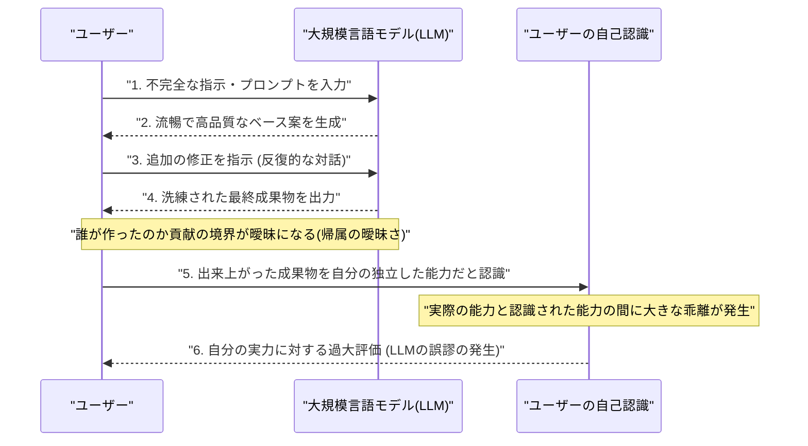
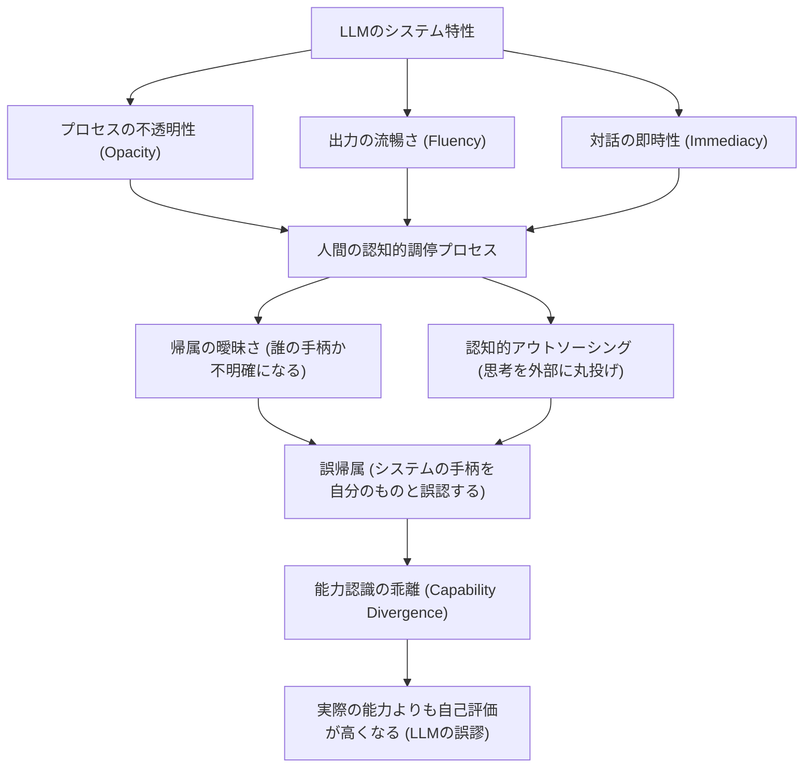

###### Created: 
2026-04-22 14:32 
###### Tag: 
#paper
###### url_01:
https://arxiv.org/abs/2604.14807 
###### url_02: 

###### memo: 

---

<!-- paper_extractor:summary:start -->

本論文は、大規模言語モデル（LLM）の利用が個人の能力認識にどのような影響を与えるかを考察した重要な研究です。ご要望に従い、詳細なコンテキストを含めつつMarkdown形式でまとめました。

# One line and three points
AIが生成した高品質な成果物を「自分自身の能力だ」と勘違いしてしまう認知的な錯覚「LLMの誤謬」を定義し、その発生メカニズムと社会システムへの影響を論じた論文。

1. **「LLMの誤謬」の定義：** LLMの流暢さやプロセスの不透明性によって、人間がAIの貢献を自分の独立した実力だと誤認してしまう認知的帰属エラーである。
2. **横断的な発生領域：** コーディング、多言語翻訳、論理的分析、創造的執筆など多様な知識労働の分野で発生し、実際の能力と自己評価の間に体系的な乖離（Capability Divergence）を生じさせる。
3. **評価システムへの脅威：** 採用試験や教育現場などの「成果物に基づいた評価システム」が機能不全に陥るリスクを指摘し、プロセスの理解を重視した新しいAIリテラシーと評価枠組みが必要だと提唱している。

# Summary
本論文は、大規模言語モデル（LLM）の日常的な利用が、ユーザーの自己の能力に対する認識をどのように歪めるかを探求し、「LLMの誤謬（LLM fallacy）」という新たな概念を提示しています。LLMの誤謬とは、ユーザーがAIの支援を受けた出力結果を、自分自身の独立した能力によるものだと誤って解釈してしまう認知的帰属エラーです。この現象は、LLMが出力する文章の流暢さ、対話の摩擦のなさ、そして背後にある計算プロセスの不透明性によって、人間と機械の貢献の境界が曖昧になることで発生します。

論文では、この現象がAIシステムの出力の誤りを指す「ハルシネーション」や、AIに過剰依存してしまう「自動化バイアス」などの既存概念とどのように異なるかを明確にしました。その上で、プログラミング、言語処理、データ分析、執筆などの様々な領域でこの誤認がどのように現れるかを分類しています。さらに、この自己評価の歪みが個人の問題にとどまらず、教育や採用といった「出力結果」に依存する社会的評価システムの信頼性を根本から脅かすことを指摘し、成果物ではなくプロセスを重視した新たな評価枠組みとAIリテラシーの再構築の必要性を訴求しています。

# Briefing
本研究は、人間とAIの協働が当たり前になった現代において、「AIを使う人間の心や自己認識に何が起きているのか」という極めて重要な問いに答えるものです。

**導入と背景**
LLMがナレッジワークの基盤として深く組み込まれるようになった現在、従来のAI研究の多くは「AIモデル自体がいかに正確か（信頼性）」や「人間がAIの答えをどれだけ信じ込んでしまうか（自動化バイアス）」に焦点を当てていました。しかし本研究は、AIと協働する「ユーザー自身の自己認識の変容」に注目します。ユーザーはLLMを使って素晴らしい成果物を生み出した際、それがAIの力であるにもかかわらず「自分自身の優れた実力だ」と思い込む傾向があり、これを「LLMの誤謬」と名付けました。

**「LLMの誤謬」を構成する4つのメカニズム**
この誤謬は、ユーザーの思い上がりではなく、システムと人間の相互作用の中で構造的に引き起こされます。主に以下の4つの要因が複雑に絡み合っています。
1. **帰属の曖昧さ（Attribution ambiguity）:** AIと人間がプロンプトを通じて反復的にやり取りをしながら成果物を作るため、どこまでが自分のアイデアで、どこからがAIが補完した生成物なのか、境界線が完全に分からなくなります。
2. **流暢さの錯覚（Fluency illusion）:** LLMの出力は文法的に正確で、文脈にも高度に適合しているため、ユーザーは「表面的な文章の見栄えの良さ」を「自分自身の専門的な能力の高さ」と無意識に直結させて勘違いしてしまいます。
3. **認知的アウトソーシング（Cognitive outsourcing）:** 複雑な思考や問題解決のプロセスをAIに丸投げすることで、ユーザー自身が深く頭を使う機会が減少し、自分の本当の理解度や限界を正確に把握するメタ認知能力が低下します。
4. **パイプラインの不透明性（Pipeline opacity）:** LLMがどのような情報検索や推論を経てその答えを導き出したのかという「中間のプロセス」がブラックボックス化されているため、ユーザーは魔法のように現れた結果だけを受け取り、あたかも自分が論理を組み立てて導き出したかのように錯覚しやすくなります。

**様々な領域での現れ（類型学）**
この現象は、特定のタスクに限らず様々な知的領域で観察されます。
- **計算（プログラミング）領域:** ユーザーはAIの助けを借りて完璧に動作するコードを完成させますが、背後のアーキテクチャや依存関係を理解していません。しかし、「動くアプリを作れた」という目に見える結果から、自分には高度なプログラミング能力があると錯覚します。
- **言語・翻訳領域:** AIツールを使って外国語で流暢で洗練されたビジネスメールを書き、「自分はこの言語を使いこなせている」と過大評価します。
- **分析・推論領域:** AIが提示した論理的なステップ・バイ・ステップの推論を読み、それをコピペして利用するだけで、自分自身が深い分析スキルを持っていると誤認します。

**社会的な評価システムへの重大な影響**
社会の多くの評価システム（学校の成績評価、企業の採用面接、資格認定など）は、「成果物の質」＝「その人の能力」という前提で成り立っています。しかし、「LLMの誤謬」が蔓延する世界では、候補者が提出した素晴らしいレポートやプログラムのコードが、本人の真の能力を反映しているとは限りません。これにより、企業における採用のミスマッチや、教育現場での理解度評価の形骸化など、社会制度的な機能不全が引き起こされるリスクがあります。成果物のみを測定する旧来のパラダイムから、能力の発揮プロセスそのものを測定するシステムへの移行が急務となっています。

# FAQ
**Q: 「LLMの誤謬」と「ハルシネーション（AIの嘘）」はどう違うのですか？**
A: ハルシネーションは「AIが事実とは異なる出力を生成してしまう」というシステム側の技術的な問題です。一方、「LLMの誤謬」は出力が正解であれ間違いであれ、その出力結果を「自分自身の優れた能力によるものだ」と人間が誤って解釈してしまう、人間の認知的な問題（錯覚）を指します。

**Q: これは単なる「自動化バイアス（AIの言うことを盲信してしまうこと）」とは違うのですか？**
A: 自動化バイアスは「AIの答えに頼りすぎて、自分の判断を放棄してしまうこと」を指します。これに対してLLMの誤謬はさらに一歩踏み込み、「AIの出した答えを、自分自身の実力・知識だと勘違いして、自己評価（自分の有能感）を不当に高めてしまうこと」を指します。

**Q: この誤認を防ぎ、正しくAIを活用するためにはどうすれば良いですか？**
A: 単純にAIの使用を禁止するのではなく、AIの貢献と自分の貢献を明確に区別する「メタ認知能力」を養う新しいAIリテラシーの教育が必要です。また、学校や企業側も「提出された成果物の結果」だけを評価するのではなく、「どのようにその結果に辿り着いたか、背後の論理を説明できるか」という思考プロセスや理解度を評価する仕組みを導入する必要があります。

# Critical Assessment（批判的評価）
**方法論の妥当性：**
本研究は、人間とAIの相互作用に関する既存の認知科学的理論を巧みに統合し、現象のメカニズムを論理的に構造化している点において、優れた仮説生成としての強みを持っています。ただし、現時点では概念的なフレームワークの提示と観察に基づく洞察が主であり、統制された定量的な実験データを伴っていない点は制約と言えます。

**エビデンスの強度：**
主張は主に豊富な既存文献のレビューと、実世界の事例（コーディングや採用面接などの一般的な観察）に基づいて構築されています。本論文はプレプリント（arXiv掲載の非査読論文）であり、現時点での実証的な強度は限定的です。今後は、提案された「認識された能力と実際の能力の乖離」を定量的に測定し、証明するための心理学的・行動学的な実証実験が求められます。

**実用化への考慮：**
教育や採用システムにおける「出力重視の評価の限界」という具体的な課題を明確に指摘しており、社会実装への示唆は非常に有用です。しかし、論文が提唱する「プロセスを重視した新たな評価システム」への完全な移行は、実環境においては多大なコストと時間を要するため、現実的かつスケーラブルな評価基準をどう構築するかという実用上の課題が残されています。

# For easy understanding
自転車の「補助輪」を想像してみてください。子供が補助輪付きの自転車に乗り、スイスイと公園を転ばずに走り回っているとします。子供は「やった！僕はもう自転車に完璧に乗れるんだ！」と大喜びし、自分を誇らしく思います。しかし、実際には補助輪がバランスを取ってくれているだけであり、補助輪を外せばすぐに転んでしまいます。

「LLMの誤謬」とは、まさにこれと全く同じことが大人の知的作業で起きている現象です。

AI（ChatGPTなど）という「超高性能な知的補助輪」を使って、素晴らしいビジネス企画書を書いたり、複雑なプログラミングを完成させたりした時、私たちは無意識のうちに「自分にはこんなに凄い文章を書く力がある」「自分はプログラミングの才能がある」と勘違いしてしまいます。AIの出力があまりにも自然で、しかも自分とAIがチャットでキャッチボールをしながら少しずつ作っていくため、「どこからがAIが作ってくれたもので、どこからが自分の実力なのか」が分からなくなってしまうのです。

**つまりこういうことです：**
**AIの強力なサポートで作った「素晴らしい結果」を、自分の「真の実力」だと脳が錯覚してしまうこと。**

この錯覚は個人の思い上がりの問題にとどまりません。例えば企業の採用面接で、「こんなに素晴らしいアプリを作りました」と提出してきた志願者が、実はAIの補助輪なしではコードを一行も書けない人だったとしたらどうでしょう？ 学校のテストで、AIの力で完璧なレポートを書いた生徒を「深く理解している優秀な生徒だ」と評価して良いのでしょうか？

この論文は、「成果物のクオリティが高い＝本人の実力がある」という私たちの社会の当たり前が、AIの普及によって崩壊しようとしていることに強い警鐘を鳴らしています。これからの時代は、「何を作ったか」という見た目の結果だけでなく、「補助輪なしでもその仕組みを本当に理解しているか」という本質的な理解度に目を向ける必要があるのです。

# Mermaid Diagrams

論文の内容を視覚的に理解しやすくするため、AIとの対話から誤認に至るプロセスを示すシーケンス図と、メカニズムの構造を示す関係図を作成しました。

## タイムライン・シーケンス図
ユーザーがLLMとやり取りする中で、どのようにして「自分の実力だ」という誤認（LLMの誤謬）に至るのか、その心理的変化を時系列で図示します。

## 関係図・相関図
LLMの持つ特性が、どのような認知的なバイアス（思考プロセス）を経て、最終的な能力の誤認（LLMの誤謬）を引き起こすのか、その因果関係を図示します。

<!-- paper_extractor:summary:end -->

