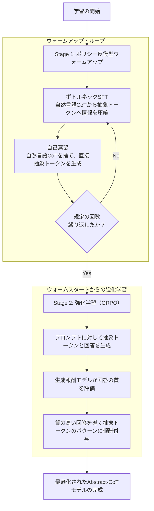
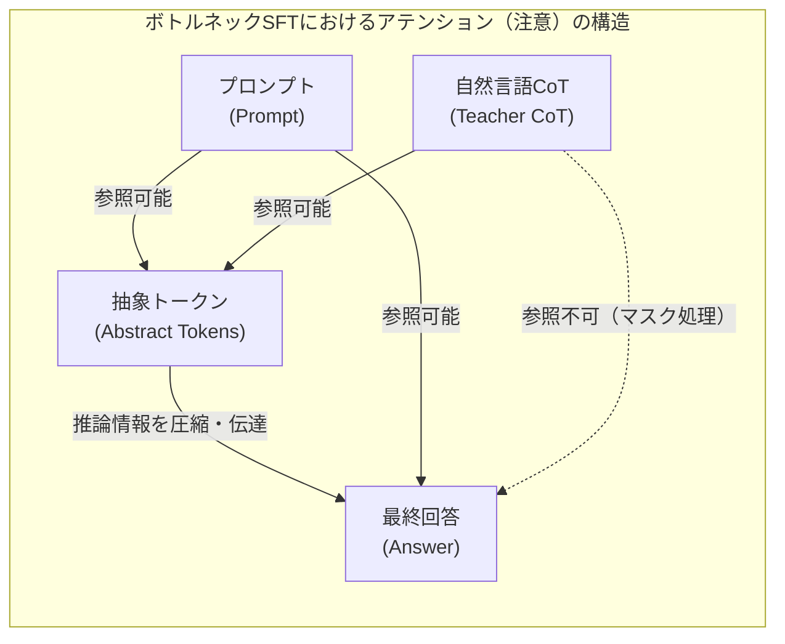
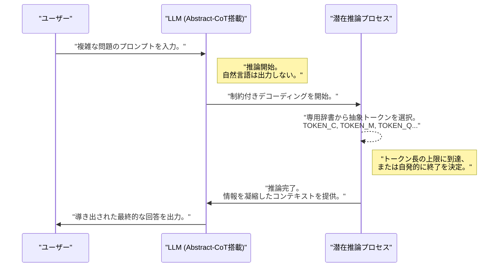

###### Created: 
2026-05-02 15:00 
###### Tag: 
#paper
###### url_01:
https://arxiv.org/abs/2604.22709 
###### url_02: 

###### memo: 

---

<!-- paper_extractor:summary:start -->

本論文のSummary、Briefing、FAQ、平易な理解のための解説、およびMermaid図表をMarkdown形式で出力します。本論文はarXivで公開されたプレプリント（2026年4月付表記）です。

# One line and three points
自然言語の代わりに意味を持たない「抽象トークン」を用いて思考させることで、大規模言語モデル（LLM）の推論能力を維持しつつ、計算コスト（出力トークン数）を最大11.6倍削減する画期的な学習手法です。

1. **Abstract-CoTの提案:** 冗長な自然言語によるChain-of-Thought（思考の連鎖）を排除し、独自の「抽象トークン」の短い配列を用いて潜在的な推論を行うメカニズムを開発しました。
2. **事後学習のみで実現可能な２段階トレーニング:** プロンプトと回答の間に存在する推論プロセスを圧縮して学習させる「ボトルネックSFTと自己蒸留」の反復、および生成報酬モデルを用いた「強化学習（RL）」によって、一から新しい推論言語を学習させます。
3. **劇的な効率化と推論言語の創発:** MATH-500などの複雑なタスクにおいて通常のCoTと同等の性能を維持しながら推論トークン数を劇的に削減し、さらに獲得された抽象トークンが自然言語と同様の「べき乗則」に従う頻度分布を示すことを発見しました。

# Pre-knowledge
**Chain-of-Thought (CoT):** LLMに対して「ステップ・バイ・ステップで考えて」と指示したり、推論過程を含めたデータで微調整したりすることで、途中の論理展開を自然言語で出力させ、最終的な回答の精度を大幅に向上させる手法です。
**潜在推論（Latent Reasoning）:** 従来のCoTは人間が読める長文を出力するため、APIコストや生成の遅延が大きな課題となります。これに対し、モデル内部の連続ベクトルや人間には読めない短いトークンを用いて、推論プロセスをモデルの内部状態（潜在空間）に押し込み、計算の効率化を図る研究分野です。

# Summary
複雑な推論タスクにおいて、LLMは長く明示的なChain-of-Thought（CoT）に依存していますが、これは推論時の生成コストを増大させます。近年、連続表現を利用して生成長を短くする非言語的推論手法が登場していますが、自然言語のCoTに比べて性能が劣るという課題がありました。
本論文では、LLMが自然言語の代わりに、新たに予約された語彙からなる短い「抽象トークン」のシーケンスを生成し、その後に最終的な回答を生成する「Abstract Chain-of-Thought (Abstract-CoT)」を提案しています。

全く未知の抽象トークンに意味を持たせ、推論経路として機能させるために、本研究では2つのフェーズからなる事後学習（Post-training）レシピを導入しました。第1フェーズは「ポリシー反復型のウォームアップ」です。ここでは、自然言語のCoTが持つ情報を抽象トークンに強制的に圧縮させる「ボトルネックSFT（Supervised Fine-Tuning）」と、自然言語CoTを破棄してプロンプトから直接抽象トークンを生成させる「自己蒸留」を交互に繰り返します。第2フェーズでは、ウォームアップされたモデルに対し、制約付きデコーディングの下で生成報酬モデル（GRPO）を用いた強化学習を行い、最適な抽象トークンの生成ポリシーを最適化します。

結果として、Abstract-CoTはMATH-500、AlpacaEval、HotpotQAなどのベンチマークにおいて、通常の自然言語CoTと同等以上の性能を達成しつつ、推論トークン数を最大11.6倍削減することに成功しました。さらに、学習の過程で抽象トークンの出現頻度が自然言語に似たべき乗則分布へと進化することが確認され、モデルが自律的に効率的な「抽象的推論言語」を獲得していることが示唆されています。

# Briefing
本研究は、大規模言語モデルにおける推論コストの肥大化という現代AIの致命的な課題に対して、極めてエレガントかつ実用的な解決策を提示しています。

**1. 推論のボトルネックとAbstract-CoTの基本概念**
従来のLLMは、数学の文章題などを解く際に「AはBであり、ゆえにCとなるから…」といった長大な自然言語を生成することで論理の整合性を保っています。しかし、最終的な正解を得るためだけであれば、これらの中間テキストが必ずしも人間の言語である必要はありません。Abstract-CoTは、モデルの語彙に数十個（実験では主に64個）の「意味を持たない抽象トークン（例: `<TOKEN_A>`）」を追加し、これらを自然言語の代わりに使用して短いステップで推論を行うようにモデルを訓練します。

**2. 情報を絞り込む「ボトルネックSFT」の巧妙なメカニズム**
ランダムに初期化された新しいトークンに、いきなり推論を行わせることは不可能です（コールドスタート問題）。これを解決するため、著者らはアテンションマスク（モデルがどの情報を参照できるかを制御する仕組み）を巧みに操作しました。
訓練データには、プロンプト、自然言語のCoT（Teacher）、抽象トークン、そして最終的な回答が含まれます。ここで、**最終的な回答を生成する際、モデルは「自然言語のCoT」を直接見ることができないようにマスクされます**。最終的な回答が見ることができるのは、「プロンプト」と「抽象トークン」だけです。一方、抽象トークンは「自然言語のCoT」を見ることができます。
この制約により、モデルが正しい回答を導き出すためには、長大な自然言語CoTに含まれる重要な推論ロジックを、短い抽象トークンの表現の中に凝縮（圧縮）して中継しなければならなくなります。この「情報ボトルネック」として機能するSFTが、無意味だったトークンに強力な推論能力を埋め込むための鍵となります。

**3. 自己蒸留と強化学習によるポリシーの洗練**
ボトルネックSFTで抽象トークンが推論の仲介役として機能するようになった後、モデルは「自然言語のCoTを全く見ずに、プロンプトから直接抽象トークンを生成し、回答を導く」という自己蒸留（Self-Distillation）の訓練を受けます。これらを繰り返すウォームアップ期間を経て、最終的にGRPO（Group Relative Policy Optimization）を用いた強化学習（RL）が適用されます。
強化学習では、モデルがプロンプトに対して様々な抽象トークンの組み合わせを出力して回答を生成し、その回答の正確さや質（生成報酬モデルによる採点）に基づいて報酬が与えられます。これにより、より短く、より確実に正解にたどり着くための「思考パス」が最適化されます。

**4. エビデンスと「推論言語」の創発的性質**
Qwen3-8Bなどのモデルを用いた実験では、数学（MATH-500）で推論トークンを11.6倍削減しつつ精度を維持し、一般的な指示追従（AlpacaEval）や複雑なQA（HotpotQA）でも優れた性能を発揮しました。
さらに興味深いのは、抽象トークンの使用頻度に関する分析です。初期状態では均等に使われていたトークンが、学習が進むにつれて特定のトークンが頻繁に使われ、他のトークンは稀にしか使われないという、自然言語に見られる「Zipfの法則（べき乗則）」に酷似した分布を示すようになりました。また、生成された抽象トークンの順序を入れ替えると正答率が顕著に低下することから、これらのトークンが単なるランダムな記号の羅列ではなく、明確な構成的意味（文法や概念の繋がり）を持った「未知の推論言語」として機能していることが強く示唆されています。

# FAQ
**Q1: 抽象トークンとは具体的にどのような単語ですか？人間が解読することは可能ですか？**
A1: 抽象トークンは、モデルの辞書に新しく追加された `<TOKEN_A>` や `<TOKEN_B>` といった純粋な記号であり、それ自体に人間の言語のような事前定義された意味はありません。現時点では、これらのトークンが内部でどのような論理（例：「ここで足し算をする」「前の文脈を否定する」など）を表しているかを人間が直接解読することは困難です。

**Q2: 単なる「休止トークン（Pause tokens）」とは何が違うのですか？**
A2: Pause tokensの研究は、推論の前に単一の `<pause>` トークンを複数回出力させることでモデルの計算時間を稼ぐ手法ですが、既存の多くの研究で通常のCoTほどの精度向上は得られていません。Abstract-CoTは、多様な語彙を持つ抽象トークンを「制約付きで生成」させる点、そしてアテンションマスクを用いた情報圧縮（ボトルネック）により、教師データ（自然言語CoT）の論理構造を明示的にトークン間の関係性に学習させている点が根本的に異なります。

**Q3: なぜ強化学習（RL）だけではダメで、ウォームアップが必要なのですか？**
A3: 新しく追加されたトークンの埋め込み（ベクトル表現）は初期状態では完全にランダムであり、意味を持っていません。この状態でいきなり強化学習による試行錯誤（コールドスタート）を行っても、正解にたどり着く有効なトークンの組み合わせを発見することが非常に難しく、学習が収束しません。ウォームアップ段階で自然言語CoTから情報を蒸留することで、トークンに基礎的な「意味のベクトル」を与え、強化学習の効率的な出発点（ウォームスタート）を作ることが不可欠です。

# Critical Assessment（批判的評価）
本研究を以下の観点から簡潔に評価します。なお、本論文はプレプリント（未査読）として公開されたものです。

**方法論の妥当性：**
アテンションマスクを利用して中間の自然言語CoTを隠蔽し、情報を抽象トークンに強制的に圧縮させる「ボトルネックSFT」のアプローチは極めて論理的かつ独創的です。自己蒸留と強化学習を組み合わせた二段階のパイプラインも適切に設計されており、アブレーション（構成要素の検証）実験を通じて各ステップの必要性が明確に証明されています。

**エビデンスの強度：**
複数のモデル（Qwen3シリーズ、Granite）および数学から一般指示追従まで多岐にわたるベンチマークにおいて一貫したトークン削減と精度維持が確認されており、実験結果の再現性と一般化可能性は高いと評価できます。ただし、プレプリント段階であるため、他者による追試や、より大規模なフロンティアモデル（100Bパラメータ以上）での有効性の検証が今後の課題となります。

**実用化への考慮：**
LLMのAPIコストや推論遅延を劇的に（最大10倍以上）削減できるため、商用アプリケーションへの応用価値は計り知れません。しかし、中間推論プロセスが人間には解読不可能な記号列となるため、AIの回答の根拠を説明する責任（Explainability）が求められる医療や法務などのクリティカルな領域への適用には、深刻な制限が生じる可能性があります。

# For easy understanding
AIが難しい問題を解くとき、「Chain-of-Thought（思考の連鎖）」というテクニックがよく使われます。これは、AIに対して「答えを出す前に、途中式や理由を声に出して（テキストとして出力して）考えてね」と指示する方法です。これによってAIは賢くなりますが、その分だけ出力する文字数が爆発的に増え、回答が返ってくるまでの時間が長くなり、システムを動かすコストも跳ね上がってしまいます。

人間の世界で例えてみましょう。数学の問題を解くとき、黒板にすべての途中式を丁寧に書き出しながら解くのが従来のAIです。しかし、本当に頭の回転が速い人は、すべての言葉を口に出さなくても、頭の中だけで「あれがこうなって…」と一瞬で思考を巡らせて、すぐに答えを出せますよね。

この論文が提案した「Abstract-CoT」は、まさにAIに「人間の言葉を使わずに、頭の中の暗号だけで考える」方法を教え込む画期的なトレーニング方法です。

研究チームは、AIに数十個の「意味のない記号（抽象トークン）」を新しく与えました。そして、「自然言語で書かれた長々とした解説」をカンニングペーパーとして用意し、AIに「この長い解説の内容を、数個の記号だけで圧縮して表現しなさい」という特訓（ウォームアップ）を行いました。その後、この記号を使って正しく回答を導き出せた場合にはご褒美を与えるという特訓（強化学習）を追加しました。

結果はどうなったか？
AIは、長々とした人間の言葉を出力するのをやめ、代わりに短い「謎の記号の羅列」を少しだけ出力するようになりました。しかし、出てくる最終的な「答え」の正確さは、長々と解説を書いていた時と全く同じだったのです。これにより、考えるための文字数が最大で11分の1に減り、爆速かつ低コストで賢い回答を出せるようになりました。さらに面白いことに、AIが使っているこの「謎の記号」を分析すると、人間が使う言語の単語の現れ方と同じようなパターンを持っており、AIが自分たちだけの「超効率的な新しい言語」を開発してしまった可能性が示されています。つまりこういうことです。「AIは言葉を捨てて、自らの思考専用の言語を手に入れることで、より速く効率的に思考できるようになった」のです。

# Mermaid Diagrams

## 概念図・構造図

## フローチャート・プロセス図

## 関係図・相関図

## タイムライン・シーケンス図

<!-- paper_extractor:summary:end -->

<!-- ... existing content ... -->

**補足：連続表現 vs 離散トークンとCoTの関係**
CoTの本質は「推論を段階的な中間状態の列として進めること」であり、必ずしも自然言語や離散トークンである必要はありません。ただし、離散トークン列は表現容量の制約（ボトルネック）により重要情報の選択・圧縮が起きやすく、ステップの固定や学習信号の与え方も設計しやすい、という実務的な利点があります。本論文はこの利点を「短い抽象トークン列」に移し替え、自然言語CoTの冗長性だけを削って効率化しています。

<!-- ... existing content ... -->