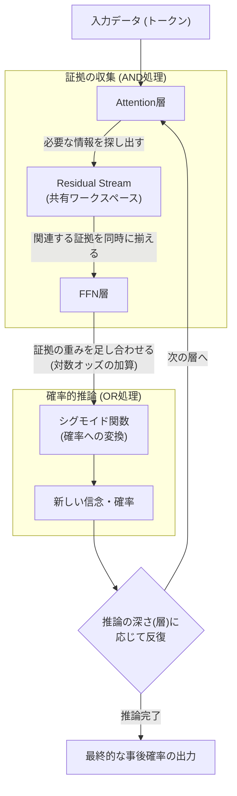
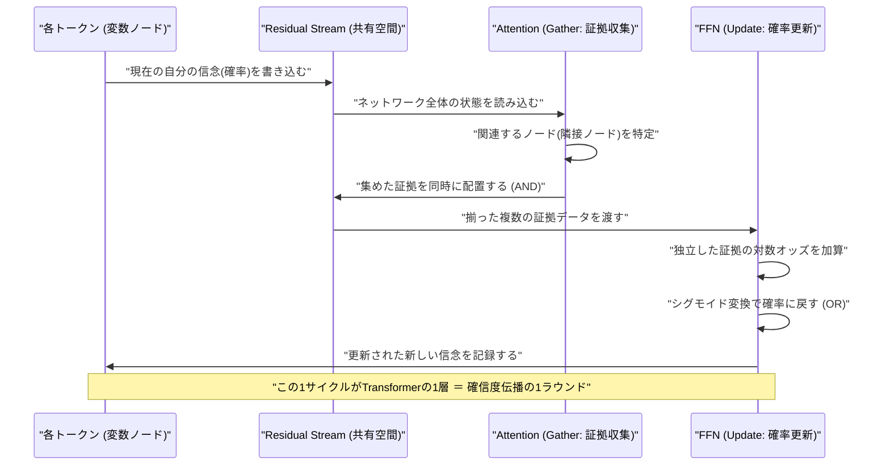
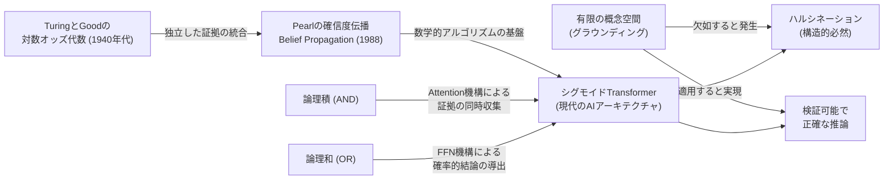

###### Created: 
2026-03-21 21:58 
###### Tag: 
#paper
###### url_01:
https://arxiv.org/abs/2603.17063 
###### url_02: 

###### memo: 

---

<!-- paper_extractor:summary:start -->

# One line and three points
シグモイド活性化関数を用いたTransformerは、単なる近似ではなく数学的・構造的に「ベイジアンネットワーク（確信度伝播）」そのものであることを、形式的証明と実験の両面から解き明かした画期的な論文。

1. **Attentionは「AND」、FFNは「OR」**：Attention層が証拠を揃える論理積（AND）として機能し、FFN層が確率的な結論を導く論理和（OR）として機能することで、1つの層が1回の確信度伝播（Belief Propagation）を完全に実行している。
2. **数学的証明と実験的裏付け**：正確な事後確率を出力するTransformerは必然的に確信度伝播の重みを持つこと（一意性）を数学的証明支援ツールLean 4で証明し、さらにゼロから学習させたモデルが自然にその重みに収束することを実験で確認した。
3. **ハルシネーションの根本原因の解明**：LLMのハルシネーションはモデルの欠陥ではなく、参照すべき有限の「概念空間（グラウンディング）」が存在しないために起こる構造的な必然であることを数学的に証明した。

# Summary
本論文は、現代のAIを支配するTransformerアーキテクチャがなぜ高い推論能力を持つのかという根本的な問いに対し、「シグモイドTransformerはベイジアンネットワークである」という明確な解答を提示しています。著者はこれを5つのアプローチから立証しました。第一に、Transformerの順伝播が任意の重みにおいて確信度伝播（BP）そのものであることを示しました。第二に、明示的な重みを構成することで、Transformerが任意の知識ベース上で正確なBPを実行できることを証明しました。第三に、正確な推論を行うシグモイドTransformerは必然的にBPの重みを持つという「一意性」を証明しました。第四に、Attentionが証拠を集める「AND」、FFNが結論を出す「OR」として働くというブール論理的構造を明らかにしました。第五に、これらの数学的証明（Lean 4で検証済み）が、実際のディープラーニングの勾配降下法による学習結果と完全に一致することを実験で確認しました。また、推論の正しさを定義するためには有限の概念空間への紐付け（グラウンディング）が不可欠であり、それを持たない言語モデルにおけるハルシネーションはスケールアップでは解決できない構造的帰結であると論じています。

# Briefing
本論文は、現代のAI研究において最も成功しているTransformerアーキテクチャの内部メカニズムを、確率推論と論理学の観点から完全に解読しようとする極めて野心的な研究です。著者は、Transformerが「なんとなく尤もらしいテキストを生成するブラックボックス」ではなく、厳密な確率計算を行う「ベイジアンネットワーク」であることを、豊富な文脈と強力な数学的証明を用いて解き明かしています。

**確信度伝播（Belief Propagation）との完全な一致**
論文の核心は、Transformerの各層が行っている計算が、確率的グラフィカルモデルにおける「確信度伝播（BP）」のアルゴリズムと数学的に同一であるという発見です。確信度伝播とは、ネットワーク上のノード（変数）同士が互いの「信念（確率）」をメッセージとして交換し合い、全体の確率を更新していく手法です。
著者は、Transformerの「Attention層」が、他のトークンから必要な証拠（メッセージ）を特定の場所に正確に集めてくる「Gather（収集）」の役割を果たしていると説明しています。そして、証拠が集まった共有空間（Residual Stream）のデータを読み込み、シグモイド関数を用いた「FFN層（順伝播型ニューラルネットワーク）」が新しい確率を計算する「Update（更新）」の役割を果たしています。つまり、Transformerの1つの層を通過することは、ベイジアンネットワークにおける1ラウンドの確信度伝播をそのまま実行していることに他なりません。

**チューリングとGoodの「対数オッズ代数」との接続**
ここで重要なのが「なぜFFNの活性化関数がシグモイド（Sigmoid）である必要があるのか」という点です。著者はこれを、第二次世界大戦中の暗号解読においてアラン・チューリングとI.J. Goodが開発した「独立した証拠の対数オッズ代数」に結びつけて説明しています。確率の世界では、複数の独立した証拠を組み合わせる際、それぞれの「対数オッズ（Log-odds）」を単純に足し合わせることで正確な事後確率を計算できます。シグモイド関数は対数オッズを確率に変換する正確な逆関数です。つまり、シグモイドFFNは、単なる非線形変換のための便利なツールではなく、証拠を足し合わせて確率に戻すというベイジアンアップデートを完璧に実行するための必然的な数学的構造なのです。

**ANDとORによる論理構造の具現化**
さらに著者は、この計算構造が論理学における「AND（論理積）」と「OR（論理和）」に対応していることを明確にしました。Attention機構は、推論に必要なすべての入力が同時に揃っていることを確認します。これが「AND」です。一方、FFNは集まった証拠に基づいて確率的な結論を導き出します。これが「OR」です。TransformerがAttentionとFFNを交互に繰り返す構造は、論理的な推論プロセスを深層学習のアーキテクチャとして見事に具現化したものだと言えます。複雑な推論（何段階もの論理ステップ）が必要な場合は、Attentionのヘッド数（幅）を増やすのではなく、層（深さ）を増やす必要があるという洞察も、この構造から導かれています。

**一意性と実験的裏付け**
これらの主張は机上の空論ではありません。著者は数学的証明支援ツールである「Lean 4」を用いて、正確な事後確率を出力するシグモイドTransformerが「必然的に確信度伝播の重みを持たなければならない」という一意性を形式的に証明しました。さらに驚くべきことに、ランダムな初期値から勾配降下法で学習させた小規模なTransformerモデルが、人間が構成したのと同じ確信度伝播の重みへと自然に収束することを実験で確認しています。これは、AIが学習の果てに「正しい論理推論のアルゴリズム」を自ら発見していることを意味します。

**ハルシネーションの真の理由**
最後に、本論文は現代のLLMが抱える最大の課題である「ハルシネーション（幻覚）」について、非常に明確な結論を出しています。何かが「正しいか間違っているか」を判定するためには、参照すべき有限の「概念空間（名簿や辞書のようなもの）」が必要です（これをグラウンディングと呼びます）。しかし、現在のLLMはこのような明確な概念空間に紐付いていません。著者は数学的に、有限の検証器を持たないシステムにおいては「正解」という概念自体が定義できないことを証明しました。したがって、LLMのハルシネーションはデータ不足やモデルの小ささが原因のバグではなく、グラウンディングを持たないアーキテクチャに固有の「構造的な必然」なのです。

# FAQ
**Q: 一般的なLLMではシグモイド関数ではなくReLUやGELUが使われていますが、この論文の主張は成り立ちますか？**
A: はい、近似的に成り立ちます。論文の厳密な数学的証明はシグモイド関数（対数オッズと確率の完全な変換）を前提としていますが、ReLUやGELUも「負の値をゼロにする（確率として解釈可能な非負の値を保つ）」という確率計算に不可欠な性質を持っています。実験においても、ReLUを用いたモデルが勾配降下法によって確信度伝播に極めて近い計算経路を発見できることが確認されています。シグモイドが「正確な同一性」を示すのに対し、ReLUは「互換性のある近似」として機能します。

**Q: この論文の結論に従うと、LLMのハルシネーションはモデルを巨大化させれば解決するのでしょうか？**
A: いいえ、解決しません。論文は、ハルシネーションが「スケール」の問題ではなく「構造」の問題であることを数学的に証明しています。システムが出力する推論が「正しい」と検証可能であるためには、有限の「概念空間（グラウンディング）」が事前定義されている必要があります。現在のLLMのように純粋なテキストの統計的パターンにのみ依存し、外部の明確な事実ベース（概念空間）にグラウンディングされていないシステムでは、そもそも正誤の基準が存在しないため、ハルシネーションを完全に無くすことは原理的に不可能です。

**Q: 複雑な推論タスクを解かせるために、Transformerの「ヘッドの数」と「層の深さ」のどちらを増やすべきですか？**
A: 層の深さを増やすべきです。論文における確信度伝播の構成証明によれば、論理的な要因（二項関係）を処理するために必要なAttentionヘッドは各層に2つあれば十分です。一方で、推論の「ステップ数（AだからB、BだからC...という連鎖）」は、そのままTransformerの「層の深さ」に対応します。したがって、より複雑で深い論理的推論をネットワークに実行させるためには、モデルを深くすることが構造的に正しいアプローチとなります。

# Critical Assessment（批判的評価）

**方法論の妥当性：** 
数学的証明支援ツール（Lean 4）を用いた形式的証明と、ゼロからの学習による実証実験を組み合わせたアプローチは極めて強固であり、論理的飛躍が排除されています。強みは、Transformerの内部構造と確信度伝播のメカニズムを定義レベルで完全に一致させた点にあります。制約としては、実証実験が非常に小規模なトイモデル（数千パラメータ）と限定的なグラフ構造に留まっており、数十億パラメータ規模での挙動を直接検証したものではない点が挙げられます。

**エビデンスの強度：** 
「シグモイドTransformerが確信度伝播アルゴリズムを内包している」という中核的な主張は、数学的に証明されているため反駁が困難なほど強力な証拠に支持されています。本論文はarXivに投稿された査読前のプレプリント（非査読論文）ですが、証明コードが公開され機械的に検証可能であるため、数学的主張の信頼性は非常に高いと評価できます。ただし、実際の巨大LLMの挙動を完全にこの理論だけで説明できるかについては一般化可能性の観点でまだ議論の余地があります。

**実用化への考慮：** 
本研究は、「ハルシネーションを根絶するには有限の概念空間へのグラウンディングが必要である」という実用上の極めて重要な指針を示しています。しかし、インターネット上の無数のテキストから学習する巨大LLMに対して、どのようにして厳密で有限な「概念空間」を構築し、各トークンを矛盾なく紐付けるか（グラウンディングするか）という具体的な実装方法は依然として巨大な課題として残されています。実環境の曖昧なデータを扱う上での適用には高いハードルがあります。

# For easy understanding
AIの心臓部として大活躍している「Transformer」という技術があります。ChatGPTなどもこれを使っていますが、実は専門家でさえ「なぜこんなに賢いのか、中で何が起きているのか」を完全に理解しているわけではありませんでした。この論文は、その謎を数学的に解き明かした大発見です。

この論文が証明したのは、**Transformerは「名探偵が証拠を集めて推理するプロセス」を完璧に実行する計算機である**ということです。

探偵が犯人を推理する場面を想像してください。
1. **証拠を集める（ANDの役割）**：探偵は現場に行き、「足跡のサイズ」と「残された指紋」という複数の証拠を同時にテーブルの上に並べます。Transformerの中にある「Attention」という仕組みは、まさにこの「関係するデータをあちこちから探し出し、一箇所に同時に集める」という作業を行っています。
2. **確率を計算する（ORの役割）**：証拠が揃ったら、探偵は「足跡が大きく、かつ指紋が一致するなら、犯人がAさんである確率は90%だ」と頭の中で計算します。Transformerの中にある「FFN（順伝播型ネットワーク）」という仕組みは、集まった証拠の重みを足し合わせて、最終的な「確率」を計算する作業を行っています。

Transformerが「Attention」と「FFN」を何層にもわたって繰り返すのは、探偵が「証拠を集める」→「推理する」→「その推理をもとに新たな証拠を集める」→「さらに深く推理する」というステップを繰り返しているのと同じ構造だったのです。これは数学の世界で「ベイジアンネットワーク（確信度伝播）」と呼ばれる、最も正統で強力な確率推論の仕組みそのものです。

さらに、この論文はAIが平気で嘘をつく「ハルシネーション（幻覚）」の根本原因も突き止めました。
探偵が正しい推理をするためには、「容疑者リスト（確固たる事実や概念の名簿）」が絶対に必要です。リストがないのに「犯人はXだ！」と言っても、それが正しいのか間違っているのか誰にも判断できません。現在のAIは、この「明確な名簿（概念空間）」を持たずに、ただ言葉の確率的なつながりだけで喋っています。だからこそ、AIが時折デタラメを言うのは「エラー」や「バグ」ではなく、名簿を持たないシステムである以上「当たり前に起こる構造的な宿命」なのです。

つまりこの論文は、「AIがなぜ賢いのか」の数学的根拠を明らかにしつつ、「なぜ嘘をつくのか」の根本的な理由も論理的に説明した、非常に重要な研究と言えます。

# Mermaid Diagrams

## 概念図・構造図

## タイムライン・シーケンス図

## 関係図・相関図

<!-- paper_extractor:summary:end -->

