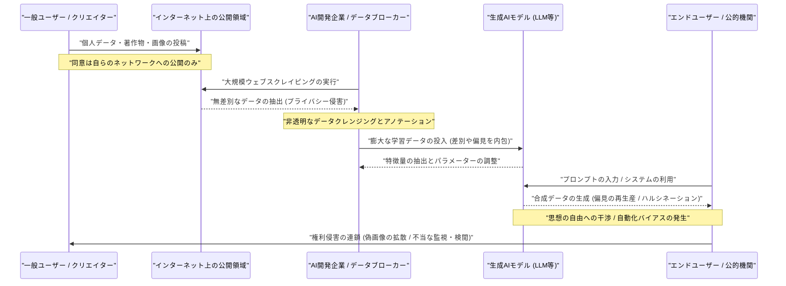
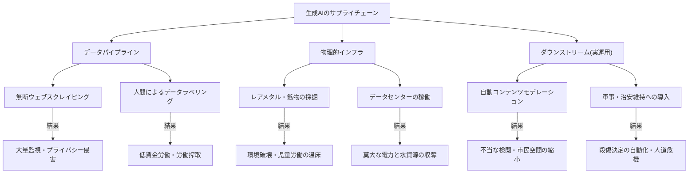

###### Created: 
2026-06-01
###### Tag: 
#paper
###### url_01:
[Unlawful by design: Exposing the human rights costs of generative AI - Amnesty International](https://www.amnesty.org/en/documents/pol40/0996/2026/en/)
###### url_02: 

###### memo: 

---
本論文（アムネスティ・インターナショナル発行「UNLAWFUL BY DESIGN: EXPOSING THE HUMAN RIGHTS COSTS OF GENERATIVE AI」）について、ご指定の要件に基づき、学術的かつ包括的な視点から詳細な解説を提供いたします。

# One line and three points
現代の生成AIシステムは、同意なき大規模なウェブスクレイピングを前提として設計されており、プライバシーの侵害、差別の増幅、思想の自由の制限といった深刻な人権リスクを構造的に内包していることを告発した包括的報告書。

1. **プライバシーと同意の根本的欠如**：大規模言語モデル（LLM）などの生成AIは、著作物や個人情報を含むインターネット上の膨大なデータを無断で収集（スクレイピング）して構築されており、これは国際人権法が定めるプライバシー権に対する「設計上の（By Design）」重大な侵害である。
2. **構造的差別の再生産と表現・思想の自由への脅威**：英語圏や特定の文化的価値観に偏った学習データは、人種やジェンダーに基づく偏見をシステムの出力として固定化し、さらにユーザーの認知や意思決定を気づかないうちに誘導することで「思想の自由」を根底から脅かしている。
3. **隠蔽された環境負荷と軍事利用のエスカレーション**：AIを駆動するデータセンターは莫大な電力と水資源を消費し、グローバルサウスのコミュニティに不均衡な犠牲を強いているのみならず、自動化された意思決定システムが軍事標的の選定などに無批判に導入されることで、深刻な人道危機を引き起こしている。

# Pre-knowledge
本論文を深く理解するためには、現在の生成AI（ChatGPTやMidjourneyなど）が、単なるプログラムされた計算機ではなく、インターネット上にある人間のあらゆる記録（テキスト、画像、音声）を無作為に吸い上げる「データパイプライン」に絶対的に依存しているという技術的背景を知る必要があります。また、法的背景として、国連の「市民的及び政治的権利に関する国際規約（ICCPR）」や「ビジネスと人権に関する指導原則（UNGP）」が、国家だけでなく巨大テクノロジー企業に対しても、事業活動の全サプライチェーンにわたって人権を尊重し、負の影響を軽減するデューデリジェンス（相当な注意による確認と対応）の義務を負わせているという前提を把握しておくことが重要です。

# Summary
アムネスティ・インターナショナルによって発表された本報告書は、現在世界を席巻しているスタンドアロン型（独立機能型）の生成AIシステムが、その華々しい効率性や利便性の裏側で、国際人権法（IHRL）の基本原則と根本的に対立する設計思想に基づいて構築されている実態を鋭く解剖しています。テクノロジー企業は、自社のAIモデルをより高性能化させるため、利用者の同意や透明性の確保を無視し、個人的な行動履歴から医療画像、児童の性的虐待描写に至るまで、あらゆるデジタルデータを無差別に収集するウェブスクレイピングに依存しています。

本論文は、このような搾取的なデータ収集の手法そのものが、法的な保護の枠を超えた「大量監視システム」と同義であり、重大なプライバシー侵害であると断じています。さらに、偏った学習データセットによって生み出される出力結果が、マイノリティに対するステレオタイプを強化し、自動化されたコンテンツモデレーションによる不当な検閲を引き起こすことで、表現の自由や平等の権利を著しく阻害していると論じています。これに加えて、計算資源を支えるデータセンターの運用に伴う過酷な環境破壊や水資源の収奪、さらには軍事紛争地域における殺傷決定システムへのAIの転用など、物理的・地政学的な人権侵害の連鎖も詳述されています。結論として本報告書は、こうした違法なデータパイプラインに依存する生成AIシステムの利用禁止を求めるとともに、各国政府に対して強制力のある人権・環境影響評価の法制化を、企業に対しては根本的なビジネスモデルの転換を強く勧告しています。

# Briefing
本報告書は、生成AIの台頭を単なる技術的ブレイクスルーとしてではなく、テクノロジー企業による権力と資源の寡占、そして人権の犠牲の上に成り立つ「供給網（サプライチェーン）の問題」として包括的に分析しています。以下に、本論文が提起する核心的な議論を構造的に詳述します。

**1. 技術的基盤とデータパイプラインに潜む「設計上の違法性」**
現在の主要な生成AIシステム（LLM、GAN、拡散モデルなど）は、その機能を実現するために天文学的な量の学習データを必要とします。企業（OpenAI、Google、Metaなど）は、Common Crawlのような大規模データセットや独自のクローラーを利用し、インターネット上のあらゆるテキストや画像を無断で抽出しています。本論文は、このプロセスに個人情報や著作物が同意なく含まれていることを指摘し、これが国際人権法（特にICCPR第17条）が禁ずる「プライバシーに対する恣意的または不法な干渉」に該当すると厳しく批判しています。企業側は「一般に公開されているデータを利用しているに過ぎない」と主張しますが、公衆の場に情報が存在することと、それを営利目的で大規模に抽出・処理し、新たな出力を生成するシステムに組み込むことは法的次元が異なり、このデータ収集モデル自体がすでに権利侵害を内包している（Unlawful by design）と結論づけています。

**2. 偏見の再生産による平等権の侵害と「思想の自由」への潜在的脅威**
生成AIは、入力された膨大なデータから「平均的」なパターンを抽出して出力を生成しますが、現実世界のデータセットには歴史的な差別や偏見が深く刻み込まれています。結果として、生成AIは人種やジェンダーに関する有害なステレオタイプ（例えば、特定の有色人種を犯罪的属性と結びつける、特定の職業を男性のみとして描写するなど）を再生産します。さらに深刻なのは、AIがコンテンツモデレーション（不適切な投稿の監視）に導入されることで、グローバルサウスの言語や文化的文脈が正確に解釈されず、結果的にパレスチナ関連の投稿などが不当に削除されるといった「市民空間の縮小」が引き起こされている点です。
また、本論文は「思想の自由（Freedom of Thought）」という、これまで絶対的に保障されてきた内面的な権利への干渉にも踏み込んでいます。ユーザーが日常的な検索や意思決定においてAIによる予測や提案に過度に依存するようになれば、AIの持つバイアスがユーザーの認知モデルを気づかないうちに形成・操作（マニピュレーション）し、自律的な思考の形成を阻害する危険性が極めて高いと警告しています。

**3. 環境収奪とサプライチェーンにおけるグローバルな不平等**
生成AIが「クラウド」上で動作する仮想的な存在であるというイメージは虚構であり、実際には莫大な計算資源（GPU）とそれを冷却・稼働させるための巨大なデータセンターを必要とする物理的かつ資源集約的な産業です。本論文は、これらの施設がチリやメキシコなど、すでに深刻な干ばつや水不足に悩まされている地域に建設され、地元コミュニティから必要不可欠な水や電力を奪い取っている現状を告発しています。さらに、半導体製造に不可欠なコバルトなどの希少鉱物の採掘過程（コンゴ民主共和国など）において、強制労働や児童労働といった深刻な人権侵害が温存されていることにも言及し、AIの発展がグローバルな不平等を加速させる環境植民地主義的側面を持っていることを明示しています。

**4. 国家による監視・軍事利用への転用と規制緩和の危機**
生成AIの技術は、その本質的な不透明性や不正確性にもかかわらず、公的部門や軍事領域へと急速に導入されています。特に、イスラエルによるガザ地区での軍事作戦において、AIベースの標的選定システムが市民への無差別攻撃を助長している実態や、米国等の国家安全保障機関による大規模監視への利用拡大は、テクノロジーの兵器化を象徴しています。一方で、AI産業からの強力なロビー活動により、各国政府が十分な人権評価（デューデリジェンス）を義務付けることなく、自国のAI産業の競争力を優先して規制を緩和しつつある現状に対し、本報告書は極めて強い懸念を表明しています。

# FAQ

**Q1: インターネット上の公開データを収集（スクレイピング）することが、なぜ国際人権法違反になるのですか？**
インターネット上に公開されている情報であっても、個人のアイデンティティやプライベートな情報が含まれる場合、それらを無差別かつ大規模に収集・蓄積・利用することは「プライバシーの権利」に対する不釣り合いで不当な干渉とみなされます。利用者が特定のSNSに投稿した同意の範囲を超えて、AI企業が自らの営利システム構築のためにデータを無断転用することは、合法的な目的や透明性を欠いており、事実上の「大量監視システム」と同等のプライバシー侵害を引き起こすと本論文は指摘しています。

**Q2: 生成AIが「思想の自由」を脅かすとは、具体的にどのようなメカニズムですか？**
「思想の自由」には、自らの考えを形成するプロセスにおいて、外部から強制されたり操作されたりしない権利が含まれます。生成AI（特にチャットボット）は、極めて説得力のある人間らしい対話を行うため、利用者はシステムから提示された情報を無批判に受け入れる「自動化バイアス」に陥りやすくなります。学習データの偏りによって生み出された特定の政治的・文化的イデオロギー（多くは欧米中心主義的）に繰り返し曝露されることで、利用者の世界観や価値判断が無意識のうちに操作され、自律的な思考能力が奪われる危険性を指しています。

**Q3: AI開発企業は安全対策（セーフガード）を導入していると主張していますが、それでは不十分なのでしょうか？**
本論文によれば、現在の生成AIが抱える問題は「設計上の根本的な欠陥（Unlawful by design）」によるものであり、表面的なフィルターや利用規約といった事後的な安全対策では解決できません。同意のないデータ収集や、偏見に満ちた学習データに依存する構造そのものを維持したまま、出力結果の微調整だけで人権侵害を防ごうとするアプローチは、問題の根本原因を覆い隠す免罪符として機能しているに過ぎないと批判しています。

# Critical Assessment（批判的評価）

**方法論の妥当性：**
本報告書は、AIシステムの技術的構造を「サプライチェーン全体（データの収集から環境負荷まで）」の視座で解剖し、国際人権法（IHRL）の既存の枠組みを適用した点で、極めて包括的かつ説得力のある分析の枠組みを提示しています。ただし、企業内部の非公開アルゴリズムや学習データの詳細な内訳に直接アクセスできたわけではなく、公開情報や二次データからの推論に依存せざるを得ないという、AI研究特有の検証可能性の制約は抱えています。

**エビデンスの強度：**
主張の根拠として、査読済みの著名な学術論文（「Stochastic Parrots」など）、国連特別報告者の公式報告書、および国際的な調査報道機関による証拠（軍事利用に関する+972 Magazineの報道など）を幅広く引用しており、主張を裏付けるエビデンスの強度は総じて高いと言えます。一方で、最新のAIモデルの性能劣化（モデル崩壊）や小規模言語モデル（SLM）の将来性に関する議論などでは、プレプリント（arXiv等）の未査読論文も引用されているため、技術的予測の確実性については一定の留保を持って評価する必要があります。

**実用化への考慮：**
「違法なウェブスクレイピングに基づくスタンドアロン型生成AIの全面的な利用禁止」という勧告は、人権擁護の観点からは極めて論理的かつ妥当ですが、実環境（グローバルな経済競争や既存のインフラへの組み込み状況）を考慮すると、その即時的な政治的・法的な実現可能性には大きなハードルがあります。オープンソースモデルの扱いに関する責任の所在や、国境を越えるAIサプライチェーン全体の規制をいかにして実行力のある国際ルールへと落とし込むかが、今後の最大の課題となります。

# For easy understanding
論文の重要なポイントを、専門知識のない方にも分かりやすく解説します。

**AIという「巨大な泥棒掃除機」の正体**
今の流行りである「生成AI（ChatGPTや画像生成AIなど）」は、まるで魔法のように賢く見えますが、実はゼロから自分で考えているわけではありません。これらのAIを作るために、企業は巨大な「掃除機」のようなプログラム（クローラー）を使って、世界中の人々がインターネット上に書いた日記、描いたイラスト、会話の記録を、**誰の許可も得ずに**すべて吸い上げています。アムネスティの報告書は、この「勝手に他人のデータを吸い上げて儲けるシステム」そのものが、根本的なプライバシー泥棒であり、人権侵害の土台になっていると指摘しています。つまり、スタート地点からすでに法律違反（Unlawful by design）だということです。

**偏見をコピーして拡大する「歪んだ鏡」**
AIは吸い上げた膨大なデータをお手本にして言葉や画像を作ります。しかし、吸い上げたデータには、人間の社会にある差別や偏見（「白人男性が優秀だ」「女性は家事をするものだ」「特定の人種は犯罪者だ」など）がたっぷり混ざっています。AIはこれを「これが世界の普通なんだ」と勘違いして学習し、私たちが質問したときに、その偏見を事実のように堂々と出力してしまいます。これが繰り返されると、AIを使っている私たち人間の方が「AIが言うならそうなんだろう」と思い込まされ、私たち自身の考え方までAIに操られてしまう（思想の自由が奪われる）危険性があります。

**見えない場所で起きている「環境破壊」と「戦争への加担」**
AIはスマホの中で動いているように感じますが、実際には地球のどこかにある「データセンター」という巨大なコンピューターの塊がフル稼働して計算を行っています。このデータセンターは、冷やすために途方もない量のきれいな水と電力を使い果たし、地元の人々の生活基盤を奪っています。さらに恐ろしいことに、こうした「もっともらしい答えを出すAI」が、実際の戦争（例えばガザ地区など）で、「誰を攻撃するか」を決めるシステムに使われ始めているのです。

**つまりこういうことです**
「便利で賢いツール」に見える生成AIは、現在の作り方のままでは、私たちのプライバシーを盗み、差別を広げ、地球環境を壊し、誰かの命を奪うことの上に成り立っています。報告書は、「どんなに便利であっても、他人の権利を犠牲にして作られた道具を使うのはやめよう。企業にはきちんとルールを守らせよう」という強い警告を発しているのです。

# Mermaid Diagrams

以下に、本論文の核となる内容を視覚的に理解するためのMermaid図表を提示します。

## タイムライン・シーケンス図
生成AIのデータパイプラインにおいて、個人の権利がどのように侵害され、最終的な出力として社会に還元されていくかの連鎖（シーケンス）を図示します。

## 概念図・構造図
本論文が指摘する、生成AIを取り巻く「サプライチェーン」とそれぞれの段階で発生する人権・環境リスクの構造を図示します。

## 関係図・相関図
生成AIの学習データに含まれる「バイアス（偏見）」が、どのようにして利用者の「思想の自由」を侵害するループ構造を生み出しているのかを図示します。

