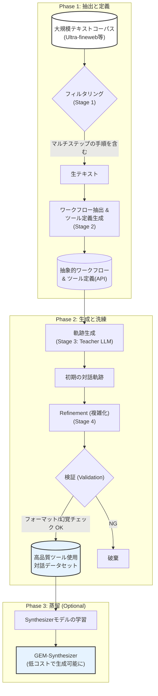
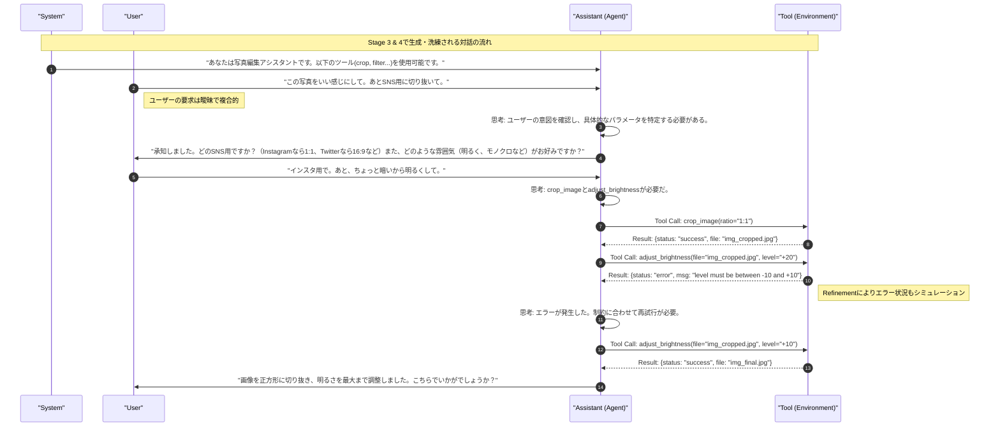
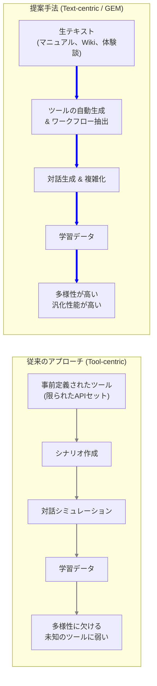

###### Created: 
2026-01-24 19:40 
###### Tag: 
#paper #datasynthesis #agent #api #tooluse 
###### url_01:
https://arxiv.org/abs/2601.10355 
###### url_02: 

###### memo: 

---

<!-- paper_extractor:summary:start -->

世界トップレベルの大学教授として、本論文「Unlocking Implicit Experience: Synthesizing Tool-Use Trajectories from Text（暗黙の経験の解錠：テキストからのツール使用軌跡の合成）」について解説します。

この研究は、大規模言語モデル（LLM）のエージェント能力、特にツール使用（Tool Use）能力を向上させるための、データ合成におけるパラダイムシフトを提案する重要な論文です。

---

# One line and three points
既存のツールありきのデータ生成手法から脱却し、大量の「生テキスト」からツール定義と対話履歴を逆生成するという逆転の発想により、多様かつ高品質なエージェント学習データを構築する手法。

1.  **パラダイムシフト**：事前に定義されたAPIセットに基づく従来のシミュレーションではなく、生テキストに含まれる問題解決プロセスから「ツール」と「対話軌跡」の両方を抽出・生成する新手法「GEM」を提案。
2.  **高品質なデータパイプライン**：テキストフィルタリング、ワークフロー抽出、軌跡生成、複雑性向上（Refinement）、検証という4段階のプロセスにより、実世界の複雑さを反映した学習データを生成。
3.  **汎化性能の向上**：生成されたデータで学習したモデルは、既存ベンチマーク（BFCL V3）で大幅な性能向上（+16.5%）を示し、未知のドメイン（$\tau^2$-bench）に対しても高い汎化性能を発揮した。

# Summary
本研究は、自律型エージェントのトレーニングにおいてボトルネックとなっている「高品質なマルチターン（複数回往復）のツール使用データ」の不足を解決するために、**GEM (Generalization, Extraction, generation, and Modification)** というデータ合成パイプラインを提案しています。

従来の主流なアプローチは、事前に用意されたAPI（ツール）セットに基づいて対話をシミュレーションするものでしたが、これはAPIの多様性に限界があり、実世界の広範なシナリオをカバーできませんでした。著者らは、Web上の膨大な「生テキスト（マニュアル、ガイド、体験談など）」には、明示的ではないものの、問題解決の手順（暗黙の経験）が含まれていることに着目しました。

GEMパイプラインは、テキストから「どのような手順でタスクを解決するか」というワークフローを抽出し、それに必要なツール（API定義）を自動生成し、さらにユーザーとエージェントの対話軌跡（Trajectory）を合成します。さらに、単純なやり取りにとどまらず、エラー処理や曖昧な指示への対応といった「複雑性」を注入（Refinement）することで、実用的なエージェントの育成を可能にしました。

実験の結果、GEMで生成されたデータで微調整されたモデルは、機能呼び出しのリーダーボード（BFCL V3）や実環境に近いベンチマーク（$\tau^2$-bench）において、既存のドメイン特化型データを学習したモデルと同等以上の性能を示し、テキストベースのデータ合成が高い汎化能力をもたらすことを実証しました。また、このパイプラインを蒸留した「データ合成専用モデル（Synthesizer）」を開発し、低コストでのデータ量産も可能にしました。

# Briefing
本論文の核心的な詳細を、背景、手法、結果の観点から包括的に解説します。

## 1. 背景と課題：データ不足と「ツール中心」の限界
自律型エージェント開発において、複雑な実環境でツールを使いこなす能力（Tool-Use）は不可欠です。しかし、現実的で多様なマルチターンの対話データは希少です。
*   **従来手法（ツール中心）**: ToolBenchなどの既存研究は、「まずAPIセットを用意し、それを使うシナリオを生成する」アプローチでした。しかし、多様なAPIを集めるのは困難であり、生成されるシナリオも用意されたAPIの範囲内に限定されてしまいます。
*   **本研究の洞察（テキスト中心）**: 大規模な事前学習データ（Ultra-finewebなど）には、「病院での払い戻し手続き」や「ソフトウェアのセットアップ」など、手続き的な知識が豊富に含まれています。これらを「API定義」と「実行ログ」に変換できれば、無限に近いデータソースを活用できます。

## 2. GEMパイプラインの構成
提案手法GEMは、以下の4段階で生テキストをエージェント学習データに変換します。

*   **Stage 1: フィルタリング (Selection)**
    *   生テキストの中から、複数のステップを含む操作手順が含まれているものを識別します。予備分析では約14%のテキストが該当しました。
*   **Stage 2: 抽出 (Extraction)**
    *   テキストから抽象的なワークフロー（手順の流れ）を抽出し、同時にその手順を実行するために必要な**ツール（関数定義/JSONスキーマ）をゼロから設計**します。
    *   例：「写真を編集する」というテキストから、`crop_image`, `adjust_brightness` といったツール定義を生成します。
*   **Stage 3: 生成 (Generation)**
    *   抽出したワークフローとツール定義に基づき、ユーザーとエージェントの具体的な対話（システムプロンプト、ユーザーの依頼、エージェントの思考とツール呼び出し、ツールの実行結果）を生成します。高性能な教師モデル（GLM-4.6）を使用します。
*   **Stage 4: 洗練 (Refinement) & 検証**
    *   **複雑化**: 初期の生成データは単純になりがちです。そこで、ユーザーの依頼を曖昧にしたり、制約条件を追加したり、エラーを発生させたりして、難易度を上げます（平均ターン数が約30から46へ増加）。
    *   **検証**: ルールベースのチェック（フォーマット、型）と、LLMによるチェック（幻覚の検出）を行い、品質を保証します。

## 3. 実験結果と成果
*   **BFCL V3 Multi-Turn**: 32Bモデルにおいて、GEMデータで学習したモデル（Qwen3-32B-GEM）はベースモデルから**16.5%の精度向上**を達成し、GPT-4などの商用モデルをも一部上回りました。
*   **$\tau^2$-bench (Airline/Retail)**: このベンチマークは特定のドメイン（航空券予約、小売）に特化したものですが、GEMは**ドメイン外（Out-of-Domain）のテキストデータ**から学習したにもかかわらず、そのドメイン専用に作られたデータで学習したベースラインモデルと同等以上の性能（Pass@4スコアで最大86.84%）を記録しました。これは、特定のツールの使い方ではなく、「ツール使用の一般的な推論能力」を獲得したことを示唆しています。
*   **Synthesizerの蒸留**: GEMパイプラインの入出力を学習させた小型モデル（GEM-Synthesizer）を作成し、これを用いてもフルパイプラインと同等の高品質なデータを低コストで生成できることを確認しました。

# FAQ

**Q1: 「テキストからツールを生成する」とは具体的にどういうことですか？**
A1: 通常、APIは開発者が定義するものですが、この研究では「このテキストの手順を実行するにはどんなAPIが必要か？」をLLMに考えさせ、架空のAPI定義（関数名、引数、説明文）を作成させます。例えば、料理のレシピテキストから「切る(食材)」「煮る(時間)」といったAPIを自動生成するイメージです。これにより、実在するAPIに縛られず、あらゆるドメインの学習データを作成できます。

**Q2: 生成されたツールは架空のものですが、実用的な意味はありますか？**
A2: はい、非常に大きな意味があります。エージェントの学習で重要なのは「特定のAPIの使い方」を覚えることではなく、「与えられたAPI仕様（名前や説明）を理解し、文脈に合わせて正しく引数を埋め、順序立てて呼び出す論理的推論能力」を養うことです。架空のAPIであっても、その推論プロセスは実在のAPIを使う場合と共通しており、汎化性能の向上に寄与します。

**Q3: 既存のデータセット（ToolBenchなど）との最大の違いは何ですか？**
A3: 最大の違いは「多様性」と「スケーラビリティ」です。ToolBenchなどは収集可能なAPIの数に依存しますが、GEMはインターネット上のあらゆるテキストをソースにできるため、APIが存在しないようなニッチな領域や、複雑な業務プロセスのデータも無数に生成可能です。また、実世界の「暗黙の制約（例：予算内で予約する）」などもテキストから自然に取り込める点が強みです。

# Critical Assessment（批判的評価）

**方法論の妥当性：**
実験設計は堅牢であり、パイプラインの各段階（特にRefinementと検証）が最終的な性能にどう寄与したかをAblation Studyで丁寧に検証しています。特に、生テキストから生成した「架空の」ツールを用いた学習が、実際のベンチマーク（BFCL等）で性能向上につながることを示した点は、方法論の有効性を強く支持しています。ただし、教師モデル（GLM-4.6）の能力に依存するため、より弱いモデルで同様のパイプラインを構築できるかは検討の余地があります。

**エビデンスの強度：**
BFCL V3や$\tau^2$-benchといった、定評ある外部ベンチマークでの大幅なスコア向上は強力な証拠です。特に、ドメイン外のデータのみで学習したモデルが、ドメイン内データで学習したモデルに匹敵する結果を出した点は、提案手法が「ツール使用の一般能力」を効果的に引き出していることを示唆しています。本論文はプレプリント（arXiv）段階ですが、実験の規模と比較対象の適切さから、エビデンスレベルは高いと言えます。

**実用化への考慮：**
実環境での適用において、この手法は「特定ドメインのデータがない場合」のコールドスタート問題に対して極めて有効です。企業内のマニュアル文書などから即座にトレーニングデータを生成できる可能性があります。一方で、生成されたツールはあくまでシミュレーション上のものなので、実際に動作するAPIとの接続（Grounding）を行う際には、実APIの仕様に合わせた再調整やアダプテーションが必要になる点が課題として残ります。

# For easy understanding
専門知識がない方のために、この論文の内容を「料理人ロボットの教育」に例えて説明しましょう。

**従来の方法（ツール中心）：**
ロボットに料理を教えるために、まず「フライパン」「包丁」「ミキサー」といった**具体的な道具（ツール）**を全部用意し、それらを使った「調理訓練」をシミュレーションさせます。
しかし、これだと「タコ焼き器」のような新しい道具が出てきたときや、道具がない環境では、ロボットはどうしていいかわからなくなります。また、世の中のすべての道具を事前に用意するのは不可能です。

**今回の研究の方法（GEM / テキスト中心）：**
この研究では、道具を渡す前に、世界中の**「料理本やブログ（テキスト）」**をロボットに読ませます。
そして、こう考えさせます。
1.  「このレシピを実行するには、どんな道具が必要かな？（想像上の道具を作る）」
2.  「その道具を使って、どういう手順で料理するか、頭の中でシミュレーションしてみよう（対話の生成）」
3.  「もし途中で材料が足りなくなったらどうする？（あえて難しい状況を練習）」

**つまりこういうことです：**
具体的な道具（API）の使い方を丸暗記させるのではなく、**「文章からやるべきことを理解し、必要な道具を定義し、それを使いこなすための思考回路」**そのものを鍛える方法を開発しました。
この方法で特訓したロボットは、いざ本番で見たことのない道具（新しいAPI）を渡されても、「ああ、これはあのブログで読んだあの手順に使えそうだな」と応用を利かせて使いこなすことができるようになった、というのがこの論文のすごいところです。

# Mermaid Diagrams

## 1. GEMパイプラインのフローチャート

## 2. 生成される対話軌跡のシーケンス図

## 3. パラダイムの比較概念図

<!-- paper_extractor:summary:end -->