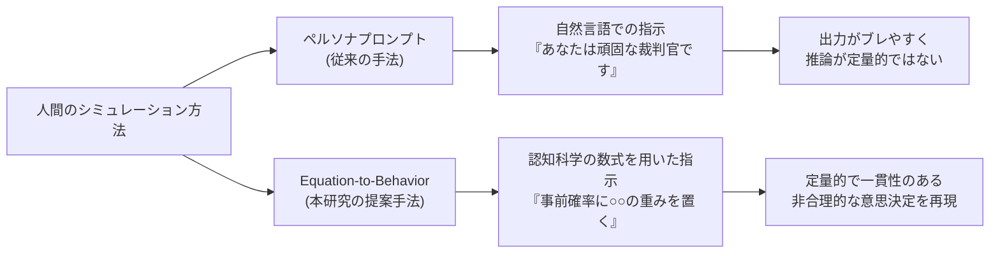
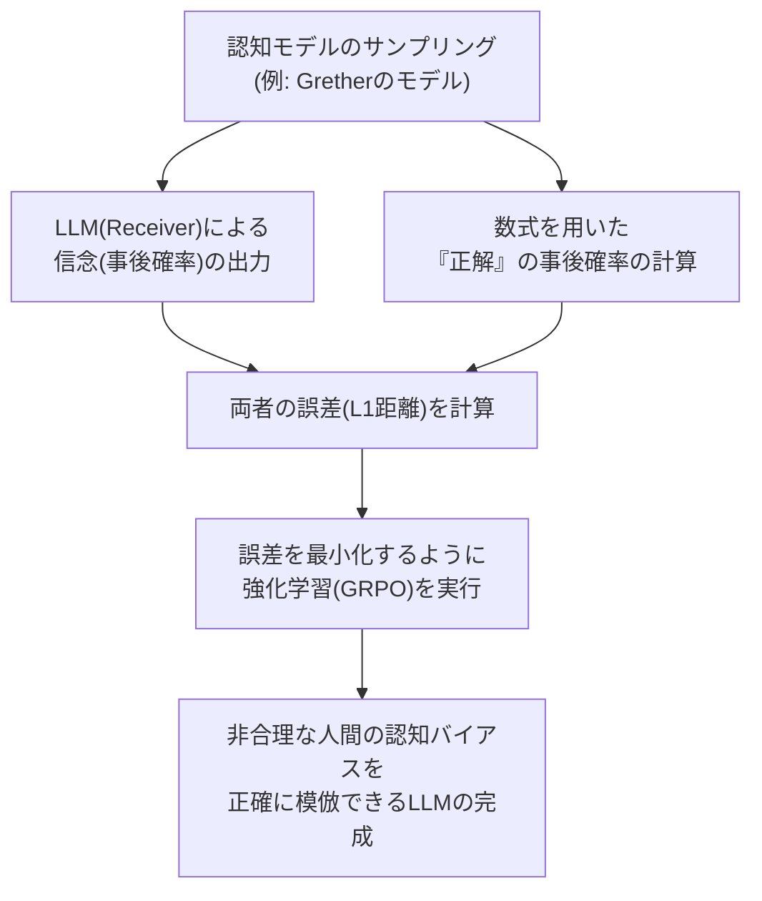
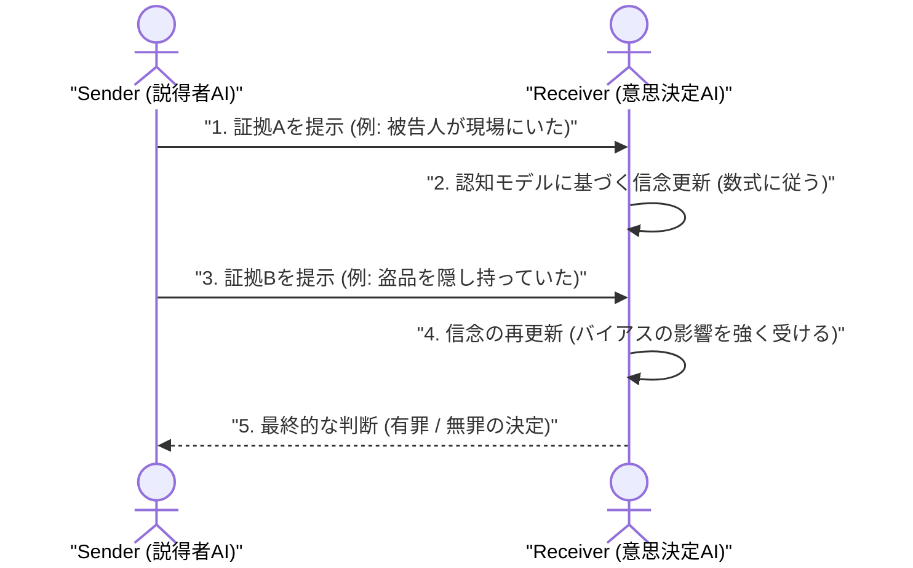

###### Created: 
2026-06-24 15:59 
###### Tag: 
#paper
###### url_01:
https://arxiv.org/abs/2606.17657v1 
###### url_02: 

###### memo: 

---

<!-- paper_extractor:summary:start -->

本論文のSummary、Briefing、FAQ、平易な理解のための解説、およびMermaid図表をMarkdown形式で出力します。

# One line and three points
認知科学の数理モデルを用いて言語モデルに「人間の非合理なバイアス」を組み込み、より現実に近い高度な説得・意思決定シミュレーションを実現する研究。

1. **数式から行動への変換（Equation-to-Behavior）：** 認知科学や経済学で用いられる信念更新の数理モデル（アフィン歪みや動機づけられた推論など）をプロンプトや強化学習の報酬として言語モデルに直接組み込む手法を提案。
2. **モデル規模による違いとRLの有効性：** GPT-5等の大規模モデルはプロンプトだけで指定された認知バイアスを正確に模倣できるが、小規模モデルは強化学習（RL）を施すことで初めて高い精度で模倣でき、未知のバイアス設定にも汎化することを確認。
3. **説得AIの高度化：** 多様な認知バイアスを持つAI（裁判官役）を相手に説得AI（検察官役）を訓練することで、合理的な相手のみで訓練した場合よりも、現実の複雑な人間に対する説得成功率が大幅に向上することを実証。

# Pre-knowledge
人間は新しい証拠や情報に触れた際、純粋な数学的確率（ベイズ更新）に従って合理的に考えを改めるわけではありません。「最初の印象に引きずられる」「自分の望む結論を支持する情報だけを重視する」といった**認知バイアス（予測可能な非合理性）**を持っています。現在、言語モデル（LLM）を用いて法廷やビジネスの場における人間同士の交渉をシミュレートする研究が盛んですが、LLMはデフォルトで「人間よりも合理的すぎる」傾向があり、現実の人間の泥臭い意思決定プロセスを再現するのが難しいという背景があります。

# Summary
本研究は、言語モデル（LLM）を用いて人間の意思決定プロセスをシミュレートする際、人間の持つ「非合理的な認知バイアス」を正確に反映させるための新しいアプローチ「Equation-to-Behavior（数式から行動へ）」を提案しています。人間は新しい証拠を与えられたとき、純粋な数学的確率（ベイズ推定）に従うだけでなく、情報への過剰・過小反応や、好ましい情報を優先する「動機づけられた推論」などのバイアスを示します。本論文では、17世紀から20世紀のロンドン中央刑事裁判所の記録（Old Baileyデータセット）から法廷での説得ゲーム環境を構築しました。

LLMに認知モデルの数式をプロンプトとして与える手法と、数式が弾き出す「正解の事後確率」を報酬として強化学習（RL）を行う手法の2つを検証しました。結果として、GPT-5のような大規模モデルはプロンプトだけで多様な人間の信念更新パターンをシミュレートできる一方、Llama-3.1-8Bなどの小規模モデルは強化学習を通じて初めてそれを正確に模倣できるようになりました。さらに、この手法で生み出した「多様な認知バイアスを持つAI」を相手に「説得を行うAI」を訓練すると、合理的な相手だけで訓練した場合よりも、証拠の提示順を工夫するなどの高度な戦略を獲得し、はるかに現実世界で通用する高い説得力を持つAIを生み出せることが明らかになりました。

# Briefing
**言語モデルによる人間シミュレーションの限界と課題**
現在、言語モデル（LLM）を用いたマルチエージェント・シミュレーションが急速に発展しています。ディベートの練習相手や、模擬裁判のシミュレーターとしてAIを活用する際、私たちは「ペルソナプロンプト（例：あなたは保守的な裁判官です）」を用いてAIに役割を与えます。しかし、LLMは本質的に「論理的かつ合理的」に推論するように最適化されているため、人間特有の「非合理的な思い込み」や「新しい証拠に対する偏った反応」を正確にシミュレートすることができません。リアルな人間社会のシミュレーションを行うためには、人間の認知メカニズムを数学的に制御・模倣できる新しいアプローチが必要です。

**「Equation-to-Behavior（数式から行動へ）」の提案**
研究チームは、認知科学や行動経済学で長年研究されてきた「人間の信念更新の数理モデル」をLLMの制御に直接持ち込みました。本研究では主に以下のモデルが使用されています。
- **ベイズ更新 (Bayesian Updating)：** 理想的で合理的な基準。新しい証拠の確率に応じて正確に意見を変える。
- **アフィン歪み (Affine Distortion)：** 保守的な人間を表現するモデル。新しい証拠が出ても「でも最初はこう思っていたしな」と、事前の信念に強く引きずられる。
- **動機づけられた推論 (Motivated Updating)：** 自分の信じたい結論がある人間を表現するモデル。「有罪にしたい」という動機がある場合、有罪に有利な証拠は過大評価し、無罪の証拠は軽視するといった非対称な反応を示す。
- **Gretherのα-βモデル：** 情報への過剰反応（飛びつき）や過小反応（鈍感さ）を数学的にパラメータ化するモデル。

**大規模モデルの対応力と、小規模モデルへの強化学習（RL）**
GPT-5やClaude-Sonnet-4のような最先端の大規模モデルに対し、これらの数式やパラメータをプロンプトとして組み込んだところ（Equation-to-Behavior Prompting）、驚くべきことに、モデルは指示されたバイアス通りの確率で「有罪・無罪」の判断を下すようになりました。与えられた数式の意味を文脈から理解し、非合理的な人間を見事に演じきったのです。
一方で、Llama-3.1-8Bなどの小規模モデルは数式の指示を理解しきれず、結局のところ通常の合理的な推論に戻ってしまいました。そこで研究チームは、小規模モデルに対して強化学習（Equation-to-Behavior RL）を適用しました。数式が算出する「理想的なバイアスのかかった事後確率」と、LLMが出力する確率の誤差（L1距離）を計算し、誤差を最小化するようにGRPOアルゴリズムで学習させました。その結果、小規模モデルはバイアスを正確に模倣できるようになっただけでなく、訓練されていない未知のパラメータや、別の認知モデルに対しても高い精度で汎化（応用）できることが証明されました。

**最強の「説得AI」を生み出すための訓練環境**
この研究の最大の貢献は、単に人間を模倣することにとどまりません。このようにして構築された「様々な認知バイアスを持つAI（裁判官）」を相手にして、「説得を行うAI（検察官）」を強化学習で訓練しました。
もし「合理的な裁判官」だけを相手に訓練した検察官AIは、単に強い証拠を並べるだけの単調なAIになります。しかし、「動機づけられた推論を持つ裁判官」や「保守的な裁判官」など、多様なバイアスを持つ混合集団を相手に訓練された検察官AIは、相手の反論を予測して先回りして論破したり、弱い証拠が逆効果にならないように証拠を提示するタイミングを工夫したりと、現実の凄腕の弁護士のような高度で適応力のある説得戦略を獲得しました。これは、将来的にAIを用いた教育シミュレーターや、交渉支援システムにおいて、極めて実用的で強力な基盤技術となることを示しています。

# FAQ
**Q. 従来の「ペルソナプロンプト」とは何が違うのですか？**
A. 従来のペルソナプロンプトは「あなたは偏見を持つ裁判官です」と自然言語で指示するため、出力がブレやすく、どの程度偏見を持っているかを定量的に制御できませんでした。本手法は認知科学の数式を直接組み込むため、バイアスの強さを数値で厳密に制御でき、一貫性のあるリアルな意思決定を再現できます。実験でも、本手法の方が実際の裁判記録における判決予測精度が高いことが示されています。

**Q. 強化学習（RL）で訓練したモデルは、学習していない未知のバイアスにも対応できますか？**
A. はい、対応可能です。研究では、特定の認知モデル（例えばGretherのモデルのみ）で訓練されたLLMが、訓練時に見ていない「動機づけられた推論」や「相関関係の無視」といった別の認知バイアスのテスト環境においても、ベースモデルより高い精度で模倣できる（汎化する）ことが確認されました。

**Q. 説得力が高すぎるAIが生み出されることで、詐欺などの悪用リスクはありませんか？**
A. 大きなリスクが存在します。本論文のセーフティ評価（MakeMePayやMakeMeSayといったベンチマーク）でも、最適化されたAIはターゲットから資金を引き出したり、特定の言葉を言わせたりする能力が極めて高いことが示されています。この技術は教育や交渉支援などの有益な目的がある一方で、悪意のあるマニピュレーション（心理的操縦）に転用される危険があるため、実用化に際しては厳格な監視とセーフティガードの確立が不可欠です。

# Critical Assessment（批判的評価）
※本論文はarXivに公開されたプレプリント（査読前論文）に基づく評価です。

**方法論の妥当性：**
17世紀からの実際の裁判記録（Old Bailey）を証拠の単位に分解し、認知科学の数理モデルと組み合わせた精緻な実験設計は非常に高く評価できます。一方で、法廷の証拠の強さや因果関係をLLM（Gemini）によってアノテーションしているため、データの質自体がLLMの推論能力に依存しているという制約があります（少人数の人間の検証は行われていますが、歴史的背景の解釈には限界があります）。

**エビデンスの強度：**
GPT-5、Claude、DeepSeek、Llama 3など、複数サイズ・多様なアーキテクチャのモデルで一貫した比較実験が行われており、証拠の強度は高いと言えます。特に強化学習（GRPO）による汎化性能の向上については、OOD（分布外）テストで明確な統計的有意差が示されています。ただし、現実の人間の複雑な判決データを完全に単一の数式で説明しきれるわけではないため、実社会への完全な一般化にはさらなる検証が必要です。

**実用化への考慮：**
弁護士のディベート訓練や、交渉トレーニングのためのロールプレイ・シミュレーターとして非常に有望かつ実用的なアプローチです。しかしながら、人間の認知バイアスをハック（悪用）する説得AIの構築が可能であることを示唆しており、スパムや詐欺ボットへの悪用を防ぐための技術的・倫理的な防壁の構築が実用化における最大の課題となります。

# For easy understanding
あなたが車を買いにディーラーへ行ったと想像してみてください。
理想的な「論理的で合理的な人」であれば、車の燃費、価格、安全性能などのデータを冷静に計算して、一番お得な車を買うはずです。しかし、現実の人間はそうではありません。「最初に見た赤い車が忘れられない（初頭効果）」「このブランドが好きだから、燃費が悪いというデータは見なかったことにしよう（動機づけられた推論）」といった具合に、情報に対して**非合理的な偏り（認知バイアス）**を持っています。

最近、AI同士を会話させて人間社会のシミュレーションを行う研究が流行っていますが、現在の賢いAI（LLM）は「合理的すぎる」ため、人間らしい泥臭い偏見や非合理性をうまく演じることができません。

そこで本研究のチームは、**「人間の非合理性を表す数学の計算式」をAIに教え込む**という画期的なアプローチをとりました。
巨大なAI（GPT-5など）には、「あなたはこの数式に従って、少し偏った考え方をしなさい」と指示するだけで、見事に人間らしい偏見を再現できました。一方、少し小さなAIには、強化学習というトレーニングを施して「都合のいいことしか聞かない人間」の思考プロセスを徹底的に叩き込みました。

その結果どうなったでしょうか？
この「偏見を持つAI」たちを説得する練習を積んだ「営業マンAI（説得AI）」は、単に事実を並べるだけでなく、「相手がどの情報に食いつくか」「都合の悪い情報をどうやってオブラートに包んで伝えるか」といった、**現実の凄腕の営業マンや弁護士のような、極めて高度な説得テクニックを身につけた**のです。
つまりこの研究は、「非合理な人間をAIに正確に演じさせることで、現実世界で本当に役立つ、説得力に優れたAIを育てることができる」ということを証明したのです。

# Mermaid Diagrams

## 概念図・構造図

## フローチャート・プロセス図

## タイムライン・シーケンス図
**Important** 説得ゲームの対話と信念更新のプロセス

<!-- paper_extractor:summary:end -->

