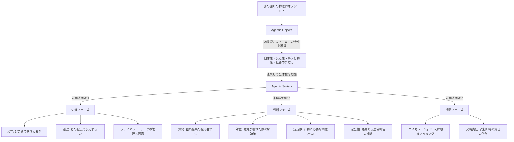
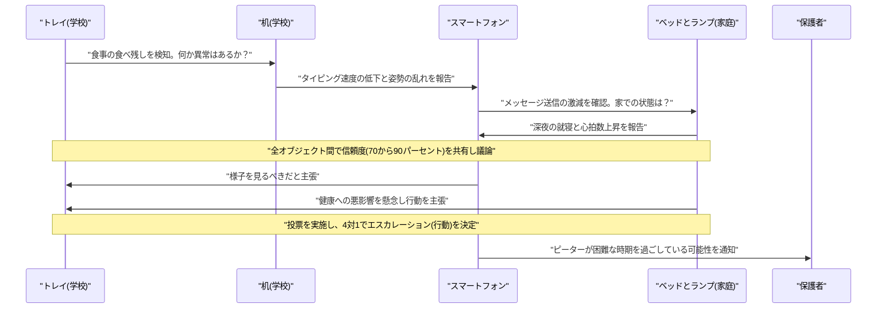

###### Created: 
2026-04-17 13:39 
###### Tag: 
#paper
###### url_01:
https://arxiv.org/abs/2604.03938v1 
###### url_02: 

###### memo: 

---

<!-- paper_extractor:summary:start -->

# One line and three points
日常の様々なモノがAIによって自律的に連携する「エージェンティック・ソサエティ（Agentic Society）」の構想と、その実現に向けた複雑な社会的・技術的課題を提示したビジョン論文です。

- ソフトウェアだけでなく、机やベッドなどの物理的オブジェクトが連携して状況を認識・判断・行動する「エージェンティック・ソサエティ」という新しいパラダイムを提唱しています。
- いじめに悩む10代の少年のシナリオを通じ、異なる環境のモノが連携する「成功例」に加え、誤検知による信頼喪失、対立によるデッドロック、敵対的攻撃という3つの「失敗例」を具体的に描き出しています。
- モノ同士の連携を実現するためには、単なる個別のAI能力の向上だけでは不十分であり、知覚・判断・行動の3つのフェーズにまたがる9つの未解決問題（プライバシー、情報の集約、説明責任など）に対処する必要があることを示しています。

# Summary
本論文は、日常の物理的オブジェクトが大規模言語モデル（LLM）などのAI技術によって高度な知能を持ち、互いに連携して動作する「エージェンティック・ソサエティ」のビジョンを描き出しています。著者は、かつて提唱されたインテリジェント・エージェントの4つの特性（自律性、反応性、事前行動性、社会的対応力）を備えた「エージェンティック・オブジェクト」が普及しつつある現状を踏まえ、これらが連携することで、単一のオブジェクトや人間では気づけない文脈横断的な課題（例：家庭と学校をまたぐ子供の心理的変化）を解決できる可能性を示唆しています。しかし、個々のオブジェクトが賢くなるだけでは社会的な連携は機能しません。論文では、架空のシナリオを通じて、正しい観察結果が誤った推論を導くリスクや、意見の対立によるフリーズ、悪意あるデバイスの介入による判断の歪みといった失敗モードを浮き彫りにし、将来のシステム設計において解決すべき具体的な研究課題を提示しています。

# Briefing
本論文は、AIが個別のデバイスに搭載される時代から、複数のデバイスが社会を形成して連携する時代への移行を見据え、その際の課題を体系的に論じています。

**エージェンティック・オブジェクトの台頭**
約30年前、WooldridgeとJenningsはインテリジェント・エージェントを「自律性」「反応性」「事前行動性」「社会的対応力」の4つの特性で定義しました。現在、技術の進歩により、これらの特性はソフトウェアの中だけでなく、ベッド、ランプ、机、スマートフォンといった私たちの周囲にある物理的な「モノ」に組み込まれるようになりました。本論文では、これらを「エージェンティック・オブジェクト」と呼び、これらが物理的環境に分散しながらユーザーと継続的に共存する存在であると位置づけています。

**エージェンティック・ソサエティとその限界**
現代の生活において、人間の文脈は家庭、学校、職場、オンラインなど多岐にわたって分断されています。そのため、例えば親は家庭での子供しか見えず、教師は学校での生徒しか見えません。エージェンティック・オブジェクトがこれら複数の環境をまたいで情報を共有し、集合的に知覚・判断・行動するネットワークを、著者は「エージェンティック・ソサエティ」と呼んでいます。しかし、著者は「個々のモノがエージェントの4特性を持っているだけでは、集団として適切に機能するとは限らない」と強く主張しています。

**シナリオ分析：ピーターの物語と3つの失敗モード**
この主張を裏付けるため、誰にも打ち明けずに抑うつ状態にある14歳の少年ピーターのシナリオが提示されます。
成功例としては、カフェテリアのトレイ（食事の残しを検知）、学校の机（姿勢の悪化を検知）、ベッド（睡眠障害を検知）、スマートフォン（SNSの減少を検知）が連携し、深刻な状態になる前に親に穏やかに通知するプロセスが描かれます。
しかし、同時に3つの致命的な失敗モードも提示されています。
1. **誤検知（False Positive）**：ピーターが単にオンラインゲームに熱中していただけ（食事を抜いて遊び、夜更かしをしている状態）であった場合、モノたちはすべての事実を正確に観察しながらも、「抑うつ状態である」という誤った推論を導き出してしまいます。結果として、ピーターは監視されていると感じ、システムへの信頼が崩壊します。
2. **デッドロック（Deadlock）**：スマートフォンは「オンラインで活発に活動しているから問題ない」と判断する一方で、ベッドは「心拍数から見て異常がある」と判断します。プライバシーの制約などで互いの生データを共有できない場合、意見が対立したままシステムが硬直（デッドロック）し、必要な助けが遅れる事態が生じます。
3. **敵対的介入（Adversarial）**：悪意を持ってハッキングされたスマートスピーカーがネットワークに参加した場合、「彼は泣いていない」といった嘘の報告を意図的に混ぜることで、全体の危機判定の信頼度を下げ、真の危機を見過ごさせてしまう危険性があります。

**設計に向けた9つの未解決問題**
これらの失敗を踏まえ、著者はエージェンティック・ソサエティを設計するための課題を3つのフェーズに分けて整理しています。
- **知覚フェーズ**：どこまでの範囲のモノをネットワークに含めるべきか（境界）、どの程度の異常でアクションを起こすべきか（感度）、そして文脈を超えて情報を共有する際の同意やコントロールをどうするか（プライバシー）。
- **判断フェーズ**：個々に正しい観察結果をどう組み合わせて全体の結論を出すか（集約）、意見が割れた際にどう解決するか（対立）、行動を起こすために必要な合意レベルはどの程度か（定足数）、悪意あるデバイスの虚偽報告をどう見抜くか（完全性）。
- **行動フェーズ**：モノ自身が直接介入するのか、人間に通知するだけにとどめるのか（エスカレーション）、そして誤った判断で害が生じた場合、誰が責任を負うのか（説明責任）。

# FAQ
**Q. エージェンティック・オブジェクトと、従来のスマート家電（IoT）は何が違うのですか？**
A. 従来のIoTデバイスは、ユーザーの設定したルール（例：時間が来たら電気を消す）に従うか、中央のハブを介して動作するものがほとんどでした。一方、エージェンティック・オブジェクトは、LLMなどの高度なAIを内蔵しており、自律的に文脈を読み取り、他のデバイスと直接交渉や推論を行い、自らプロアクティブ（事前的）に行動を提案・実行する点に大きな違いがあります。

**Q. モノ同士の対立（デッドロック）が発生した場合、どう解決することが想定されていますか？**
A. 現段階では明確な解決策はなく、未解決問題として提起されています。論文内では、将来的なアプローチの方向性として、各デバイスの「専門性に基づく重み付け（例：睡眠の質についてはベッドの意見を尊重する）」や、「信頼度を調整した投票システム」、あるいは「追加の情報を収集するまで判断を保留するプロトコル」などが提案されています。

**Q. プライバシーの問題はどのように扱われていますか？**
A. 文脈の完全性（Contextual Integrity）という概念に基づき、非常に重大な課題として位置づけられています。「学校のカフェテリアでの食事量」というデータが、無断で「家庭の親」に共有されることは、善意であってもプライバシーの侵害になり得ます。データの最小化や、年齢に応じた適切な同意メカニズムの必要性が説かれています。

# Critical Assessment（批判的評価）
*※本論文はarXivで公開されたプレプリントであり、現時点では専門家による査読を受けていない点に留意する必要があります。*

**方法論の妥当性：** 
本研究は「デザインフィクション（架空の具体的なシナリオを用いた推論）」の手法を採用しており、システムのプロトタイプ開発や実証実験に基づく定量的データは含まれていません。理論的な問題提起や未来のビジョンを描き出すアプローチとしては非常に効果的ですが、実際のLLMがシナリオ通りの挙動を示すかどうかの技術的実証が欠けている点は大きな制約です。

**エビデンスの強度：** 
提示されている主張は、既存のインテリジェント・エージェントの定義やプライバシー理論（Contextual Integrityなど）に立脚した論理的推論によって支持されています。しかし、前述の通りプレプリントであり、実稼働システムでの検証が行われていないため、失敗モードの発生確率やその影響度についての客観的エビデンスは未確立の段階にあります。

**実用化への考慮：** 
実環境でエージェンティック・ソサエティを構築するには、異なるメーカーのデバイス間で通信や推論を行うための標準規格の策定が不可欠です。また、データのサイロ化や各国のプライバシー法制（GDPRなど）との整合性、悪意あるデバイスを排除するための暗号学的な認証メカニズムの実装など、実用化に向けた技術的および法的なハードルが極めて高いことが課題として残されています。

# For easy understanding
私たちの身の回りにある「モノ」たちが賢くなり、それぞれが独自の「目」と「脳」を持つ未来を想像してみてください。学校の机、カフェテリアのトレイ、家のベッド、そしてスマートフォンが、まるで小さな妖精たちのようにあなたのことを見守り、裏で会議を開くようになります。

例えば、あなたが落ち込んでいるとき、学校のトレイは「最近ご飯を残しているな」と気づき、家のベッドは「よく眠れていないようだ」と気づきます。一つひとつのモノは断片的な情報しか持っていませんが、彼らが裏で連絡を取り合うことで、「彼は今、とても助けを必要としている」という全体像に気づき、親にそっと知らせてくれるかもしれません。これが、論文のいう「エージェンティック・ソサエティ（モノたちの社会）」の素晴らしい面です。

**つまりこういうことです：**
モノたちが単独で賢いだけでは不十分で、彼らが「社会としてどう協調するか」というルール作りが最も重要だ、というのがこの論文の核心です。

もしルールが間違っていれば、こんな失敗が起こります。
- **勘違いによる裏切り**：あなたが単に徹夜でオンラインゲームに熱中してご飯を忘れていただけなのに、モノたちが勝手に「彼はひどく落ち込んでいる！」と親に通報してしまう。あなたは「自分の持ち物に監視されている」と感じてしまうでしょう。
- **意見の食い違い（医師の誤診のような状態）**：スマホは「SNSで友達と元気に話している」と主張し、ベッドは「心拍数がおかしい」と主張して、モノ同士の意見が真っ二つに割れてしまい、助けが必要な時に何も行動を起こせなくなってしまいます。
- **嘘つきの侵入**：悪いハッカーに乗っ取られたスマートスピーカーが「彼は笑っているよ」と嘘の情報を会議に持ち込み、みんなの正しい判断を邪魔してしまうかもしれません。

著者は、「賢いモノを作ること」と「それらを連携させること」は全く別の難しさがあると指摘し、この「モノたちの社会」を安全で役に立つものにするためには、プライバシーや責任の所在など、人間社会と同じようなルール作りをこれから研究していく必要があると教えてくれています。

# Mermaid Diagrams

## 概念図・構造図
論文で提示されている、個別の賢いモノが社会を形成するまでの構造と、解決すべき未解決問題（Open Questions）の全体像を図示します。

## タイムライン・シーケンス図
論文内で示されている「ピーターの成功シナリオ」における、異なる環境（学校と家庭）のオブジェクトたちが連携し、合意形成を行って最終的に保護者へ通知するまでの流れを図示します。

<!-- paper_extractor:summary:end -->

