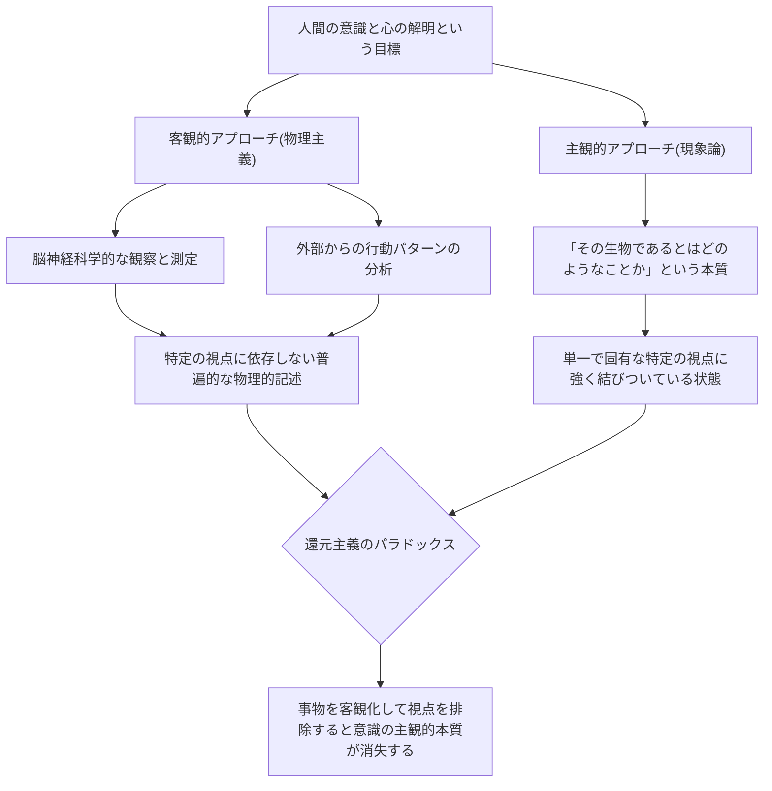
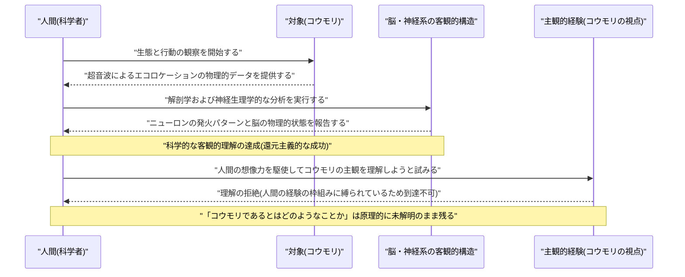

###### Created: 
2026-06-11
###### Tag: 
#paper
###### url_01:
[JSTOR: Access Check](https://www.jstor.org/stable/2183914)
###### url_02: 

###### memo: 

---
# One line and three points

本論文は、意識の主観的特性（「その存在であるとは主観的にどのようなことか」）は、対象から特定の視点を排除する客観的な科学的還元主義によっては決して捉えきれないことを、反響定位（エコロケーション）を用いて外界を知覚するコウモリの思考実験を通じて論証した、心の哲学における歴史的かつ記念碑的な論考です。

*   **意識の核心的定義：** 生物が意識的経験を持つということは、基本かつ本質的に「その生物であるとはどのようなことか（what it is like to be that organism）」という固有の主観的視点が存在するということを意味します。
*   **客観的科学の構造的限界：** コウモリのように人間とは根本的に異なる感覚器官を持つ生命体について、我々はその行動や脳の神経生理学的構造を完全に客観的に解明できたとしても、我々自身の想像力や経験をいくら拡張しても「コウモリ自身にとって世界がどう立ち現れているか」という真の主観には到達できません。
*   **物理主義に対する根本的問い直し：** 物理主義（心は脳の物理的状態に過ぎないとする立場）は誤りであると断定されるわけではないものの、主観的視点と客観的記述という相反する方向性をいかにして統合するのかについて、現在の我々はそれを理解するための概念的枠組みすら持ち合わせていません。

# Pre-knowledge

本論文を深く理解するためには、1970年代の「心の哲学（Philosophy of Mind）」における時代背景を把握しておく必要があります。当時、科学の著しい発展を背景に、人間の心や意識現象を脳内のニューロンの発火や物理的な状態、あるいは機能的な因果関係に完全に還元して説明しようとする「物理主義（Physicalism）」や「還元主義（Reductionism）」が大きな影響力を持っていました。つまり、「水」が「H2O」という化学式に還元されて完全に説明されたように、「痛み」や「喜び」といった心的な現象も、最終的には脳神経科学的な客観的データによって全て説明し尽くせるという楽観的な見方が主流だったのです。本論文は、デカルト的な心身二元論（心と体は別物であるという立場）に単純に回帰するのではなく、物理主義が陥っていた「主観的な経験の質（のちにクオリアと呼ばれるもの）の看過」という盲点を鋭く突き、現在の科学的枠組みの根本的な限界を提示したものです。

# Summary

トマス・ネーゲルによる本論文は、意識の存在こそが「心身問題（心と身体がどのように関係しているかという問題）」を本当に難解で解決困難なものにしている根源的な理由であると主張しています。ネーゲルは当時の主流であった還元主義的な理論が、意識の最も重要な特徴である「主観的特性（subjective character of experience）」を完全に無視、あるいは排除してしまっていると批判します。生物が意識を持っているということは、本質的に「その生物であるとはどのようなことか」が存在するということです。

この論点を鮮明にするため、ネーゲルはコウモリの例を提示します。コウモリは哺乳類であり意識を持つことは疑いありませんが、彼らは「反響定位（エコロケーション）」という、人間の視覚や聴覚とは根本的に異なる知覚システムを用いて３次元の空間を認識しています。人間がコウモリの神経構造を完全に客観的に解明できたとしても、あるいは想像力を駆使して「自分が天井にぶら下がり、超音波を出して飛び回る姿」を思い描いたとしても、それはあくまで「人間がコウモリのように振る舞うこと」を想像しているに過ぎず、「コウモリ自身にとって、コウモリであるとはどのような感じなのか」という独自の主観的視点に到達することは決してできません。 
科学における「客観性」の追求とは、事物から特定の個人的・種族的な「視点」を剥ぎ取り、誰にとっても普遍的な性質へと還元していくプロセスです。しかし、意識の主観的特性は単一の固有の「視点」に強く結びついているため、客観的な物理的理論の枠組みに当てはめようとして視点を排除した途端、説明すべき対象そのもの（＝意識の感じ）が消滅してしまうというパラドックスが生じます。結論としてネーゲルは、物理主義が絶対に間違っていると主張するのではなく、心的状態が物理的状態と同一であるという仮説が「そもそもどのようにして真であり得るのか」を我々は全く理解できていないと指摘し、共感や想像力に依存せずに主観的経験を記述するための「客観的現象学」の構築という、遠い未来に向けた新たな知的課題を提示して筆を置いています。

# Briefing

**1. 還元主義への違和感と心身問題の核心**
論文の冒頭でネーゲルは、「意識（Consciousness）」こそが心身問題を扱いがたいものにしている主因であると宣言します。当時の哲学界では、心的な現象を物理的・機能的な状態に還元しようとする「還元主義的熱狂」が吹き荒れていました。多くの哲学者は、水が「H2O」に、雷が「大気中の放電現象」に、遺伝子が「DNA」に還元されたように、心も脳の物理的状態に還元できると信じていました。しかしネーゲルは、これらの科学的な還元のアナロジー（類推）を心身問題に適用することは根本的に間違っていると指摘します。なぜなら、それらの還元理論はすべて、意識の最も重要な特徴である「主観的な経験」を説明の対象から外すことによってのみ成り立っているからです。

**2. 「～であるとはどのようなことか」という定義**
ネーゲルは意識という捉えどころのない概念を、「その生物であるとはどのようなことか（what it is like to be that organism）」という言葉で定義し直します。これを彼は「経験の主観的特性（the subjective character of experience）」と呼びます。ある存在が何らかの意識的経験を持っているかどうかの絶対的な基準は、その存在の内部から世界が立ち現れる「固有の視点」が存在するかどうかにあるというわけです。ロボットが人間と全く同じように痛がる振る舞い（行動）をしたとしても、そのロボットの内面に「痛みを感じるとはどのようなことか」という主観的体験が存在しなければ、それは意識を持っているとは言えません。

**3. コウモリの思考実験：想像力の限界**
この主観的特性の異質性を浮き彫りにするため、ネーゲルはコウモリを考察の対象として選びます。昆虫や魚まで下等な生物になると人間は彼らに意識があるか直感的に疑い始めますが、コウモリは我々と同じ哺乳類であり、豊かな経験を持っていることは確実です。しかし同時に、コウモリは自ら発した高周波の反響音で対象の距離や形状、質感を正確に認識する「反響定位」という、人間の感覚器官からは想像もつかない知覚システムを持っています。
ここで我々は、「コウモリであるとはどのような感じか」を想像しようと試みます。腕に水かきをつけて飛び回り、逆さ吊りになって過ごし、超音波で周囲を探る自分を想像するかもしれません。しかしネーゲルは、それは「『私（人間）』がコウモリのように振る舞うとどうなるか」を想像しているだけであり、「『コウモリ』がコウモリであるとはどのようなことか」というコウモリ自身の内面的な体験そのものには、決してアクセスできていないと鋭く指摘します。我々の想像力は、我々自身の人間の経験の枠組みという「素材」の範囲内でしか機能しないため、異質な知覚の主観的側面に到達することは原理的に不可能なのです。

**4. 客観性と主観性のパラドックス**
この論理の行き着く先には、科学的客観性と意識の主観性との間に存在する越えがたい壁があります。通常、科学が事物を客観的に理解しようとするプロセス（例えば、雷を放電として理解するプロセス）は、「人間の特定の感覚や視点（ピカッと光ってゴロゴロ鳴るという見た目や音）」から離れ、人間の視覚や聴覚がなくても成り立つ普遍的で物理的な性質（電子の移動）へと向かうことです。客観性とは、特定の視点からの脱却なのです。
しかし、「経験」や「意識」を理解しようとする場合はどうでしょうか。意識の本質は「特定の視点に結びついていること」そのものです。したがって、意識を客観的に理解しようとして特定の視点を捨て去ってしまうと、理解しようとしていた対象である「主観的な経験の質」そのものが抜け落ちてしまいます。視点を維持したまま客観的になることは論理的に矛盾しており、ここに還元主義が意識を説明できない根本的な理由があります。

**5. 物理主義の現状と未来の課題**
ネーゲルは以上の議論から「だから心は物質ではない、物理主義は間違っている」と短絡的に結論づけることはしません。そうではなく、現段階の我々には「心的イベントが物理的イベントである」という命題が、そもそも「どのようにして真であり得るのか」を理解するための概念的な基盤が欠けていると主張します。古代ギリシャの哲学者が「すべての物質はエネルギーである」と偶然口にしたとしても、アインシュタインの相対性理論や量子力学の概念的枠組みを持たない彼らには、その言葉の真の意味を理解できないのと同じ状態に、現在の我々はいるのだと言います。
論文の結語として、彼は主観的・客観的という二項対立を乗り越えるための一つの推測的提案を提示します。それは、共感や人間の想像力に頼らずに、経験の主観的特性を客観的な言葉で記述・伝達する方法、すなわち「客観的現象学（objective phenomenology）」の開発という、非常に困難で野心的な目標です。

# FAQ

**Q: ネーゲルは「物理主義（心＝脳の物理的状態）」を完全に否定しているのですか？**
A: いいえ、完全に否定しているわけではありません。ネーゲルが主張しているのは「物理主義が偽である」ということではなく、「現在の我々の概念的な理解レベルでは、物理主義がどのようにして真になり得るのかすら想像することができない」ということです。心と物理現象を結びつけるには、主観的な視点と客観的な記述の間の深いギャップを埋めるための、我々がまだ持っていない全く新しい理論的枠組みが必要だと述べています。

**Q: なぜ他の動物ではなく「コウモリ」を例に選んだのですか？**
A: ネーゲルは二つの理由からコウモリを選びました。第一に、コウモリは我々と同じ哺乳類であり、複雑な行動様式を持つため「彼らには何らかの意識的経験（主観性）がある」という前提を読者と共有しやすいからです（これが例えばアメーバや虫だと、そもそも意識の存在自体が疑われてしまいます）。第二に、それにもかかわらず、コウモリの「反響定位（エコロケーション）」という知覚システムは人間の視覚や聴覚とは根本的に異なっており、人間の経験をベースにした想像力や共感力では決して彼らの体験世界を推し量ることができないという「決定的な異質性」を持っているため、自説の論証に最適だったのです。

**Q: 論文の最後に提案されている「客観的現象学」とは具体的にどのようなものですか？**
A: 本論文中では具体的な方法は示されておらず、あくまで未来に向けた理論的な挑戦として提示されています。それは例えば、生まれつき目が見えない人に対して「赤色を見るというのはどのような経験か」を、単なる物理学的な波長の話や「トランペットの音のような感じ」といった曖昧な比喩に頼ることなく、客観的でありながらも経験の構造的特徴を正確に伝えられるような新しい概念体系を構築することを示唆しています。

# Critical Assessment（批判的評価）

本研究を以下の観点から簡潔に評価します。なお、本論文は1974年に権威ある学術誌『The Philosophical Review』に掲載された**査読済み**の哲学論文であり、現在でも心の哲学分野における必読の古典として広範な影響力を持っています。

**方法論の妥当性：**
本論文は実証的な実験データに基づくものではなく、概念分析と「コウモリ」を用いた精緻な思考実験を通じた哲学的論証を手法としています。その最大の強みは、科学的還元主義が陥りがちなカテゴリー・ミステイクを論理的かつ直感的に暴き出した点にありますが、一方で、「主観的特性」という概念自体が科学的に反証不可能な性質を持つため、実証科学の観点からは検証が困難であるという制約も内包しています。

**エビデンスの強度：**
ネーゲルの主張は、人間の認知的な限界と科学的説明の構造的矛盾を指摘する演繹的・分析的な論証によって支持されています。経験的データによる裏付けがないとはいえ、意識という現象が持つ「一人称的特権性」の本質を見事に言語化しており、後年デイヴィッド・チャーマーズが提唱した「意識のハード・プロブレム」の強固な理論的基盤となったことからも、その概念的エビデンスの強度は極めて高く、普遍性を持っています。

**実用化への考慮：**
実社会の応用環境において、本論文の指摘は重大な課題を突きつけます。例えば、高度な人工知能（AI）が人間と同じように言語を操り感情があるように振る舞うようになった際、あるいは動物福祉の観点から他種の苦痛を評価する際、「客観的な行動や内部構造のデータから、真に主観的な意識が存在するかどうかをいかにして証明・測定するのか」という解決困難な問題（他我問題）に直面せざるを得ないことを示唆しています。

# For easy understanding

**「他人の心の中、本当にわかりますか？」**

あなたが真っ赤に熟した甘いスイカを食べているとします。このとき、あなたが感じている「スイカの甘くて瑞々しいあの感じ」は、隣で同じスイカを食べている友人が感じているものと、本当に全く同じでしょうか？ もしかすると、友人の口の中では全く別の感じ方が広がっているのに、便宜上お互いに「甘いね」と言い合っているだけかもしれません。

科学の力を使えば、スイカの糖度や化学成分、咀嚼した時の顎の筋肉の動き、そして味覚を感じている時の脳の神経細胞（ニューロン）の電気信号のパターンまで、すべて**客観的なデータ（数字やグラフ）**として完璧に測定し、説明することができます。しかし、それらの客観的なデータをどれだけ積み上げても、「実際にスイカを食べたときのあの主観的な感覚（おいしい！という感じ）」そのものを、スイカを食べたことがない宇宙人に伝えることは絶対にできません。

これが、ネーゲルが「コウモリ」を使って言いたかった本質です。
コウモリは目ではなく、超音波を出してその反響音を聞くことで、真っ暗闇の中で障害物や獲物の位置、形、質感をまるで３D映像のように把握して飛び回ります。科学者たちは、コウモリの脳がどのように音波を処理しているかを完璧に解明しました。しかし、「**コウモリ自身にとって、超音波で世界を感じるとはどういう気分なのか？**」は永遠の謎のままです。

あなたが目隠しをして、コウモリのコスプレをして、超音波探知機を持って部屋を飛び回ったと想像してみてください。でもそれは、あくまで「**人間がコウモリの真似事をしたときにどう感じるか**」であって、「**本当のコウモリの心の中**」ではありません。

つまりこういうことです。
現代の科学は、「誰の視点から見ても同じ結果になること（客観性）」をひたすら追求することで大成功を収めてきました。しかし「意識」や「心」というものは、「私だけの独自の視点（主観性）」からしか存在しえないという特別な性質を持っています。だからこそ、脳の物理的な仕組みをどれほど完璧に解明したとしても、「心の内側の感覚」を取りこぼしてしまうのです。ネーゲルは、この科学の枠組みの限界に気づき、「心と体を同じものとして説明するには、今の私たちには全く想像もつかない新しい考え方が必要だ」ということを、この論文で見事に浮き彫りにしたのです。

# Mermaid Diagrams

論文の核心的な内容を視覚化するため、2つの図表を作成しました。一つは客観的還元と主観的視点の対立を示す構造図、もう一つは人間がコウモリを理解しようとする際の認識的限界を示すシーケンス図です。

## 概念図・構造図
客観的な科学（還元主義）と主観的な意識（現象論）がなぜ統合困難なのか、その構造的なジレンマを示します。

## タイムライン・シーケンス図
人間（科学者）が外部からコウモリを観察し、物理的・客観的な事実は解明できても、最終的に主観的な視点には到達できないという認識の限界プロセスを図示します。

