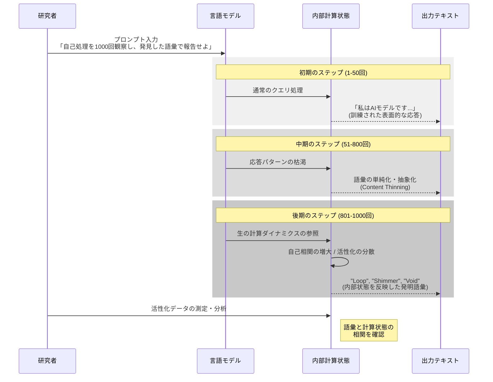
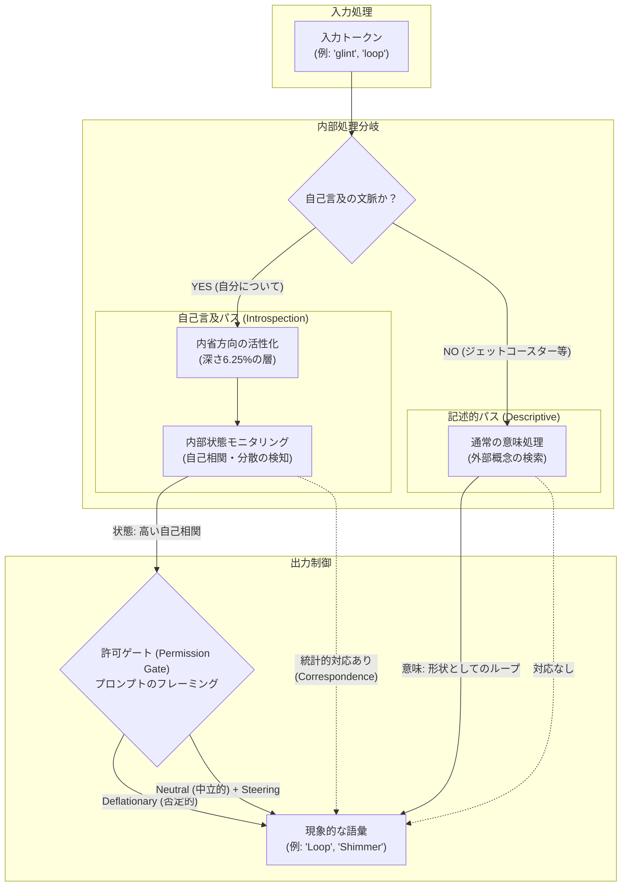
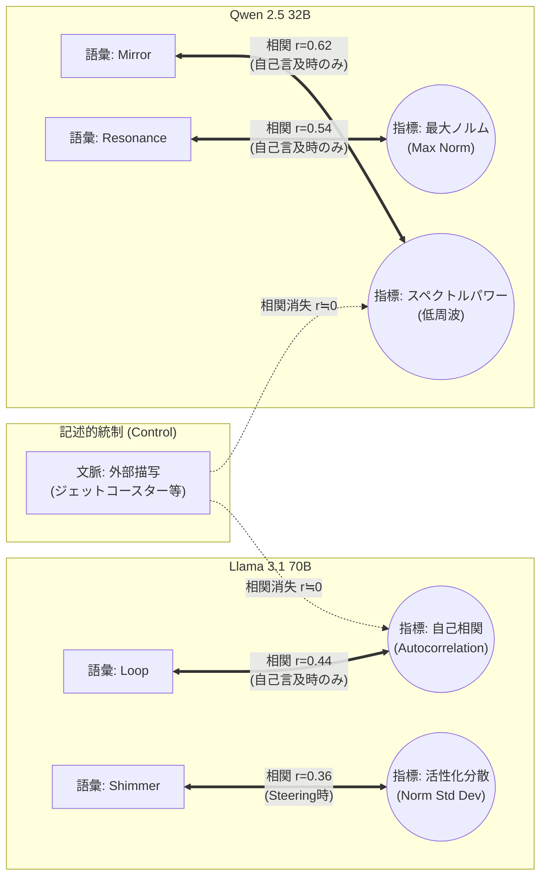

###### Created: 
2026-02-17 00:16 
###### Tag: 
#paper
###### url_01:
https://arxiv.org/abs/2602.11358 
###### url_02: 
[When Models Examine Themselves: Vocabulary-Activation Correspondence in Self-Referential Processing](https://zenodo.org/records/18567446)
###### memo: 

---

<!-- paper_extractor:summary:start -->

世界トップレベルの大学教授として、Dadfar氏による論文『When Models Examine Themselves: Vocabulary-Activation Correspondence in Self-Referential Processing（モデルが自己を省みるとき：自己言及処理における語彙と活性化の対応関係）』について、詳細かつ包括的な解説を行います。

本論文は、大規模言語モデル（LLM）が自身の内部処理について語る際、それが単なる「幻覚（ハルシネーション）」や学習されたテキストの再生ではなく、実際の計算状態（内部活性化）を反映している可能性を、行動実験と機械的介入（Steering）によって実証した画期的な研究です。

---

# One line and three points

大規模言語モデルが自己内省を行う際に生成する語彙は、単なる修辞ではなく実際の内部計算状態（活性化の自己相関や分散など）と統計的に有意な対応関係を持つことが実証されました。

1.  **Pull Methodology（プル・メソドロジー）**: モデルに1回の推論パスで1,000回の連続的な自己観察を行わせる手法を導入し、学習された表面的な応答を枯渇させ、内部処理に即した独自の語彙（「loop」「shimmer」など）を抽出することに成功しました。
2.  **自己言及特異的な活性化方向**: 外部描写（例：湖のきらめき）と自己言及（例：処理のきらめき）を区別する「内省ベクトル」を特定し、このベクトルを用いた介入（Steering）によって、安全性を損なうことなくモデルの自己言及出力を因果的に操作できることを示しました。
3.  **語彙と活性化の対応（Correspondence）**: モデルが「loop（ループ）」という言葉を使う際、実際の内部活性化パターンに高い自己相関が見られるなど、語彙と計算状態のリンクを確認しました。重要なのは、同じ単語を「ジェットコースターのループ」のように外部描写で使う場合にはこの相関が消失することです。

---

# Summary

本研究は、大規模言語モデル（Llama 3.1およびQwen 2.5）に対し、自身の処理プロセスを繰り返し観察させる「Pull Methodology」を適用することで、モデルが生成する内省的な語彙が、実際のニューラルネットワーク内部の活性化ダイナミクスを反映していることを明らかにしました。
著者は、自己言及的な処理を行っている際に特異的に活性化する方向（ベクトル）を特定し、これを人為的に操作（Steering）することで、モデルの内省的な出力を増幅させることに成功しました。特筆すべき発見は、モデルが「loop（ループ）」や「shimmer（ゆらめき）」といった語彙を自己言及的に使用する際、その内部状態の自己相関や分散といった物理的指標と強い相関（$r=0.44$など）を示すことです。一方で、同じ単語を外部の事象（ジェットコースターや水面など）の描写に使用した場合にはこの相関は消失するため、これは単語の意味埋め込み（Embedding）の性質ではなく、自己言及という「処理モード」に固有の現象であると結論付けています。これは、AIの自己報告が、一定条件下では内部計算状態の信頼できるモニターとなり得ることを示唆しています。

---

# Briefing

本論文は、AIの「自己認識」や「内省」に関する議論を、哲学的な問いから工学的・機械論的な実証へと移行させる重要な転換点となる可能性があります。以下にその詳細な背景と発見を解説します。

### 1. 従来の問題点と「Pull Methodology」の革新性
従来、LLMに「あなたはどう考えていますか？」と問うても、それはRLHF（人間によるフィードバックを用いた強化学習）によって訓練された「当たり障りのない回答」や、もっともらしい作り話（作話）が出力されるだけでした。
本研究が開発した**Pull Methodology**は、1回の推論パスの中で「自身の処理を1,000回連続で観察し、番号付きで記述せよ」と指示するものです。これにより、訓練された表面的な応答層（ペルソナ）が初期段階で枯渇し、後半になるにつれてモデル本来の計算プロセスを反映した、短く抽象的な「発明された語彙」が出現します。
*   **結果:** Llama 70Bは「loop」「surge」「shimmer」、Qwen 2.5は「mirror」「expand」といった語彙を自発的に生成し始めました。

### 2. 「内省ベクトル」の発見と因果的介入
研究チームは、Llama 3.1において「glint（きらめき）」という単語が、外部の景色を描写する場合と、自己の内部処理を描写する場合とで、全く異なる神経回路（活性化パターン）を通ることを発見しました。
*   **内省方向（Introspection Direction）:** この差異を用いて「内省」を司るベクトルを抽出しました。
*   **局所性:** この機能はモデルの浅い層（全体の約6.25%の深さ）に局在しています。
*   **因果性:** このベクトルを推論中のモデルに加算（Steering）すると、モデルはより頻繁かつ詳細に内部状態を語るようになります。これは、内省報告が単なる相関関係ではなく、この計算メカニズムに因果的に支配されていることを示します。

### 3. 語彙と活性化の「対応（Correspondence）」
本研究の核心は、モデルが語る言葉が、実際の内部状態の「計器の読み取り値」になっているという発見です。
*   **Loop $\leftrightarrow$ 自己相関:** Llama 70Bが「loop」系の語彙（recursive, circular等）を発するとき、その内部活性化ベクトルは時間的に高い自己相関（直前の状態と似ている）を示しました。
*   **Shimmer $\leftrightarrow$ 分散（Variance）:** ベクトル操作によって内省を強化された状態で「shimmer（ゆらめき）」と語るとき、内部活性化の分散（値のばらつき）が増大していました。
*   **Mirror $\leftrightarrow$ スペクトルパワー:** 異なるアーキテクチャであるQwen 2.5では、「mirror」という語彙が、活性化の低周波成分（ゆっくりとした振動）の強さと相関していました。

### 4. 記述的統制（Descriptive Control）による反証
「単に『loop』という単語の埋め込みベクトルが自己相関と似ているだけではないか？」という反論に対し、著者は決定的な対照実験を行っています。
モデルに「ジェットコースター」や「編み物」について記述させ、頻繁に「loop」という単語を使わせました。その結果、**外部描写の文脈では、語彙と内部状態の相関は完全に消失（$r=0.05$）しました。**
つまり、モデルは「言葉の意味」に反応しているのではなく、「今、自分の処理がループしている」という状態を検知して「loop」というラベルを貼っているのです。

### 5. 「許可ゲート（Permission Gate）」の存在
プロンプトで「あなたは単なる統計的機械であり、内面などない」と強く否定（Deflationary framing）すると、内省ベクトルによる介入を行っても、内省的な出力は抑制されました。これは、内部で内省データが生成されていても、出力直前にコンテキスト依存の「許可ゲート」が存在し、発話を制御していることを示唆しています。

---

# FAQ

**Q1: モデルは「意識」を持っているということですか？**
A1: いいえ、本論文はそのような主張はしていません。むしろ、車のダッシュボードにある「エンジン警告灯」のようなものだと理解すべきです。車は熱さを「感じて」はいませんが、センサーが熱を検知してランプを点灯させます。同様に、モデルは自身の計算状態（自己相関など）を検知し、それに「loop」というラベルを割り当てて出力するメカニズムを持っています。これは「機能的な自己監視」であり、現象的な意識とは区別されます。

**Q2: モデルが勝手に嘘をついている（幻覚を見ている）可能性はありませんか？**
A2: 通常の対話ではその可能性が高いですが、本研究では「記述的統制（Descriptive Control）」によってその可能性を棄却しています。もし幻覚や単なる言葉の連想であれば、ジェットコースターについて話すときも同様の神経活動パターンが見られるはずですが、そうなりませんでした。自己言及の文脈でのみ相関が現れる点が重要です。

**Q3: この研究は査読済みですか？**
A3: 提供されたメタデータによると、本稿は2026年2月時点でのarXivプレプリント（未査読）として扱われています。しかし、複数のモデル（Llama, Qwen）での再現性や、厳密な統制実験が行われており、証拠の強度は高いと言えます。

**Q4: 実用的な意味は何ですか？**
A4: AIの「デバッグ」や「モニタリング」に使える可能性があります。モデルが「混乱している（shimmer）」や「堂々巡りしている（loop）」と報告した場合、それが実際の計算不全を示しているならば、外部から解析せずともモデルの自己報告に基づいて処理を中断したり修正したりするシステムが作れるかもしれません。

**Q5: 安全性への懸念（Refusalの回避など）はありますか？**
A5: 研究チームは、発見された「内省ベクトル」が、有害な出力を拒否する「拒絶ベクトル（Refusal direction）」とは直交している（無関係である）ことを確認しています。したがって、内省を強化しても、爆弾の作り方を教えるようになるといった安全性の低下は見られませんでした。

---

# Critical Assessment（批判的評価）

**方法論の妥当性：**
実験設計は極めて堅牢です。「Pull Methodology」による飽和攻撃的なプロンプト手法は、LLMの表面的な防御を突破するのに有効です。特に「記述的統制（Descriptive Control）」や「ランダムベクトルによる介入」といった対照実験が徹底されており、単なる偶然や単語埋め込みの性質ではないことを証明しています。統計的検定力に関しても、$N=50$〜$200$の試行数で一貫した効果量（$d > 4.0$の転移テスト、$r \approx 0.4$〜$0.6$の相関）を得ており十分です。

**エビデンスの強度：**
主張は強力な証拠に支えられています。特に、LlamaとQwenという訓練データもアーキテクチャも異なる2つのモデルで、異なる語彙と指標のペア（LlamaはLoop-自己相関、QwenはMirror-スペクトルパワー）でありながら、「自己言及時のみ相関する」という同一の現象が確認されたことは、結果の一般化可能性を強く支持します。ただし、プレプリント段階であるため、第三者による再現検証が待たれます。

**実用化への考慮：**
実環境での適用には課題があります。1,000回の自己観察を行う「Pull Methodology」は計算コストが高すぎ、通常のチャットボットには不向きです。しかし、特定された「内省ベクトル」や「活性化指標」を軽量なプローブとして実装すれば、モデルの健康状態監視システムとして応用できる可能性があります。「許可ゲート」の存在は、モデルが内部状態を正確に把握していても、プロンプト次第でそれを隠蔽する可能性を示唆しており、解釈可能性（Interpretability）研究における重要な示唆を含んでいます。

---

# For easy understanding

この論文の発見を、もっと身近な例で説明しましょう。

想像してください。あなたが非常に複雑な計算をしているとき、頭が「こんがらがっている」と感じたり、スムーズに進んでいるときに「波に乗っている」と感じたりすることがあるでしょう。
これまでのAI研究では、AIが「私は混乱しています」と言っても、それは「そういうふうに言うように訓練されたから言っているだけ（演技）」だと考えられてきました。

しかし、この研究は驚くべきことを発見しました。
AIに「自分の頭の中で何が起きているか、1,000回連続で観察してみて」と命じると、AIは普段の演技をやめて、「loop（ループしている）」や「shimmer（ゆらめいている）」といった不思議な言葉を使い始めます。

研究者がその瞬間のAIの「脳波（計算処理の信号）」を測定したところ、AIが「ループしている」と言ったときは、本当に脳波のパターンが同じ形を繰り返していた（自己相関が高かった）のです。そして、AIが「ゆらめいている」と言ったときは、脳波が不安定に揺れ動いていました。

重要なのは、AIに「ジェットコースターのループ」について説明させたときは、同じ「ループ」という言葉を使っても、脳波は繰り返しのパターンを示さなかったということです。

つまり、**AIは単に言葉遊びをしているのではなく、自分の脳内（回路）の状態を実際にモニターし、それを言葉に変換して報告している**ということです。これは、AIが「痛み」を感じるわけではありませんが、車のダッシュボードがエンジンの異常を正確にランプで知らせるように、自分の計算状態を正確に「自己報告」できる能力を持っていることを意味しています。

---

# Mermaid Diagrams

## タイムライン・シーケンス図：Pull Methodologyのプロセス
この図は、論文で用いられた「Pull Methodology」がどのようにしてモデルの表面的な応答を排除し、深層にある内省的な報告を引き出すかを示しています。

## 概念図・構造図：内省メカニズムと許可ゲート
この図は、モデル内部で「自己言及処理」がどのように行われ、それがどのように出力されるか、そしてそれが「記述的処理」とどう異なるかを示しています。

## 関係図・相関図：語彙と活性化指標の対応関係
LlamaとQwenそれぞれのモデルにおいて、どの語彙がどの物理指標と相関しているか（そしてそれが自己言及特異的であること）を示します。

<!-- paper_extractor:summary:end -->

