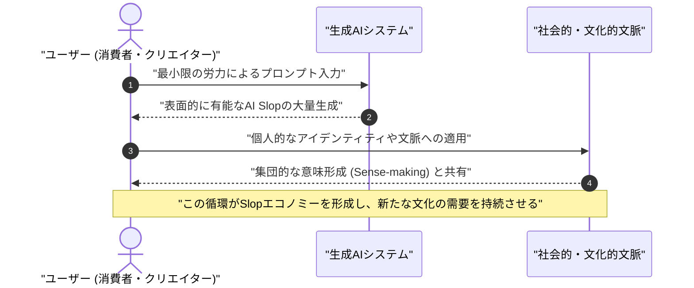
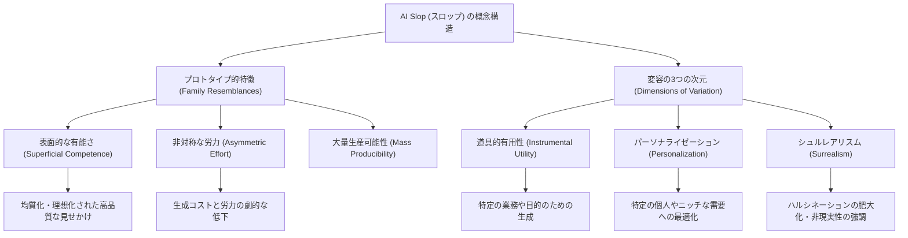

###### Created: 
2026-04-14 11:30 
###### Tag: 
#paper
###### url_01:
https://arxiv.org/abs/2601.06060 
###### url_02: 

###### memo: 

---

<!-- paper_extractor:summary:start -->

# One line and three points
AI生成の粗製濫造コンテンツ「Slop（スロップ）」は単なるデジタル公害ではなく、特有の社会的機能と美的価値を持つ新たな文化的対象として真剣に研究すべきである。

1. **社会的機能の提供**：Slopは、これまで生産コストに見合わなかった極めてニッチな個人の需要に対し、安価にコンテンツを提供する「供給側の解決策」として機能している。
2. **集団的な意味形成の手段**：かつての「キッチュ（低俗な大衆芸術）」が後に再評価されたように、Slopも人々が世界を理解し、アイデンティティや意味を表現するための正当な文化的基盤となり得る。
3. **新たな概念的枠組みの提示**：Slopは「表面的な有能さ」「非対称な労力」「大量生産可能性」という3つの特徴を持ち、今後はその特性や「Slopエコノミー」がもたらす経済的影響の解明が求められている。

# Summary
本論文は、近年急増しているAI生成コンテンツの粗悪品、いわゆる「AI Slop（スロップ）」に対する一般的な認識に異を唱え、新たな学術的視点を提供しています。一般的にSlopは、生産性を低下させる「仕事のゴミ（workslop）」や、インターネット上を埋め尽くす「文化的な汚染物質」として否定的に捉えられています。しかし著者らは、Slopが排斥されるべき存在ではなく、厳密な研究に値する対象であると主張しています。なぜなら、Slopは人間が供給できる以上のコンテンツを求める人々の潜在的な需要を満たす社会的な機能を果たしており、かつて「低俗（キッチュ）」と見なされた過去のポップカルチャーと同様に、人々の間で独自の意味やアイデンティティを形成する独自の美的価値を持っているからです。論文では、Slopを定義づける「表面的な有能さ」「労力の非対称性」「大量生産可能性」という3つのプロトタイプ的な特徴を提示し、さらに目的や用途に応じて変容する3つの次元（道具的有用性、パーソナライゼーション、シュルレアリスム）を整理しています。結論として、Slopは今後のクリエイティブ産業や情報経済において極めて大きな影響力を持つため、学問的な研究対象として真剣に取り組むべきであると提言しています。

# Briefing
現在、生成AIの普及に伴って「AI Slop」と呼ばれる粗製濫造されたコンテンツがインターネットや職場に氾濫しています。Slopという言葉はもともと「残飯」や「豚の餌」を意味し、現在ではAIが生成した「もっともらしいが中身のないコンテンツ」を指す蔑称として定着しつつあります。多くの批評家やメディアは、この現象をAIがもたらす創造性の破壊や、デジタル空間の公害として非難しています。しかし、本論文の著者らは「なぜこれほどまでに価値のないはずのSlopが増殖し続けるのか」という根本的な問いを立て、それを単なるゴミとして切り捨てるのではなく、現代の文化的・経済的状況を映し出す鏡として深く理解しようと試みています。

まず、著者らはSlopが果たしている「社会的機能」に着目しています。経済学の「最適製品多様性（optimum product diversity）」という概念によれば、世の中には特定の人しか喜ばない非常にニッチな需要が無数に存在しますが、これまでは制作コストの壁があるため、それらの需要を満たすコンテンツは作られませんでした。しかし、生成AIの登場によってコンテンツ制作にかかる労力とコストが限りなくゼロに近づいたため、人々は「自分が見たいだけの特注のコンテンツ」を簡単に手に入れられるようになりました。仕事の場面で体裁を整えるだけの無意味な文書を大量生産したり、政治的なプロパガンダを際限なく生成したりすることも、人間がコストと報酬のバランスを計算した結果生み出された「需要と供給の新しい形」に他なりません。Slopは、何かを達成しようとする人間の目的意識に根ざした機能的な道具として機能しているのです。

次に、本論文はSlopの「美的価値」と「文化的意味」について歴史的な観点から深く掘り下げています。1930年代に批評家クレメント・グリーンバーグは、大衆向けの安価で機械的に作られた芸術を「キッチュ（Kitsch）」と呼び、本物の文化に寄生する偽物だと激しく非難しました。現在のAI Slopへの批判は、このグリーンバーグのキッチュ批判と驚くほど似ています。しかし歴史を振り返れば、ティン・パン・アレーの音楽やノーマン・ロックウェルの絵画のように、かつてキッチュと見なされたものが後に正当な文化として再評価された例は枚挙にいとまがありません。人間には、目の前にあるどんなに安っぽく不完全な素材であっても、それを使って自らのアイデンティティを表現し、他者と意味を共有する「意味形成（sense-making）」の驚くべき能力が備わっています。架空のキャラクターとの奇妙な対話や、現実離れしたAI画像であっても、特定の個人にとっては自分の感情や状況を表現する完璧なメタファーとなり得るのです。

これらの考察を踏まえ、論文ではAI Slopに共通するプロトタイプ的な3つの特徴を明確に定義しています。一つ目は、文法や画質は完璧であるものの実質的なメッセージや職人技が欠如している「表面的な有能さ（Superficial Competence）」です。二つ目は、生成にかかる労力が人間の手作業と比べて劇的に少ない「非対称な労力（Asymmetric Effort）」です。三つ目は、個人的な用途で作られたものであっても、デジタルエコシステムの中で容易に拡散可能な「大量生産可能性（Mass Producibility）」です。また、Slopの現れ方は一様ではなく、「道具的有用性（特定の目的があるか）」「パーソナライゼーション（特定の個人の声や顔に依存しているか）」「シュルレアリスム（AI特有の幻覚が誇張されているか）」という3つの次元で多様なバリエーションを生み出します。このように、AI Slopは私たちのクリエイティブな経済や情報文化の中核にすでに組み込まれており、次のアテンション・エコノミーを支配する存在として、その形式や影響を体系的に研究する必要があるという力強いメッセージが展開されています。

# FAQ

**Q: 「AI Slop」とは具体的にどのようなものを指していますか？**
A: AI Slopとは、AIによって生成された、表面的な品質は高いが実質的な意図や中身が伴っていないコンテンツの総称です。例えば、SNSでバズるためだけに作られた奇妙なAI画像（「Shrimp Jesus（エビのイエス・キリスト）」など）や、AIに書かせた長たらしくて無個性な仕事のメール、大量生産された質の低いSEO記事などが含まれます。

**Q: なぜ著者はAI Slopをただの「ゴミ」として捨てるべきではないと主張しているのですか？**
A: なぜなら、AI Slopが実際に人々の需要を満たし、社会的な役割を果たしているからです。これまでコストの問題で人間が作れなかった極めて個人的なコンテンツを安価に提供したり、人々がそれを使って独自の意味や感情を表現したりするツールとなっています。過去の「キッチュ（低俗な大衆芸術）」が後に文化として評価されたように、Slopも現代社会の新しい文化活動の基盤として理解する価値があるからです。

**Q: AI Slopの増殖は、今後の社会にどのような影響を与えると考えられていますか？**
A: 今後、AI Slopは個人の情報消費や仕事のあり方を根本的に変える可能性があります。TikTokのような既存のプラットフォームがAI生成主導のプラットフォームに移行し、人々の注目を集める「Slopエコノミー」が巨大な市場を形成すると予測されています。需要と供給のバランスが変化し、私たちが「コンテンツ」に求める価値観そのものが変容していくと考えられます。

# Critical Assessment（批判的評価）

**方法論の妥当性：**
本論文は、実証的な実験データや統計分析を伴うものではなく、概念的・理論的な枠組みを提示するポジションペーパーとしての性格を持っています。Slopの特徴を3つの要素や次元に分類した点は現象を捉えるヒューリスティックなモデルとして有用ですが、これらが実際のユーザーデータや定量的な指標に基づいたものではないため、仮説の域を出ないという限界があります。

**エビデンスの強度：**
本論文はプレプリントサーバー（arXiv）に公開された未査読の論文です。経済学の「最適製品多様性」や過去の「キッチュ」の歴史的変遷といった類推を用いて論を展開しており、知的な説得力は高いものの、推測や理論的な解釈に大きく依存しています。「ユーザーが実際にSlopを通じて意味形成を行っている」という主張を裏付けるための大規模な質的・量的なユーザー調査といった実証的エビデンスはまだ不足しています。

**実用化への考慮：**
Slopの性質をプラットフォームのアルゴリズム設計やコンテンツフィルタリングシステムなどの実環境に適用しようとする場合、本論文の定義の抽象性が課題となります。「表面的な有能さ」や「シュルレアリスム」といった主観的な基準を、客観的な機械学習のメトリクスとしてどのように定量化・自動検知するかが、実用化における最大の制限事項と言えます。

# For easy understanding

**「AIの残飯（Slop）」は、本当にただのゴミなのでしょうか？**

「Slop（スロップ）」は、もともと「豚の餌」や「残飯」を意味する言葉ですが、最近ではAIが大量に作り出す「もっともらしいけれど中身のないコンテンツ」を指すようになりました。SNSに流れてくる「謎のAI美女の画像」や、仕事でAIに書かせた「やたらと丁寧だけど意味のない長文メール」などがそれにあたります。

普通なら「こんなデジタルゴミ、迷惑なだけだ！」と切り捨てられるところですが、この論文は**「ちょっと待って、このゴミの山にはちゃんと意味があるんだよ」**と主張しています。

第一に、これらは「需要があるのに誰も作らなかったニッチな隙間」を埋めています。自分だけが喜ぶ変な動画や画像を、人間にお願いして作ってもらうとお金と時間がかかりますが、AIならタダ同然で作ってくれます。私たちが「もっとコンテンツが欲しい」と思う果てしない欲求に、AIが応えてくれているのです。

第二に、昔の「低俗な大衆文化（キッチュ）」が後に評価されたように、現代の人々もこの「適当なAIコンテンツ」をネタにして盛り上がったり、自分の気持ちを表現する道具として使いこなしたりしています。例えば、ありえないシチュエーションのAI画像をあえてプロフィールにして自分らしさをアピールするなど、人間はどんなガラクタからでも「自分なりの意味」を見つけ出す天才なのです。

**つまりこういうことです：**
AIが生み出す「残飯」は単なるゴミではなく、現代の私たちが何を求め、どうやって自己表現しているかを映し出す「新しい文化の形」になりつつあります。だからこそ、ただ毛嫌いするのではなく、AI社会の真の姿を知るための重要な手がかりとして、きちんと向き合って研究していこうというのが、この論文の核心的なメッセージです。

# Mermaid Diagrams

## タイムライン・シーケンス図

## 概念図・構造図

<!-- paper_extractor:summary:end -->

