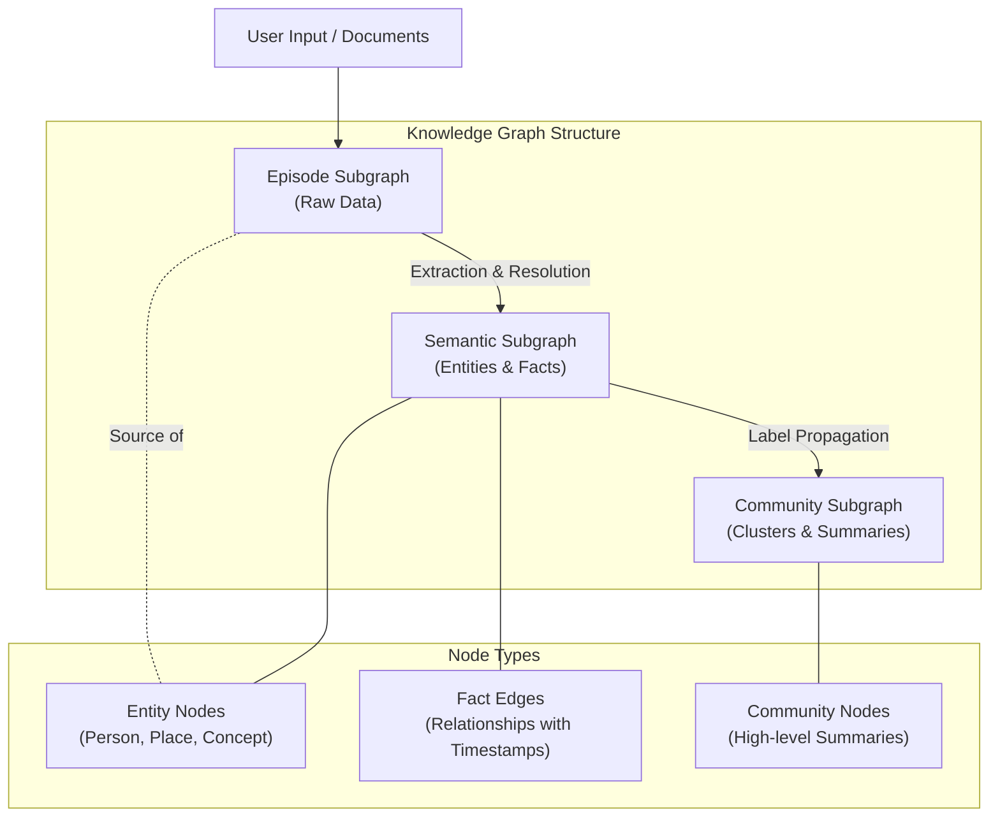
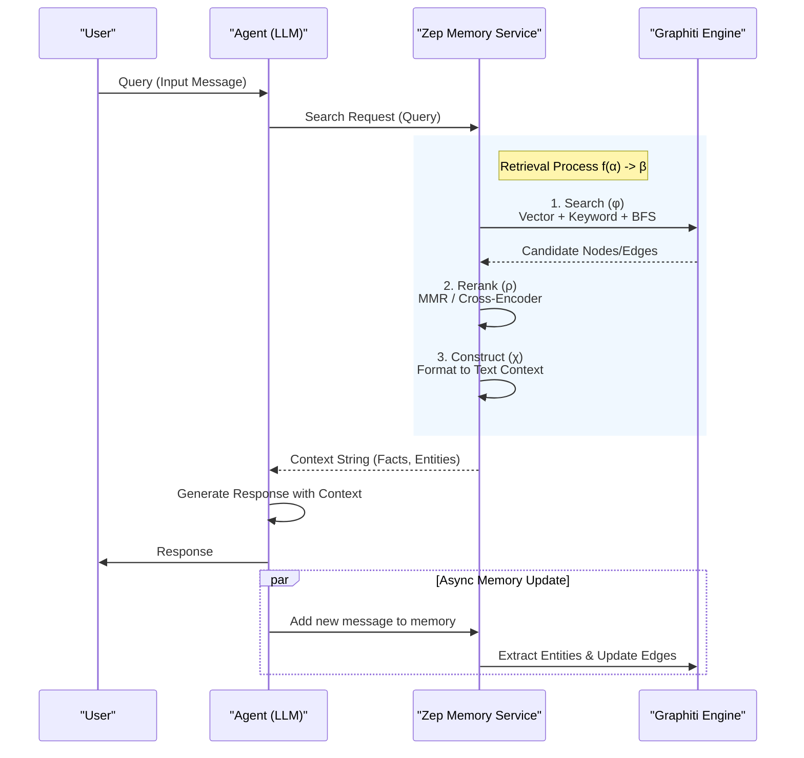
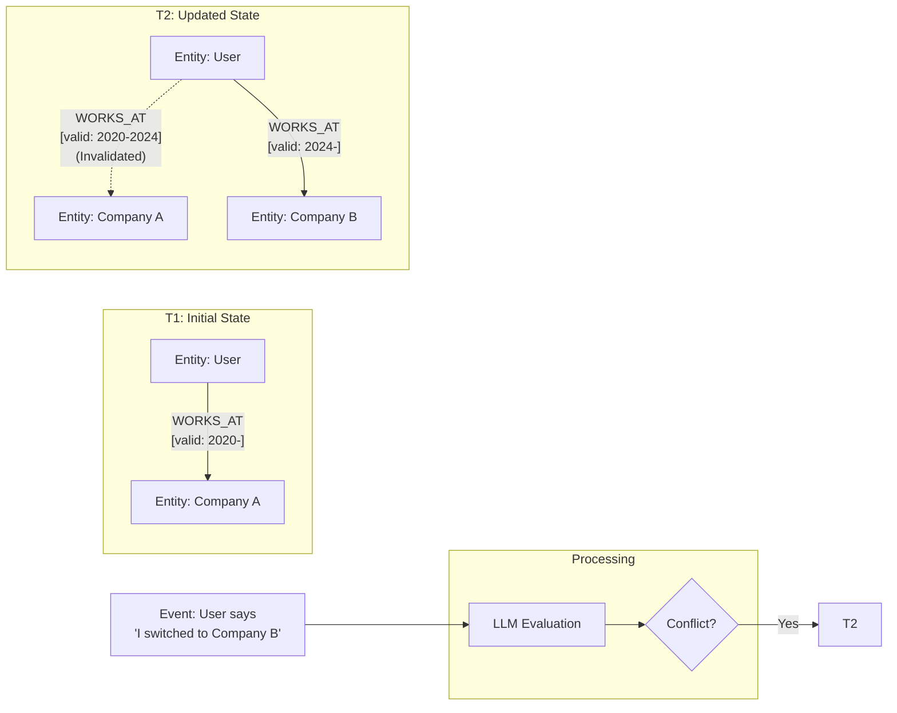

###### Created: 
2026-02-04 17:32 
###### Tag: 
#paper
###### url_01:
https://arxiv.org/abs/2501.13956 
###### url_02: 
[GitHub - getzep/graphiti: Build Real-Time Knowledge Graphs for AI Agents](https://github.com/getzep/graphiti)
###### memo: 

---

<!-- paper_extractor:summary:start -->

本論文は、AIエージェントのための新しいメモリレイヤーアーキテクチャ「Zep」と、そのコアエンジンである「Graphiti」について詳述した技術レポートです。

# One line and three points
AIエージェントに「時間の流れ」と「文脈の変化」を理解させるため、動的な時系列ナレッジグラフを用いた次世代メモリシステム「Zep」の提案と評価。

1.  **時系列を考慮した動的ナレッジグラフ（Graphiti）：** 従来の静的なRAGとは異なり、会話や事実の時間的有効性（いつからいつまで正しいか）を管理するバイテンポラル・データモデルを採用しています。
2.  **階層的なメモリ構造：** 生の会話データ（エピソード）、抽出された事実・エンティティ（セマンティック）、そしてそれらの要約群（コミュニティ）という3層構造で、人間の記憶に近い柔軟な検索を実現しています。
3.  **高い検索精度と低レイテンシ：** MemGPTなどの既存手法と比較し、Deep Memory Retrievalタスクで上回る精度（94.8%）を達成しつつ、応答時間を最大90%削減することに成功しています。

# Summary
本論文では、LLMベースのエージェントが長期的な文脈や変化する情報を保持できないという課題に対し、**Zep**と呼ばれる新しいメモリサービスアーキテクチャを提案しています。Zepの中核には**Graphiti**という動的なナレッジグラフエンジンがあり、非構造化データ（会話ログ）と構造化データ（ビジネスデータ）を統合して管理します。

最大の特徴は、事実関係に「時間軸」を導入した点です。単に情報を蓄積するだけでなく、「過去の事実はこうだったが、現在はこうである」という情報の更新や無効化を、グラフ構造のエッジ（関係性）の操作によって実現しています。

実験においては、MemGPTチームが提唱したDeep Memory Retrieval（DMR）ベンチマークおよび、より実用に近いLongMemEvalベンチマークを用いて評価を行いました。その結果、Zepは検索精度において既存のSOTA（State-of-the-Art）を上回り、かつエンタープライズ利用に耐えうる低レイテンシを実現していることが示されました。これは、静的なドキュメント検索に留まっていた従来のRAG（検索拡張生成）を、動的なエージェントメモリへと進化させる重要な研究成果です。

# Briefing
本論文の核心的な技術と成果について、包括的に解説します。

**1. 背景と課題：静的RAGの限界**
現在主流のRAGアプローチは、一度インデックス化されたドキュメントが変化しないことを前提とした「静的」なものです。しかし、エージェントがユーザーと対話し、問題を解決する過程では、情報は常に更新されます（例：「来週引っ越す」と言えば、住所という事実は更新される）。MemGPTなどの先行研究はありましたが、コンテキストウィンドウの制限や、複雑な時間的推論において課題が残っていました。

**2. アーキテクチャ：3層構造のナレッジグラフ**
Zepは、以下の3つの階層で情報を管理します。
*   **エピソード層（Episode Subgraph）：** 生の会話メッセージやデータを損失なく保存する層。これを基点に事実抽出が行われます。
*   **セマンティック層（Semantic Entity Subgraph）：** エピソードから抽出された「エンティティ（人、物、場所）」と「ファクト（事実関係）」で構成される層。重複排除（Entity Resolution）が行われ、整理された知識となります。
*   **コミュニティ層（Community Subgraph）：** 密接に関連するエンティティのクラスター。GraphRAGの概念を拡張し、ドメイン全体の高レベルな要約を提供します。

**3. 時間的認識（Temporal Awareness）と不変性**
Zepの独自性は、データに2つの時間軸を持たせている点です（Bi-temporal model）。
*   **トランザクション時間（$T'$）：** データがいつシステムに記録されたか。
*   **有効時間（$T$）：** その事実が現実世界でいつ有効か（$t_{valid}$ から $t_{invalid}$）。
新しい情報が古い情報と矛盾する場合（例：役職が変わった）、LLMを用いて古いエッジを無効化（invalid_atを設定）し、新しいエッジを追加します。これにより、情報の履歴を保持しつつ、最新の状態を正しく検索できます。

**4. 検索プロセス（Retrieval）**
検索は単なるベクトル検索ではなく、以下の3ステップで行われます。
1.  **Search（探索）：** コサイン類似度（意味検索）、BM25（キーワード検索）、そしてナレッジグラフ上の幅優先探索（BFS）を組み合わせ、関連ノードを広く集めます。
2.  **Reranker（再順位付け）：** グラフ上の距離や、エピソード内での言及頻度、あるいはLLMを用いたクロスエンコーダーにより、候補を絞り込みます。
3.  **Constructor（構築）：** 選ばれたノードとエッジを、LLMが理解しやすいテキスト形式に変換してプロンプトに挿入します。

**5. 評価結果**
*   **DMRベンチマーク:** MemGPTの93.4%に対し、Zepは94.8%（GPT-4-turbo使用時）の精度を達成。
*   **LongMemEval:** 10万トークン超の長い文脈において、ベースラインと比較して最大18.5%の精度向上を確認。特に「時間の推論」や「複数セッションにまたがる情報結合」で顕著な性能を示しました。
*   **レイテンシ:** 全文脈をLLMに入力する場合と比較し、応答時間を約90%削減（例：31.3秒→3.2秒）しました。

# FAQ
**Q1: 従来のGraphRAGと何が違うのですか？**
A1: 最大の違いは「動的な更新」と「時間管理」です。従来のGraphRAG（Microsoftなど）は主に静的なドキュメント群の分析に適していますが、Zepは会話の流れに応じてリアルタイムにグラフを更新し、事実の有効期限（いつからいつまでその情報が正しいか）を管理することに特化しています。

**Q2: すべての会話履歴をグラフにするコストは高くないですか？**
A2: 確かにLLMを用いてエンティティ抽出を行うためコストはかかりますが、Zepは検索時のコストとレイテンシを大幅に削減します。毎回膨大な履歴（数万トークン）を読み込むコストと比較すれば、実運用時のトータルコストと応答速度において有利に働くと考えられます。

**Q3: 「コミュニティ」とは具体的に何を指しますか？**
A3: グラフ理論における概念で、密接に結びついたノードのグループです。例えば、「プロジェクトA」に関するタスク、メンバー、期限などが密にリンクしている場合、それらをひとまとめにして「プロジェクトAコミュニティ」として扱い、その概要を生成します。これにより、「プロジェクトAはどうなっている？」といった抽象的な質問に答えやすくなります。

# Critical Assessment（批判的評価）

**方法論の妥当性：**
時間的ナレッジグラフ（Bi-temporal model）とハイブリッド検索（ベクトル+キーワード+グラフ探索）を組み合わせた設計は、エージェントの記憶課題に対して論理的かつ堅牢である。特に、新しい事実による古い事実の無効化（Edge Invalidation）プロセスをLLMに委ねる設計は実用的だが、その精度がLLMの能力に依存する点は留意が必要である。

**エビデンスの強度：**
MemGPTという強力なベースラインと比較し、DMRおよびLongMemEvalという異なる性質のベンチマークで優位性を示した点は評価できる。ただし、本論文は**プレプリント（Zep AI社による技術レポート）**であり、第三者による査読を経たものではない可能性がある点、および著者がZep AI所属であることから、自社製品に有利なバイアスが含まれている可能性は排除できない。実験規模（DMRは500会話）はやや限定的である。

**実用化への考慮：**
レイテンシの大幅な削減（90%減）は、エンタープライズ環境での実用化において極めて重要な強みである。一方で、ナレッジグラフの構築・更新にかかるLLMトークンコストや、グラフデータベース（Neo4j等）の運用複雑性についての詳細なコスト分析は不足しており、導入のハードルとなる可能性がある。

# For easy understanding
この論文は、AIにとっての「最高性能のメモ帳」を発明した、というお話です。

今のAI（ChatGPTなど）における「記憶」は、これまでの会話をただひたすら長い巻物のように読み込ませる方法が主流です。しかし、これには2つの弱点があります。
1.  **量が増えると遅くなる・忘れる：** 巻物が長すぎると、読むのに時間がかかり、大事なことを見落とします。
2.  **情報の更新が苦手：** 「来週旅行に行く」と言った後で「やっぱり中止した」と言った場合、AIは両方の情報を同時に見てしまい、「結局どっち？」と混乱することがあります。

**Zep（ゼップ）**は、この巻物を「整理されたデータベース（ナレッジグラフ）」に書き換える仕組みです。

*   **人間の脳に近い整理術：**
    日記のように出来事を記録するだけでなく（エピソード記憶）、「田中さんはコーヒーが好き」「佐藤さんは部長である」といった事実を抜き出して、付箋のように整理します（意味記憶）。
*   **時間軸の管理（ここがすごい！）：**
    「佐藤さんは部長である」という付箋に、「2024年4月から」というメモを付けます。もし「佐藤さんが退職した」という新しい情報が入ったら、古い付箋を捨てずに「これは過去の事実」としてラベルを貼り替えます。これにより、「今の部長は誰？」と「前の部長は誰？」の両方の質問に正しく答えられます。

**つまりこういうことです：**
Zepは、AIのために「記憶を整理整頓し、常に最新の状態に保ちつつ、過去の履歴もわかるようにファイリングしてくれる秘書」のようなシステムです。これにより、AIは大量の会話の中から必要な情報を一瞬で見つけ出し、的確に返答できるようになります。

# Mermaid Diagrams

## 概念図・構造図：Zepの階層的メモリ構造

## プロセス図：検索と応答生成の流れ (Sequence Diagram)

## タイムライン・シーケンス図：エッジの無効化（時間的更新）

<!-- paper_extractor:summary:end -->