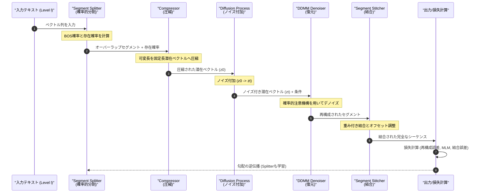
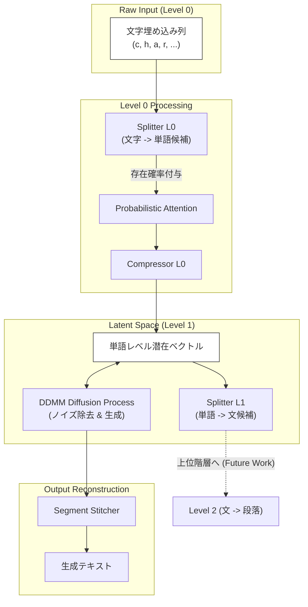

###### Created: 
2026-02-08 23:27 
###### Tag: 
#paper
###### url_01:
https://www.arxiv.org/abs/2601.21768 
###### url_02: 
[GitHub - ARozental/Zonkey](https://github.com/ARozental/Zonkey)
###### memo: 

---

<!-- paper_extractor:summary:start -->

本論文は、従来の固定的なトークナイザー（BPE等）に依存しない、完全微分可能な階層型拡散言語モデル「Zonkey」を提案した画期的な研究です。以下にその詳細な解説を出力します。

# One line and three points
固定的なトークナイザーを排除し、生の文字入力から「確率的注意機構」を用いて適応的に意味単位（単語や文）を学習・生成する、完全微分可能な階層型拡散言語モデル。

1.  **完全微分可能なトークナイゼーション（Segment Splitter）：** 従来のBPEのようなルールベースではなく、「確率的注意機構（Probabilistic Attention）」と存在確率（Existence Probabilities）を用いることで、生の文字から言語的に意味のある境界（単語や文など）を教師なしで創発・学習します。
2.  **階層的な圧縮と再構成：** テキストを文字レベルから単語、文へと階層的に圧縮（Compressor）し、拡散モデル（DDMM）を用いて潜在空間でノイズ除去を行うことで、可変長のテキスト生成を実現しています。
3.  **オーバーラップを許容する整合的結合（Stitcher）：** 分割されたセグメントを再結合する際、微分可能な「Stitcher」を用いることで、セグメント間の境界を滑らかに繋ぎ、全体として整合性の取れたテキストを生成します。

# Summary
本研究は、大規模言語モデル（LLM）の主要なボトルネックとなっている「固定的なトークナイザー（BPE等）」の問題を解決するために、**Zonkey**と呼ばれる新しいアーキテクチャを提案しています。既存のトークナイザーは微分不可能であり、ノイズの多いテキストや未知語への適応性が低いという課題がありました。

Zonkeyは、生の文字入力を受け取り、それを**Segment Splitter**によって確率的にセグメント化します。この過程は**Probabilistic Attention**によって支えられており、位置ごとの「存在確率」を扱うことで、理論上無限のシーケンスに対するソフトなマスキングと勾配の伝播を可能にしています。これにより、モデルは明示的な教師データなしに、スペースや句読点といった言語的な境界を自律的に学習します。

階層構造を持つこのモデルは、下位レベル（文字など）の表現を上位レベル（単語、文など）の潜在ベクトルへと圧縮し、**DDMM（Denoising Diffusion Mixed Model）** と呼ばれる拡散モデルを用いて再構成します。最終的に**Stitcher**がオーバーラップ部分を考慮しながらセグメントを結合し、一貫したテキストを生成します。Wikipediaデータセットを用いた実験では、ノイズからのコヒーレントなテキスト生成や、創発的な階層構造の獲得が確認されました。
<!-- genimage-pending-1771576473120-zgb6tw -->
# Briefing
本論文の技術的な詳細と構成要素についての包括的な解説です。

## 1. 背景と課題
従来のTransformerベースのLLMは、BPE（Byte Pair Encoding）などの静的なトークン化アルゴリズムに依存しています。これらは微分不可能であるため、モデルのエンドツーエンドな最適化を妨げ、ドメインシフトやノイズに対して脆弱です。また、拡散モデルをテキストに適用する際、離散的離散的なトークンを扱う難しさやなトークンを扱う難しさや、固定長出力の制約が課題となっていました。

## 2. コア技術：確率的注意機構 (Probabilistic Attention)
Zonkeyの核心技術です。従来のHard Mask（0か1か）の代わりに、各トークン位置に「存在確率（Existence Probability）」 <math>p_k \in (0, 1]</math> を割り当てます。
*   **ソフトマスキング:** 存在確率は累積的に減衰し、シーケンスの終わりを確率的に表現します。
*   **微分可能性:** これにより、トークンの切れ目やシーケンス長に関する勾配をネットワーク全体に伝播させることが可能になります。

## 3. アーキテクチャの主要コンポーネント
Zonkeyは以下のパイプラインで構成されます。

*   **Segment Splitter (微分可能なトークナイザー):**
    *   入力シーケンスに対し、確率的なBOS（Beginning-of-Sequence）決定を行います。
    *   明示的な教師なしで、文字レベルならスペース、単語レベルならピリオドといった「意味の切れ目」で確率が高くなるよう学習が進みます。
    *   出力はオーバーラップするセグメントとして切り出され、後段に送られます。

*   **Compressor (階層的圧縮):**
    *   切り出された可変長のセグメントを、固定数の潜在ベクトル（例：4つのベクトル）に圧縮します。
    *   ここではMLM（Masked Language Model）ロスを補助的に用い、意味的なクラスタリングを促進します（例：「素晴らしい」と「良い」を近くに配置）。

*   **DDMM (Denoising Diffusion Mixed Model):**
    *   圧縮された潜在表現を再構成するための拡散モデルです。
    *   DDPM（多様性重視）とDDIM（決定論的・効率重視）の利点を組み合わせ、推論時のステップ数削減と生成品質の安定化を図っています。
    *   「Clean」な状態への復元と、ノイズレベル間の遷移の両方を学習します。

*   **Segment Stitcher (結合器):**
    *   ノイズ除去されたオーバーラップのあるセグメント群を、微分可能な形で再結合します。
    *   隣接するセグメント間の整合性を保ちつつ、Splitterに対して「どこで切るのが最適か」という勾配シグナルをフィードバックする役割も果たします。

## 4. 学習と生成
*   **学習:** エンドツーエンドで行われ、文字レベルの再構成、潜在空間でのMLM、拡散モデルのデノイズ誤差、Stitcherの整合性ロスなどを複合的に最小化します。
*   **生成:** ノイズから始まり、上位レベル（文など）で生成された潜在表現を下位レベル（単語、文字）へと順次デノイズ・展開していくことで、可変長のテキストを生成します。インフィリング（穴埋め）タスクにも自然に対応可能です。

# FAQ

**Q1: 従来のBPEトークナイザーと比べて何が決定的に違うのですか？**
A1: 最大の違いは「微分可能性」と「適応性」です。BPEは固定ルールでテキストを分割するため、学習中に分割方法を変えることができません。ZonkeyのSplitterはニューラルネットワークの一部であり、タスクの損失関数（Loss）に応じて「どこで単語や文を区切るべきか」を動的に学習・更新します。

**Q2: 拡散モデルは画像生成で有名ですが、なぜテキスト生成に使うのですか？**
A2: 自己回帰モデル（左から右へ生成）とは異なり、拡散モデルは全体を同時に生成・修正できるため、双方向のコンテキストを考慮した生成や、文章の途中を埋めるインフィリング（穴埋め）などが得意です。Zonkeyは階層構造を取り入れることで、拡散モデルが苦手とする「離散的なテキストの扱い」と「計算効率」の問題に対処しています。

**Q3: 「確率的注意機構」とは具体的に何をしているのですか？**
A3: 注意機構（Attention）の計算において、各トークンが「どれくらい実在しているか」という重み（存在確率）を導入しています。これにより、文末のトークンがいきなり消えるのではなく、徐々に薄れていくように表現され、シーケンスの長さを連続値として微分可能な状態で扱えるようになります。

**Q4: 実用段階ですか？**
A4: 現時点では、Wikipediaデータセットを用いたプロトタイプ（概念実証）の段階です。単語や文の構造を学習できることは示されましたが、ChatGPTのような大規模な対話モデルとしての性能評価には至っていません。

# Critical Assessment（批判的評価）

**方法論の妥当性：**
「確率的注意機構」による微分可能なトークナイゼーションの設計は理論的に非常に洗練されており、従来の離散的最適化の壁を突破する有効なアプローチである。特に、Splitter、Compressor、Stitcherをエンドツーエンドで学習させる設計は、局所的な最適解に陥りやすい階層モデルの弱点を克服している。ただし、学習の安定性を保つために多数の補助損失関数（Auxiliary Losses）を必要とする点は、ハイパーパラメータ調整の複雑さを示唆している。

**エビデンスの強度：**
本論文はプレプリント（arXiv）段階であり、査読を受けていない点に注意が必要である。実験は単一GPUで行われた小規模なものであり、定性的な評価（生成テキストの例示やAttention mapの可視化）が中心である。既存のLLM（Llamaなど）との定量的な比較（Perplexityやダウンストリームタスクのスコア）が不足しており、スケーラビリティや実際の生成能力の競争力については未知数である。

**実用化への考慮：**
トークンフリーかつ並列生成が可能であるため、推論速度の向上やドメイン適応（専門用語が多い分野など）において大きな可能性を秘めている。特に、固定語彙を持たないため、多言語や未知語への対応力は高いと推測される。しかし、階層が深くなるにつれて計算コストが増大する可能性や、現状のプロトタイプから大規模モデルへスケールアップする際の学習リソースの要求量は主要な課題となるだろう。

# For easy understanding
この論文のすごいところは、**「AIに『言葉の区切り方』そのものを教えるのではなく、AIが自分で『ここが区切りだ』と発見できる仕組みを作った」** 点にあります。

今のAI（ChatGPTなど）は、人間があらかじめ決めたルール（BPE）で、文章を「レゴブロック」のように分解して処理しています。しかし、このルールは固定されているため、知らない単語や入力ミスに弱いという弱点がありました。

Zonkeyは、言葉をカチカチのブロックではなく、**「粘土」のように柔らかいもの**として扱います（これが「確率的」で「微分可能」という意味です）。
1.  **粘土の切り分け（Splitter）：** AIは文章という長い粘土を、どこで切れば扱いやすいかを自分で試行錯誤して学習します。「スペースの後は新しい単語っぽいな」とAI自身が気づくのです。
2.  **圧縮と復元（Compressor/Diffusion）：** 切り分けた粘土を、ギュッと小さく圧縮して（意味の塊にして）、それにノイズ（砂）を混ぜてぐちゃぐちゃにします。そして、その砂を取り除いて元のきれいな粘土に戻す練習をします。
3.  **つなぎ合わせ（Stitcher）：** 戻した粘土をつなぎ合わせるとき、継ぎ目が見えないように滑らかになじませます。

これを繰り返すことで、Zonkeyは「A」とか「B」という文字の羅列から、「Apple」という単語、そして「Apple is red」という文章の構造を、誰に教わらなくても自然に理解し、生成できるようになるのです。これは次世代のAIを作るための重要な基礎技術になる可能性があります。

# Mermaid Diagrams

## シーケンス図：Zonkeyの学習・生成ステップの流れ

## 概念図：階層的構造と確率的注意機構

<!-- paper_extractor:summary:end -->

