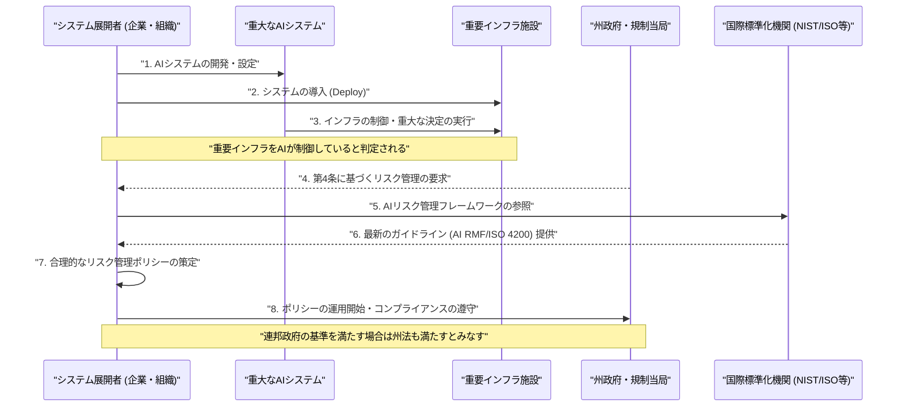
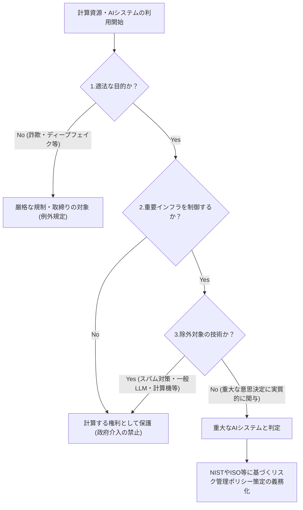

###### Created: 
2026-03-15
###### Tag: 
#law
###### url_01:
{{url}} 
###### url_02: 

###### memo: 

---
# One line and three points
米国モンタナ州における計算資源の私有・利用を憲法上の基本的人権として保護する一方で、重要インフラを制御する重大なAIシステムに対しては国際標準に準拠した厳格なリスク管理を義務付ける「計算する権利法（Right to Compute Act）」の制定法案です。

1. **計算資源の権利保護:** ハードウェア、ソフトウェア、AIなどの計算資源を所有し利用する権利を、モンタナ州憲法が定める財産権および表現の自由の枠組みの中で強力に保護し、政府による過剰な規制に歯止めをかけます。
2. **重要インフラ向けAIへの安全基準:** 水道、電力、通信などの重要インフラの制御に関わる「重大なAIシステム」の運用者に対し、NIST（米国国立標準技術研究所）やISO/IECなどの国際的な枠組みに準拠したリスク管理ポリシーの策定を義務付けています。
3. **明確な除外規定と政府の重大な利益:** スパムフィルターや計算機、一般的なチャットボット（違法コンテンツ生成を禁じるポリシーを持つもの）を過剰規制から除外する一方、ディープフェイクによる未成年者の被害防止や詐欺の撲滅を「政府の重大な利益」と定義し、例外的に規制が許容される範囲を明確化しています。

# Summary
本法案（Senate Bill 212：2025年モンタナ州議会）は、「計算する権利（Right to Compute）」を法的に確立することを目的とした画期的な州法です。現代のデジタル社会において、機械学習や量子コンピューティングを含む強力な計算資源は、経済成長と国家安全保障の基盤となっています。しかし同時に、政府による過剰な規制が市民の財産権や表現の自由を侵害する懸念も高まっています。本法案は、市民や企業が適法な目的で計算資源を私有・利用する権利を基本的人権とみなし、政府の介入を「政府の重大な利益（Compelling government interest）」を達成するために「実証可能かつ必要最小限に限定された（narrowly tailored）」ものに厳格化します。その一方で、AI技術が社会に与えうる現実的な脅威を看過せず、重要インフラの制御を担うAIシステムに対しては、展開後のリスク管理ポリシーの策定を義務付けることで、技術革新の保護と公共の安全確保の絶妙なバランスを図っています。

# Briefing
本法案が提起する法理と規制のフレームワークについて、法学および技術政策の観点から包括的に解説します。本内容は、技術の急速な進展に対して法整備がどのように適応しようとしているかを示す重要な実例です。

**1. 立法の背景と哲学：技術的優位性の確保と基本的人権の交差点**
近年、機械学習をはじめとする計算技術の革新は、ほぼすべての産業セクターにおいて経済成長と繁栄をもたらす原動力となっています。米国が敵対国家に対して競争上の優位性を維持するためには、これらの技術の最前線に立ち続けることが不可欠です。しかし、強力な計算資源がもたらす公衆衛生や安全への潜在的リスクに対する懸念から、連邦政府および各州政府は計算資源の私有や利用に対する広範な規制を提案し始めています。モンタナ州議会は、こうした過剰な規制の波が、市民の「財産権」や「表現の自由」といった憲法上の基本的人権を侵害する危険性があるとの強い危惧を抱きました。本法案の哲学は、イノベーションを阻害する不透明な規制を排除し、計算資源を利用する自由を憲法レベルで再確認することにあります。

**2. 「計算する権利（Right to Compute）」の法理的構造**
法案の第2条および第3条において、モンタナ州憲法第2条第3項（財産を取得、所有、保護する権利）および同第7項（表現の自由）を根拠として、「計算資源を私有し利用する基本的権利」が明文化されました。これにより、政府が計算資源の利用を制限しようとする場合、米国憲法学における最も厳格な審査基準である「厳格審査（Strict Scrutiny）」に類似したテストが課されることになります。具体的には、規制は「政府の重大な利益（Compelling government interest）」を満たすためのものであり、かつ「実証可能に必要であり、目的達成のために必要最小限に制限された（narrowly tailored）」ものでなければなりません。

**3. 「政府の重大な利益」の具体的定義と例外規定**
法案第7条では、いかなる場合において政府の介入（規制）が正当化されるか、すなわち「政府の重大な利益」が極めて具体的にリストアップされています。
*   重要インフラを制御するAIシステムにリスク管理ポリシーを策定させること。
*   大衆を欺瞞し、または詐取する行為に対処すること。
*   ディープフェイクなどの有害な合成コンテンツを、その性質を認識した上で頒布する者から個人（特に未成年者）を保護すること。
*   物理的なデータセンターのインフラが引き起こすコモン・ロー上のニューサンス（生活妨害・公害）を防止・排除すること。
これらを明記することで、表現の自由の弾圧や技術開発の不当な妨害に繋がるような恣意的な規制を防ぐ意図があります。

**4. 重要インフラにおける「重大なAI」へのリスク管理義務**
法案第4条は、技術の安全な社会実装に向けた核心部分です。水処理施設、送電網、交通システムなどの「重要インフラ施設（Critical infrastructure facilities）」の一部または全部を「重大なAIシステム（Critical artificial intelligence system）」が制御する場合、そのシステムの展開者（Deployer）に対して厳格な義務を課します。展開者は、システム稼働後に、NIST（米国国立標準技術研究所）の最新のAIリスクマネジメントフレームワーク（AI RMF）、またはISO/IEC 4200などの国際標準に基づく合理的なリスク管理ポリシーを策定しなければなりません。なお、連邦法に基づく計画を策定している場合は、州法にも準拠しているとみなされる（重複規制の排除）という実務的な配慮もなされています。

**5. 規制対象から除外されるテクノロジーの明確化**
AI規制において最も問題となるのが「どこまでがAIで、どこからが従来のソフトウェアか」という線引きです。本法案は、イノベーションの萎縮を防ぐため、「重大なAIシステム」の定義から以下を明確に除外しています。
*   狭い手続き的なタスクを実行するもの（計算機、スプレッドシートなど）。
*   スパムフィルタリング、マルウェア対策、ファイアウォールなどのサイバーセキュリティツール。
*   違法なコンテンツの生成を禁止する「利用規約（Acceptable Use Policy）」の対象となっている、自然言語処理を行う技術（情報の提供、回答、推奨などを目的とする一般的なLLM・チャットボット）。
これにより、社会の基盤を揺るがす重大な決定を下すAI（Consequential decision）にのみ規制のリソースを集中させる、極めて合理的で実用的な法執行が可能となります。

# FAQ

**Q1: この法律ができると、私たちが個人的にパソコンやAIを使う権利はどうなりますか？**
より強固に保護されることになります。この法律は、適法な目的である限り、個人や企業がコンピュータやAI（計算資源）を所有し、利用する権利を「憲法上の基本的人権」として扱います。政府や自治体が「AIは危険だから」といった漠然とした理由で、正当な利用を禁止したり制限したりすることはできなくなります。

**Q2: ChatGPTのような生成AIモデルを開発・利用する企業は、厳しいリスク管理ポリシーを作る必要がありますか？**
原則として、一般的な利用目的であれば必要ありません。本法案は、利用規約（AUP）によって違法コンテンツの生成を禁止している一般的な自然言語モデル（ChatGPTなど）を、厳格な規制対象である「重大なAIシステム」から明確に除外しています。ポリシー策定義務が発生するのは、そのAIが「電力網」や「水道施設」といった人命や社会の根幹に関わる重要インフラを直接制御し、重大な意思決定を行う場合に限られます。

**Q3: 「ディープフェイク」の問題に対して、この法律はどのように対処していますか？**
本法案は「計算する権利」を絶対視しているわけではありません。「ディープフェイクや有害な合成コンテンツを意図的に拡散させ、未成年者などの個人に危害を加える行為」から公衆を保護することは、「政府の重大な利益（絶対に守るべき公共の利益）」として例外規定に明記されています。したがって、ディープフェイクを用いた詐欺や児童搾取などの悪質な行為に対しては、政府は「権利の制限」を理由に躊躇することなく、法的な取締りや規制を行うことができます。

# Critical Assessment（批判的評価）

**方法論の妥当性：** 
法案の設計方針として、NISTのAI RMFやISO/IEC 4200といった既存の確立された国際的枠組みをリスク管理の基準として採用している点は、実務的な実現可能性が高く評価できます。一方で、「重大な結果をもたらす決定（consequential decision）の重要な要因となる」というAIの定義には解釈の余地が残されており、実際の法適用において、どのシステムが該当するかの境界線について司法の場での争いが生じる制約を孕んでいます。

**エビデンスの強度：** 
本入力文書は査読済みの科学論文ではなく、米国モンタナ州議会に提出された法案（立法文書）です。したがって、科学的データによるエビデンスの強度を評価する性質のものではありません。しかし、連邦政府の動向やテクノロジー業界の懸念といった社会的背景（立法事実）に基づき論理的に構築されており、州法としての法的拘束力を持つ強力な文書です（2025年発効予定）。

**実用化への考慮：** 
イノベーションを阻害しないよう、日常的なソフトウェアや一般的なLLMを規制の対象外とした実務的な配慮は極めて優れています。しかし、実環境での適用においては、州政府（または関連機関）が企業が提出するNIST準拠の「リスク管理ポリシー」の妥当性を、どのような専門的知見をもって審査・評価し、実効性を担保するのかという執行能力（Enforcement capability）の面において大きな課題が残されています。

# For easy understanding
**「計算する権利」＝包丁や印刷機を持つ権利と同じ**

この法律の画期的なポイントを、身近な例で考えてみましょう。
かつて人々は、自由に意見を発信するために「印刷機」を持つ権利を主張しました。また、料理をするためには「包丁」を持つ権利があります。印刷機で誹謗中傷のビラを刷る人がいるからといって「印刷機を一般人が持つのは違法」とはなりませんし、包丁で怪我をする危険があるからといって「包丁の所持を免許制にする」ことはありませんよね。

モンタナ州のこの法律は、現代の**「コンピューターやAI（計算資源）」を、まさにこの印刷機や包丁と同じ「基本的人権」の道具**として認めたものです。政府が「AIはなんか怖いから、使うのを制限しよう」と安易に法律を作ることを禁止し、「適法に使う限りは、自由にコンピューターを使える権利」を州民に約束しました。

**ただし、「原子力発電所」で包丁を使うなら話は別**

権利を広く認める一方で、絶対に守らなければならない安全のルールも作りました。
先ほどの包丁の例で言えば、自宅で料理に使う分には自由ですが、もしその包丁を「原子力発電所の配線を切る作業（＝重要インフラの制御）」に使うなら、絶対に事故を起こさないための「超厳格な安全マニュアル（＝リスク管理ポリシー）」を作ることを義務付けたのです。

つまりこういうことです。
1. **普段使いのAI・アプリ**（チャットボット、計算機、迷惑メールフィルター）：**自由に使ってOK！** 政府は邪魔しません。
2. **社会の命綱を握るAI**（水道、電気、交通などの重要インフラを動かすAI）：**国際基準（NISTやISO）に合格するレベルの安全対策計画を出しなさい！**
3. **悪いことに使うAI**（詐欺、ディープフェイクで人を騙す）：**これは「権利」とは認めません。徹底的に取り締まります！**

このように、個人の自由な技術開発（イノベーション）を守りつつ、社会を壊しかねない本当に危険な部分だけをピンポイントで管理するという、非常にバランスの取れた「未来のルールのモデルケース」と言える内容になっています。

# Mermaid Diagrams

ここでは、法案が規定する「重要インフラに対するAI導入時のリスク管理プロセス」を時系列で示すシーケンス図と、「AIシステムに対する規制の適用判断プロセス」を示すフローチャートの2つを作成します。

## タイムライン・シーケンス図
重要インフラ施設にAIを導入する際から、リスク管理ポリシーの策定に至るまでの一連のプロセスと関係者の相互作用を示します。

## フローチャート・プロセス図
法案に基づく「ある技術・システムが政府の規制（リスク管理義務等）の対象となるか否か」を判定する法的な論理構造を図示します。

